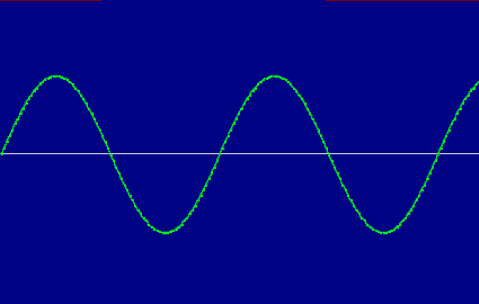

# 发展钟摆

> 原文：<https://simpleprogrammer.com/the-development-pendulum/>

我注意到了一个关于软件开发中的最佳实践和趋势的非常有趣的事情，随着时间的推移，它们往往会从一个极端振荡到另一个极端。

许多现在流行的或被认为是“好”的东西，几年前被认为是“坏”的，甚至更早以前是“好”的。

这种循环和规则似乎一遍又一遍地重复，并且在软件开发的几乎所有领域都很普遍。

## 它有三个维度

但是不要误解我的观点，我们正在前进。我们真的需要从三维的角度来看待这个问题。

你见过这样的玩具吗？你可以一边摇一边前进。

软件开发在许多领域都在做同样的事情。我们不断地走来走去，但我们仍在前进。

让我们看一些例子，然后我会告诉你为什么这很重要。

## JavaScript！

JavaScript 是好是坏？

取决于你问的是谁，但它现在绝对受欢迎。

如果我们回到大约 5 年前，你会得到完全不同的答案。大多数人会建议避免使用 JavaScript。

现在，JavaScript 本身在这段时间内并没有太大的变化，但是变化的是我们如何使用它。

我们学会了一些技巧，我们周围的世界发生了变化。我们发现了如何解决 JavaScript 最大的问题…

与 DOM 一起工作！

JQuery 使操作 DOM 变得极其容易，痛苦被消除了。

然而，新的痛苦出现了，于是 [backbone.js](http://wiht.link/backbonejs-intro) 诞生了。

## 胖客户端还是 web？

看看这是怎么来来回回变化了这么多次的。首先，网络是一个玩具，真正的应用程序安装在你的机器上。

然后开发桌面应用变得非常不酷，每个人都在开发 web 应用。

但是很快我们遇到了一个小问题——那些讨厌的页面刷新。天哪！

那我们做了什么？我们用 AJAX 让浏览器变成了胖客户端。

这造成了如此大的混乱，以至于我们真的需要将视图从我们的模型和逻辑中清晰地分离出来(至少在。所以我们回到在服务器上渲染整个视图，并用 MVC 把它发送到客户端。(是的，你可以争论这一点，但就假装你同意并容忍我。)

然后我们决定，我们需要开始把这些东西移回客户端，这样我们就可以用我们的页面做更多更酷的事情。我们开始将 JavaScript 注入页面，最终创建了运行在浏览器中的胖客户端，这些浏览器运行在 JavaScript 和 HTML5 上。

现在，我们再次看到 iOS 和 Android 设备上的传统胖客户端，甚至这些设备也可能最终迁移到网络上。

## 简单数据与描述性数据

看看这个正弦波！

首先，我们有固定长度的记录，其中我们指定了每一列的长度以及确切的数据内容。

然后我们转移到 CSV，在那里我们有用逗号分隔的松散数据。

然后我们认为 XML 风靡一时，并痛打了那些没有定义 xsd 的人，因为没有定义的**数据就是噪音，你知道的！**

现在，我们到处发送结构非常松散的 JSON 对象，每当我们看到尖括号就抛出。

## 还有很多其他的例子

看看这个列表:

*   静态与动态语言
*   Web 服务易用性与模糊性(SOAP 和 REST)
*   预先设计 vs 敏捷(记得我们刚刚编写代码并部署它的时候，它有点像敏捷，但是不同)
*   源代码控制、持续协作与分支
*   测试和 TDD
*   数据库，存储过程与内联 SQL
*   对比控制
*   …

它永远持续下去

## 那么为什么这很重要呢？

这不仅重要，作为一名开发人员，理解这一点对你来说也是至关重要的。

为什么？

因为无论现在发生什么“酷”的事情，无论现在发生什么“正确”的做事方式，都会改变。

它不仅会改变，而且会走向完全相反的方向。

它看起来不会和以前完全一样——我们会从以前的错误中吸取教训——但它会是相同的概念。

进步遵循这种正弦波模式。不要试图和它斗争得如此激烈。

你必须保持平衡。在开发过程中，您必须能够理解技术或最佳实践选择的优点、优势和劣势。

你必须理解为什么 TDD 改进了我们的代码，直到它导致我们过度使用 IoC，并将 C#和 Java 开发人员推向 Ruby 等动态语言的自由。

你必须明白，最终这个过程会再次自我修正，回到新的静态语言的方向，甚至是一个将会复活的旧的静态语言。

## 这是你成长的方式

认识到这正是你成长的方式也是非常重要的。

正如你周围的技术世界在不断向前发展，你也是如此，以不同的速度，不同的节拍。

我知道，通过我个人的发展历程，我无数次在一个话题上转换立场。

你可能会叫我“胡扯”，但我称之为进步。

生活是一场超越和调整的游戏。