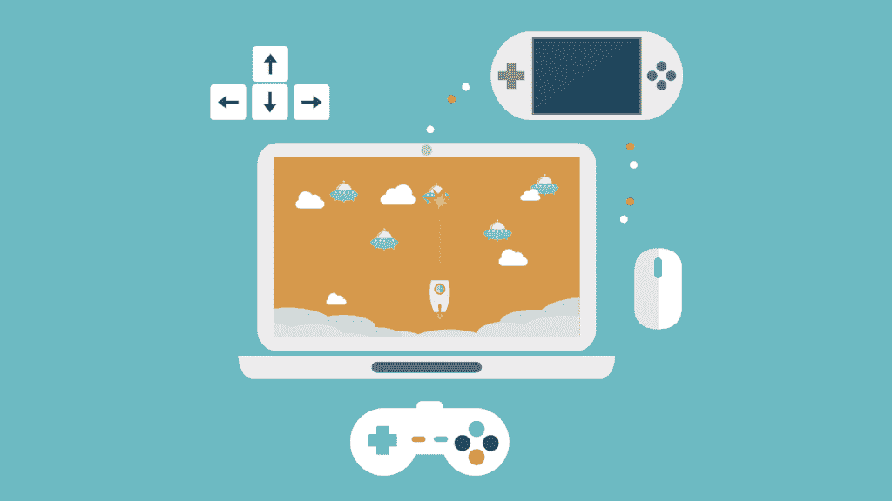
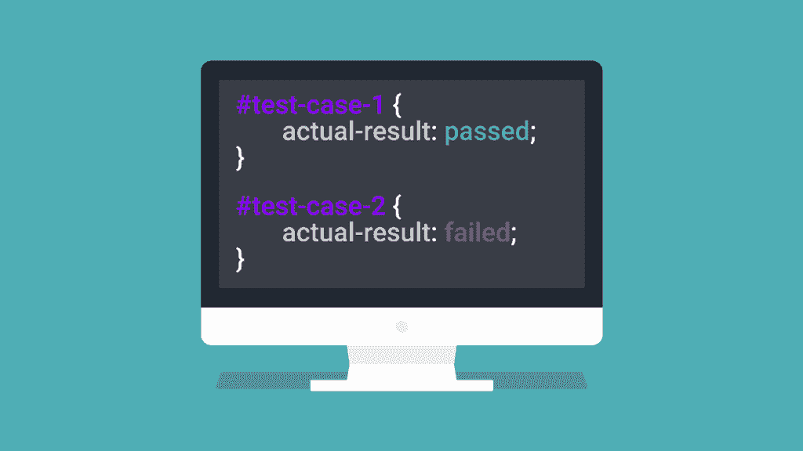
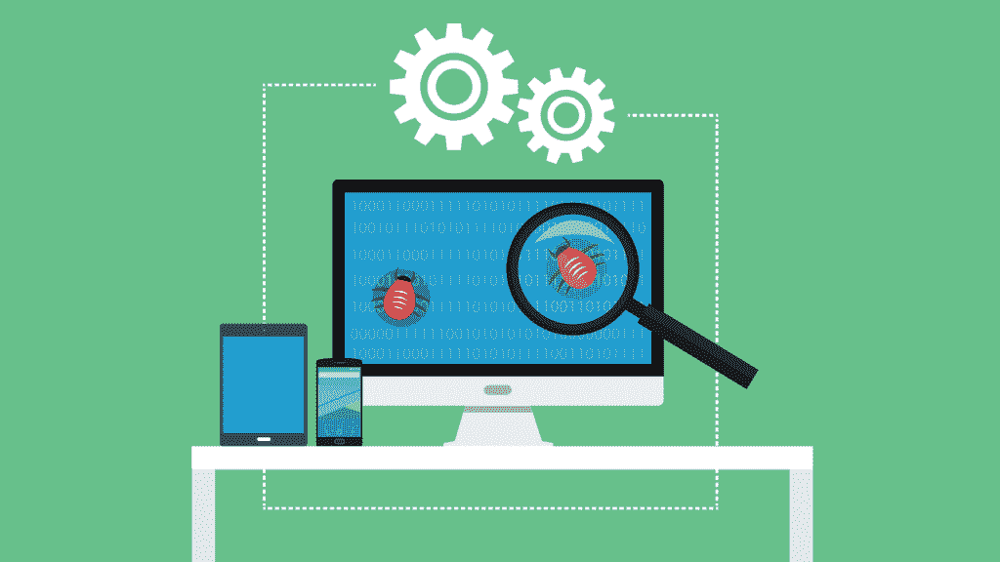

# 游戏和软件测试的区别

> 原文:[https://simple programmer . com/the-difference-between-games-and-software-testing/](https://simpleprogrammer.com/the-difference-between-games-and-software-testing/)

当我经历从游戏测试员到软件测试员的转变过程时，我在上面找不到任何材料。

因此，为了让其他人免受我所忍受的头痛，我决定创建一个指南来做到这一点。

在本指南中，我想强调测试中两种途径的区别，我为这种横向职业转移做了哪些准备，以及我已经做了哪些使过渡更容易的事情。

为了澄清，在这篇文章中，我将使用术语 ***软件测试*** 来区分游戏测试和游戏行业之外的测试之间的区别。虽然这可能意味着测试软件，但也可能意味着测试桌面和移动网站、基于网络的应用程序或移动应用程序。

## 我的游戏测试生活

当我作为一名游戏测试员，告诉别人我是做什么工作的时候，他们几乎总是说，“那么，你只是整天玩游戏吗？”

“但愿如此！”我以为。

做游戏测试员是我一生中最具挑战性的工作之一(我已经工作了 31 年中的 15 年！).它挑战你的毅力，你对细节的关注，对工作的关注，以及你对游戏的热爱。

在甜甜圈里驾驶同样的本田思域风格的汽车八个小时后，看着它在第 14 圈后是否自燃，你可能会开始感觉到你的激情在消退。

是的，这意味着你可能要连续几天测试游戏的同一个部分(取决于复杂程度)。这显然不全是娱乐和游戏。

游戏测试现在只使用少量的自动化，但它是项目、团队和公司特有的，而不是行业标准。大多数游戏测试都是手工完成的。当您手动测试时，这意味着您必须在没有编程自动化脚本帮助的情况下完成测试。通常，一个有经验的(可能是领导或者资深)测试人员会写出一个测试计划，并将工作分配给他们的团队。

单个测试被称为*测试用例*。完成一个测试用例也被称为*运行*一个测试用例。测试用例的长度取决于项目，但是它们通常很短，并且一次测试游戏的一部分。这有助于将问题隔离在游戏的特定区域内。

## 软件测试有什么不同？

与游戏测试不同，软件测试极大地利用了[自动化脚本](https://simpleprogrammer.com/2016/08/31/resources-to-learn-automation-testing/)，是的，你测试的是软件，而不是游戏。这些脚本可以在产生书面测试用例之前或之后创建，因为任一个都可以用来补充另一个的测试。已经开发了许多工具和框架来使自动化更快，因为设置自动化脚本最初可能非常耗时。

随着软件测试越来越多地使用自动化脚本，这通常意味着软件测试人员的工作比游戏测试人员更具技术性。例如，作为一名软件测试人员，您可能需要能够使用工具来查询数据库。不过，这取决于每家公司使用的测试方法和他们测试的内容。

软件测试领域通常被认为是比游戏测试更需要技能的职业，尽管游戏测试人员所需的技能与手工软件测试人员所需的技能完全相同。

## 需要的资格

那么你需要什么样的背景和经验才能找到工作呢？

对于软件测试，你通常需要一个计算机科学、软件工程、数学或者任何技术方面的学位。

对于游戏测试来说，学位可能有用，但并不总是必要的。对游戏的热爱、对细节的关注和强烈的职业道德通常能让你进入这个领域。

## 测试平台

对于游戏测试，您可以测试的平台有:

*   个人电脑(包括 Steam)和台式机
*   控制台
*   网络——在线游戏，如 MMOs、HTML5 和脸书
*   移动的

对于软件测试，您有:

*   网
*   软件
*   移动的

## 类型和专业

你测试的平台和内容是软件测试员和游戏测试员之间最明显的区别。

不同平台和内容之间的这些差异导致了每个角色的不同专业。

### 游戏测试

**手动**

这包括手工检查每一个测试用例(不管你需要运行多少次)。

**性能**

这确保了游戏以每秒所需的帧数运行。

**兼容性**

如果你正在测试一个浏览器游戏，你可能需要测试游戏在不同浏览器上的功能、可用性和可访问性。这确保了玩家无论用什么浏览器玩都有相同的体验质量。

**探索性**

这是你展示你真正技能的地方。探索性测试是你尽你所能在游戏中遇到缺陷和问题的地方。一旦你发现了一个问题，你需要确保你能回忆起重现它的确切步骤，这样开发人员就能修复它。

**认证**

在游戏测试中，你可能会在许多不同的平台上工作，比如任天堂、索尼或微软的最新游戏机。每一个都有不同的认证标准测试，游戏需要通过这些测试。

### 软件测试

**兼容性**

在软件测试中，特别是 web 测试中，您可能必须测试产品是否与所有当前版本的 web 浏览器兼容。在这种情况下，你会被归类为兼容性测试专家。

**性能**

通过性能测试，您可以尝试确定系统在特定工作负载下的响应能力和稳定性。性能测试是一个内部有[个专业](https://en.m.wikipedia.org/wiki/Software_performance_testing)的领域。

**自动化**

自动化包括创建可以重复使用的测试脚本，以允许测试人员将时间投入到其他任务中。

**功能性**

功能性关注系统的输入和输出及其行为。它也可以被称为黑盒测试。

**非功能性**

任何非功能性测试都关注系统如何运行，而不是它的行为。它也可以被称为白盒测试。

**回归**

当你执行回归测试时，你运行一个产品的全部功能，以确保自从一个新的特性被引入以来，没有任何东西发生变化。

**集成测试**

集成测试需要同时测试系统的多个组件，并确保它们的交互方式符合预期。

**单元测试**

这是测试系统的单个组件。您必须确保它们的输入和输出都符合预期。

**健全性测试**

健全性测试有时被称为冒烟测试。这是在产品的横截面上做的最少的工作，以确保所有的功能仍然完好无损。

**系统测试**

当您执行系统测试时，您的工作是确保系统的所有组件一起工作，就像预期的那样。

**端到端测试**

最后，端到端测试需要对系统的整个周期进行测试，从第一个对象产生时，或者从第一个客户与之交互时，直到结束状态。

## 软件测试中的自动化工具

我明白了，一项任务只能和你用来完成它的工具一样有趣。

当我第一次开始自动化时，很痛苦——我们使用 WaTiN。现在回想起来，我意识到如果我们没有从这个工具开始，我可能不会像现在这样深入地学习 C#，所以还有一线希望。但当我们的团队最终被授权使用硒时，我发出了一声小小的欢呼。在撰写本文时，它是最流行的自动化工具，用于 web 和移动测试(带插件)。

Selenium 提供了两种自动化方式:[IDE](http://www.seleniumhq.org/projects/ide/)T2 和 [WebDriver](http://www.seleniumhq.org/projects/webdriver/) 。

IDE 是一个桌面应用程序，允许用户使用简单的命令来创建自动化脚本，以详细说明命令、目标和值。不需要编程知识，只需要如何导航网站的直接对象模型(DOM)即可。

与 IDE 不同，Selenium WebDriver 是一个在测试项目中安装和使用的库。利用几种语言，如 Java、C#、Python、JavaScript、PHP、Perl 和 Ruby，您可以创建自动化脚本。这个工具需要编程知识，但不需要成为专家。一旦您习惯了 Selenium 的方法，编写测试就会变得更加愉快。

## 培训和认证

从基础到高级水平的认证是为了扩展和展示你在软件测试方面的知识。

目前在游戏测试中没有类似的东西，尽管没有什么能阻止游戏测试人员获得软件测试证书。事实上，这可能有助于加强个人的技能。

这些认证目前由 [BCS](http://certifications.bcs.org/category/15568) 、微软 [MTA](https://www.microsoft.com/en-gb/learning/exam-98-379.aspx) 和 [MCSD](https://www.microsoft.com/en-gb/learning/exam-70-497.aspx) 提供。

游戏测试课程是可用的，但不被认为是进入该领域的必要资格。

## 从游戏转移到软件测试时要考虑的几点

当你决定从游戏测试转向软件测试时，你应该考虑以下几点:

### 积极的

**更多的钱**

一般来说，软件测试员比游戏测试员挣得多，因为，正如我提到的，这个角色可能更有技术含量。

**更好的生活质量**

你工作的最后期限通常不像游戏行业项目那样压力很大。虽然可能会有一些加班，但一般都比较少，而且经常有补偿。加班少了，你就有更多的时间做你自己，享受生活，所以你可以为了生活而工作，而不是相反。

**技术专长的提高**

您的编程技能将会提高，这取决于您执行的自动化程度，但是您对后端使用的工具的接触也会增加。您可能每天都在使用数据库来提高您的 SQL 技能，与开发人员密切合作，这样您将学会如何说“开发对话”,并在一定程度上调试问题。

### 底片

**获取技术**

如果你想得到一个好的工作机会，你必须花时间学习自动化，或者展示一些技术能力。如果你想让 T1 变得更有技术含量，这可能是一个好消息！

**从底部开始**

无论你是游戏测试员，你都必须从软件测试员开始做起。这可能会有点伤害你的自尊心，但请记住，在犯错误时，低年级学生会得到更多的宽容。最好是陶醉在这段时间里，犯你的错误，学习很多，找到你的位置，然后努力向上。

可能会有更多的问题需要考虑，因为转行的决定是个人的，你的动机我无法解释，但这些是我的主要原因。

我看了利弊，肯定是利大于弊，所以就换了。

## 使过渡更加平滑

为了尽可能容易地转换职业道路，我创建了小型自动化工具来帮助我完成日常测试任务。我还买了本书并开始阅读， *[软件测试:ISTQB-BCS 认证测试员基础](http://www.amazon.com/exec/obidos/ASIN/1780172990/makithecompsi-20)* 。为了帮助你探索，我建议你做以下事情:

**阅读基础软件测试书**

这本书涵盖了软件测试的所有基础知识，并为你在面试中可能被问到的关于测试的任何问题做好准备。

**学习任何编程语言的基础知识**

通过学习一门编程语言，你将跨越自动化的障碍。正如您前面所读到的，Selenium 可以用多种语言编程，所以我建议选择其中一种。

**玩硒**

老实说，理解 Selenium 的基础知识并不需要大量的编程语言知识。命令是以可读的方式编写的，所以你所读到的基本上就是你告诉浏览器去执行的。例如:

司机。导航()。GoToUrl("[https://simple programmer . com "](https://simpleprogrammer.com))；

你认为这意味着什么？

**一次向前移动百分之一**

开始做小事。任何可以一步一步积累你的知识的事情，一天一次。

这样做 30 天后，你会发现你获得的知识比你想象的要多得多。尝试阅读 ISEB 基金会软件测试之类的书籍，每天完成一个小的 Selenium 问题，或者执行一个小的 C#教程。

无论你选择什么，确保它能让你朝着建立你的软件测试知识的目标前进。

## 那么你的下一步是什么？

从游戏转移到软件测试看起来非常令人生畏，但是如果那是你正在考虑的，那么你应该全力以赴。

在当前工作的同时学习会很艰难，但绝对值得。这一职业变动的好处超过了短期的缺点。你只需要有耐心，有上进心，相信自己能行。

祝你好运！