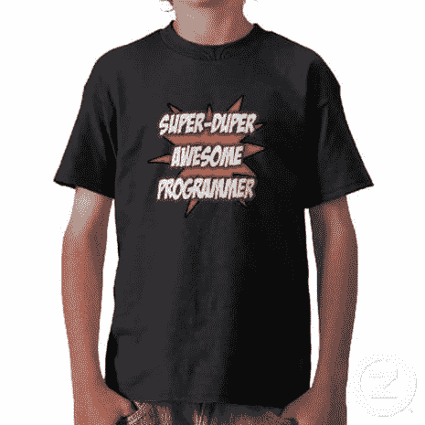
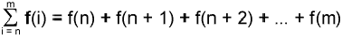

# 超级程序员的神话

> 原文：<https://simpleprogrammer.com/the-myth-of-the-super-programmer/>

在过去的一周里，我收到了一封让我不安的邮件。

基本上，这封邮件的作者推断，我在博客帖子和 [Pluralsight 视频](https://simpleprogrammer.com/pluralsight)中谈论的大多数话题都是相对容易的话题，但我假惺惺地建议[面试应该很难](https://simpleprogrammer.com/2010/10/06/why-hard-interviews-are-good/)，应该为“真正的程序员”或超级程序员设计。

从本质上来说，这封邮件的要点是，应用程序开发人员不是“真正的程序员”，“真正的程序员”用困难的数学做困难的事情。

## 寻找超级程序员

我不认为这种关于编程和软件开发的态度或理解是独特的或不规则的。甚至斯科特·汉瑟曼也给自己打电话，认为自己是个骗子。

他关于这个主题的帖子引起了我的共鸣，因为我有时也会对自己有同样的想法。

有时候，我怀疑我是否真的能解决真正困难的问题。

我冒昧地说，大多数软件开发人员都有某种信念，认为他们只是一个普通的程序员，但确实存在一些超级程序员，他们实际上做着复杂的算法，控制着硬盘上的缓存，并为谷歌搜索结果编制索引。

现在，当然有程序员写代码做各种你我都不理解的复杂事情，但是这些程序员和我们其他人有什么不同呢？

企业应用程序开发人员和为谷歌编写搜索算法和固件的程序员之间真的有区别吗？固件控制硬盘磁头从磁盘读取数据时的机械操作。

## 在我回答你之前…

先说一分钟问题。

你被要求解决的最困难的问题是什么？

你是如何着手解决这个问题的？

最后，当你真正解决问题时，解决方案看起来容易吗？

你回过头来看问题，是不是现在看起来简单多了？

我知道有很多问题——但我希望你在继续阅读之前，真的花时间思考这些问题。

理解感知和现实之间的区别是很重要的，包括我在内的许多软件开发人员经常很难区分这两者。

你看，我们对一个问题的看法往往与问题的实际情况大相径庭。当我们不理解一件事的时候，它看起来比实际复杂得多。但是，一旦我们开始理解一个问题，我们会发现它实际上是多么简单。

我给你举个真实的例子。看看下面这个数学方程式。

现在有两种人会看这个方程。

1.  那些对中高等数学有相当程度的了解，并且立刻就能认出来，立刻就能理解的人。
2.  那些从未见过这些符号一起使用的人会立即认为这是某种复杂的东西，需要花上几年的时间才能学会。

我可能不完全正确，但我的观点是，理解的人和不理解的人之间有明显的区别。

我可以非常简单地用你已经理解的术语向你解释这组符号。

准备好了吗？

这个等式和这个代码是一样的:

## 那么我的观点是什么？

我的观点是，一般来说，在数学、编程和日常生活中很少有真正的难题，通常这些难题可以分解成更小的问题(有时不止一次)，直到你最终得到一个简单的问题。

这个博客的意义，我的 [Pluralsight 视频](https://simpleprogrammer.com/pluralsight)的意义，我生活的意义，基本上就是[把复杂的事情变得简单](https://simpleprogrammer.com/2011/11/06/teaching-is-simplifying/)。

如果你想成为一名成功的程序员，你必须[学会如何为自己做这件事](https://simpleprogrammer.com/2011/01/08/solving-problems-breaking-it-down/)，因为这是你能拥有的最重要的技能。

所以，回答最初的问题——不，我不相信有超级程序员。我不认为企业应用程序开发人员和致力于解决大多数其他程序员认为非常困难的问题或“真正的编程”的程序员之间有什么区别

现在，不要误解我，认为我是说我不认为有些程序员比其他人好几个数量级。我敢说，真正优秀的程序员的效率是普通程序员的 10 到 20 倍。

我想说的是，当我们把所有的问题分解成更小的问题时，我们往往会忘记它们有多简单，而且所有的问题都可以这样分解。

我想说的是，可能阻止你成长为一名真正优秀的程序员的是你自己的错误信念，即你不可能理解你目前认为复杂的东西。

我想说的是，当你编写一个对你来说似乎很简单的企业应用程序时，你可能会忘记，对于你所有对编程一无所知的朋友和家人来说，这是多么的困难和几乎不可能。

## 还认为我错了吗？

好吧，你有权这么想。

但是我确实有一个挑战给你。你肯定认识一个“超级程序员”你甚至可能是其中之一。如果是的话，让我们听听你或他们的意见。告诉我们那个复杂的问题，这个问题太难了，我们其他人可能理解不了。

我根本没有讽刺的意思。说真的，如果你能证明我错了，那就证明吧。我从来没有见过一个问题不能被分解成简单易懂的部分。

当你在学习的时候，看看我的课程:[快速学习的 10 个步骤。](https://simpleprogrammer.com/store/products/learn-anything-quickly/)学习不一定要让人头脑麻木。