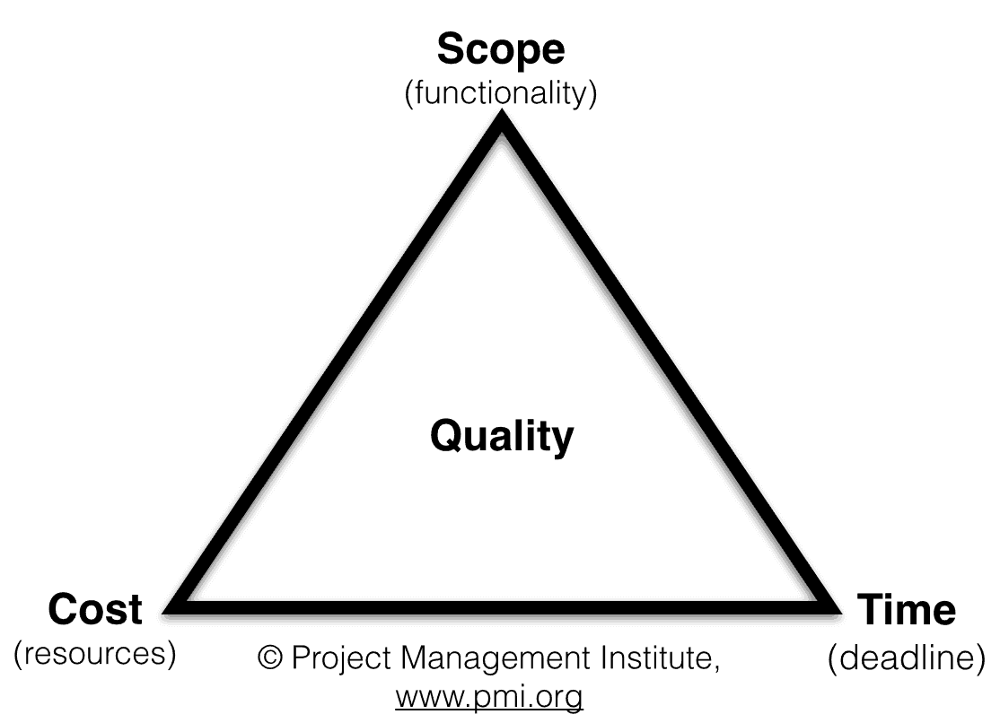
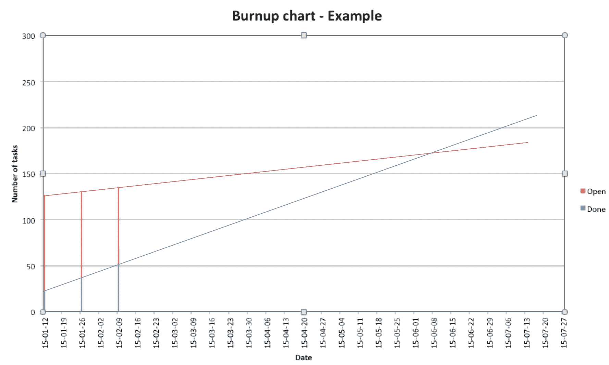

# 无估计运动

> 原文：<https://simpleprogrammer.com/the-noestimates-movement/>

我的职业生涯始于作为程序员和顾问建立电子商务网站。[工作量估算](https://en.wikipedia.org/wiki/Software_development_effort_estimation)在我开发软件的时候就一直在身边。我自己做了努力评估，我也让其他人做，然后在各种计划中使用它们。

在我职业生涯的开始，我在做出努力评估方面非常糟糕。我曾经估算过一个项目，最终，它比最初预计的时间长了十倍。后来，我收集了一些知识并变得更加擅长，但是我从来不喜欢做工作量估算，我想我和软件开发行业的许多其他人都有这种感觉。

做努力估算的时候，有一定的不踏实感；你无法预测未来，当花费的时间比最初估计的多时，你将被追究责任。除了估算工作量之外，我们还可以使用其他方法吗？

## 历史

Through Twitter, the three initiators of the NoEstimates movement met for the first time in October 2012\. They were [Woody Zuill](https://twitter.com/WoodyZuill) (an American software veteran), [Vasco Duarte](https://twitter.com/duarte_vasco) (a European author and agile practitioner), and [Neil Killick](https://twitter.com/neil_killick) (an Australian agile practitioner). By reading each other’s blog posts and continuing the discussion using the hashtag #NoEstimates on Twitter, they soon spread the word to others and the movement got started.

他们都质疑在管理软件开发中“事实上”使用评估，但是他们对使用评估的核心问题有不同的想法，因此有不同的解决方法。如果你看了今天正在进行的#NoEstimates 辩论，它可能是相当生动的。在接下来的日子里，[罗恩·杰弗里斯](https://twitter.com/RonJeffries)和[肯特·贝克](https://twitter.com/KentBeck)(敏捷宣言背后的两位作者)加入了讨论并分享了他们的想法。

## 三组

即使对无估计值的探索仍在进行，我还是试图将这些位置分为三组:

1.  连续交货
2.  预测/预测驱动
3.  估计改进

第一个位置，**持续交付**，通过找到交付最大客户价值的东西，走上一条高度敏捷的道路。当发现最有价值的功能/特性/故事时，就实施并交付给客户。这种说法是，只有当你完成并交付了最重要的事情，你才能继续下去，找出第二重要的事情是什么，交付它，等等。如果[瀑布](https://en.wikipedia.org/wiki/Waterfall_model)在光谱的一端，一切都是预先计划好的，那么这是另一端最敏捷的方法。

通过定期测量团队的生产能力，比如每周完成的任务，你可以使用这些数据来预测未来。正如 W. Edward Deming 所说，您的过程需要处于统计控制中(稳定)，也就是说，只有常见的变化原因才会出现。例如，这对于长期呆在一起并致力于同一产品的团队来说是可以实现的。

最后一组我简称为**估计改进**。这些人希望找到方法使评估更准确，因此对前期规划更有用。我认为这是坚持瀑布方法的一种尝试，代表了最不敏捷的方法。

我的经验是需要项目预测，所以我同情第二种群体。

## 在项目开始前进行规划

If you are continuously measuring the capacity of your team, you can do project planning without effort estimation. You can use the following steps:

1.  **测量能力**–统计团队每周完成的任务。
2.  **分析收集的数据**–分析你收集的数据，以便能够使用。
3.  **计算指标**–计算用于预测的指标。
4.  **时间计划**–检查时间计划中的时间，因为时间通常是项目中的一个限定因素(项目应在何时完成)。
5.  **预测**–使用计算的指标和给定的时间限制进行预测。
6.  **假设**–实现假设，这样你就能使用这种方法进行计划。
7.  **相似性**–使用预测并与其他已知参考进行比较。
8.  **思考**——根据收集到的知识，思考并判断项目是否可行；如果没有，请采取适当的措施。

有了这八个步骤，你就不需要花费宝贵的时间去做工作量估算了。

## 这是怎么做到的

### 1.衡量能力(每周完成的任务)

为了衡量能力，每周五团队领导都会计算 Scrum/看板(代表已完成的任务)上“完成”栏中的所有粘滞物，并将总数写在板上。这种情况每周五都会重复。在我们的板上，每个帖子对应于一个故事/功能或一个 bug 修复的子任务。因此，测量是在我们跟踪的最底层工作上进行的。数据也绘制在图表中。

### 2.分析

为了能够将收集到的数据用于进一步的规划，必须对其进行分析。换句话说，我们必须理解并能够解释“高峰和低谷”。很可能，产能(已完成任务的吞吐量)在平均值/中间值附近波动，有一些顶部和底部。如果数据代表一个稳定的系统，我们可以对未来做出预测。

### 3.计算指标

为了能够进行预测，必须使用电子表格程序对收集的数据进行以下计算:

*   平均值–考虑所有周的平均产能值。
*   中值–考虑所有周的中值能力值。
*   AVG 偏差–容量值与平均值的平均偏差。
*   最大值(偏差)–平均值+ AVG 偏差，给出考虑偏差后的最大容量值。
*   最小(偏差)–是平均 AVG 偏差，给出考虑偏差后的容量最小值。

### 4.时间计划

通常在时间计划中提前为项目设定完成日期。经验告诉我们，团队的能力会在项目过程中发生变化。因此，我将这个项目分成三个“子阶段”下面我从一个虚构的时间计划中添加一些时间来计算下一步的预测示例:

*   “启动”——三周是通常的时间，因为开始一个新项目并跟上速度自然是很难的。
*   “稳定状态”——在第九周，团队达到了速度，并在正常运行中工作。
*   “高峰期”——花三周时间做好项目的最后准备，产能将高于正常水平。

### 5.预报

是时候使用收集的指标的更多示例值进行预测了:

*   “启动”-12 个任务/周，对应于最小(偏差)值。
*   “稳定状态”——18 项任务/周，相当于平均值和中间值。
*   “峰值”——23 个任务/周，对应于最大(偏差)值。

项目期间可以完成的任务=(3 x 12)+(9 x 18)+(3 x 23)= 36+162+69 = 267 个任务。

### 6.假设

为了保持预测，需要以下假设:

*   在项目进行期间，团队必须保持完整。如果团队成员被移出团队，能力将会降低。如果增加新的团队成员，容量可以增加，但不是立即增加，因为老团队成员需要教育新成员。
*   团队将面临的挑战与前一个项目大致相同。对于产品开发(我们正在工作)，这可能是真的，因为产品的下一个版本将添加到上一个版本。如果项目中有重大的变化，团队在计划时必须考虑到这一点。
*   如果你有 1)和 2)，你应该有一个稳定的可预测的系统，也就是说，可以使用以前收集的数据对未来进行预测。

### 7.类似

我能听到你在想，“这并不能说明什么！”当然，这是完全正确的。我们需要将预测与我们已知的类似情况进行比较，比如已经完成的项目。
我们之前做的 482 任务/bug 解决票控系统的项目就是一个例子。
与上一个项目相比，该项目可以交付 267 / 482 ≈ 55%的范围。

好吧，也许这也不能说明什么。让我们比较一下上一个项目的一些功能(有人称之为史诗)和故事:

*   “功能 A”(核心变更)，票务控制系统中的 33 项任务
*   “功能 B”(新界面)，26 项任务
*   “故事 C”(GUI 改进)，5 项任务

在这个项目中，我们可以管理:

*   267 / 33 ≈ 8“类似于”功能 A 的史诗，或
*   267 / 26 ≈ 10“类似于”功能 B 的史诗，或
*   267 / 5 ≈ 53 层“类似”于“C 层”

当然，在现实中，该项目将由上述内容混合而成。但是，这些信息对于下一步应该足够了。

### 8.想

现在是做一些思考和判断项目的时候了，特别是考虑我们想要做的范围在给定的约束条件下(时间和人员)是否可能。我从未遇到过范围小于我们所能处理的范围的情况(例如，为添加更多故事留出空间)。通常，你想做的比你能做到的更多。你是怎么处理的？你需要咨询[铁三角](https://en.wikipedia.org/wiki/Project_management_triangle)，如下。

## 指导正在进行的项目

根据项目管理协会的说法，一个项目基本上取决于三个变量:

*   **时间**——项目应该交付的时间。
*   **成本**–有多少人参与这个项目。
*   **范围**–内容(特性和功能等。)的项目。

基本上，它是这样工作的:你可以有两个固定的变量，但第三个需要灵活。如果你做一个固定价格和固定时间的计划项目，范围必须是可变的。如果这三个问题都解决了，而你的项目遇到了麻烦，那么**质量**就会受到损害(从长远来看，你将会失业)。

你可以在项目进行过程中以及开始之前使用铁三角来提问，比如:

*   **范围**–范围可以缩小吗？一些任务可以等到产品的下一个项目/发布吗？也许有些优先级较低的任务(“最好拥有”)可以完全跳过，等等。
*   **时间**–我们可以延长时间计划吗？我们希望在交付中指定的所有功能，我们可以推迟项目(如果可能)。
*   **成本**–团队可以增加更多成员吗？也许我们可以有几个团队？对于小公司来说，这种选择可能是不可能的，但对于可以重新安排员工的大公司来说，这可能是一种选择。有没有简单的方法来检查你的项目是否在正轨上？你可以使用[燃耗图。](http://www.clariostechnology.com/productivity/blog/whatisaburnupchart)

当项目开始时，我们开始测量两件简单的事情:打开的任务(上图中的蓝色)和完成的
任务(红色)。两条平行线表示组成任务总数的条形图。如果你使用的是票务控制系统，进行这种测量是相当简单的。

基本上你跟踪:

*   任务增加率(TAR)–每周增加的任务数量。
*   任务完成率(TCR)–每周完成的任务数量。

自然，您的 TCR 需要大于您的 TAR，否则您的项目将永远无法完成。

你的第一次和第二次测量不会说这么多，但在那之后你可以开始看到趋势并做出预测(上图中的红色和蓝色线)。当这两条线相交时，就是预计的完工日期。如果你不喜欢这个预测(或日期)，你需要回到铁三角，看看你是否能做一些改变。在整个项目中，您需要定期进行测量和重新规划。

## 

接下来呢？

现在你知道了更多关于估算的知识，并且有了一些关于如何在不做努力估算的情况下[计划和指导项目](https://simpleprogrammer.com/2015/01/22/start-agile-project/)的技巧和诀窍。很简单，所以今天就开始衡量你的团队的能力吧！然后，使用本文中描述的步骤，在需要时规划和重新规划您的项目。一些人将 NoEstimates 描述为敏捷下一步的一部分，还有其他趋势，这些趋势正在质疑我们在软件行业工作的其他“事实上的”方式。让我们团结起来，一劳永逸地减少对工作量估算的需求！