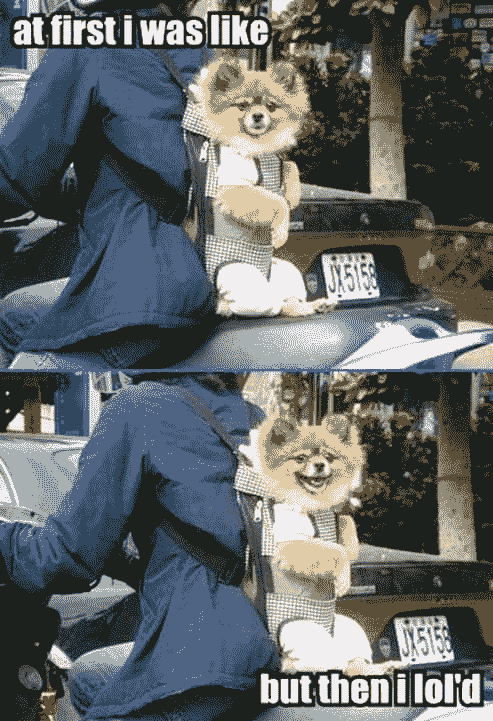

# 删除的力量

> 原文：<https://simpleprogrammer.com/the-power-of-delete/>

你是自己命运的主人。生活可能会强加于你，但你有武器。你有数字时代的神剑…

**你控制删除！**

## 不请自来的邮件？

最近，我收到了一封不请自来的电子邮件，是一位程序员同事发来的，他做了一件很酷的事情。

他在这里制作了一些关于编程的优秀视频:[http://hillelcoren.com/coder/](http://hillelcoren.com/coder/)

当我第一次在收件箱里看到这封邮件时，我想这可能是某种垃圾邮件，但我还是决定看一看，发现了一些非常棒的东西。

后来，我了解到，希勒尔被他发送过电子邮件的一些人弄得神经兮兮的，特别是那些学术领域的人。相当可惜。

这是他回复给我的一封电子邮件:

> 我从没听说过你，也没听说过推荐你视频的人。
> 滥发就是滥发。你和其他白痴没什么不同，他们认为他的信息太重要了，以至于不能在 T2 的自我推销中保持克制。你希望人们看你的视频，让他们的电子邮件隐私权见鬼去吧。这不是我们应该
> 传达给学生的态度。远离我的收件箱。

有点像这样:

起初我有点同意他，但后来我意识到我拥有一种不可思议的力量，一种我们每个人都拥有的力量。

## 删除的力量！

所以，一些你不喜欢的东西出现在你的电子邮件收件箱里。

你该怎么办？

你应该为此哭泣吗？

你应该假装有人用枪指着你的头强迫你点击链接吗？

你能想象你收件箱的窗帘被撕开，让你赤裸的电子邮件暴露在世人面前吗？

如果你只是检查邮件然后点击删除怎么样？

关键是，你不会改变世界，告诉每个人什么是正确的电子邮件礼仪。

即使你可以，真的会变得更好吗？

## 我收到很多不请自来的电子邮件

我几乎回复了每一封。

当然，我会看看你的网站。

当然，我会回答你这个简单的问题。

为什么不呢？

我交了朋友，并从回复陌生人的随机邮件中学到了不少东西。

我想我想说的是:

1.  如果你收到一封你不喜欢的邮件，删除它，你有这个权力。
2.  碰碰运气，奖励别人碰碰运气，世界上有足够多的批评家，我们都只是人。让我们试着玩得开心，互相帮助。