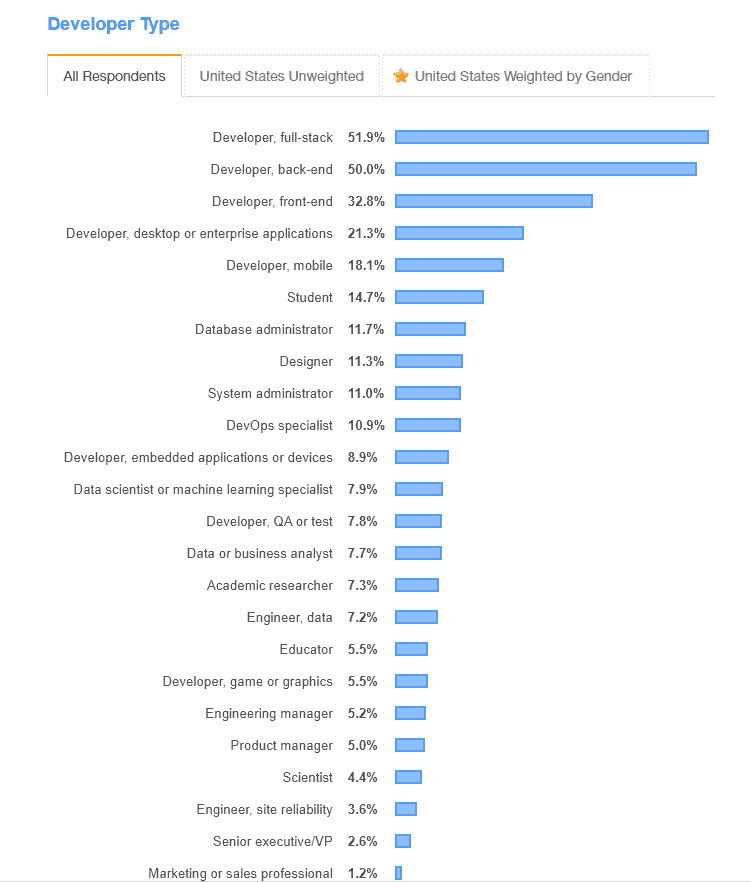
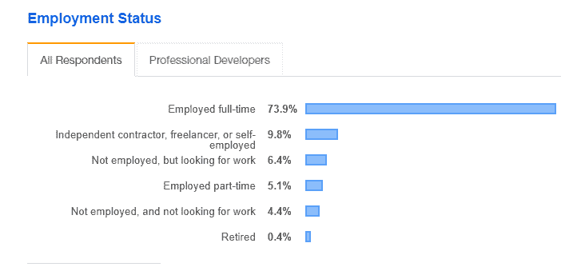

# 单人软件开发的利与弊

> 原文:[https://simple programmer . com/the-pros-and-cons-of-one-person-software-development/](https://simpleprogrammer.com/the-pros-and-cons-of-one-person-software-development/)

说到软件开发，我们通常会想象拥有众多软件工程师团队从事大型项目的大公司。开放空间的噪音、持续的协作、头脑风暴和团队建设事件都是日常软件开发现实中熟悉的属性。

然而，这种协作的工作方式并不普遍。当软件工程师独自工作时，至少有三种情况:

*   作为独立技术顾问的自由软件开发人员。
*   在单人 IT 部门工作的软件开发人员。
*   没有团队参与项目或有独特专长的软件开发人员。

但是为什么软件专家碰巧独自工作呢？对于一些专业人士来说，独自工作是一个经过深思熟虑的决定，来自他们独立管理工作活动和自由选择项目、技术和客户的意图。

对其他人来说，单干只是环境的结合。他们的队友可能会离开公司或被解雇，或者他们参与的项目可能只需要一名具有特定知识的专家。

所以，无论你是在考虑开始自己的软件开发生涯，还是已经开始独自工作，这篇文章都是很好的思考素材。我们将分析单人工作的每一个场景，以发现每个场景的优势和挑战，并探索成为一名成功的独立软件开发人员所需的技能。

## 自由职业者:做自己的老板

有些人从大学就开始了他们的自由职业之路，有些人在获得团队合作经验后转而从事自由职业。通常，厌倦了公司生活，对项目和薪水不满意，并受到白手起家的偶像的榜样的鼓舞，如通过发明比特币改变世界的[中本聪](https://simpleprogrammer.com/satoshi-nakamoto-changed-world/)，各种级别的工程师都决定开始自己的单人生意。

根据 [Stack Overflow 的 2019 年开发者调查](https://insights.stackoverflow.com/survey/2019)，几乎有 10%的软件开发者永久从事自由职业者的工作。

但是是什么促使软件开发人员成为自由职业者呢？

*   工作方式更加自由和灵活，包括时间表、工作量和项目类型。
*   更加关注他们喜欢的技术。作为一名自由职业者，你可以随时拒绝对你的技术不感兴趣的项目。
*   更广阔的工作地域。您不仅可以与来自世界各地的客户合作，还可以选择居住的国家，而不必依附于特定的办公地点。
*   你可以控制你的收入，大幅增加你的平均工资。

虽然自由职业听起来像一个梦，但这种自由职业也有它的另一面。

你是唯一能填满你工作时间的人。没有其他人能轻而易举地给你带来项目或客户。一遍又一遍地找工作可能会花很多时间，而你的努力所得到的回报可能会比你一开始预期的少得多。

也不可能忽视软技能对于一个成功的开发人员职业生涯的重要性。自由软件开发需要有技术头脑的人成为他们自己的销售和营销经理，以促进和销售他们的服务和能力，以及与客户、技术供应商和第三方软件提供商沟通。

你的收入可能不稳定。从逻辑上讲，如果地平线上没有客户，你就拿不到钱。更重要的是，即使你有稳定的项目和客户，他们也可以推迟或延期付款，所以你最好留一些钱在淡季支付账单。

你可能会超负荷。虽然一些自由职业者可能有空闲时间，但其他人很难找到空闲时间。通过参与多个项目，你很容易完成比你曾经有过的或身体能够承受的更多的任务。结果，许多自由职业者没日没夜地工作，没有休息日和假期，把自己搞得筋疲力尽。

自由职业者经常面临的其他问题是孤独，缺乏学习时间，知识差距，以及对职业活动各个方面的巨大责任。一些专家发现自由职业的缺点非常严重，这使得他们回到了习惯性的办公室工作。

***对自由职业者说“是”:*** 如果你不怕挑战，并准备好成为身兼数职的自己的业务经理。对于那些[软技能](https://simpleprogrammer.com/soft-skills-remote-work/)发达、自律性强的专家来说，这也是一个不错的选择。

***对自由职业者说“不”:*** 如果你习惯了办公室工作的稳定性和每月固定的工资，并且你不喜欢管理相关的活动(会计、客户沟通、报告等。)靠自己。

## 在一个人的 IT 部门工作:成为多面手

一方面，全世界全栈软件开发者的数量不断增长。这意味着越来越多的企业对更广泛的软件开发人员技能感兴趣，并且更喜欢能够同样好地处理前端和后端技术的专家。

另一方面，较小的企业通常不愿意投资于专门的 IT 部门，而是更愿意雇用能够处理各种软件相关挑战的程序员。因此，组织可能会寻找在软件开发、系统和网络管理、信息安全以及数字企业的其他方面经验丰富的专业人员。

我的第一个雇主就是这样。在我们公司，只有一名内部专业人员开发软件解决方案，支持所有公司 IT 基础架构，并负责物理和虚拟安全。

这种多任务处理在很多方面对软件专家都很有吸引力:

*   您可以在不同的 IT 方面开展工作。几乎没有墨守成规的风险。多面手可以参与多方面的活动，这可以提高他们的参与度，防止他们感到无聊。
*   你唯一的顾客是你的雇主。当专家管理内部软件和基础设施时，他们的工作量和结果并不直接取决于雇主的客户，这保证了收入和任务流的稳定。
*   你可以不断扩展你的职业前景。因为多面手处理不同的任务，他们必须不断提高他们的技能和知识。你可以[说服你的老板投资你的教育](https://simpleprogrammer.com/programmers-convince-boss-upskilling/),参加最相关的培训，或者花时间自学。

与此同时，多面手可能会发现他们职业道路上的不利之处，甚至会受到他们更狭隘的同事的批评。潜在的隐患包括:

**知无不言，言无不尽。**成为多面手通常意味着做很多事情，但在任何一方面都不是真正的专家。多面手的职责范围非常广泛，可能缺乏专注于特定技术的机会。因此，他们对不同技术的了解程度可能不一致。

在这方面，软件开发专业人士强调，尽管公司认为他们寻找的是多面手，但实际上，他们希望他们的员工至少在一个特定领域拥有更深入的知识。这种更窄的专业化，也就是 T 形知识，让多面手更接近专家，并增加他们的市场价值。

由于一心多用，结果不佳。多面手不得不同时处理多项任务，他们可能会发现很难恰当地履行自己的职责。缺乏时间管理和项目管理技能也可能导致糟糕的结果，因为员工可能会忘记一些任务，混淆他们的优先级，或者错误地完成一些任务。

落后于其他软件开发商。当你独自在一家公司工作时，你会专注于这家公司的需求，可能会忽略行业趋势和技术更新。结果，你可能成为一个公司的专家，很难在任何其他环境中运用你的专业知识。

***对通才说‘是’:***如果你对软件开发领域的各个方面感兴趣，并且不打算专攻某一特定技术。对于那些热衷于基础设施支持并准备成为多任务专业人士的人来说，这也是一个很好的职业选择。

***对通才说‘不’:***如果你在钻研一个特定的软件开发领域，想成为一个狭义的专员；如果你还没有准备好同时处理软件和硬件；如果你喜欢在大型 IT 部门工作。

## 单干:只依靠自己

有时即使被大公司雇佣，程序员仍然要不时地独自工作。以下是可能出现这种情况的几个例子:

*   外包专家在没有团队的情况下参与项目。在另一边可能有一个客户团队，但是一个程序员仍然在没有他们同伴支持的情况下工作。
*   一个专家在一个小团队中工作，负责一项特定的技术，没有其他专家分享类似的专业知识。

对于一些程序员来说，这种场景可能是最佳的，原因有几个:

*   他们不必与拥有相似专业知识的同事竞争。
*   他们可以了解他们技术的来龙去脉，并在复杂的项目中应用他们的知识。
*   他们可以与全球团队合作，并获得跨境沟通的经验。

和其他风格的独立作品一样，单干也有弊端。

没有同伴的支持。你没有机会向同事寻求建议或讨论挑战。因此，很容易犯一个对项目有重大不利影响的错误。

为了避免错误，积极利用公司的知识资源是合理的。一些公司[将 SharePoint 用作知识管理系统](https://www.iflexion.com/sharepoint/knowledge-management)或企业维基，其他公司则提供软件开发项目各方面的指导、带有定制代码的现成存储、开发人员的生活窍门和专家建议。

没有休息。如果一个项目持续时间很长，休假或病假可能会很难，因为没有类似的专业人员支持你。

**没机会保持沉默。**你还必须善于沟通，以便与客户和第三方团队轻松合作。

***对单独工作说“是”:*** 如果你精通自己的领域，并准备好在没有同事帮助的情况下承担与项目相关的责任。

***对单独工作说“不”:*** 如果你对自己的知识没有信心，没有额外的支持也不准备好处理任务。

## 你成功单飞的必备条件

不管工作场景如何，独立软件开发人员的生活都不容易，并给选择它的人带来许多挑战。

那么一个优秀的独立软件开发人员应该具备哪些素质和技能呢？

独自工作的最大挑战之一是扮演不同专家的角色。因此，除了成为一名技术专家，你还必须用[必备的软技能](https://www.amazon.com/gp/product/1617292397/ref=dbs_a_def_rwt_bibl_vppi_i3)拓展你的能力，包括沟通和时间管理，如果你是一名自由职业者，还要建立你的报告和会计流程。

这也是对你做的每一个决定和你交付的每一段代码或服务负全部责任。既然没有人阻止你失败，那你就要做好面对挑战的准备，时刻有 b 计划。

同时，对于软件专家来说，单干是一个很好的机会，可以在软件开发的各个领域尝试自己，提升自己的硬技能和软技能，打造独特的能力。作为一个远离团队压力和竞争的独立工作者，你可以展示更令人印象深刻的结果，更有效率，对你所做的工作更开心。