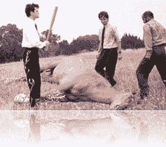

# Scrum 泡沫

> 原文：<https://simpleprogrammer.com/the-scrum-bubble/>

我认为今天是谈论我所谓的“Scrum 泡沫”的好时机最近关于 Scrum 和认证的话题似乎非常热门。从我在 [Scrum for the Money](https://simpleprogrammer.com/2010/03/31/scrum-for-the-money/) 上的原始帖子到 [Ron Jeffries 关于认证的帖子](http://xprogramming.com/articles/scrum-alliance-drop-certified/)到[Bob 叔叔关于认证的帖子](http://blog.objectmentor.com/articles/2010/04/27/certification-dont-waste-your-time)，再到 [David Starr 关于认证的帖子](http://elegantcode.com/2010/04/29/scrum-and-the-c-word/)。

死马当活马医。你不能真的知道它死了。我是说，当然它的眼睛是闭着的。当然，它躺在地板上，血肉模糊，但是它真的死了吗？唯一明智的做法是再打一次，以防万一。让我们好好宰了那匹马！

这里有一个潜在的问题……我称之为

## SCRUM 泡沫

记住。com 时代。啊，是不是很棒。

整个股市十年来一直上涨…

哦，别忘了房地产繁荣。房地产繁荣是伟大的！

但是后来…发生了什么？

哦，是的，我们回到了石器时代。

同样的事情也发生在 Scrum 上。认证的激增助长了这一趋势。当软件开发界的每个人都是认证的 Scrum 大师，而我们还在构建低劣的软件时，会发生什么？然后呢？

## 嘣！

它会内爆，就像泡沫一样。这个泡沫将会破裂，当它发生时，敏捷也会随之破灭。

一位智者曾经说过

> 你可以多次剪羊毛，但只能剥一次皮。

当你用无用的证书武装人们，并把他们送进组织去征服软件开发的野兽时，你是在剥那只羊的皮。所有从 Scrum 中榨取了大量金钱的顾问最终都会发现这个问题。

## Scrum 很好

确实是。这确实是一个构建软件的好工具。它是有意义的，它是实用的，如果你正确地应用它，你会得到一个好的结果。问题是如何正确应用它。问题是它没有解决其他需要改变的事情，从而真正能够进行敏捷开发。(这就是为什么我建议采用新的流程 kanba 和 T1 来解决这些问题。)

培训和顾问也不错。从真正知道自己在做什么的人那里获得良好的培训可以加速你的学习曲线。已经经历过一个过程并能以新的眼光看待事物的顾问，对于在一个组织中做出积极的改变是无价的。

问题是 Scrum 并不是软件开发的终极目标。杀死死亡行军僵尸的不是银弹。它是一种工具。我真的很喜欢 Henrik Kniberg 的 Scrum 和看板方法，他谈到每一个都是帮助你开发软件的工具。在他的[书](http://www.amazon.com/gp/product/0557138329/ref=as_li_ss_tl?ie=UTF8&camp=1789&creative=390957&creativeASIN=0557138329&linkCode=as2&tag=makithecompsi-20)(买这本书真好)中，他问了这样一个问题，叉子和刀子哪个更好？这是一个非常愚蠢的问题，很好地说明了这一点。

当我们把 Scrum 炒作到摇滚明星的地步，然后用它作为工具，从软件开发生态系统中快速榨取大量金钱时，我们正在制造一个泡沫。就像任何泡沫一样，如果我们继续吹大它，我们应该预料到它会破裂。

## Scrum 中有很多优秀的人

有很多优秀的人对 Scrum 有着真诚的热情，他们真正投入到 Scrum 中，因为他们知道这是向客户交付价值的好方法，而且这是一个简单的框架，可以很容易地教授和实现。有很多像大卫·斯塔尔和 T2·托拜厄斯·梅尔这样的人在软件开发领域真诚地尝试做好事，并使用 Scrum 来做。我真的相信。

但是，还有很多人依靠 Scrum 的成功，在证书工厂之外发展事业。如果我们想避免破坏其他人以 Scrum 的名义所做的好事，我们必须从那些人那里拿走通往王国的钥匙。