# 软件开发人员(和其他科技极客)2016 年圣诞礼物清单

> 原文:[https://simple programmer . com/the-software-developer-and-other-tech-geeks-Christmas-gift-list/](https://simpleprogrammer.com/the-software-developer-and-other-tech-geeks-christmas-gift-list/)

## **更新:[点击这里查看最新的 2020 年软件开发者礼物清单](https://simpleprogrammer.com/gifts-for-programmers/)**

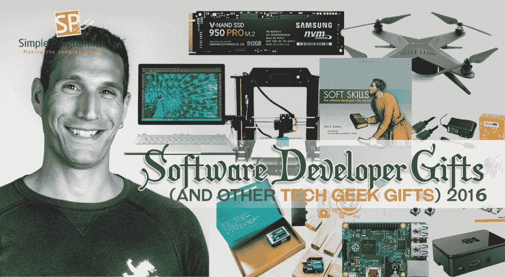

按照真正简单的程序员传统，我为软件开发人员、程序员和技术发烧友们整理了今年的圣诞清单。

程序员是挑剔的人，如果你的配偶/亲戚/家庭成员是，你可能会发现这个圣诞节为他们购物是一件非常痛苦的事情。

或者你自己也是一名程序员，你已经厌倦了从一个善意的、被误导的亲戚那里收到又一件花哨的圣诞毛衣。

如果是这样的话，你可以不那么微妙地分享这个圣诞清单。它包含了我今年最喜欢的科技产品——科技领域的任何人都会喜欢的产品。

*你可以在这里查看往期的年度榜单:*

*[软件开发者圣诞清单 2013](https://simpleprogrammer.com/2013/12/16/software-developer-tech-geek-christmas-gifts/)*
*[软件开发者圣诞清单 2014](https://simpleprogrammer.com/2014/11/17/top-developer-gifts-tech-geek-gifts/)*
*[软件开发者圣诞清单 2015](https://simpleprogrammer.com/2015/11/30/software-developer-gifts-and-other-tech-geek-gifts-2015/)*

如果你不喜欢阅读，你可以在这里看我制作的视频:

[https://www.youtube.com/embed/OMhKzTFyVdw](https://www.youtube.com/embed/OMhKzTFyVdw)

Let’s get cracking.

## [NES 经典版](https://simpleprogrammer.com/nesclassic)

这是我的童年。

任何 30 多岁的人都会对此兴奋不已。它预装了 30 个游戏，你可以插入并玩。

为了怀旧，它还配有一个老式的任天堂控制器。

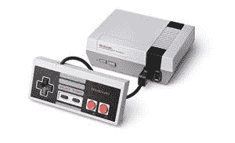

仿真很棒，感觉像是在玩原版。没有 ROM 或开关盒。

很酷的礼物。如果有的话，那就是感觉。

## [**剃须刀片 Pro**](https://simpleprogrammer.com/razerbladepro)

我目前正在使用 Surface Book，但我对它的主要不满是它不能玩游戏。

如果我真的玩游戏，我会对这个宝贝垂涎三尺。

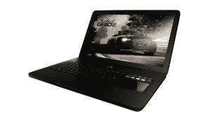

32g 内存。4K 触摸屏显示器。

它拥有最高端的显卡之一，所以你可以在 ultra 中运行大多数游戏。

它有点重，价格也令人沮丧(3000 美元)，但我正在认真考虑放弃我的 Surface Book，转而购买这款低劣的机器。

## [**三星 960 Pro**](https://simpleprogrammer.com/samsung960pro)

每当我看到一个超快的 SSD 驱动器，我就有一种再次切换到 PC 的强烈冲动。这款基本上是商用级的驱动器，价格是消费级的。

这款固态硬盘属于 M2 格式，有点像芯片。它有 1TB 或 2TB 两种容量。

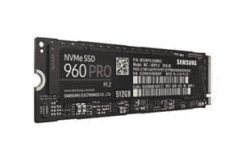

不过有一个问题 960 Pro 要到明年 1 月才会上市。你可以预购或现在购买 950 Pro，但我更喜欢 960。

这东西的速度太快了。

## [**树莓派 3**](https://simpleprogrammer.com/raspberry3)

我在之前的列表中讨论过树莓派。这是更新后的树莓派，相当牛逼。

更加强大。更多的功能。

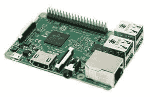

这对于爱好来说很棒。如果你想让你的孩子学习编程，或者只是想创建一些很酷的项目，你可以用它做很多很酷的事情。

## [**Oculus Rift**](https://simpleprogrammer.com/oculusrift)

**你现在只能得到开发者版本，所以它不太适合普通用户。**

**但如果你想玩虚拟现实，这是一个新鲜的新玩具。**

****

**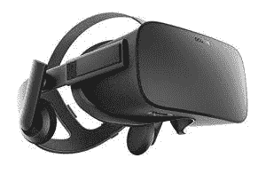**

**

对于想修修补补的程序员来说，这是个不错的选择。我甚至可能尝试为这个东西制作一些虚拟现实程序。

## [**LG 34UC88-B 34 英寸 21:9 曲面超宽 QHD IPS 显示器**](https://simpleprogrammer.com/LGultrawidemonitor)

我实际上做了一个评论。你可以在这里查看。

这基本上是一个弯曲的超宽显示器。看起来很神奇。

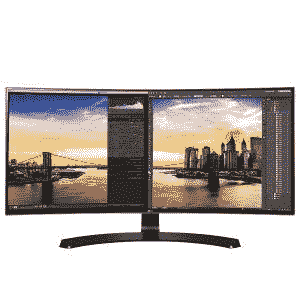

价格是一个挫折，但我不介意。显示器是一流的。很高兴我买了它。

## [**佳明先行者 235**](https://simpleprogrammer.com/garminforerunner)

这玩意现在就在我手腕上。

以前戴的是 Apple Watch，最近换成了这个。我经常跑步，但苹果手表不适合我。电池寿命也太短了。

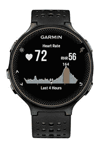

现在，Garmin Forerunner 235 没有做到我希望它做到的一切，但电池寿命约为 9 天，它给出了一吨关于您跑步的极客统计数据。

它还能追踪你的睡眠模式，这很酷。从技术上来说，Apple Watch 也可以做到这一点……但是你可能会在睡觉的时候给它充电，因为这个吸盘只能持续一天。

你也可以在 Garmin Forerunner 上安装应用程序。不是苹果式的应用程序，但它是某种东西。

## [**Apple Watch II**](https://simpleprogrammer.com/applewatch2)

不可否认，我不明白这一点——我对我的 Garmin Forerunner 相当满意，因为我跑得很多。

也就是说，它带有内置 GPS，这很酷。它通常更快更好，尽管还没有完全实现。

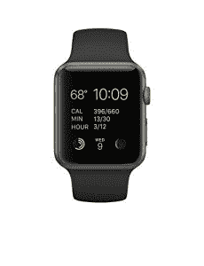

仍然是一个很好的礼物，有些人会从中受益匪浅。

有时候还是会怀念以前的 Apple Watch…

## [**西勒奇感应智能插销**](https://simpleprogrammer.com/schlagesmartlock)

我一直在尝试家庭自动化，并发现这很有趣。

如果你真的在考虑买这个，请点击这里查看我的视频评论。

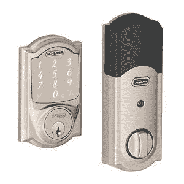

本质上，它让你可以无钥匙进入你的房子。你要么输入几个数字，要么用智能手机解锁。

相当方便的升级。

## [**按动启用 Wi-Fi 的视频门铃**](https://simpleprogrammer.com/ringvideodoorbell)

同样，我做了一个关于这个的视频回顾，所以你可以[在这里](https://www.youtube.com/watch?v=QVwREQqLJPo)详细查看。

你可以用手机按门铃，这样就有第二个摄像头监视你的前门。

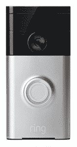

它非常有用。当人们放下包裹时，你可以和他们交谈，这是一个非常有用的功能。

我在这东西上花了 200 美元。完全值得:这是我今年买的最好的东西之一。

## [**奥斯基特扭领带**](https://simpleprogrammer.com/auskitties)

我有很多这样的东西。这是把那些讨厌的绳子绑在一起的简单方法。

绝对比使用 Velcro 皮带或只是捆绑在一起的绳子。

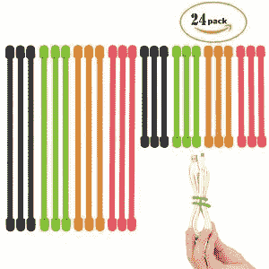

这份清单上的大多数东西都非常昂贵和高科技，但是如果你正在寻找一个简单的礼物，这肯定会在你的预算之内。

## [**Akker 40W 4 口 USB 壁式充电器电源部分 4**](https://simpleprogrammer.com/anker40w)

我特别选择了这个，因为它很好，很紧凑，适合旅行，还因为它有四个端口。

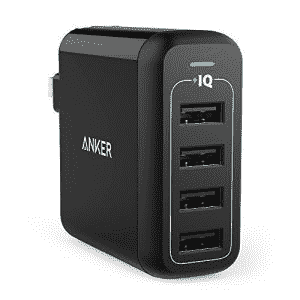

它的充电电流高达 2.1 安培(即最大充电电流)。

它还有一个“智商智能充电”功能，这个功能很有用。把这个翻出来，插上电源就能充电了。

## [**奥林巴斯 OM-D E-M10 马克 2 号无反光镜数码相机**](https://simpleprogrammer.com/olympuscamera)

我给我妻子买了这个，到目前为止她真的很喜欢。

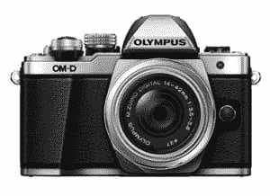

我用佳能 T5I 拍摄我的 YouTube 视频，但当我去旅行时，这更方便。这是一台超小型高品质相机。

它还配有无线同步和一系列其他很酷的功能。

## [**AmazonBasics 单显示器安装臂**](https://simpleprogrammer.com/mountarmasingle)

我现在正在用这个。不太贵，但是很灵活。

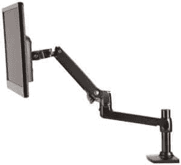

你可以把它转向各个方向，这样可以腾出一点桌面空间。

显示器支架通常会占用地面空间，而且它们不能广泛调节，但这比我想象的要好得多。很好，如果你也在做站坐式办公桌的话。

## [**MYOHO 3.3 脚/ 1 米通用 2 合 1 充电&同步线**T3】](https://simpleprogrammer.com/myohocable)

一个非常实用的工具。它有 Micro USB 和 Lightning 组合，非常方便。

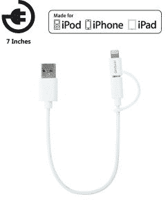

我去年的单子上有这样的东西，但是这些更耐用。它们不会破碎。

我有六个这样的家伙。

## [**Lizone Extra Pro 26000mAh 外置电池充电器**](https://simpleprogrammer.com/lizonebattery)

这个可以给你的笔记本电脑、手机、电池充电……它基本上是一个外部电池组。

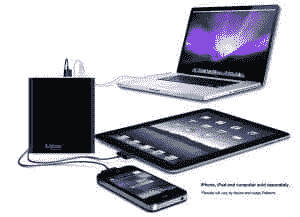

他们有 40，000 毫安时的版本，但我选择了 26，000 毫安时的。一些航空公司限制使用 40，000mAh 的版本，所以我会选择这个。

有这个在身边对我内心的平静很有好处。当我外出长途旅行时，不用担心手机没电了。

## [**3D 打印笔包**](https://simpleprogrammer.com/3doodler)

我发誓，这两个，Oculus Rift 和 NES 正在拖走我内心的孩子。

3Doodler 是一种三维笔。这有点像 3D 打印，只不过你是在 3D 中绘图。

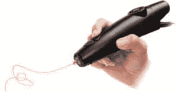

相当有创意的工具。玩它会很有趣，一旦你觉得无聊，至少它仍然是一个可以向朋友炫耀的新奇物品。

## [**PancakeBot PNKB01BK 3D 食品打印机**](https://simpleprogrammer.com/pancakebot)

这不是开玩笑。煎饼机器人。它存在。可以买。

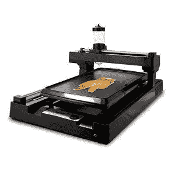

它的工作方式是，你给它一个图像，比如说一只猫，它会用煎饼面糊给你画出来。有点像煎饼艺术。

这是一个非常独特的想法。有点贵，但拥有它似乎很有趣。

## [**卡诺电脑套装**](https://simpleprogrammer.com/kanokit)

我打算给我女儿买这个。这是一个组装自己电脑的工具包。

我认为让孩子们接触编程很棒，这似乎是一种让他们熟悉的有趣方式。

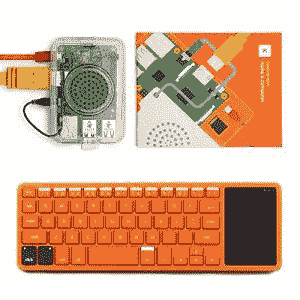

它有一些编程作业和基本任务给他们做。孩子们建造他们自己的电脑，然后它就是他们的了。

一个很酷很有用的工具，我很想看看我女儿是怎么找到它的。

## [**自主智能桌面 2**](https://simpleprogrammer.com/autonomousmartdesk)

我用这个。你可以根据自己的工作方式升高或降低桌子。

可调节站立式书桌真的很便宜。我倾向于在站立模式下一直使用它。

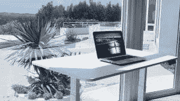

我会说这是我更好的投资之一，因为我可以燃烧额外的卡路里，我有更多的能量。

一个小小的缺点是，你必须自己把这些组装起来，但这并不需要太长时间。

## [**TechMatte MagGrip 出风口磁性万向车载支架**](https://simpleprogrammer.com/techmattegrip)

这个小玩意太棒了。

这是一个小小的磁性汽车支架。现在，我知道你开始怀疑了——这件事？这怎么能被描述为“太棒了”？

你会惊讶这有多方便。

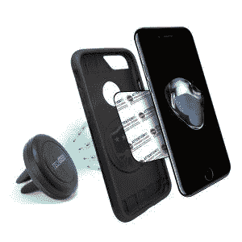

它有一个强大的磁铁，你可以用吸盘把它放在你的仪表板上。然后你有一些强磁铁放在你的手机壳后面。

假设你正在开车并使用你的全球定位系统，你只需把你的手机放在那里。简单。

这是一件小事，但它让生活变得无比便利。

## 来自简单程序员的礼物怎么样？

最后，您可以查看一些简单的程序员产品。

学习任何东西都有 [10 个步骤](http://simpleprogrammer.com/10stepstolearn)，技术领域的任何人都会发现非常有用。

接下来是经典的[如何把自己推销成一名软件开发人员](http://simpleprogrammer.com/howtomarketyourself)，许多人用它来标榜自己是开发人员并获得更高的报酬。

软技能:软件开发人员生活手册是所有软件开发人员的综合指南。

如果你知道有人想进入博客，你可以给他们 10 种从你的博客中赚钱的方法。不，广告不是唯一的方法。

最后但同样重要的是，我为软件开发人员组织了一个关于[房地产投资的课程。](https://simpleprogrammer.com/products/simple-real-estate/)

节日快乐！

**寻找更多礼物创意？**

提醒一下，如果你还需要更多的想法，你可以点击这里查看过去的年度列表:

[软件开发者圣诞榜 2013](https://simpleprogrammer.com/2013/12/16/software-developer-tech-geek-christmas-gifts/)
[软件开发者圣诞榜 2014](https://simpleprogrammer.com/2014/11/17/top-developer-gifts-tech-geek-gifts/)
[软件开发者圣诞榜 2015](https://simpleprogrammer.com/2015/11/30/software-developer-gifts-and-other-tech-geek-gifts-2015/)**