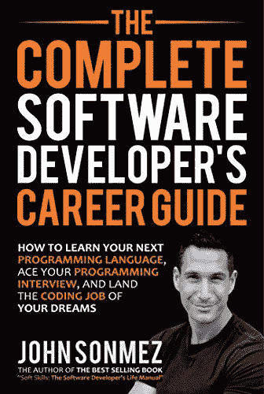
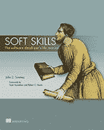
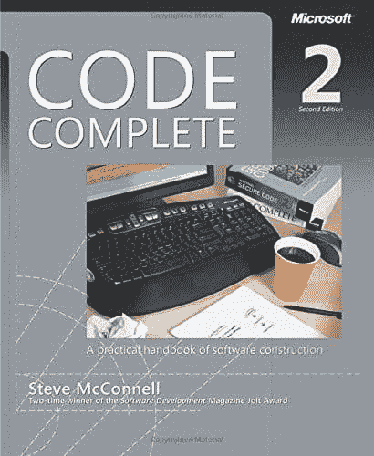
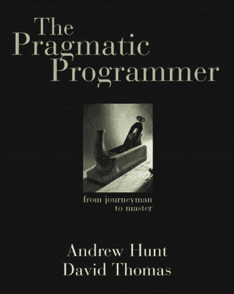
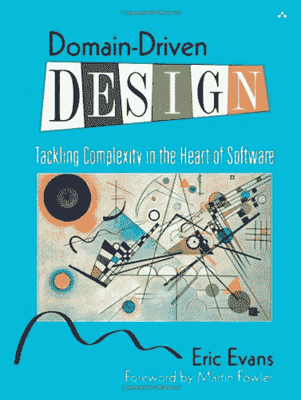
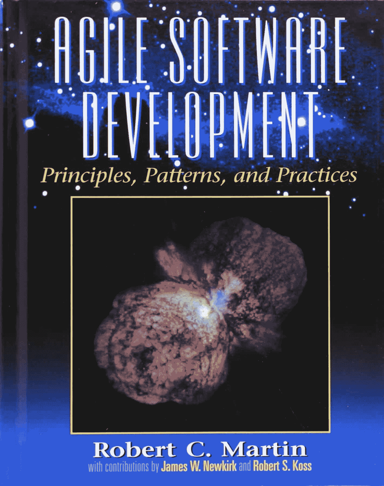
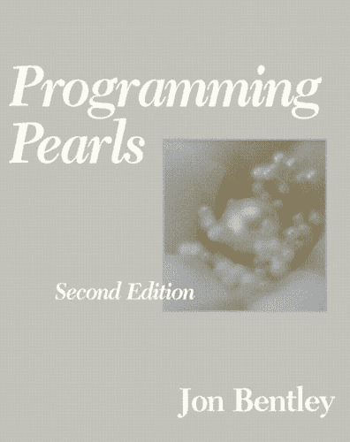
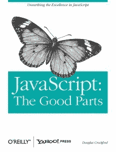
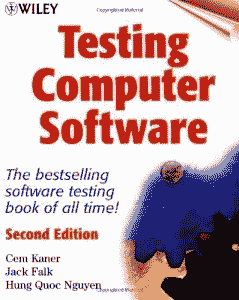
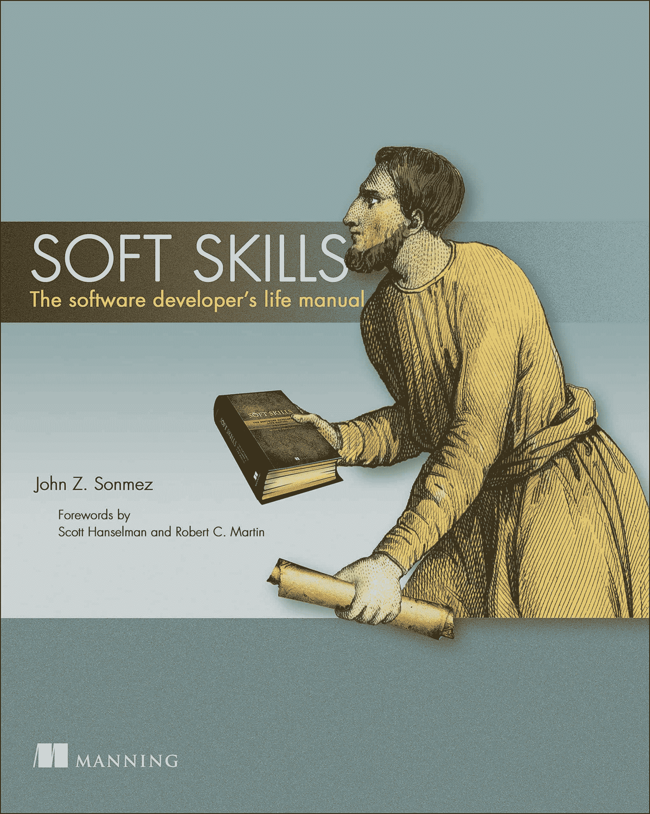

# 编程书籍的终极列表

> 原文:[https://simple programmer . com/the-ultimate-list-of-programming-books/](https://simpleprogrammer.com/the-ultimate-list-of-programming-books/)

经常有人问我，我会推荐所有软件开发人员阅读哪些顶级编程书籍。

我终于决定整理一份我认为最有益的编程书籍清单，我认为每个程序员都应该阅读。

现在，就像我的开发者播客最终列表一样，这是我的列表，所以我来制定规则。(这意味着我可以把我的书放在这个列表的最前面——实际上是两个都是。)

首先，关闭:

我最近的一本书是一本名为《软件开发人员职业指南》的大部头书。

这本书很大，印刷版大约有 800 页。【T2

我写这本书主要是因为没有一本好书——或者真的没有任何这方面的书——**告诉软件开发人员他们需要知道的关于如何在软件开发人员中获得成功职业生涯的一切事情**,并回答我得到的所有常见问题，比如:

*   作为一名软件开发人员，我该如何入门？
*   我如何学习一门新的编程语言？
*   大学，新兵训练营，自学？
*   我该怎么对付我的混蛋老板？我的同事？歧视？
*   我如何找到一份新工作？我的第一份工作？
*   我如何获得加薪？
*   作为一名软件开发人员，我需要知道些什么？
*   我如何赚更多的钱并推进我的职业发展？

我可以继续说下去，但我想你明白了。无论如何，我们的目标是为所有的软件开发人员，不管他们的职业水平如何，创建一个一站式的指南来管理他们的职业生涯。

这本书到目前为止取得了巨大的成功，在发行的那一周，它在《华尔街日报》非小说类畅销书排行榜上首次登上第五名，是的，没错，第五名。

这是一本每个软件开发人员都应该拥有的书。句号。(不仅仅是因为是我写的。)

接下来…

在**阅读了这份清单上的所有书籍**，在**软件开发领域呆了超过 15 年**和**培训了数十万软件开发人员**之后，通过[我在 Pluralsight](https://simpleprogrammer.com/pluralsight) 的在线课程，我写了我自己的书，名为[软技能:软件开发人员的生活手册](https://simpleprogrammer.com/softskills)
 
现在，显然**我极力推荐这本书**——但不仅仅是因为我写了这本书。我写这本书是因为我觉得现有的编程书籍中缺少大量的知识。

有许多优秀的书籍——毫无疑问你会在这个列表中遇到——但是，**没有任何一本书提供了作为一名成功的软件开发人员**以及总体上过上更好生活所需的软技能的全面论述。

所以，[软技能:软件开发人员的生活手册](https://simpleprogrammer.com/softskills)就是这样。我想写一本书，我希望有人在 15 年前给我，那时我刚开始我的软件开发职业生涯。

好了，这是足够的宣传我自己的书。如果你想看看，你可以在这里找到大量的评论。

(在你通读这份清单之前，你可能想看看我的指南:[快速学习的 10 个步骤](https://simpleprogrammer.com/store/products/learn-anything-quickly/))

## 基础编程书籍

我认为第一个书单是一个很好的起点，并为任何软件开发人员提供了坚实的基础:
 
**[代码完整:软件构造实用手册，第二版](http://www.amazon.com/gp/product/0735619670/ref=as_li_tl?ie=UTF8&camp=1789&creative=390957&creativeASIN=0735619670&linkCode=as2&tag=makithecompsi-20&linkId=SW5BESGGHL4VGASU)**

这本书是我读过的最具变革性的书之一。在读完这本书之后，我写代码的方式和我思考写代码的方式完全改变了。这本书充满了关于如何写出好代码的好建议，不管是架构还是编程语言。代码完整深入到编写好代码的结构细节中。我从来没有找到任何一本书能够触及这本书的许多主题。我认为这本书是所有严肃的软件开发人员的必读之作。这本书有点过时了，但仍有极有价值的信息。

**[《干净的代码:敏捷软件工艺手册》](http://www.amazon.com/gp/product/0132350882/ref=as_li_tl?ie=UTF8&camp=1789&creative=390957&creativeASIN=0132350882&linkCode=as2&tag=makithecompsi-20&linkId=SLMG4URLW5MRDZBU)** 
这是又一本彻底改变了我写代码方式的书。我可以把我的编程生涯分为代码完成前、代码清理前和代码清理后。在阅读完《代码完整》之后，我推荐这本书，因为《代码完整》更多地是处理代码和方法的单个行的结构，而《干净的代码》处理一些相同的概念，但是在稍微更高的层次上。

阅读这本书而不成为一名更好的程序员是相当困难的。

[**计算机程序的结构和解释**](http://www.amazon.com/gp/product/0262510871/ref=as_li_tl?ie=UTF8&camp=1789&creative=390957&creativeASIN=0262510871&linkCode=as2&tag=makithecompsi-20&linkId=C244HXF4X3AL277T) 
我争论着把这一个列入名单。真的是基础性的吗？这取决于你想拥有一个多么坚实的基础。如果你想有一个真正坚实的基础，那么答案是响亮的“是”

这本书很有挑战性。它涉及函数式编程。它是为麻省理工学院著名的编程入门课程而写的。但是，我建议你不仅要读这本书，还要完成书中所有的练习。这将是一个艰难的旅程，但你会成为一个比以前更好的程序员。

**[设计模式:可重用面向对象软件的元素](http://www.amazon.com/gp/product/0201633612/ref=as_li_tl?ie=UTF8&camp=1789&creative=390957&creativeASIN=0201633612&linkCode=as2&tag=makithecompsi-20&linkId=T5LO7MSEHZOVINEZ)** 
这本经典书籍是批判性阅读，以真正理解什么是设计模式，并熟悉你在职业生涯中可能遇到的最常见的设计模式。这不是一本特别容易阅读的书，其中的描述和例子可能有点难以理解——尤其是如果你对 UML 没有很好的理解——但是，我认为这是一本“必读”的书如果你对这本书有困难，你可能想从“头先设计模式”开始。它以一种更容易理解的方式教授了本书中的设计模式——尽管如此，没有什么可以替代原著。

[**头先设计图案**](http://www.amazon.com/gp/product/0596007124/ref=as_li_tl?ie=UTF8&camp=1789&creative=390957&creativeASIN=0596007124&linkCode=as2&tag=makithecompsi-20&linkId=XC3XKCNWDKLNSB6Y) 
先读经典，再读这一个，再回头读经典的一个，重新认识。这本书让设计模式更容易理解。这也是一本学习如何教授复杂话题并让它们变得有趣的有用的书。

[**重构:改进现有代码的设计**](http://www.amazon.com/gp/product/0201485672/ref=as_li_tl?ie=UTF8&camp=1789&creative=390957&creativeASIN=0201485672&linkCode=as2&tag=makithecompsi-20&linkId=FHSAXTL2WUBMEQ32) 
虽然现代的 ide 已经自动化了本书中提到的许多重构，但是为了编写好的、干净的代码，重构仍然是一个非常重要的概念，尤其是在当今敏捷的环境中。这本书涵盖了所有软件开发人员应该知道如何在任何代码库中执行的所有主要重构。学习如何重构你的代码可以让你给它注入新的生命，让它随着时间的推移得到改进，而不是腐烂。

[**有效地使用遗留代码**](http://www.amazon.com/gp/product/0131177052/ref=as_li_tl?ie=UTF8&camp=1789&creative=390957&creativeASIN=0131177052&linkCode=as2&tag=makithecompsi-20&linkId=APSKHNFRSBQHXL6S) 
除非你足够幸运地一直从事绿色领域的项目，否则在你的职业生涯中你很可能会遇到遗留代码——而且是大量的遗留代码。我包括了这本书，因为它是关于使用遗留代码的基础编程书籍。如果你正在开发一个超过 5 年的大型代码库，这本书可能是你的新圣经。读一读，记在心里。

## 专业开发编程书籍

这一部分包含了我发现对我作为软件开发人员的职业发展最有益的编程书籍。
 
[**【务实的程序员:从熟练工到大师**](http://www.amazon.com/gp/product/020161622X/ref=as_li_tl?ie=UTF8&camp=1789&creative=390957&creativeASIN=020161622X&linkCode=as2&tag=makithecompsi-20&linkId=FTFYFATU5GAYAQDV) 
当我第一次读这本书的时候，它并不是我最喜欢的。我仍然不同意书中所说的一切，但即使我有疑虑，我也不得不承认这是一本编程书籍，每个软件开发人员都应该阅读，当他们想从仅仅是一个程序员过渡到更多的东西时。这本书里有一些非常实用的建议，会给你提供一些原本需要几年甚至几十年才能学会的课程。

[**《干净的程序员:职业程序员的行为准则》**](http://www.amazon.com/gp/product/0137081073/ref=as_li_tl?ie=UTF8&camp=1789&creative=390957&creativeASIN=0137081073&linkCode=as2&tag=makithecompsi-20&linkId=XKQCRBOYPIGRWEO6)
这本书是关于如何成为一名职业程序员的。这是一本难读的书。很多开发人员不会喜欢这本编程书，因为其中的建议有时难以下咽。但如果可以的话，还是咽下去吧，因为本书的作者鲍伯·马丁是业内资深人士，他已经成功地编写了数十年的代码。我真的发现这本书在塑造我的职业生涯和做出艰难决定方面很有帮助。

[**《热情的程序员:在软件开发中创造非凡的职业生涯》**](http://www.amazon.com/gp/product/1934356344/ref=as_li_tl?ie=UTF8&camp=1789&creative=390957&creativeASIN=1934356344&linkCode=as2&tag=makithecompsi-20&linkId=UMUZQ6J567EVOVAV) 
这本书是主要的编程书籍之一，它影响了我将我的软件开发职业视为一项业务，而不仅仅是我所做的事情。这本书充满了各种各样的智慧，关于如何增加你的技能，最大限度地利用你的时间，保持你的职业生涯和激情等等。如果你想超越编程仅仅是一份工作，我强烈推荐你阅读这本书。

[**【神话中的人月】**](http://www.amazon.com/gp/product/0201835959/ref=as_li_tl?ie=UTF8&camp=1789&creative=390957&creativeASIN=0201835959&linkCode=as2&tag=makithecompsi-20&linkId=AJXQSTT3JZM4EFOA) 
所有这些你认为是你的项目独有的问题，好吧，我告诉你，它们不是。它们在这本书里。如果你想要一本关于复杂软件开发项目的非常实用的编程书籍，这就是了。这本书就像是困扰非平凡软件开发项目的最常见问题的目录，并且这本书经受住了时间的考验。

## 基于架构的编程书籍

这些是关心架构的有抱负的架构师或软件开发人员应该阅读的编程书籍。
 
**[领域驱动设计:在软件的心脏部位攻克复杂性](http://www.amazon.com/gp/product/0321125215/ref=as_li_tl?ie=UTF8&camp=1789&creative=390957&creativeASIN=0321125215&linkCode=as2&tag=makithecompsi-20&linkId=IQJEFS3QBO4A4WPZ)** 
扣好安全带，这是一个难读的东西。第一次看这本书，没看懂。第二次看的时候，我有点明白了。直到我第三次翻阅这本书时，它才终于一路走好。这本书将帮助你学习如何创建一个基于领域建模的可维护架构。一旦你知道了这本书里的内容，你就不能回头了。你不会再用同样的方式思考软件开发架构了。

[**企业应用架构的模式**](http://www.amazon.com/gp/product/0321127420/ref=as_li_tl?ie=UTF8&camp=1789&creative=390957&creativeASIN=0321127420&linkCode=as2&tag=makithecompsi-20&linkId=E7JZASHLN5LXW3V6) 
如果你正在做任何一种企业应用开发，你会发现这本书极其有用。它包含了关于如何从头到尾设计和构建企业应用程序的大量信息。不过，我发现最有用的是书中包含的许多在企业应用程序中常见的模式。这是我在为工作构建大型企业应用程序时一直参考的一本书。

**[企业集成模式:设计、构建和部署消息传递解决方案](http://www.amazon.com/gp/product/0321200683/ref=as_li_tl?ie=UTF8&camp=1789&creative=390957&creativeASIN=0321200683&linkCode=as2&tag=makithecompsi-20&linkId=PIR7XJJSX6LYRE32)** 
这是实现消息总线或服务总线架构的绝对指南。不要让这本书的名字欺骗了你，这本书是关于消息总线和所有正确实现它们的模式的。如果您正在使用总线进行应用程序或服务之间的任何类型的集成，您一定会喜欢这本书。

[**重构到模式**](http://www.amazon.com/gp/product/0321213351/ref=as_li_tl?ie=UTF8&camp=1789&creative=390957&creativeASIN=0321213351&linkCode=as2&tag=makithecompsi-20&linkId=TIS57GQXK42INOR3) 
阅读和学习设计模式是一回事，实现它们是另一回事。实际获取现有代码并将其重构为设计模式是另一回事。这是一本教你——从头开始——如何将现有代码移入模式，甚至如何将其移出模式的编程书籍。应该在每个建筑师的书架上。

## 敏捷编程书籍

这些编程书籍是我发现的关于敏捷开发的最好的书籍。我向任何在敏捷环境中工作的人推荐它们，不管你是在使用 Scrum、看板、XP 还是其他什么。
 
[**敏捷软件开发，原理、模式和实践**](http://www.amazon.com/gp/product/0135974445/ref=as_li_tl?ie=UTF8&camp=1789&creative=390957&creativeASIN=0135974445&linkCode=as2&tag=makithecompsi-20&linkId=4DHTIVWBRMB372SW) 
没错，这又是一本鲍伯·马丁的书，而且是极好的。[这本书还有 C#版本。](http://www.amazon.com/gp/product/0131857258/ref=as_li_tl?ie=UTF8&camp=1789&creative=390957&creativeASIN=0131857258&linkCode=as2&tag=makithecompsi-20&linkId=NXVYGRQXBCWL6JMG)这本书带你了解敏捷开发的所有核心要素，而不是所有的琐事。不仅如此，它还介绍了坚实的设计原则，这些原则是理解如何编写干净、可维护的代码的基础。这本书说服了我开始结对编程。

[**敏捷估算和计划**](http://www.amazon.com/gp/product/0131479415/ref=as_li_tl?ie=UTF8&camp=1789&creative=390957&creativeASIN=0131479415&linkCode=as2&tag=makithecompsi-20&linkId=UBM7CZE37UYGEIYB) 
很多团队都搞错了。这本书告诉你如何正确地做这件事。当我第一次通读这本书时，我意识到合理的原则可以应用到敏捷团队的评估和计划中。强烈推荐给任何在敏捷环境中工作的人。

[**用户故事应用:对于敏捷软件开发**](http://www.amazon.com/gp/product/0321205685/ref=as_li_tl?ie=UTF8&camp=1789&creative=390957&creativeASIN=0321205685&linkCode=as2&tag=makithecompsi-20&linkId=6YBSU7KRCEJBF5A3) 
另一本很棒的敏捷书籍帮助解决了一个主要的麻烦领域:用户故事。在敏捷团队工作时，我遇到过一些非常糟糕的用户故事，仅仅是因为没有人知道如何做出好的用户故事，或者用户故事实际上应该是什么样子。这本书解决了那个问题。

[**极限编程讲解**](http://www.amazon.com/gp/product/0321278658/ref=as_li_tl?ie=UTF8&camp=1789&creative=390957&creativeASIN=0321278658&linkCode=as2&tag=makithecompsi-20&linkId=LMXPKIVOJLV2S7G3) 
我认为是经典的敏捷书籍。对某些人来说有点极端——这不是 SCRUM，这是真正的 XP。这本编程书是关于如何实现极限编程的非常规范的描述，但是书中的思想可以应用到许多不同类型的敏捷环境中。

## 算法和面试问题编程书籍

这些编程书籍将使你更擅长编写算法，并将帮助你通过面试——尤其是你必须编写代码的编程面试。
 
[**编程明珠**](http://www.amazon.com/gp/product/0201657880/ref=as_li_tl?ie=UTF8&camp=1789&creative=390957&creativeASIN=0201657880&linkCode=as2&tag=makithecompsi-20&linkId=WUX7MH3IPWHBIP2L) 
编程难题的经典之作。阅读这本书，并实际做所有的练习。如果你熬过了这一考验，你将成为一名更好的程序员，并对算法和算法设计以及一些关键的问题解决技巧有深刻的理解。

**[破解编码面试:150 个编程问题及解答](http://www.amazon.com/gp/product/098478280X/ref=as_li_tl?ie=UTF8&camp=1789&creative=390957&creativeASIN=098478280X&linkCode=as2&tag=makithecompsi-20&linkId=PPVAMLLSJHP56DJY)** 
这本书不仅是亚马逊上最畅销的编程书籍之一，更是亚马逊上最畅销的书籍之一，句号。而且理由很充分。这本书充满了很好的面试建议和真实的编程问题，不仅会帮助你通过编码面试，而且会让你成为一个更好的程序员。浏览书本，做练习。如果你能掌握这本书里的练习，在编程面试中难倒你将会非常困难。

[**算法简介**](http://www.amazon.com/gp/product/0262033844/ref=as_li_tl?ie=UTF8&camp=1789&creative=390957&creativeASIN=0262033844&linkCode=as2&tag=makithecompsi-20&linkId=MLA46VDMERC3PKVP) 
这本书被认为是学习算法的最佳书籍之一，这是有充分理由的。对于任何有兴趣提高自己编写和理解算法(这是编写代码的核心)的能力的人来说，这是一本坚实的编程书籍。如果你要读任何关于算法的书，一定要从这本开始。

## 特定语言和编程语言相关的编程书籍

这是一本非常好的特定语言编程书籍和与编程语言相关的书籍的混合体。我知道我可能已经错过了一些，所以帮帮我。

[**JavaScript 的精华部分**](http://www.amazon.com/gp/product/0596517742/ref=as_li_tl?ie=UTF8&camp=1789&creative=390957&creativeASIN=0596517742&linkCode=as2&tag=makithecompsi-20&linkId=JJFR64SIFQJSGIEX) 
随着 JavaScript 的发展，这本书可能会过时，但就目前而言，这本书是必不可少的。JavaScript 是一种从来不是为今天的用途而设计的语言。这意味着在编写 JavaScript 代码时有很多陷阱。这本书不止一次救了我。如果你打算写 JavaScript，你会想要读这本书。

[**用 Java 思考**](http://www.amazon.com/gp/product/0131872486/ref=as_li_tl?ie=UTF8&camp=1789&creative=390957&creativeASIN=0131872486&linkCode=as2&tag=makithecompsi-20&linkId=NOS5PVISMT2O2FFU) 
这本书不仅教你如何开始用 Java 编程，而是教你如何教一门编程语言。我想我从来没有遇到过比这本书更好的学习编程语言的书。即使你对 Java 没有兴趣，我也推荐你读一读。

**[有效的现代 C++: 42 种提高你使用 C++11 和 C++14 的具体方法](http://www.amazon.com/gp/product/1491903996/ref=as_li_tl?ie=UTF8&camp=1789&creative=390957&creativeASIN=1491903996&linkCode=as2&tag=makithecompsi-20&linkId=AIJ26YDJFLA5FQLG)** 
我已经链接了这本书的现代版，但整个系列的老书都他妈的好。我从阅读原版的[有效 C++](http://www.amazon.com/gp/product/0321334876/ref=as_li_tl?ie=UTF8&camp=1789&creative=390957&creativeASIN=0321334876&linkCode=as2&tag=makithecompsi-20&linkId=WKRPAWNCGEIWGKU7) 、[更有效 C++](http://www.amazon.com/gp/product/020163371X/ref=as_li_tl?ie=UTF8&camp=1789&creative=390957&creativeASIN=020163371X&linkCode=as2&tag=makithecompsi-20&linkId=DVIXDRZ7ZGUKTRPY) 和[有效 STL](http://www.amazon.com/gp/product/0201749629/ref=as_li_tl?ie=UTF8&camp=1789&creative=390957&creativeASIN=0201749629&linkCode=as2&tag=makithecompsi-20&linkId=BLNYYHZNG7YV34GK) 书籍中学到了很多，即使我今天不写任何 C++代码，我仍然对这些书籍有着美好的回忆。我承认，如果你正在用现代 C++编写，早期的书籍可能不会对你有太大的帮助，但是如果你痴迷于成为最好的 C++开发人员，你必须阅读这一经典的更新版本。

[**有效 Java**](http://www.amazon.com/gp/product/0321356683/ref=as_li_tl?ie=UTF8&camp=1789&creative=390957&creativeASIN=0321356683&linkCode=as2&tag=makithecompsi-20&linkId=TCQLO7BQTDA5FFJX) 
Java 的对应物几乎和 C++原版一样好。由于语言的变化，一些建议已经过时了，但总的来说，这仍然是一本真正的好书。

[**C#深度**](http://www.amazon.com/gp/product/161729134X/ref=as_li_tl?ie=UTF8&camp=1789&creative=390957&creativeASIN=161729134X&linkCode=as2&tag=makithecompsi-20&linkId=LOYSLNJFEYIPC5VP) 
你知道 C#吗？你*真的*懂 C#吗？如果你读了这本书，你会的。我从来没有读过像这本书这样深入研究一种语言的书。在我读这本书之前，我认为自己是 C#方面的专家。我会给自己打 10 分。后来，我意识到我最初对自己知识的估计与事实相差甚远。

**[【七周七种语言:学习编程语言的实用指南(实用程序员)](http://www.amazon.com/gp/product/193435659X/ref=as_li_tl?ie=UTF8&camp=1789&creative=390957&creativeASIN=193435659X&linkCode=as2&tag=makithecompsi-20&linkId=NEMLFJTPKJLMHK6B)** 
我爱这本书，因为它舒展了你，让你成为一个更开放的程序员。这是一本编程书籍，有潜力带你到下一个层次，看到超越漂亮的宗教技术倾向。这本书帮助我看到如此多的编程语言是多么的相似，欣赏它们的不同之处，并看到我能学得多快。

## 运营、质量保证和部署相关的编程书籍

这些书是与正常编程活动范围之外的任何内容相关的编程书籍，包括测试、操作和部署。
 
[**测试计算机软件**](http://www.amazon.com/gp/product/0471358460/ref=as_li_tl?ie=UTF8&camp=1789&creative=390957&creativeASIN=0471358460&linkCode=as2&tag=makithecompsi-20&linkId=P376HSKN3AK7NKOI) 
每个开发人员都应该阅读这本书，以便很好地了解 QA 和测试。这本书很容易理解，但却是一本全面的关于测试的书。读完这本书后，我能够更好地与 QA 沟通，编写更多可测试的代码，并通过学习如何在翻墙之前测试自己的代码来避免缺陷。

**[发货吧！成功软件项目实用指南](http://www.amazon.com/gp/product/0974514047/ref=as_li_tl?ie=UTF8&camp=1789&creative=390957&creativeASIN=0974514047&linkCode=as2&tag=makithecompsi-20&linkId=PJFVKLNVX667RDVH)** 
这本书里有很多很棒的内容和实践。有些有点极端，但都很有效。这本书可以帮助你把你的软件开发店提高到一个新的水平。这是一本值得一读的好书，然后交给你的经理来强调一些最佳实践的价值，比如:持续集成、自动化测试、缩减计划等。

**[持续交付:通过构建、测试和部署自动化进行可靠的软件发布](http://www.amazon.com/gp/product/0321601912/ref=as_li_tl?ie=UTF8&camp=1789&creative=390957&creativeASIN=0321601912&linkCode=as2&tag=makithecompsi-20&linkId=DZWPGIU5ARNIDT6M)** 
直到我读了这本书，我才真正相信持续交付是可能的。这本书实际上向您展示了如何构建一个完整的系统，将测试代码构建并部署到产品中。这本书远远超越了持续集成，将整个交付过程带入了一个持续的流程。如果您想自动化整个部署过程，我强烈推荐这本书——相信我，您会的！

## 软技能和其他有趣的编程书籍

这些编程书籍实际上根本不是编程书籍，而是我在职业生涯中发现非常有价值的书籍，或者是大多数软件开发人员真正喜欢的书籍。

[**软技能:软件开发人员的生活手册**](https://simpleprogrammer.com/softskills) 
对，这是我的书。我以前提到过它，但我也想把它放在适当的位置。在这本书里，我涵盖了程序员可能感兴趣的所有非技术性的东西，从职业生涯到个人品牌、博客、学习、教学、生产力、财务，甚至还有一点关于健康和人际关系的内容。

[**如何赢得朋友，影响人**](http://www.amazon.com/gp/product/B003WEAI4E/ref=as_li_tl?ie=UTF8&camp=1789&creative=390957&creativeASIN=B003WEAI4E&linkCode=as2&tag=makithecompsi-20&linkId=PFFU756LAJK6LWEK) 
这本书我真的怎么赞美都不为过。是的，跟编程没关系。你可能会惊讶地发现这是一本编程书籍，但这是一本改变人生的书。作为一名软件开发人员，你将在整个职业生涯中与人打交道。如果你学会了如何有效地处理它们，你会做得更好。所以，我强烈推荐阅读这本书。这本书改变了我的生活，让我走上了现在的道路。

[**代码:计算机软硬件的隐藏语言**](http://www.amazon.com/gp/product/B00JDMPOK2/ref=as_li_tl?ie=UTF8&camp=1789&creative=390957&creativeASIN=B00JDMPOK2&linkCode=as2&tag=makithecompsi-20&linkId=YLIZQT4OP6MBEFYG) 
这是一本引人入胜的书。同样，这不是一本明确的编程书，但它是关于计算机如何在最底层工作的。读完这本书后，你会明白你写的代码实际上在做什么，以及 CPU 实际上是如何执行你的代码的。这是一本有趣又迷人的读物。

[**哥德尔、埃舍尔、巴赫:一条永恒的金色辫子**](http://www.amazon.com/gp/product/0465026567/ref=as_li_tl?ie=UTF8&camp=1789&creative=390957&creativeASIN=0465026567&linkCode=as2&tag=makithecompsi-20&linkId=VMF3NUZ3HTFLD43Y) 
这份编程书单上的另一本非编程书籍，却是一本几乎所有程序员都会觉得着迷的书。这是一本大部头的书，是我读过的最令人愉快的书之一。我不想放下这本书，当我读到最后的时候，我非常难过。

[**兵法**](http://www.amazon.com/gp/product/B007A4SDCG/ref=as_li_tl?ie=UTF8&camp=1789&creative=390957&creativeASIN=B007A4SDCG&linkCode=as2&tag=makithecompsi-20&linkId=J3DU44KE5DVHVMZE) 
这一个是另一个延伸。这绝不是一本编程书籍——甚至不是——但它帮助我实现了极高的生产率。这本书是我能坐下来花 4 个小时写这篇博文的原因。这是一本优秀的书，它将激励你成为最好的自己，并最终战胜拖延症。

## 我错过了哪些编程书籍？

有什么编程书籍应该列在这个清单上吗？

如果有，请告诉我，我会添加它们。

如果你想看我的“十大”书籍清单，我认为每个开发人员都应该阅读，我整理了一份清单供你下载。

只需点击下面的按钮获取您的副本: