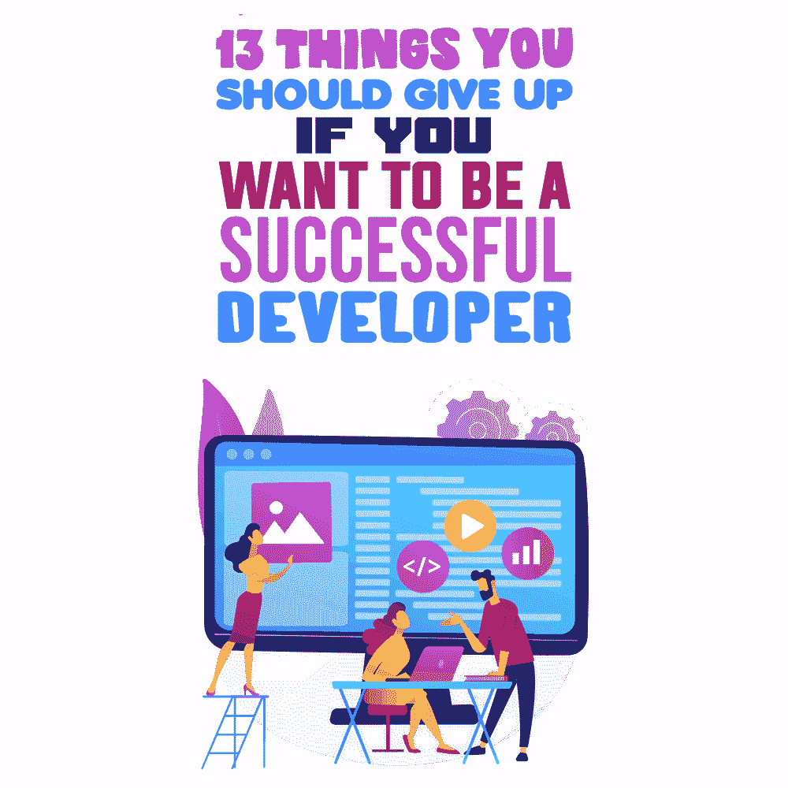

# 如果你想成为一名成功的开发者，你应该放弃的 13 件事

> 原文:[https://simple programmer . com/things-programmers-should-avoid/](https://simpleprogrammer.com/things-programmers-should-avoid/)

There is one important prerequisite to becoming better at anything: Concentrate on the things that matter, and give up what doesn’t. Developing is no exception. It is a process that can become problematic if you decide to pursue perfection, focusing on aspects that are complex but inessential.

我是一名高级软件开发人员，也乐于培养未来的程序员。在过去的几年里，我写了不少文章，主要是关于学习 Java 和其他编程语言的。在这方面，我变成了一个新手程序员错误的收集者。我分析错误，并试图为更有效的学习开出药方。

事实上，这正是我在这篇文章中所做的:我收集了 13 件新手程序员应该避免的事情。通过这个指南，我想帮助所有初学者关注发展的重要方面，从而为成功的职业生涯有一个充满希望的开始。

## 放弃创造语法糖

你在努力写短代码吗？停下来。

如何成为一名开发人员的第一条经验法则是编写可读的代码，这样许多阅读它的人就能理解它并发现它是有用的，不管代码有多少行。

如果你是编程初学者，尽量不要写太多的语法糖——定义为编程语言中的替代语法，以使一些东西更短。您的初始任务是创建可读的代码。

你应该使用尽可能少的单词或字符来编写代码的想法只会让一个原本简单的过程变得复杂——并且很有可能以后你会不明白你的意思。因此，更明智的做法是专注于让你的作品具有可读性。

## 放弃一次性创建所有特征

未来思维是好的，但不适合编码。你的代码现在和现在都应该有用。

当你在一个相对较大的程序上工作时，比如说，一个个人项目，编写足够运行系统的代码。总是从基本功能开始，然后逐渐增加功能。这样，您将经历更少的错误，并且您将花费更少的时间来开发、维护和调试。

如果您需要向代码中添加特性和功能，您可以在以后这样做。与其把时间浪费在编写你目前不需要的代码上，不如把时间花在学习新的东西上。

## 放弃忽视论坛和在线社区

*助人为乐；有效利用它。*

发展伴随着它的障碍，有些障碍甚至大到足以完全中止一个项目。

作为一名优秀的开发人员，您需要学习何时在线搜索帮助。互联网有丰富的在线社区和论坛，供开发人员用作资源，并帮助他们解决当前可能面临的障碍。不要因为害怕看起来愚蠢而犹豫不决地在论坛上提问。**愚蠢的问题不存在。**

每次我在诸如[堆栈溢出](https://stackoverflow.com/)、 [Reddit](https://www.reddit.com/) (r/WebDev 和 r/AskProgramming)或[黑客新闻](https://news.ycombinator.com/)等平台上发布我必须修复的 bug 的描述时，我都会收到其他开发者写的关于如何处理该问题的详细答案。论坛是一个惊人的知识来源，因为人们分享他们的个人经验，你可以获得许多在任何教程中没有涉及的见解。

当你卡在一行代码上时，学会在互联网上搜索指导将帮助你找到解决方案，而不会停滞不前。您可以随时创建一个方便的资源列表。

## 放弃在代码中添加注释的失败

许多开发人员很少记得记录文档。

向代码中添加注释有助于跟踪项目。它还帮助其他人理解您的代码提供了什么。有了笔记，你让信息更容易理解。

万一你忘记了一些关于你的代码的事情，或者你需要向某人解释它，注释可以帮助你和其他人。

## 放弃避免调试

调试是成为一名成功开发人员的关键部分。

没有完美的代码。即使是大型科技公司最受欢迎的应用和系统也仍然失败。这就是为什么有这么多你喜欢的应用程序的更新。

调试，即识别和删除有错误的代码部分，需要时间和精力。事实上，大多数开发人员花费超过 50%的时间进行调试，这个过程一点也不好玩。然而，这是确保您的代码不会崩溃、行为不当或被入侵的唯一方法。

您可以使用调试工具来简化这一过程，同时改进代码。寻找一个最有效的工具来使这个过程顺利进行。对于 Java，我会推荐使用 [IntelliJ IDEA。](https://www.jetbrains.com/idea/)

## 放弃使用 Ctrl+C 和 Ctrl+V

**

*不理解代码就复制粘贴不是办法；努力理解这个问题。*

抄袭他人代码的诱惑有时会很强烈。然而，这从一开始就不是一个好主意。复制和粘贴别人的代码不是一个好习惯，因为你最初的目标应该是理解问题并找出解决方案。自己动手是唯一可以学习的方法。

我把它比作学校里你朋友帮你做作业的作弊；你只需重写解决方案，并取得良好的成绩。后来，考试来了，你不得不自己做任务，但你不知道如何应对。所以尽你最大的努力，并且总是试着去理解问题。

开发代码时卡壳很正常；即使是最好的开发人员也会遇到这种情况。在这种情况下，更明智的做法是研究问题，直到你对问题有了足够的了解，可以提供解决方案。这种方法将帮助你提高你的知识和技能。

然而，如果你理解你的代码的问题，但是不希望浪费时间从头开始编码，那么复制另一个开发者的工作可能是有意义的。即使这样，您也应该对这段代码的工作原理有深入的了解。

## 放弃黑客问题

在所有挑战中闯出一条路不会让你走远；寻求理解和创造更好的解决方案。

当面临编码挑战时，许多开发人员会争先恐后地破解它。他们没有意识到的是，他们造成的伤害大于好处。试图破解你不理解的代码很少奏效。事实上，这往往只会使问题进一步复杂化。

你应该首先努力解决这个问题。一旦你对你正在处理的问题有了理解，就很容易产生一个可持续的解决方案。通过这种方式，你可以学习和发展解决问题的技能，这将是你在未来项目中取得成功的重要因素。

## 放弃你的舒适区

*“成为一名开发者需要多长时间？”新手经常问。一旦你离开你的舒适区，学习过程就开始了！*

如果你只处理你有信心的项目，你就生活在舒适区。没有增长技能的空间。

你需要接受让你害怕的项目，因为它们给你一个扩展技能和发展职业生涯的机会。

一旦你接受了一个大项目，你就开始学习新的东西，并致力于你还不知道的事情。到项目结束时，你将更加熟练地成为一名开发人员。

## 停止放弃学习

一种编程语言已经不够了；了解更多。

几年前，知道一种编程语言就足以给你的雇主留下深刻印象并保住你的工作。不幸的是，那个时代已经过去了。

当代世界的技术环境需要灵活多变的开发人员。你很了解 [Java](https://www.amazon.com/Effective-Java-Joshua-Bloch/dp/0134685997/ref=pd_day0_14_1/145-4188468-0623717?_encoding=UTF8&pd_rd_i=0134685997&pd_rd_r=8d5804ee-8789-46a1-86d3-9e3ff346a400&pd_rd_w=oe4qL&pd_rd_wg=IVVAk&pf_rd_p=fa3b4fdb-763e-40d7-b43f-8f5746023b01&pf_rd_r=NNB9NRNS4R4KENTB222T&psc=1&refRID=NNB9NRNS4R4KENTB222T) 或者 [C++](https://www.amazon.com/C-Crash-Course-Josh-Lospinoso/dp/1593278888/ref=sr_1_2?dchild=1&keywords=c%2B%2B&qid=1599691412&s=books&sr=1-2) 吗？学习一些前端技术，SQL，其他编程语言，或者你的语言的新特性。这样，你将在当今的职场中保持竞争力。

幸运的是，你不必回到学校去学习新的编码语言。有一些在线平台可以让你学习和发展你的知识和编程技能:

[CodeGym](https://codegym.cc) 是一个学习 Java 的在线平台。本课程设想了“边做边学”的方法——你 80%的时间用于做不同的编程练习

20%用来学习理论。课程完全游戏化，让学习过程真的很精彩。

[代码学院](https://www.codecademy.com/)。这个网站有各种不同的课程和任务。如果你选择这个项目，你将获得超过 300 小时的与编码相关的内容。这个平台可能对不同培训水平的人有用。

[freeCodeCamp](https://www.freecodecamp.org) 拥有不同实用编码任务的惊人选择。唯一的问题是，这个平台不太适合编程世界的新手，因为你必须对编程理论有信心。

[可汗学院](https://www.khanacademy.org)是非商业性网站。该平台大多涵盖理论，所以你不会在这里找到大量的实际任务。但是一旦你对编码基础或多或少有了信心，你就可以去 CodeGym 或 CodeAcademy 练习。

## 放弃不健康的生活方式

**

*没有健康，你的成功将是短暂的。*

许多程序员因为长期睡眠不足而出现心脏问题，这通常是由于为了熬夜编码而饮用不健康的能量饮料造成的。不要这样做；制定一个你的身体能够承受的时间表。

充足的睡眠对你的健康非常重要。在努力按时完成一个项目的同时，扭曲你的睡眠模式是非常容易的，而且这种牺牲往往感觉是理所应当的。从长远来看，过度劳累和干扰睡眠时间会损害你的健康，阻碍你成为一名成功的开发人员。你应该计划你的工作以避免过度工作。

类似地，许多开发人员面临着开发背部问题的风险。这主要是因为他们适应了长时间的不良坐姿。因此，为您的工作站选择合适的座椅和操作台至关重要。这将确保你的背部保持强壮和健康。

## 放弃避免合作

不要孤立自己。了解如何成为一名开发人员并与团队一起成长。

初学编程的人经常持有一种误解，认为他们可以靠自己成为成功的开发人员。单干可能很有趣，但不会让你成功。

团队成员和团队环境是现代计算世界的重要组成部分。许多编码项目是在团队中处理的。因此，如果你想在这个行业取得成功，你需要学会团队合作，与他人合作。与他人一起工作会提高你的技能，让你更有见识——这些特质将为你成功的职业生涯打下良好的基础。

## 放弃和别人比较

比较是令人厌恶的；关注增长。

在你的职业生涯中，感觉需要比别人更好是很正常的，但如果你专注于此，你可能不会取得太大的进步。相反，你应该专注于增加你的知识和技能的价值。利用每一个可以利用的机会，定期提高自己。

你可以为自己设定目标，并努力实现它们。要做到这一点，你可能需要设置关键绩效指标来跟踪你实现目标的进展。如果您正在学习编程，这些指标可以是，例如，定期编码的小时数、解决的问题的数量、解决的复杂性增加的问题的数量、研究的主题、您在论坛上帮助其他程序员解决的问题等等。

## 放弃放弃

放弃不是一个选项！

有些项目会很有挑战性，让你想挂靴。然而，这是你学习新事物的机会。你需要意识到每个开发人员都会经历困难时期。事实上，所有人最终都会经历一生中的艰难时刻。

你可以花几天时间学习一些新的东西来帮助你解决一个问题，但你不应该放弃。问题会一个接一个地出现，你所需要的就是学会克服它们。在我看来，如果没有挑战，我们的生活会很无聊。

## 在你的旅途中，你并不孤单

虽然放弃你的坏编程习惯有时看起来很困难，但是完全放弃不是一个选择。成为一名成功的开发人员不是一件容易的事情。一路上你会面临一些挑战和失望，你可能会在某个时候气馁。

然而，你并不孤单！相信我，所有的初学者都会经历失去动力和变得沮丧，但记住问题是暂时的，你不应该感到沮丧和停止，这是非常重要的。这条路是步行走出来的。你必须掌握继续前进的动力。我希望上面的建议能帮助你把注意力放在对你的职业发展至关重要的事情上。实现它们，你会很高兴你做到了。