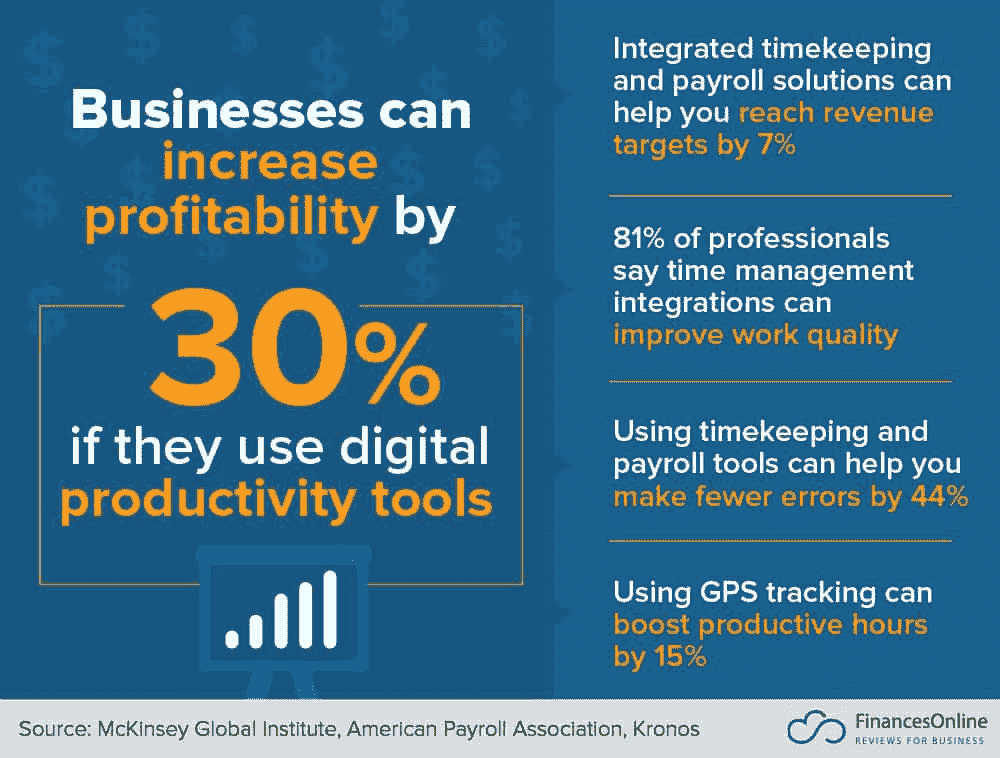

# 技术集成在时间管理中的作用越来越大

> 原文：<https://simpleprogrammer.com/time-management-apps/>

Gone are the days when letters were an effective medium of communication used by business professionals across the globe. Nowadays, people use email, video conferencing, and messaging to communicate.

企业[依靠云](https://simpleprogrammer.com/adopt-cloud-computing/)和计算机系统来确保项目的顺利完成。此外，手动待办任务列表已经被在线日历所掩盖。

这些是科技如何简化我们生活的例子。

技术最大的作用就是省时省力。帮助我们节省大量时间的技术驱动工具也提高了整体效率和程序员的生产力。因此，可以说技术和时间管理是齐头并进的。

我们都非常清楚时间在职业和个人生活中的重要性。“时不我待”说得对！

如果你遵循一个时间表，你可以优化利用可用时间。否则，你可能会失去未来的提议，甚至是你已经拥有的。

通过使用正确的工具，你可以更好地管理你的时间。这些工具可以处理耗时的过程，节省下来的时间可以用在其他重要的任务上。

然而，技术并不总是一种恩惠；有时候反而是祸根。在这篇文章中，我将聚焦技术在时间管理中的好与坏。

## 技术哪里出错了

大多数专业人士在与他们的工作无关的任务上花费大约五个小时**。**

令人惊讶…不是吗？

好吧，我们大多数人发现自己迷失在技术干扰的桎梏中，而不是变得具体、专注和有时间限制。

这背后的原因是，使用技术获得的时间通常会因浏览、聊天、社交网络和游戏等活动而浪费。

在这个数字时代，这些都是习惯性的活动，但当它们扩展到占据生产时间时，问题就出现了。这导致了糟糕的时间管理和生产力的降低。技术的最大问题是它会分散你的注意力，导致你浪费宝贵的时间(甚至一整天)。

[技术过度使用的可能症状](https://www2.deloitte.com/us/en/insights/focus/behavioral-economics/negative-impact-technology-business.html)包括:

*   **对员工或队友给予[不适当的关注。](http://www.amazon.com/exec/obidos/ASIN/B003WEAI4E/makithecompsi-20)**这可能意味着迟回复或没有面对面的会议。
*   需要尽快完成的任务。
*   生产力的损失。

当你一天多次查看邮件更新，甚至玩糖果粉碎游戏时，你是在不重要的活动上浪费时间。这不仅对时间管理没有帮助，而且让所有与时间管理相关的挑战都得不到解决。

## 时间管理过程中出现的挑战

在我们看到技术如何帮助之前，让我们仔细看看时间管理过程中出现的主要挑战。

*   不可否认，当你手头有一大堆任务时，事情会变得很困难。为了跳过所有的麻烦，在添加到你的时间表之前，找出完成每项任务需要多少时间。这有助于你管理你的任务，从而显著提高你的[时间管理技能](https://www.adamenfroy.com/time-management-skills)。

*   忽略优先事项–许多人忽略了需要先完成的工作。记住有些任务是重要的，有些是不重要的，所以根据它们的重要程度来排列它们的优先次序，把紧急的任务放在你的清单的最上面。如果你掉以轻心，你最终会浪费宝贵的时间。

*   **频繁的干扰**–时间管理的最大挑战之一是频繁的干扰，比如不相关的电话、计划外的拜访以及朋友或同事的小干扰。请记住，如果你遇到太多的停止标志，你需要更多的时间来完成你的目标。避免这些障碍，以提高工作效率。

*   **缺乏正确的方向**——如果你想充分利用可用时间，创建一个时间表。如果你的清单上有一项可以委派的任务，那就分配它。如果有任务可以以后再做，就把它搁置起来。如果有一项任务既不紧急也不重要，不要介意把它放在次要位置。

*   不能说“不”——对一些任务说“不”可能是个大问题，尤其是当它们很重要的时候。同时，对每个人说“是”会让你陷入时间管理的困境。所以在你接受一项任务之前，想一想，分析一下这需要多少时间。

显然，时间管理是一项具有挑战性的任务——尤其是手动完成的时候。这就是技术可以发挥作用的地方。第一步是寻找管理时间的最佳方法:计划。

## 计划对时间管理有什么帮助？

规划在有效的时间管理中扮演着重要的角色。你必须以这样一种方式计划你的一天，让你尽可能最好地利用现有的资源，并达到预期的结果。

记住，仅仅为了工作而工作是没有意义的。

计划最大的好处是它为你指明了方向，激励你完成任务。

计划应该包括设定一个目标，你还应该为不同的任务制定一个时间表。

计划可以帮助你确定任务的优先顺序，即决定哪些事情需要紧急处理，哪些事情可以稍后再做，并在截止日期前完成紧急和关键的任务。准备一个任务计划是个好主意，你可以根据时间分配任务。不要忘记把你最重要的工作放在最上面，然后是那些你可以稍后再做的工作。

您应该考虑使用管理器来帮助您跟踪任务。幸运的是，市场上有一系列用于此目的的工具。为了让你更容易选择，这里列出了我最喜欢的时间管理应用。让我们来看看它们。

## 可以用来节省时间的应用程序

由于技术的进步，企业可以使用多种生产力工具来节省时间。请记住，利用技术管理时间有多种好处，如下图所示。

[图像来源](https://financesonline.com/uploads/2019/07/Gamification-Stat-2.jpg)

以下是一些你可以用来节省时间的应用程序:

### 1. [ProProfs 项目](https://www.proprofsproject.com/)

ProProfs Project 是有史以来最好的(我认为是最好的)项目管理软件工具之一，它可以让你在日历中查看所有的项目和任务里程碑。此外，它允许你根据你的时间表重新安排它们。您甚至可以在日历上分享某个事件的详细信息，例如员工日。

这个应用程序可以节省时间，缓解压力。这也有助于确定任务的优先顺序。当你打开这个应用程序时，你会看到那一刻什么是重要的，这样你就可以开始工作了。在开始一天的工作之前，您可以使用此工具来检查当天安排的活动。总而言之，它提供了更好的日历管理。

### 2.[及时](https://memory.ai/timely)

维护时间表可能非常耗时。由于及时，你可以自动记录你正在做的一切。这款应用最棒的地方在于，你可以实时保存工作日的每一个细节。如果你是一名商务人士，你的一分钟可以决定一笔交易的成败，那么这款应用是一个有利可图的选择。

### 3.特雷罗

另一个你应该考虑的流行应用是 Trello。这个应用程序允许你为需要紧急完成的任务创建卡片——就像一个数字公告板，在那里你可以以有趣和游戏般的方式组织项目。项目管理应用程序允许您浏览任务并将其分类，例如“要做的事情”、“正在进行的任务”和“需要完成的任务”

### 4.[虚拟的](https://www.zirtual.com/)

如果你是一个忙碌的专业人士，你可能正在寻找一款能让你的事情变得更简单的应用。可悲的事实是，真正的助理并不是我们所有人的可行选择，这就是 Zirtual 的用武之地。这款应用是一个虚拟助手，可以回复电子邮件，管理你的计划，设计程序，优化你的日历。

## 使用您可用的工具简化您的生活

借助时间管理技术，让您的生活更加轻松，并跟踪您的计划和进度。无论你是在家工作的员工还是企业主，这些工具将确保你更好地理解手头的任务，并实现工作和生活的完美平衡。

你可能会发现计划和安排每件事是一项额外的任务，但是一旦你开始练习，这将成为一个有益的习惯。工具带有提醒、日程安排和更多类似的有用功能，可以帮助您跟踪所有已计划的任务。把所有的东西都储存在你的大脑中可能会让人不知所措，所以为什么不让这些应用程序帮你做到这一点，同时让你在游戏中保持领先呢！