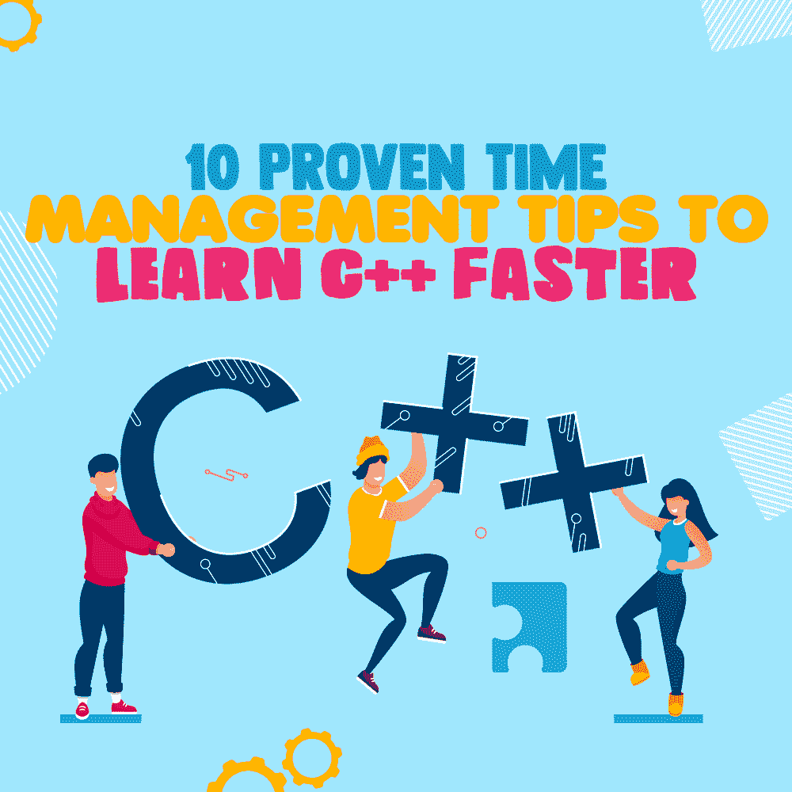
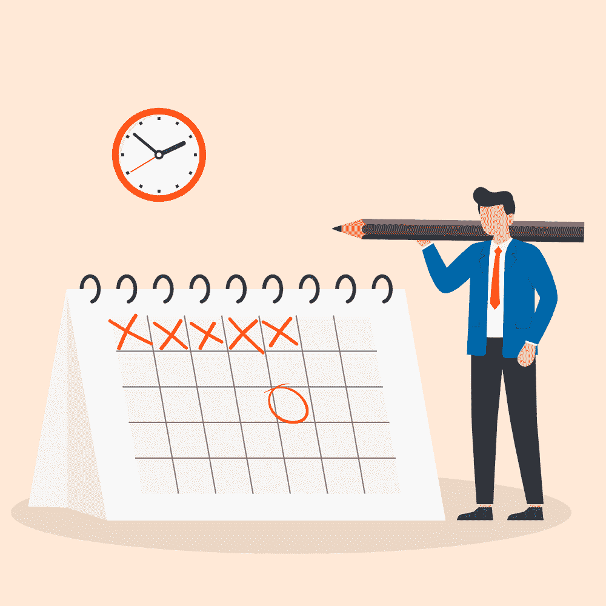
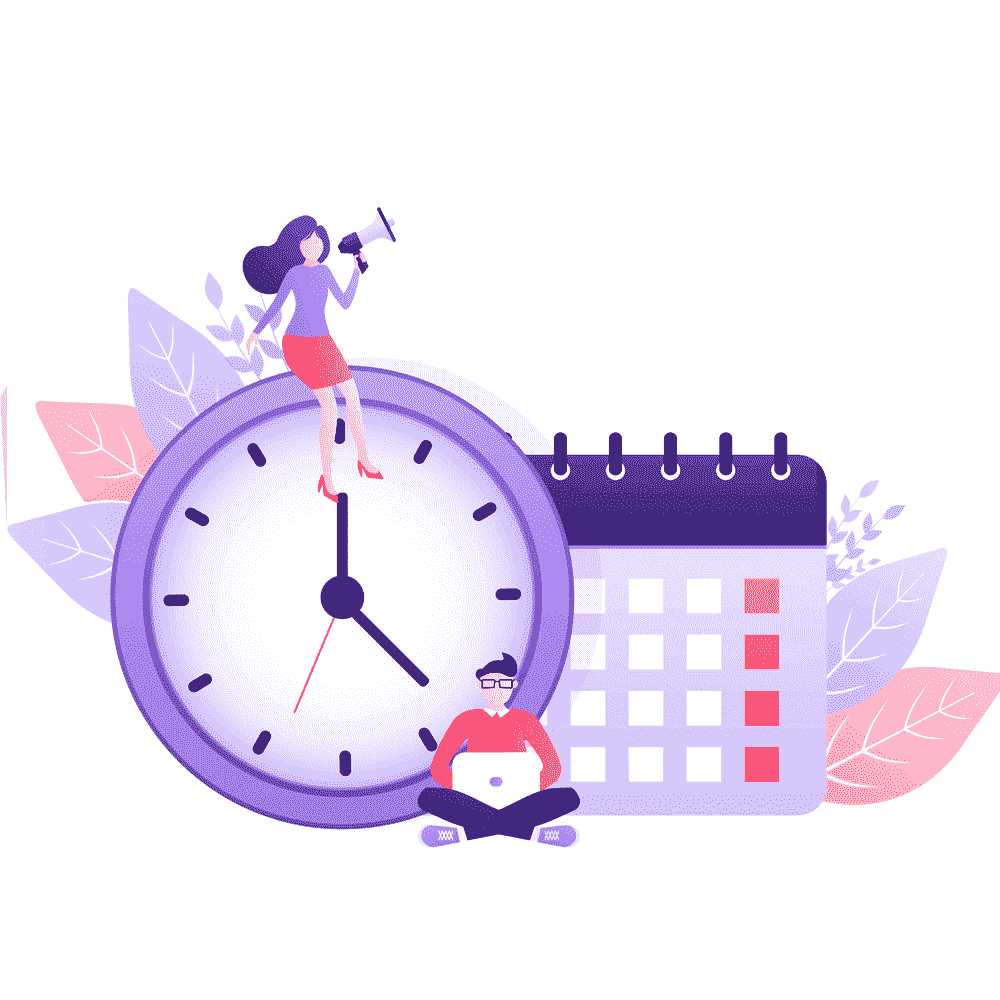

# 快速学习 C++的 10 个行之有效的时间管理技巧

> 原文：<https://simpleprogrammer.com/time-management-tips-c/>

C++ is one of the most advanced coding languages out there. For beginners, learning it can seem like a daunting task. It forces thinking and complex problem-solving. It makes you use all of your coding skills at once. It’s no understatement to say that to learn C++ is like attempting physics for the first time.

然而，现在对 C++的需求比以往任何时候都大。雇主希望你了解这种语言，因为它的使用量很大。想想所有依赖它工作的浏览器、操作系统和游戏。它们都需要像你这样的专业人士来实现。

但是如果你还不懂 C++呢？有可能学得够快找到工作吗？

答案是，是的，有可能。但是你需要运用一些时间管理技巧。

大多数人需要大约一年时间，但是如果你真的擅长管理你的时间，你可以在大约六个月内学会 C++。

本文将提供 10 个行之有效的时间管理技巧，帮助你尽快掌握 C++。

## 早点醒来

你早上什么时候醒来？

够早吗？

你不能指望中午起床就能管理好自己的时间。Ladders.com 提到一项研究，揭示了早起的人如何赚更多的钱。这项研究还暗示了一些统计数据，这些数据告诉我们成功人士醒得早。

如此多的财富 500 强首席执行官喜欢早上 4 点起床，这绝非巧合。

早起对心理有好处。你感觉更加自信，好像有更多的时间去做事情。

你有这种感觉的原因是因为这是事实。你醒得越早，白天就越长。早起的人也更有纪律性，自然也更擅长完成工作。

然而，凌晨 4 点起床并不是一个要求

早上 7 点到 8 点就可以了，但理想的时间范围是早上 6 点到 8 点。这些时间为安排一天的日程和完成目标提供了足够的杠杆。

在一大早，一杯咖啡和一些早餐的帮助下，你能学会多少 C++语法，这是令人惊讶的！

## 早上完成你最重要的工作

学习 C++已经够难了，但是很有可能你还有其他事情要做。也许你有工作或者全职上学。也许你两样都在做，感到不知所措。

不管是什么，编码可能不是唯一让你忙碌的事情。

因此，让你在早上完成最重要的工作变得更加重要。

例如，假设你开始学习 C++的构建模块。数据类型、变量和操作符都是理解这种语言的必要步骤。你要学习的唯一方法是把信息灌输到你的头脑中。

早上的第一件事，从学习数据类型开始。从你醒来的那一刻到中午，尽你所能学习关于这个特定话题的一切。

然后，也许休息一下，继续一个小时。对你正在学习的下一个主题重复这个过程。

理想情况下，最好工作到下午 3 点-4 点左右。

甚至科学也表明早上工作是个好主意。

Businessinsider.com 引用了一项科学研究，证明人们喜欢在一天的凌晨工作。他们提到了人类生物学是如何让我们在早上工作的。

因此，利用这几个小时来解决 C++中最棘手的问题。然后，你可以独自度过剩下的一天。

## 计划好你的一天

没有计划好一天是人们浪费时间的最大原因之一。当你计划好一天，你就知道什么时候必须完成什么事情。

没有计划，很难即兴发挥。

None of us are perfect, and we all need help. You can buy a [planning notebook](https://www.amazon.com/dp/B08C9SX63Q/makithecompsi-20) at any convenience store. Or if you can’t get a physical book, then a digital planner will work just fine.

如果你想快速学习 C++的话，计划好一天将会确保你能做到。坚持早起，在早上做最辛苦的工作。

此外，记得计划好这段时间的休息或用餐时间。这样做可以让你围绕他们安排你的工作。

同样，确保计划好你一天的剩余时间。

你不想被任何与编程无关的工作所拖累。任何导致你玩 catch up 的事情都会耽误你学习 C++的时间。

## 限制娱乐

对一些人来说，这是一个很难摆脱的问题。娱乐让我们许多人保持理智。

没关系，我明白。

你需要你的网飞、Hulu、视频游戏、迪士尼 Plus 和其他东西来让你开心。然而，问题源于缺乏时间。

真的没有任何魔法棒或捷径可以让你快速学习 C++。为了突破自己的极限，掌握最具挑战性的编程语言之一，你必须做出一些牺牲。

考虑暂时限制你生活中的所有娱乐活动。这包括游戏、网飞、Hulu，甚至和朋友出去。

几乎任何事情都有可能浪费时间。你减少的浪费时间越多，你学习代码的时间就越多。慢慢减少你花在娱乐上的时间。

每天减少一到两个小时的娱乐时间，直到有足够的时间学习代码。这样，你可能会有几个小时的时间去做一些有趣的事情，而不会过度。

## 周末学习

对大多数人来说，工作日是最忙的时候。但是周末通常被认为是放松的时间。然而，对你来说，周末是学习更多 C++的机会。

如果你工作或上学，很有可能周末休息。

你可以练习大量的代码，而不是把周末浪费在聚会上。

周六和周日是完成一些繁重工作的机会。周末花点时间熟悉一些 C++公式和语法。

这里有一个 C++的 Hello World 函数语法的例子:

`#include
using namespace std;
/* This is my first C++ program */
int main()
{
cout<<"Hello world!"<<endl;
return 0;
}`

这也是做一些词汇练习的好时机。利用周末早上学习关键词和变量。变量是内存位置中的给定名称。

C++有一些，它们很重要。

周末是你更快完成这些任务的机会。

## 追踪你的目标

学习像 C++这样的东西最困难的事情之一是保持动力。当感觉筋疲力尽或感觉自己在浪费时间时，很容易放弃。

然而，这就是跟踪你的目标如此重要的原因。当你追踪你的进度时，你不太可能会筋疲力尽。

下面是一个目标列表的例子:

*   看了三本 C++的书。
*   学习 C++的基础知识。
*   试着写代码。
*   开始做一个项目。
*   完成项目。

显然，这些是更广泛的目标。较小的将取决于你个人。每个人都想从学习代码中得到不同的结果。所以你有责任知道你到底想要什么，并列出清单。

深入细节，为每周和每月制定目标。

此外，对于更大的目标，比如学习 C++的基础知识，在结束时庆祝也是可以的。

庆祝那些较小的胜利会帮助你保持动力，度过这个过程。通过与朋友和家人分享你的成就来庆祝。或许今晚休息一下，出去吃顿饭。

不管是什么，一定要相信自己。

记住一旦完成就划掉目标。继续下一个，在完成另一个更大的目标后庆祝。

重复这个过程，直到你很好地理解了 C++。

## 限制每项任务的时间

你工作的结果会受到你在每项任务上花费时间的影响。是的，花足够的时间学习很重要。但是在一件事情上花太多时间实际上会拖你的后腿。

这就是为什么你需要限制你的时间。

For instance, if you’re stuck on a formula, and it feels too hard, don’t spend too much time on it. Set a timer and stop what you’re doing. There are probably more important things for you to do, even outside of programming.

日常杂务、工作和学校都需要完成，所以改天再试，可能需要一些帮助。

论坛上有很多人愿意回答你的任何问题。或者，如果更方便的话，甚至可以考虑聘请在线家教。花点钱寻求编程方面的帮助并没有错。如果这意味着你会学得更快，那么这是值得的。

了解 C++是一项很有价值的技能，雇主们愿意为此花大价钱。无论你在新兵训练营、课程和导师身上花了多少钱，都是一种投资。

## 学会如何说不

不幸的是，花时间学习 C++确实需要牺牲，就像我前面解释的娱乐一样。然而，如果关掉电视是你自己可以决定的事情，其他类型的情况可能会涉及到其他人。

所以，你仍然有可能受到来自朋友和家人的压力。你必须认真学习代码，尽可能限制聚会和社交聚会。

我不是说你必须跳过圣诞节或新年。但是如果你的朋友在周末举办派对并邀请你，你可以拒绝。

如果时间不重要的话，你可能会去，但是时间很重要。

为了减轻社交生活暂停带来的影响，只要想想掌握 C++会给你带来多少好处。

一年没那么长。

记住你学习这些东西的动机是什么。你这么做可能是为了获得更好的生活质量。所以无论这对你的社交生活有什么影响，都只是暂时的。

一旦你学会了这门语言，你就可以想去多少派对就去多少派对。然而，现在，最好坚持严格的时间表。

这是你快速学习的唯一方法。

## 优先考虑睡眠

在我在这篇文章中陈述的一切之后，学习 C++可能会感觉势不可挡。

不要让你有那种感觉。现在不是压力过大而忽略睡眠的时候。睡眠是保持计划最重要的事情之一。

Zapier.com 引用了一项科学研究，该研究揭示了大量证据表明工作效率与睡眠有关。这项研究表明，由于睡眠不足，美国工人的生产力急剧下降。

生产力会让你学得更快。如果你效率不高，那么这个过程将会花费更长的时间。

这就是为什么高质量的睡眠如此重要。

休息一下，不要过度劳累也是一个好主意。如果感觉工作太多，你甚至可以休息一两天。有时候这样做更好，可以帮助你避免精疲力尽。

## 不要一心多用

既然我们已经对时间进行了优先排序，你可能会认为多任务处理是个好主意。然而，你必须尽你最大的努力**而不是**去完成多项任务。同时做两件事会对你的学习产生负面影响。

一次性学习 C++变量、数据类型和字符串会更快吗？

当然会。然而，如果你不能真正记住信息，学习代码就没有意义。我的意思是 C++必须成为你的第二天性。

掌握这门语言的每一部分都很重要。即使你学会了所有的基础知识，甚至找到了一份工作，仍然有很多东西要学。精通 C++的程序员还在学习。

所以如果你想一开始就有很好的理解，你必须一次专注于一件事。

花时间去了解变量，不要转移到其他事情上，直到你把它们记下来。然后转移到下一个话题，把你所有的注意力都集中在这个话题上。

## 你*能不能*快速学会 C++

到底有没有可能相对快速的学会 C++？

绝对的。

然而，这也需要牺牲和纪律吗？

绝对的。

You see, nothing is going to get done unless you make it happen. If learning C++ in less than a year is your goal, then you must be dedicated. Otherwise, nothing will change.

记住我在文章中列出的所有要点，并把它们作为指南。计划好你的每一天，这样你就能按时完成。早起，早上做工作，娱乐有限。

利用周末学习更多知识，跟踪你的进展，避免在一项任务上花费太多时间。还有，一定要说不，充分休息，抵制一心多用。

遵循这些步骤将确保你快速掌握 C++。

一旦你做到了，你作为一个程序员的收入将会大幅增加。高薪工作和职业发展将最终在你的掌握之中。