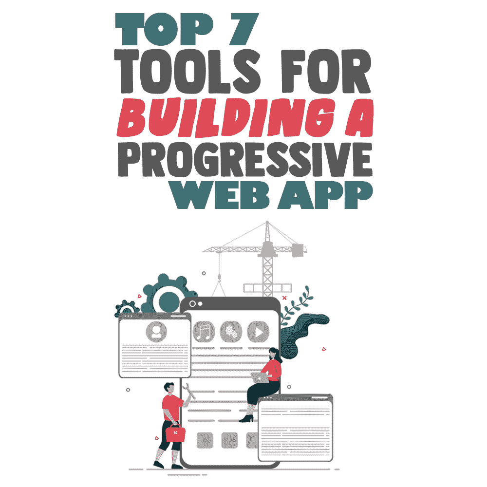

# 构建渐进式 Web 应用的 7 大工具

> 原文：<https://simpleprogrammer.com/tools-progressive-web-app/>

Over the years, there has been a huge demand for progressive web apps, as they allow businesses to provide webpage-like content into an app. In general, a progressive web app is a website that looks and performs like a mobile app. It is developed using web technologies such as HTML, CSS, and [JavaScript](https://www.amazon.com/dp/0596517742/wwwerobillarc-20).

渐进式应用程序的流行是因为它们的快速加载能力，离线可访问性，以及它们提供的增强的性能和功能。渐进式网络应用程序(PWA)可以利用设备功能，如摄像头、存储器、麦克风等。以提供出色的用户体验。

除了这些好处，PWA 还为企业提供了各种优势。由于 PWA 的独特优势，全球领先的企业都选择了 PWA 开发。Pinterest、脸书和 Spotify 是最受认可的 PWA 例子。

如果您有兴趣为您的企业构建一个渐进式 web 应用程序，那么您应该熟悉开发所需的 PWA 工具。为了让你的任务变得简单，在这篇文章中，我为成功的 PWA 开发收集了一些有用的工具。

## 创建渐进式 Web 应用程序的流行工具

列表通常既主观又不详尽。然而，下面的七个工具非常受欢迎和有用——事实上，对于创建[渐进式 web 应用程序](https://simpleprogrammer.com/progressive-web-applications/)是必不可少的。

### 反应

React 基本上是脸书在 2013 年创建的一个 JS 库。它对于开发单页面以及多页面的 web 应用程序非常有用。

在市场上可用的许多 PWA 开发工具中，React 是一个极好的选择，因为它受脸书支持，并且提供了极好的稳定性。

此外，React JS 遵循以组件为中心的开发方法，其中组件是使用 JavaScript 构建的，这意味着您可以随时重用它们。这会为你节省很多时间和金钱。

使用 React ，开发人员可以创建渐进式 web 应用程序，这些应用程序可以在不同的设备、操作系统和浏览器上完美运行。

### 聚合物

另一个流行的框架；这个是谷歌造的。它是构建可重用组件和与设备同步数据的最佳渐进式 web 应用程序工具之一。

此外，它还为您提供了一系列模板和优秀的文档，以帮助您的流程更加顺畅。该框架中提供的模板呈现初始路线，并为该路线提供重要资源。

这款开源工具简化了 PWA 开发流程，并使用 PRPL 模式为特定设备优化应用交付。

在这里，PRPL 模式代表:

*   推动初始路线的必要资源。
*   渲染初始路线。
*   预缓存剩余路线。
*   延迟加载并按需构建最后的路线。

### 胃蛋白酶普法研究

Magento 是一个流行的用 PHP 编写的开源电子商务平台。它用于创建响应性网站。

Magento PWA Studio 是一个开发人员可以用来构建高性能渐进式 web 应用程序的工具包。

如果你想在 Magento responsive 网站上建立一个 PWA 店面，那么这个工具包是理想的选择。它是为 Magento 2 平台定制的，它带有大量的库和高级工具，与平台的可扩展性原则保持同步。这意味着开发者可以使用 Magento PWA Studio 将任何使用 Magento 2 版本构建的网站转换为渐进式 web app。

此外，Magento PWA 工作室的发布模式与 Magento 2 相似。因此，每当 Magento 2 版本中有开发或架构变化时，您将永远不会面临同步您的 PWA 的问题。

### PWA 生成器

微软已经创建了 PWA Builder，它有助于以最小的开发将网站转换为渐进式网络应用。PWA Builder 网站可以立即识别网站是否支持 PWA——您只需将网站的 URL 插入 PWA Builder。

PWA 工具进一步生成一个定制的 web 清单和一些版本的服务工作者。此外，该应用程序允许你用最少的努力来测试你的渐进式网络应用程序。

使用 PWA builder 很容易，它有很多特性。例如，它允许你有一个离线拷贝的备份，有一个 WebKit，等等。

### web 包模块 Bundler

PWAs 的一个必要特征是它们必须在较差的互联网连接或断开模式下工作良好。这个开源模块捆绑器是一个优秀的 PWA 工具，用于在网站中实现离线功能。

该工具是为构建 CSS 元素、JS 文件、字体和图像之间的依赖图而开发的。这些图表的最终目的是减少依赖性管理。它将进一步减少服务器调用并支持静态元素更快地加载。

遗憾的是，该工具没有适当的文档，而且学习曲线很高。因此，它只适合有经验的开发人员。

### 灯塔

The lighthouse tool is created by Google, and it can be installed as a plugin in Chrome.

这是一个性能监控工具，它给你一个包含一系列分析的详细报告，允许你测试你的网站，如果你发现一个问题，它会告诉你如何解决它。

Lighthouse 提供的一些分析包括应用程序是否可以离线加载，页面加载性能，网站是否逐步增强，网络连接的安全性如何，用户能否将其添加到主屏幕，地址栏的颜色是否与品牌相匹配，设计是否适合移动设备，等等。

此外，这些分析都附带了使用特定技术进一步改进 progressive web 应用程序的技巧。

### 盈方微

这个构建工具允许你在你的 WordPress 网站上创建 PWA。它有助于简化开发过程，从而使想要创建渐进式 web 应用程序的没有经验的开发人员更加简单。

这个简单的工具非常用户友好，帮助您开发高质量的脱机页面，并使您的网站更容易添加脱机功能。

它提供了各种功能，如简单的配置、全面的文档、快速响应的支持等等。所有的[开发者都可以从这个工具中获益](https://www.amazon.com/dp/0137081073/wwwerobillarc-20),从而创建出能够高效离线工作的渐进式网络应用。

## PWA 工具增强了开发过程

在这篇文章中，我们看到了市场上一些最好的 PWA 工具。从适用于单页和多页网络应用的 React，到谷歌创建的 Polymer 和 Lighthouse，从微软的 PWA Builder 到 WordPress 的 SuperPWA，你肯定会在这个列表中找到满足你需求的东西。

世界各地的各种领先企业利用这些工具来创建用户友好和可扩展的渐进式 web 应用程序。为什么不是你！