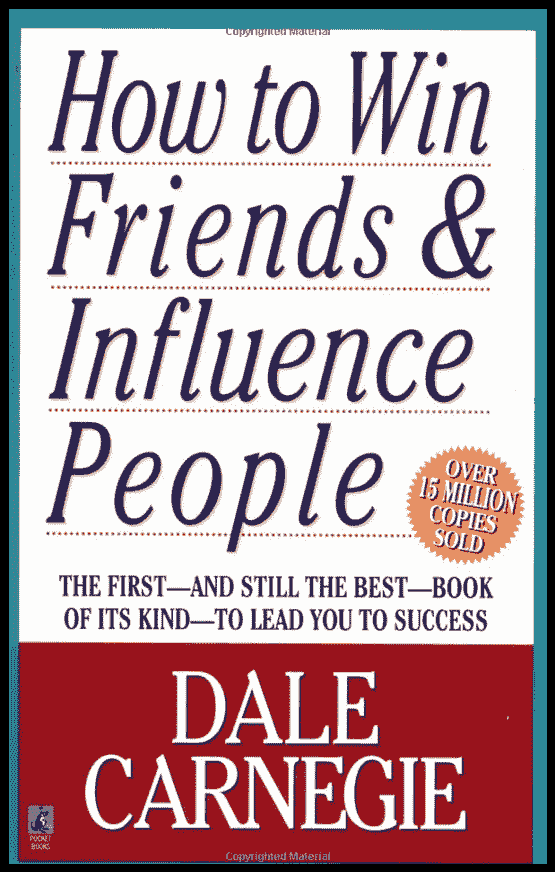
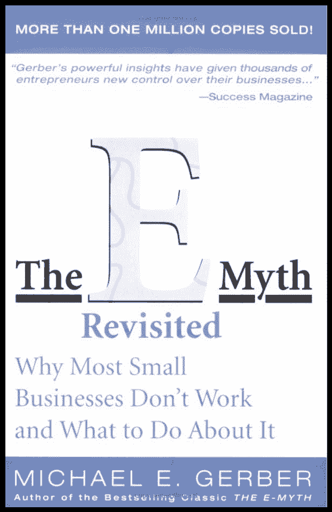
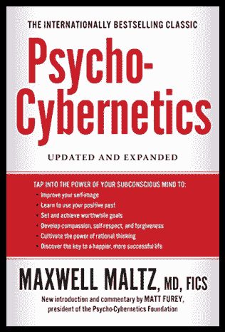

# 2017 年十大必读书籍

> 原文：<https://simpleprogrammer.com/top-10-books-read-2016/>

很多观众要求我列出我最喜欢的 10 本书。在花了一些时间思考之后，我决定用我有史以来最棒的 10 本书来创建这个列表。

对我来说，这些是我一生中读过的最好的书。我还认为，对于任何可能对改善生活、职业和软件开发技能感兴趣的人来说，这些都是 2017 年的必读书。在我 2017 年最想读的 10 本书中，有一些是有争议的，可能包含强烈的观点。这也是为什么我强烈推荐你看我之前在[上的视频《最高效的读书方式是什么？](https://www.youtube.com/watch?v=oO5uKB6Zumw)

[https://www.youtube.com/embed/h3O-RnOh-V8](https://www.youtube.com/embed/h3O-RnOh-V8)

# 2017 年十大图书

这里是所有的书，没有特别的顺序

## [1-如何赢得朋友&影响人

](http://www.amazon.com/exec/obidos/ASIN/0671027034/makithecompsi-20) 

超过 75 年来，戴尔·卡耐基经过时间考验的建议让数百万读者在他们的商业和个人生活中获得了成功。现在，这种类型的第一本也是最好的书已经重新启动，以驯服现代的复杂性，并将教你如何通过外交和机智进行沟通，利用稳固的网络，让人们喜欢你，广泛而清晰地传达你的信息，成为更有效的领导者，提高你完成事情的能力，并优化数字工具的力量。戴尔·卡耐基的常识性交流方法已经持续了一个世纪，感动了数以百万计的读者。挂在沃伦·巴菲特办公室里的唯一一张文凭是他的戴尔·卡内基培训证书。李·艾柯卡认为卡耐基给了他在公众面前演讲的勇气。《呆伯特》的创作者斯科特·亚当斯称卡内基的教导是“改变人生的”为了证明他的工具的持久相关性，戴尔·卡内基公司重新构想了他对我们这个困难的数字时代的处方和建议。我们今天可以用不同的工具和更快的速度进行交流，但是卡内基关于如何有效交流、领导和工作的建议仍然是无价的。 *摘自 Amazon.com*

## [2-巴比伦最富有的人](http://www.amazon.com/exec/obidos/ASIN/1897384343/makithecompsi-20)

受到数百万人的喜爱，这个永恒的经典掌握着你所有愿望和你希望完成的一切的关键。这是一本揭示个人财富秘密的书。无数读者受益于著名的“巴比伦寓言”，它被誉为关于节俭、财务规划和个人财富的最伟大的励志作品。用简单如圣经中的语言，这些引人入胜和信息丰富的故事让你踏上通往繁荣和随之而来的快乐的康庄大道。被誉为现代经典，这本著名的畅销书提供了对你个人财务问题的理解和解决方案，将指导你度过一生。这本书包含了保持你的钱的秘密——并且赚得更多。
*摘自 Amazon.com*

## 3-艺术之战

《艺术之战》是一部简洁、引人入胜、实用的指南，对于在任何创意领域取得成功来说，它都不亚于《孙子兵法》。是什么阻止了我们中的许多人去做我们渴望做的事情？为什么会有反对者？我们如何避免任何创造性努力的障碍——无论是开始一个梦想中的商业冒险，写一部小说，还是画一幅杰作？畅销小说家史蒂文·普莱斯菲尔德指出了我们每个人都必须面对的敌人，概述了征服这个内部敌人的作战计划，然后指出了如何取得最大的成功。《艺术的战争》强调了认识和克服野心的障碍所需要的决心，然后有效地展示了如何达到最高水平的创作纪律。就当是严厉的爱吧。。。为了你自己。无论是艺术家，作家还是商人，这本书简单，个人，没有废话，将激励你抓住你生活的潜力。
*摘自 Amazon.com*

## [4-电子神话再探:为什么大多数小企业不运转，该怎么办

](http://www.amazon.com/exec/obidos/ASIN/0887307280/makithecompsi-20) 

在这第一个新的和完全修订版的 150，000 本地下畅销书，电子神话，迈克尔葛伯驱散了神话周围开始自己的生意，并显示如何平凡的假设可以得到的方式来经营一家企业。他带你经历了从创业初期，到青春期成长的烦恼，再到成熟的企业家视角，所有成功企业的指路明灯。然后，他展示了如何将特许经营的经验应用于任何企业，无论它是否是特许经营。最后，Gerber 指出了在你的企业中工作和在你的企业中工作之间的至关重要的，但经常被忽视的区别。在你读完《电子神话重温》之后，你将真正能够以一种可预测的和富有成效的方式发展你的业务。
*摘自 Amazon.com*

## [5-如一个男人所想](http://www.amazon.com/exec/obidos/ASIN/1503055361/makithecompsi-20)

《一个人的思考》是一本重要的小册子，出版于 1902 年，解释并促进了我们的思想和我们的幸福之间的直接联系。你相信积极思考的力量吗——但仍然不清楚如何在你的生活中利用这种力量？詹姆斯·艾伦的《作为一个思考的人》解释并促进了我们的思考和我们生活方向之间的直接联系。作为新思想运动的一部分，艾伦揭示了拥有最充实的生活的秘密，这比我们任何人想象的都要容易。你也可以学习如何控制你大脑的输出，以获得你一直以来——直到现在——只是梦想的个人成功。
*摘自 Amazon.com*

## [6-高人之道](http://www.amazon.com/exec/obidos/ASIN/1591792576/makithecompsi-20)

你人生的真正目的是什么？女人到底想要什么？怎样才算一个好情人？如果你是一个正在阅读这篇文章的人，你无疑会问自己这些问题——但你可能没有太多的运气来回答它们。直到现在。在《优秀男人之路》中，大卫·戴达探索了男人生活中最重要的问题——从事业和家庭到女人和亲密关系到爱情、精神和关系——为过上正直、真实和自由的男性生活提供了实用指南。加入这位畅销书作家和国际知名的性灵专家的行列，获得直截了当的建议、赋权技能、身体练习等，帮助你立即实现充实的人生。

大卫·戴达写道:“是时候超越那种只有脊梁骨没有心脏的大男子主义了。”。“也是时候超越敏感和体贴的懦夫理想，全心全意，没有脊椎。”《高人之道》对今天的人提出了终极挑战和回报:通过在当下无限开放的时刻充分表达意识和爱来发现“心灵和脊柱的统一”，摘自 Amazon.com

## [7-写给 Lucilius 的道德信件——来自斯多葛派的信件](http://www.amazon.com/exec/obidos/ASIN/022626517X/makithecompsi-20)

这些引人入胜的信件既写给卢西尔斯，也写给普通读者，就如何应对从爱管闲事的邻居到疾病、痛苦和死亡的各种问题提供建议。塞内卡使用这封信的非正式格式来介绍斯多葛派的中心思想，几个世纪以来，斯多葛派是地中海世界最有影响力的哲学体系。他生动且不时幽默的论述使这些信件成为他最受欢迎的作品和经久不衰的经典。包括由玛格丽特·格雷弗和 A. A .龙的介绍和解释性说明，这一权威版本将吸引新一代的读者。
*摘自 Amazon.com*

## [8-阿特拉斯耸耸肩](http://www.amazon.com/exec/obidos/ASIN/0452011876/makithecompsi-20)

《阿特拉斯耸耸肩》讲述了一个令人震惊的故事，一个人说他将停止世界的马达，而且他做到了。《阿特拉斯耸耸肩》的范围之广、悬念之高令人叹为观止，它比你读过的任何一本书都拓展了边界。这是一个谜，不是关于谋杀一个人的身体，而是关于谋杀-和重生-人的精神。根据美国国会图书馆和每月一书俱乐部的联合调查,《阿特拉斯耸耸肩》是仅次于《圣经》的“对当今美国人影响第二大的书”。
*摘自 Amazon.com*

## [9-心理控制论，从生活中获得更多生活乐趣的新途径

](http://www.amazon.com/exec/obidos/ASIN/0399176136/makithecompsi-20) 

自 1960 年首次出版以来，Maltz 的里程碑式畅销书激励并改善了 3000 多万读者的生活。在这一更新版中，心理控制论基金会主席马特·富里(Matt Furey)做了新的介绍和编辑评论，对原文进行了注释和放大，使马尔茨的信息与当代读者更加相关。Maltz 是第一个解释自我形象(他推广的一个术语)如何完全控制个人实现(或未能实现)任何目标的能力的研究者和作者。他开发了改善和管理自我形象的技术——视觉化、心理预演、放松——五十多年来，这些技术已经通知和激励了无数的动机大师、运动心理学家和自助实践者。心理控制论的教导是永恒的，因为它们建立在坚实的科学基础上，并为导致可量化结果的思考和行动提供了处方。
*摘自 Amazon.com*

## [10-最高成就:释放你潜在成功力量的策略和技能](http://www.amazon.com/exec/obidos/ASIN/0684803313/makithecompsi-20)

你学习各个领域的高成就人士所使用的想法、概念和方法。你学会了如何释放你的个人潜能，实现个人的伟大。你会立刻变得更加积极、更有说服力，并且对你做的每件事都更加专注。本书所基于的研讨会项目的 100 多万名毕业生中的许多人都极大地增加了他们的收入，改善了他们生活的方方面面。这些页面中呈现的成功和成就的一步一步的蓝图包括从心理学、宗教、哲学、商业、经济学、政治、历史和形而上学中提取的经过验证的原则。这些想法被结合在一系列快速移动、信息丰富的步骤中，这些步骤将引导你获得超乎想象的成功——它们可以提高你的自尊，改善个人表现，并让你完全掌控个人和职业生活的方方面面。
*摘自 Amazon.com*

你觉得这十本书怎么样？你同意他们的观点吗？你的十大书籍清单会有所不同吗？在下面留下评论，告诉我你有什么看法！

如果你想通过阅读快速学习概念和技能，那就看看我的课程:[快速学习的 10 个步骤](https://simpleprogrammer.com/store/products/learn-anything-quickly/)