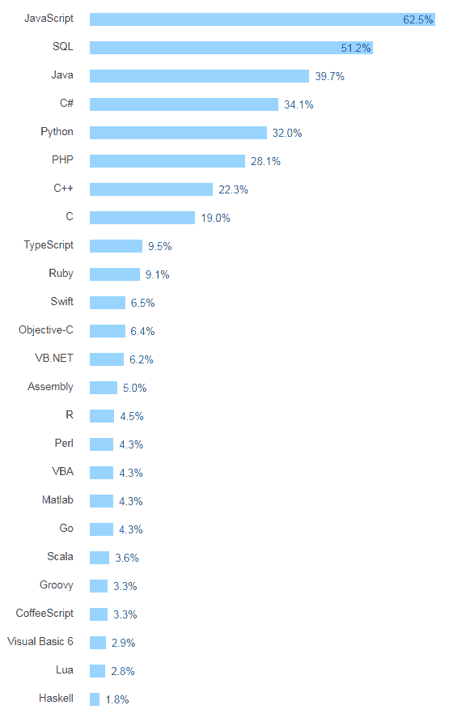

# 最值得学习的编程语言:2018 年最值得学习的 10 种编程语言

> 原文：<https://simpleprogrammer.com/top-10-programming-languages-learn-2018-javascript-c-python/>

在这篇文章中，我将谈论 2018 年最值得学习的编程语言。

1.  [JavaScript](#javascript)
2.  [Python](#python)
3.  [C#](#c-sharp)
4.  [Java](#java)
5.  [PHP](#php)
6.  [出发](#go)
7.  雨燕
8.  [生锈](#rust)
9.  [锅炉](#kotlin)
10.  [C & C++](#c-and-c-plus-plus)

很多人问我，成为软件工程师应该学习什么编程语言[。我发现自己处于困境，因为这是一个很难回答的问题。在做这个决定之前，有很多事情需要考虑。](https://simpleprogrammer.com/step-step-path-becoming-great-software-developer/)

挑选 2018 年学习的最佳编程语言的最简单方法之一是倾听市场。

市场会告诉你未来的趋势编程语言是什么。我们必须意识到趋势，关注新闻和新技术的兴起，这样我们才能调整学习编程语言的风帆，尤其是在 2018 年有很多新事物出现的时候。

这篇文章不仅仅是基于我的观点。我做了很多研究，得出了 2018 年要学习的 10 大编程语言。

## Java Script 语言

这个列表中的第一个是 JavaScript。如果你了解我的话，我对 JavaScript 是又爱又恨。我过去写过一些关于 JavaScript 的讨厌的文章，我真的不喜欢这种语言。但是当我看调查的时候，很明显 Javascript 并没有那么糟糕。我在这里看到的第一个是他们做的堆栈溢出调查，到目前为止，JavaScript 是最受欢迎的编程语言，有 65%的人使用它，他们将这一点分开。我们会把视频或者图片放上去。基本上，65%的人经常使用它，然后大约 5%的人会采用或迁移到它。

2018 年要学的顶级编程语言。斯塔科弗洛。

我的意思是，如果你今天想成为一名软件开发人员，一名网络开发人员，你很可能会使用 JavaScript。如果你正在考虑学习一门新的编程语言，你不太懂 JavaScript，或者你是一名新的开发人员，如果你懂 JavaScript，你可能会找到工作。因此 JavaScript 是一门非常好的学习语言。

现在，我想说 JavaScript 本身有点像 SQL。这还不够。还有一些纯 JavaScript。显然，你可以使用 node.js 这样的语言，你可以进行纯 JavaScript 类型的编程，但我认为这不是一种在很多企业环境中会被专门使用的语言。您可能还需要了解另一种编程语言。

尽管如此，也正如我过去说过的关于 JavaScript 的一些不好的事情，我承认，它已经变得更好了。ECMAScript 的新版本确实改进了它，它实际上是一种现在可以使用的不错的语言。JavaScript 绝对是 2018 年要学习的顶级编程语言，我会推荐它。我的意思是，如果你不知道 JavaScript，你刚刚开始，2018 年可能是真正学习 JavaScript 的好时机。

我确实有一门关于这个的课程，但是我并没有创建这门课程。一个非常优秀的 JavaScript 专家创建了它。它叫做 JavaScript LaunchPad，可以帮助你真正理解和掌握 JavaScript。我推荐那个。如果你想真正深入地了解知识，真正理解它，就去看看吧。在这里获取启动板: [Javascript 启动板](https://simpleprogrammer.com/products/javascript-launchpad/)。

## 计算机编程语言

下一个可能会让一些人感到惊讶。一些调查显示了这一点。我从许多调查中收集了数据，这个已经出现了很多次，但我并不是仅仅基于调查数据。这肯定不是最高的，但也很接近了。根据调查数据，这是第五名，但我不会真的称之为第五名。这更像是第二条，原因如下。

我认为我们应该抛弃 SQL。“技术上”它是一种编程语言，但是你不太可能只通过 SQL 得到一份工作。与其说它是一种语言，不如说它是一种必要的技能。所以这将把 Python 排在第四位。但是堆栈溢出调查中真正有趣的是。有一个部分说:“被采用或迁移成为——或过早迁移”，Python 是 12%。这是最高的数字。所以让我们假设这些人在 2018 年真的迁移到 Python。这意味着 Python 将占据 42%左右的市场份额—**位居第二！**

Python 在 2018 年有很多好事情要做。其中之一，就像我说的，是许多公司，许多团队正在迁移到 Python，他们已经在使用 Python 了。它已经是一种流行语言了。外面已经有很多工作了。不仅如此，事情是这样的，当你在亚马逊上看的时候，当你看书籍的时候，最流行的编程书籍，大部分都是 Python。我知道这些，因为我有书。我看。我有[完整的软件开发人员职业指南](http://amzn.to/2ASqFdg)。我还有[软技能:软件开发人员的生活手册](https://simpleprogrammer.com/softskills)，这些都是相当高级的书籍。我总是在看书籍排名，我可以清楚地看到，在许多类别中排名最高的书籍是 Python 书籍，尤其是初学者 Python 书籍。那很有趣。

大多数在亚马逊上畅销的新书，这是一个很好的指标，都是关于 Python 的入门书。那些大部分是初学者的书。这些实际上是最受欢迎的编程语言书籍。这是未来的一个很好的指标，因为如果所有这些人都在阅读 Python 书籍和学习 Python，这是有原因的。这告诉你将会有很高的需求。这告诉你，对于初学者来说，这也是一门好语言。如果你正在考虑为 2018 年学习一门新的编程语言，Python 是非常有意义的。这真的是一种很好的语言，在这个领域有很高的采用率和移动率。在那个领域有很多事情正在发生。

我的一个好朋友有一个机器学习。他确实喜欢图像识别和 Python 之类的东西。有很多应用，很多不同的公司以不同的方式使用 Python，我认为它还在扩展。像 Google 这样的公司真的大量使用 Python。如果你对在谷歌这样的地方找工作感兴趣，那总是一个不错的选择。实际上，我建议——我几乎可以说，如果我是一个初学者，我可能会学习 Python 和一些 JavaScript。我可能会这么做。我可能会从 Python 开始，因为它确实是很好的初学者语言。外面有如此多的信息。看看这两篇博文:

*   [学习 Python 的最佳方式](https://simpleprogrammer.com/2017/02/15/get-started-learning-python/)
*   [为什么要学习 Python–7 Python 资源](https://simpleprogrammer.com/2017/01/18/7-reasons-why-you-should-learn-python/)

## C#

好吧。下一个。这个列表中的下一个是什么？这个有点难。这就是在这里选择第三个有点困难的地方。根据调查数据，根据我所知道的大致情况。再说一遍，我这样做并不是完全基于调查数据。我选 C#。我在 C#和 Java 之间犹豫不决。显然，我已经给了你下一个会是什么的提示，但是我选择 C#是有非常非常好的理由的。之所以这样，是因为我这里有实践知识。这并不是偏见，但我要说的是，我知道 C#可以在每一个平台上使用。我用 C#开发过 iOS 和 Android 的应用，用的是 Xamarin。也可以做 Linux 应用，Mac 应用。你几乎可以在任何平台上工作，包括 Arduino 和任何嵌入式系统，Raspberry Pi 之类的都使用 C#。

C#是一种非常通用的语言。另外，它也是一种非常企业化的语言。它也是一种非常好的语言，学习起来并不困难，尽管我不得不说，随着他们增加的所有功能和语言的扩展，它肯定变得更加复杂，但它是一种非常有表现力的非常好的语言。我肯定会把它放在很高的地方。你将能够用 C#找到一份工作。没问题。这将是一个很容易融入微软商店的地方。

关于 C#的事情还有，如果你在 C#和 Java 之间犹豫不决，如果你想，“那么，我应该学习哪种编程语言？”我可能会看到——这就是它消失的地方。我会说 C#，只是因为如果你懂 C#，你就会非常了解 Java，但我觉得在 C#区有更多的高薪工作机会，而且更容易进入那个环境，因为——老实说，高技能的 C#开发人员没有 Java 开发人员多。有时可能很难进入 Java 环境，因为有时——特别是作为初学者，有时 Java 人更有经验。而 C#因为是微软商店，因为有时候不那么严谨。用 C#更容易找到工作。这是一门非常好的语言。我强烈推荐。

## 爪哇

Java 显然是下一个。在我讲得太远之前，我想告诉你 C#和 Java 在其中一些上的排名。我在看栈溢出一。C#实际上是第四名，Java 实际上是第三名。Java 实际上比栈溢出更高。现在，部分原因是因为可能参加堆栈溢出调查的人可能非常——更专业。实际上在堆栈上的人溢出等等。那不一定代表现实世界。这就是这里有趣的地方。

堆栈溢出调查中需要考虑的其他一些事情是最受欢迎、最令人畏惧和最受欢迎的语言。C#在最受欢迎的语言中排名相当靠前。那很好。是第八个。我的意思是这实际上是相当高的。Java 不是最受欢迎的语言。有点意思。你看这是怎么回事。然后是他们每年做的 TIOBE，Java 是第一名，C#是第五名。

同样，在这一点上，Java 和 C#几乎是同一种语言。真的很难。如果有人说，“约翰，不，Java 应该排第三，C#应该排第四，”我不会对此有什么异议。我把它放在第四位。还是那句话，Java，非常好的语言。非常适合企业发展和环境的语言。很多公司在 Java 上投资了很多技术。这是一个巨大的生态系统。Java 里有很多高薪工作。

这并不容易。学 Java 没 C#那么多入门类的课程什么的。这是一个缺点。Python 方面也是如此。Python 有很多初学者的东西。我确实有一门课，我在 Pluralsight 上创建的，两门关于学习 Java 的课。老实说，我认为它们是学习 Java 的最佳课程，但是你可以去看看。同样，还有很多其他资源，但我想给你一个可能对你有用的资源。

如果你想注册 Pluralsight，顺便说一句，你知道，继续通过我给你看的那个链接注册。你真的应该。这很容易——我的意思是，如果你对拓展职业生涯和学习新技术感兴趣，不用想，就像我在学习和努力发展技能时每个月花的最容易的钱一样。在这里注册: [Pluralsight 10 天试用](https://simpleprogrammer.com/pluralsight)。

## 服务器端编程语言（Professional Hypertext Preprocessor 的缩写）

这个列表中的下一个可能会让你大吃一惊，那就是 PHP。PHP。哦，天哪，那是我一点也不喜欢的语言。我必须告诉你。我不喜欢它。这只是一种笨拙的语言。很慢。关于 PHP，我可以说各种各样的坏话。你知道，如果你是一个 PHP 开发人员，很抱歉，但是为什么它会在我的列表中排第五呢？我会告诉你，因为它在任何地方都被使用，因为你知道，WordPress 90%的内容是在网络上写的，而且它是 PHP。大多数大公司，脸书和 Twitter 都是从 PHP 开始的。PHP 真的是一门——尽管它是一门令人讨厌的语言，但它学起来很快，可以原型化并完成工作。所以它还在。

就像我说的，如果你学习 PHP，如果你正在考虑为 2018 年学习一门语言，特别是如果你正在考虑成为一名自由职业者或做一些自由职业者的工作，嘿，做一些 WordPress 插件。做一个企业家。做一些 WordPress 插件，维护 WordPress 站点。这有很多好处。我的意思是，如果你学习 PHP，你总是会有一份工作。你将打开一个更广阔的自由职业的世界，因为许多人只有一个 WordPress 网站，他们需要一些定制的 PHP 工作。我需要自定义 PHP 工作不时完成。再说一次，在我看来，这不是最好的语言，但却是一种很好的学习语言，一种很好的赚钱语言。

## 去

现在，围棋很有趣。为什么这里的围棋这么好？好吧。因此，这方面的使用率只有 8%，但认为它将很快被采用或迁移的人占 11%。实际上，它是少数几个迁移率高于当前使用量的语言之一。

那是什么意思？对我来说，这很简单。这意味着增长。这意味着越来越多的公司将开始使用 Go，并正在向 Go 迁移。老实说，这是 2018 年要学的一门好课。它不是最容易学的语言，但它确实是一种很好的语言。就像我说的，我教过围棋课。我是 Go 的早期用户。我真的认为这项技术很好，这是一种正在发展的语言。这里有一个好机会。

我认为这是一种没有足够的 Go 开发者的语言，这个生态系统可以扩展很多，特别是如果你想创建框架之类的东西。如果你愿意花一些时间学习围棋，并成为一名专家，你将会大受欢迎。现在不会有那么多工作，但我认为在 2018 年，你会看到更多的工作，你会看到没有足够的人来填补这些职位。如果所有这些公司都在迁移到 Go，而你没有足够的 Go 开发人员，这是一个好地方。

同样，如果你想得到所有最高需求，C#，Java，JavaScript，PHP。这些将会是高需求的职位。围棋将变得更加专业化，但它是一门学习起来很有趣的语言。这是一个很好的机会，在我看来有很多增长的机会。我认为 Go 已经存在了足够长的时间，我可以推荐它，并说它将继续增长。它不会消失的。有时一种语言出现了，你会说，“是啊，我不确定，”但在这种情况下，我会推荐 Go。

## 迅速发生的

这里很难。但我选择斯威夫特。我选择斯威夫特有几个原因。一，iPhones。这种情况不会很快消失。即使有像 C#这样的很好的解决方案来使用 Xamarin 进行跨平台开发，并且有很多跨平台的东西，那么更多的应用程序正在 iOS 上开发，这是一种旗舰。很多公司都在开发这种技术，或者说他们基本上已经到了说“嘿，看。我们要做 iOS 和 Android。我们只是要做这些，不会担心任何其他平台。我们不担心跨平台解决方案。”在这一点上，Swift 是 iOS 的首选语言，是 iPhone 的制胜语言。

现在，iOS 正在扩张。显然，你现在已经有了手表和可穿戴设备。你有 iOS、电视，显然还有手机和 iPads。这是一个巨大的市场，这是一个真正赚钱的市场。现在几乎每个公司都必须有一个 iOS 应用程序。这就是为什么我认为 Swift 是个好主意。我不会投资目标 C，目前不会。没有任何意义。总体而言，Swift 是一种更好的语言，有很多机会。当我看调查时，Swift 第一次出现了。我的意思是，它是一种新语言，但是，它也是堆栈溢出调查中的一种。我就在这里告诉你。加上 Go，Swift 有 9%的开发者表示他们经常使用它，但有 11%的开发者表示他们将采用或迁移到它。这是另一个巨大的增长机会。如果你打算学习一门新的编程语言，你会想进入一个成长的机会。如果你打算做 iOS 开发，毫无例外，我会推荐你去 Swift。

此外，你知道，它的另一个好处是 Swift 在最受喜爱的语言之一的排行榜上名列前茅。它实际上是第四个，看起来不是很高，但是当你看这个的时候，它是——第一个是铁锈。第二个是闲聊。我是说，真的吗？来吧，闲聊？第三个是打字稿，这不算数，第四个是 Swift。再一次，看，这是这些调查中的一件事。这就像，“为什么打字稿在那里？”你不会喜欢——你不会喜欢——TypeScript 不是一门你可以用来找工作的语言。不完全是。为了做打字稿，你必须了解 JavaScript。我有些不明白，但是好吧。

## 锈

我们继续前进。下一个是——这个可能也是一个惊喜。铁锈。为什么我要在这里涂上铁锈？好吧。如果我看调查，铁锈落在哪里？在其中的一些上，它甚至没有显示出来，但是在堆栈溢出调查中，它确实显示为最受欢迎的语言之一。这告诉我什么？这告诉我什么？它告诉我，这是一门开发者喜欢的真正好的语言。

同样，这是一个非常小的市场。使用 Rust 的公司并不多。我还没有看到它起飞，但如果开发人员最喜欢 Rust，这是值得考虑的事情，特别是如果你正在考虑——如果你已经有一些编程语言，并且你正在考虑进入一种你想学习的新编程语言。对初学者来说可能不是。如果你是初学者，也许不要从生锈开始。如果你是一名经验丰富的程序员，并且你正在寻找一种 2018 年的新语言，Rust 是一个相当不错的选择，因为开发人员喜欢这种语言。这让我想起了 Ruby，那时每个人都非常喜欢 Ruby，因为它是一种有趣的语言。

我做了一点防锈工作，我真的很喜欢这种语言。我想更深入地研究它，但除了偶尔做做，我真的不再做技术性的东西了。这是一种值得下注的好语言。这不是一种喜欢把你的职业生涯押在上面的语言，但是我想说，如果开发人员非常喜欢这种语言，它就有很好的机会获得一些基础和流行，并且可能在某个时候取代 C 和 C++成为一种低级语言。

再说一次，我不知道。我没有水晶球。再说一次，我不会把我的整个职业生涯押在这上面。如果你已经是一名经验丰富的开发人员，你已经有了一些经验，尝试沿着 Rust 的道路走下去，尝试在那里建立一些专业知识，看看你是否可以得到一些高薪的咨询工作，做 Rust 的事情，因为很难找到 Rust 开发人员。

## 我的锅

科特林是 Android 平台上的新成员。再说一次，我把这个写在列表上，因为我仍然不是 100%确定。看起来大多数 Android 开发都将朝着这个方向发展，就像 Objective C 切换到 Swift 一样，但我对此并不是 100%确定。我认为这是值得的——如果你打算学习一门新的编程语言，同样，如果你打算放弃 Android 开发，这要好得多。它比 Java 更容易使用，而且基本上现在就有原生的 Android 支持。它在 Android Studio(Android 开发 IDE)中得到完全支持，并且有许多真正简单的方法来开始使用 Kotlin 开发 Android 应用程序。

再说一次，这是 iOS 和 Android 之间的整个战争。如果你打算走 Android 路线，我正在学习 Kotlin，如果我正在为 iOS 开发，我正在学习 Swift。如果你只是做 Android 开发，你可以走 Java 路线，但是用 Kotlin 可能更有意义。它变得非常受欢迎。这是那种可以淡出的，但看起来不是那样的。这就是为什么我没有把它排在名单那么高的位置，但我仍然认为它是一个好的。这是另一个，如果你是一个有经验的开发人员，你可能会冒一次险，学习并看看它会如何发展，这样你就有了那套技能。这是你可以自由职业的事情。

## C & C++

我做了一些视频，在那里我谈到了你不应该学习 C 或 C++，但我要说，作为一个初学者，不要。先从 Java 或者 C#(或者两者都有)开始，再考虑以后学 C 和 C++。作为一个有经验的开发人员，如果你在 2018 年寻找一种新的语言来学习，尽管我认为 C++和 C 将会消亡，但事实并非如此。它不会死的。发生了太多事情。VR 正在“复活”C 和 C++开发，因为 VR 游戏的计算量非常大。很多数学，重数学。如果你打算进入虚拟现实世界，C 和 C++可能是你的一个好选择，特别是通过虚幻引擎能够学习如何做到这一点，这在虚拟现实的东西，Oculus Rift 和诸如此类的东西中变得很受欢迎。我不认为这种情况会消失。我认为未来会朝着这个方向发展，我们需要很大的马力来做这件事。

现在，Rust 不是做这种事情的选择。C 和 C++是。我已经把它们放在一起了。同样，他们也在调查中名列前茅。我真的很难否认。即使我有个人偏见，我还是要说。还是那句话，我以前很喜欢 C++。我曾经是这种语言的专家，但我只是觉得它不是一种非常好的初学者语言，而且我觉得今天有其他更有效的语言。就像我说的，我不能违背自己的意愿——我可能不喜欢这种语言，但我不得不说这是 2018 年的一个好消息。但如果不是为了 VR，我是不会推荐的。我相信 VR 改变了这里的游戏，让我实际上可以推荐 C 和 C++。不是为初学者，而是为有经验的人。

## 摘要

“2018 年要学的顶级编程语言有哪些”是个难题。有很多关于什么编程语言是最好学习的编程语言的建议，其中很多都是废话。我要告诉你的是:很多人只是做一些愚蠢的调查，并把它们当作真实可靠的信息。有几个这样的调查，比如堆栈溢出调查，这是一个相当不错的调查，但还有几个其他的调查，他们基本上只是逐字重复，说:“好吧，这些是顶级编程语言，所以这些是最值得学习的。”除了什么是最流行的编程语言之外，还有很多东西需要考虑。

此外，不仅如此，这里要考虑的另一件事是，仅仅因为某个东西“流行”并不意味着它是你应该学习的编程语言。这并不一定意味着它是你职业生涯中最好的语言。更不用说通常会有相互矛盾的数据。这取决于你如何调查人们，你调查他们什么。有很多垃圾数据。老实说，有很多人输入了毫无意义的数据。

例如，在很多调查中，我看到像 SQL 这样的编程语言。我的意思是，从技术上来说，它是一种编程语言，但你不会仅仅知道 SQL 就能找到工作。这说不通。像这样的事情你只需要知道作为你工作的一部分。我看到的另一件事是 HTML 和 CSS。再说一次，它不是真正的编程语言，你只需要知道一些东西。是 web 开发。网络上的一切都有 HTML 和 CSS。从这个角度看，这有点傻。所有这些因素都使得寻找真正的“2018 年 10 大编程语言”变得非常困难。

如果你看了我在下面链接的 YouTube 视频，我在剪辑的结尾加入了一些额外的数据。请务必查看我的一些顶级“潜在客户”,它们并没有出现在十大编程语言列表中。

以下是 2018 年最值得学习的 10 种编程语言:

*   [JavaScript](#javascript)
*   [Python](#python)
*   [C#](#c-sharp)
*   [Java](#java)
*   [PHP](#php)
*   [出发](#go)
*   雨燕
*   [生锈](#rust)
*   [锅炉](#kotlin)
*   [C & C++](#c-and-c-plus-plus)

你同意这些将成为 2018 年的趋势编程语言吗？下面留言评论！

[//www.youtube.com/embed/CwaSHqAWPUU?not_used=1](//www.youtube.com/embed/CwaSHqAWPUU?not_used=1)