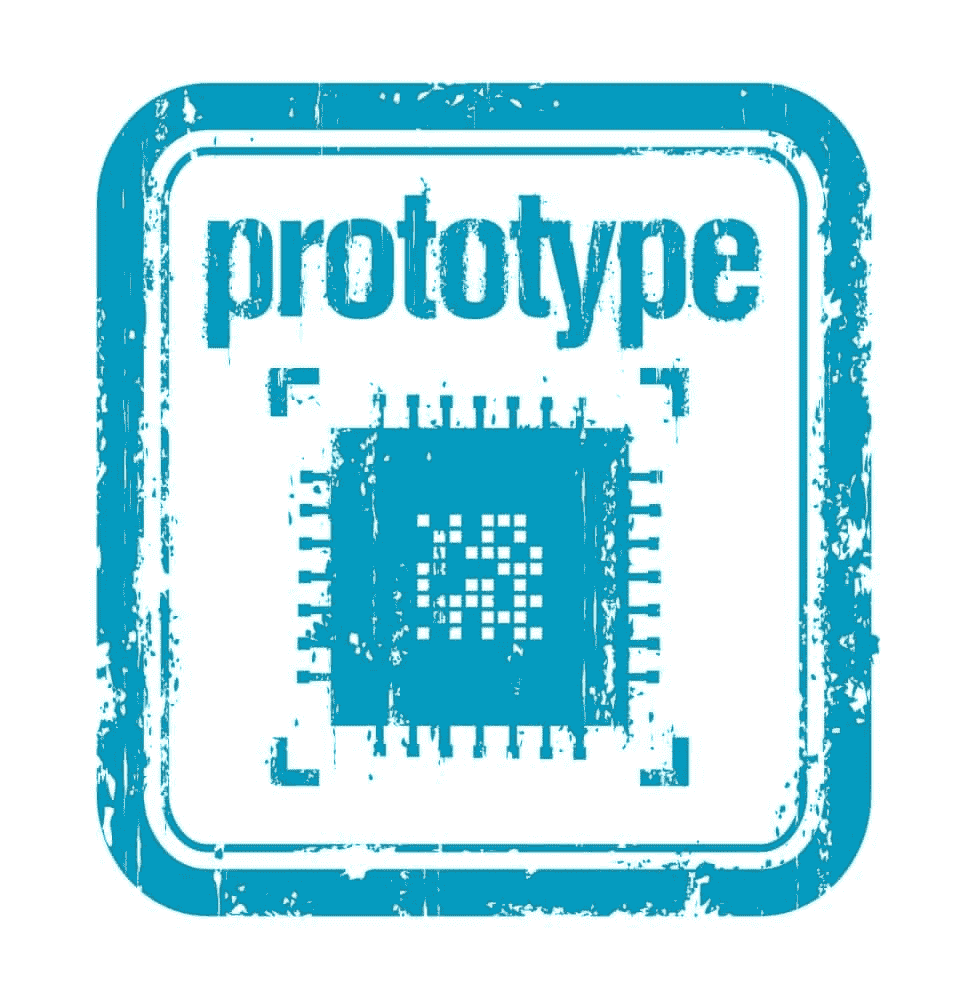

# Node.js 初学者必须知道的 4 个 Javascript 概念

> 原文：<https://simpleprogrammer.com/top-4-javascript-concepts-a-node-js-beginner-must-know/>

如果您只需要知道一种编程语言来构建一个全栈应用程序，这不是很棒吗？Ryan Dahl 将这一想法付诸实践，并创建了 Node.js. Node.js 是一个服务器端框架，建立在 Chrome 强大的 V8 JavaScript 引擎之上。虽然最初是用 C++编写的，但它使用 JavaScript 来应用。

看，问题解决了。用一种语言来统治他们。但这也让你意识到，现在你的整个应用程序都在使用同一种语言。这意味着你必须对那种语言有很好的了解。

这里有四个最基本的概念，你应该能够在实践中有效地使用 Node.js。

## 1.非阻塞或异步 I/O

因为 Node.js 是一个服务器端框架，所以它的主要操作之一就是处理浏览器请求。在传统的 I/O 系统中，只有当前一个请求的[响应](https://simpleprogrammer.com/2013/12/09/wrong-javascript-responsive-design/)(HTML 页面)到达时，才能发出请求。服务器阻塞其他请求，称为**阻塞** I/O，以便处理当前请求，这导致浏览器等待(旋转的圆圈)。

Node.js 不遵循这种 I/O 原则。如果一个请求需要更长时间，Node 会在一个**事件循环**中发送该请求(我将在另一篇文章中更深入地解释)，并继续处理**调用堆栈**中的下一个请求。一旦挂起的请求处理完毕，它就告诉 Node.js，并且在浏览器上呈现响应。

让我们用一个虚拟的例子来理解这一点:

### 阻塞输入输出

在这个餐馆的例子中，服务员接受订单，等待订单完成，然后每次都回到桌子上为订单服务。在订单处理期间，服务员只是等待或阻止其他顾客的订单。

### 非阻塞输入输出

在这个例子中，服务员接受一个订单，通知厨师这个订单，然后回去接受另一个订单。处理完第一份订单后，服务员将该订单拿到相应的桌子上，然后继续接受其他顾客的订单。与第一个例子相比，服务员不会阻止其他顾客的订单。

## 2.原型

Prototype is a complex concept of JavaScript. Since you are going to use [prototypes](http://www.amazon.com/exec/obidos/ASIN/1491904151/makithecompsi-20) a lot in Node.js, every Javascript developer must know about this concept.

在像 Java 或 C++这样实现传统继承的语言中，出于代码重用的目的，首先创建一个类(对象的蓝图),然后从该类创建对象或扩展该类以继承其属性。

但是 JavaScript 中没有类的概念。首先用 JavaScript 创建一个对象，然后扩充自己的对象或从它创建新对象。这被称为**原型继承**，意味着对象是通过原型实现的，而不是通过类。

每个 JavaScript 对象都链接到一个原型对象，它可以从这个原型对象继承属性。原型类似于其他面向对象语言中的类，但不同之处在于它们本身是对象。每个对象都链接到用 JavaScript 预定义的 Object.prototype。

如果您通过 obj.propName 或 obj['propName']查找属性，而该对象没有可以通过 obj.hasOwnProperty('propName ')检查的属性，则 JavaScript 的运行时会在其原型对象中查找该属性。如果原型对象也没有这样的属性，*它自己的*原型被依次检查，直到找到匹配或者如果它已经到达 **Object.prototype** 。如果这个属性在原型链中不存在，那么它会产生一个*未定义的*值。

让我们用下面的示例代码来说明这一点:

创建新对象时，可以选择一个对象作为其原型。这里，我们向 Object 函数添加了一个 create 方法。create 方法通过将另一个对象作为参数传递给 create 方法，创建一个使用该对象作为其原型的新对象。当我们对新对象进行更改时，它的原型保持不变。但是当我们对原型对象进行更改时，这些更改在基于该原型的所有对象中都是可见的。原型是一个复杂的概念。我将在另一篇文章中详细讨论它。

## 3.模块

如果你曾经在 Java 中使用过*包*，Node.js 中的模块也没有什么不同。如果你没有，不要担心。模块是简单的 JavaScript 文件，包含用于特定目的的代码。模块模式用于使您的代码易于导航和使用。要使用一个模块的属性，你必须**在一个 JavaScript 文件中要求**它，就像你**在 Java 类中导入**包一样。Node.js 中有两种类型的模块:

*   **核心模块**——这些是 Node.js 库预编译的模块。核心模块的目的是为开发人员提供经常出现和重复的代码段，如果这些代码段不可用，就会给开发人员带来乏味的任务，因为他们必须一次又一次地编写相同的代码。一些常见的核心模块有 HTTP、URL、事件、文件系统等。
*   **用户定义模块**–用户定义模块是开发人员在他/她的应用程序中为特定目的而创建的模块。当核心模块不能实现期望的功能时，这些是必需的。

通过**要求**功能提取模块。如果它是一个核心模块，参数就是这个模块的名字。如果是用户定义的模块，那么参数就是该模块在文件系统中的路径。举个例子，

## 4 .回电

In JavaScript, functions are regarded as first-class objects. That means you can do all the operations with a function that you can do with regular objects. You can assign functions to a variable, pass these as arguments to methods, declare them as a property of an object, and even return them from functions.

回调是最广泛使用的函数式编程范式，是 JavaScript 中的匿名函数，可以作为参数传递给其他函数，并且可以执行或从该函数返回以便以后执行。

当我们将回调函数作为参数传递给另一个函数时，我们只传递函数定义，也就是说，我们永远不知道回调函数何时执行。执行的时间完全取决于调用函数的机制。它在稍后的某个时间点被“召回”,因此得名。这是 Node.js 的非阻塞或异步行为的唯一基础，如下例所示。

这是回调的一个最简单的例子。我们传递了一个匿名函数作为参数，它只是将控制台上的一些输出记录到 setTimeout 函数中。由于只是函数定义，函数不知道什么时候执行。执行时间由调用 setTimeout 函数通过第二个参数确定，该参数确定它将在 2 秒后执行。首先，第二个 log 语句将输出记录到控制台，两秒钟后，回调函数中的 log 语句将输出记录下来。

就是这样。这些是我认为 Node.js 初学者学习成为更好的程序员应该学习的四个 JavaScript 概念。

你的清单上有什么？请在评论里告诉我。

如果你有技能，但你看不到你在职业生涯中应得的成功，那么一定要参加我们简单的程序员课程[“如何作为一名软件开发人员推销自己”。](https://simpleprogrammer.com/store/products/how-to-market-yourself/)T3】