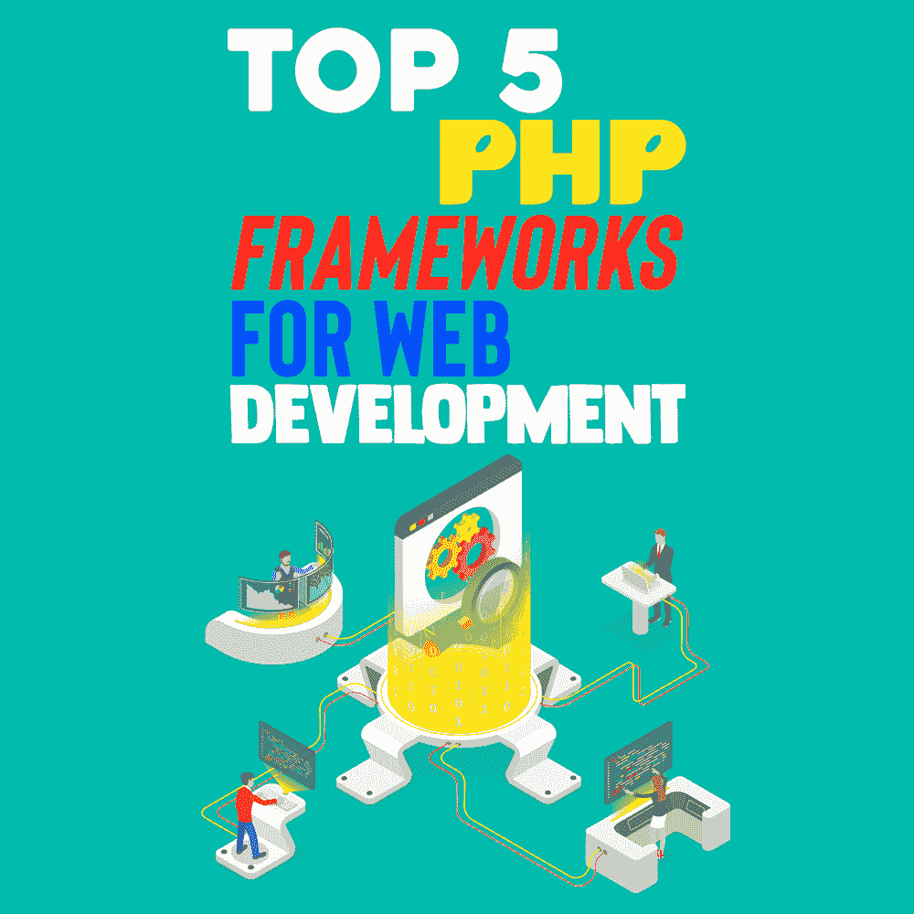
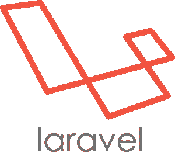
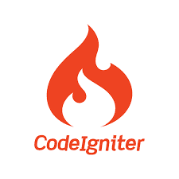
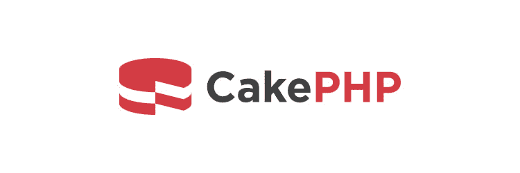
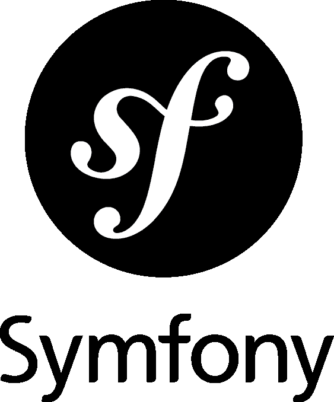

# Web 开发的五大 PHP 框架

> 原文：<https://simpleprogrammer.com/top-5-php-frameworks/>

According to a study, [more than 77% of websites on the internet use PHP](https://w3techs.com/technologies/details/pl-php) — the free, open-source scripting language—for their backend. That means, if you’ve been around for a while, chances are that PHP was your first backend language. And if you’re a beginner, it’s a good idea to learn it to advance in your career.

PHP 的一个优点是容易学习和使用。此外，PHP 比其他后端技术更兼容 HTML。

至于 PHP 框架，它们是预先编写的 PHP 代码，可以帮助你更容易地构建网站。PHP 框架使用库和常用函数使网站开发更快，允许您使用更少的代码和更多的功能。

如果您是 PHP 框架的新手，您可能想知道从哪里开始，哪些框架是最好的。在这篇文章中，我将与你分享一份 web 开发的五大 PHP 框架列表，以帮助你选择最适合你的框架。

## Web 开发的五大 PHP 框架

那么，哪个是最好的 PHP 框架呢？答案取决于你的需求，但一般来说，最**简单的**框架，也就是**提供最多功能**，也是最**流行的**，可以被认为是最好的。让我们来看看排名前 5 的 PHP 框架，这样你就可以挑选出最适合你需求的一个。

资料来源:SeekLogo

### 拉勒韦尔

Laravel 是最著名和使用最广泛的 PHP 框架。它于 2011 年 6 月 9 日首次发布。有大量的贡献(GitHub 上的承诺)和全球超过 110 万个网站使用这个框架。

**GitHub 明星:** 70.2K

**著名用户:** BBC，辉瑞，自由互助保险。

**网站数量:**110 万

**推荐学习资源:** Udemy，YouTube， [Laravel 学习书籍](https://www.amazon.com/dp/B0775K3VK7/makithecompsi-20)

Laravel 的优点包括:

*   初学者易于学习和使用
*   简单易懂的语法
*   高度安全
*   许多内置功能，如身份验证和安全系统

至于它的缺点，可以总结如下:

*   复杂项目结构
*   没有新版本
*   比 Django 等其他框架[慢](https://techtrim.tech/django-vs-php)
*   不太强大的作曲家

来源:CDNLogo

### 视频教程

代码点火器于 2006 年 2 月 28 日推出。这是一个免费的开源网络开发框架。由于它的内置模块，它也是最好的 PHP 框架之一，因为它的速度和易于配置。

**GitHub stars:** 18.2K

**著名用户:**埃森哲、Ola、Zendesk Inc

网站数量: 541K

CodeIgniter 的优点包括:

*   由于其结构简单，易于使用
*   比大多数其他 PHP 框架快 3-4%
*   没有强制的设计模式

至于它的缺点，可以总结如下:

*   不如其他框架安全，因为它是一个旧框架
*   用于创建新功能的库更少
*   这是一个旧的框架，没有进一步的发布

来源:CakePHP

### CakePHP

CakePHP 于 2005 年 4 月发布。它也是一个免费的开源 web 开发框架，提供非常高安全性的特性，如 SQL 注入保护和 XSS 保护。

**GitHub 明星:** 8.5K

**著名用户:**格伦雷文公司，国际保护组织，InSync 解决方案

**网站数量:** 188K

CakePHP 的优点包括:

*   轻松[开发应用](https://simpleprogrammer.com/popular-app-development-languages-2022/)
*   许多有用的内置功能，例如，安全系统和强大的搜索引擎优化路由
*   非常安全

至于它的缺点，可以总结如下:

*   小型社区支持
*   不全面和初学者友好的文档

资料来源:Symfony

### symphony

Symfony 是一个基于 PHP 的 web 开发框架，以其可重用的组件和库而闻名，这使得它易于编码。Symfony 的工作流程非常快，因为没有必要一次又一次地为同一件事写代码。

**GitHub stars:** 27K

**知名用户:** Spotify、Dailymotion、Trivago

**网站数量:** 37K

Symfony 的优点包括:

*   快的
*   非常灵活
*   可重用代码

至于它的缺点，可以总结如下:

*   测试需要更多的时间
*   OOP(面向对象编程)使得初学者很难学习

资料来源:YiiFramework

### Yii2

Yii2 是一个基于 PHP 的框架，遵循 DRY(不要重复自己)原则。Yii2 是作为框架 Yii 的继承者发布的。此外，它还附带了一个名为 Gii 的类代码生成器。

**GitHub stars:** 13.9K

**著名用户:**发现、通用、富士通

网站数量:170，000

Yii2 的优点包括:

*   惊人的快
*   也支持[前端开发](https://simpleprogrammer.com/top-10-emerging-front-end-frameworks/)
*   非常轻量级(使用较少的资源，如 RAM 和 CPU)

至于它的缺点，可以总结如下:

*   难学
*   不支持许多功能，如查询和广播

## 使用顶级 PHP 框架更智能地构建

脚本语言 PHP 是免费的、开源的、功能强大的，并且很受欢迎。它包含许多框架。那么，有什么比简单更好的呢？但是当然，*更简单！*

这就是 PHP 框架的用武之地。作为预先编写的 PHP 代码，它们可以帮助你更容易地构建网站，避免额外的工作。PHP 框架使得网站开发更快，允许你使用更少的代码和增加更多的功能。这样，你的*生产力和效率*就会提高。

在这篇文章中，我给你提供了一个 5 大 PHP 开发框架的列表，以及它们的优缺点，所以你可以为你的项目选择一个合适的。经验法则是，要构建得更智能，而不是更难！