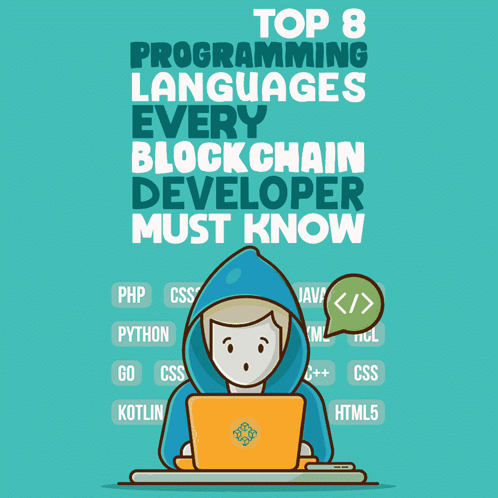

# 每个区块链开发者必须知道的 8 种编程语言

> 原文:[https://simple programmer . com/top-8-区块链编程语言/](https://simpleprogrammer.com/top-8-blockchain-programming-languages/)

Here’s a question for you: Name the technology that has taken the world by storm, with core characteristics like decentralization, immutability, and transparency.

答案当然是区块链，它以前所未有的方式进入并扰乱了商业和工业。

因此，几乎所有的初创企业和机构都希望以分散应用、加密货币或任何其他形式利用区块链的力量，并最终在区块链市场分一杯羹。预计在 2020 年至 2025 年期间，以 67.3%的复合年增长率从 30 亿美元增长到 397 亿美元。

这导致对区块链专家的需求增加。根据 LinkedIn 分享的最新数据，区块链开发人员的工作岗位数量增长了 40%。Glassdoor 的另一份报告显示，区块链和密码相关的工作岗位增加了 2%。

同样，Janco Associates 在 2019 年进行的[调查显示，区块链开发者的平均工资估计在 12.5 万美元到 17.5 万美元之间。](https://www.e-janco.com/Articles/2018/2018-09-27-Blockchain-Developer-Salary.html)

然而，有一个小故障。

尽管区块链市场潜力无限，但缺乏有能力、有经验、有创新精神的区块链开发商，这意味着只有少数专家知道如何成功建设一个全面的区块链项目。

区块链应用程序开发人员在需求和可用性方面的这种差异吸引了各种各样的人才，并使他们好奇的期待学习区块链开发的基础知识以及行业开发中使用的编程语言。

假设你是一个对区块链技术有基本了解的开发人员，让我们只关注第二个因素，也就是你必须知道的语言，以便为初创公司和企业提供最好的区块链解决方案。

你准备好了吗？

我们会发现最好的区块链编程语言的名字吗？

我们走吧。

## 爪哇

你可以选择踏入区块链竞技场的首要语言是 Java。

这种语言是面向对象的，具有各种特性，如易于内存清理和可移植性，这意味着它的潜力不局限于设备的架构。它能够实时管理区块链网络中的大量用户。

这使得它成为构建[智能合约](https://appinventiv.com/blog/smart-contract-guide/)和 [IoTA](http://www.amazon.com/exec/obidos/ASIN/198041887X/makithecompsi-20) 和 [NEM](https://nem.io/) 等 dApps 的完美选择。

## 固态

虽然是新的，但 Solidity 也是开发基于以太坊的智能合约的完美选择。

该语言是静态类型的，具有与 [ECMAScript](https://en.wikipedia.org/wiki/ECMAScript) 相关的语法组件，由 Ethereum 团队设计，旨在帮助开发人员编写高级智能契约驱动的代码，这些代码可以翻译成低级语言并在低级语言中使用。通过这种方式，它提高了区块链生态系统的可用性。

## Golang

Golang(或 Go)是用于创建 hyperledger fabric 和其他去中心化解决方案的顶级编程语言之一。

它是一种静态类型的语言，加载了各种高级特性和功能，即泛型、构造函数、注释、类、异常和继承。由于通道和接口的智能实现，它非常快速、高效，并提供了管理远程包的便利。

此外，它采用了“Goroutines”而不是线程，这使得人们可以更容易地执行多线程，而不必担心内存消耗和编译时间。这再次说明了为什么 Go 是区块链编程语言列表中的完美补充。

## 计算机编程语言

创建于 1991 年的 Python 在市场上获得了巨大的动力，尤其是因为它们在人工智能应用程序开发中的作用。然而，这并不是故事的结尾。

这种编程语言还以构建有效的区块链项目和为不同平台编写智能合同而闻名，如 [NEO](https://en.wikipedia.org/wiki/NEO_(cryptocurrency)) 和 [Hyperledger](https://www.hyperledger.org/) 。背后的几个原因是它有更简单的语法和独有的特性，以及在编译和运行时都可以使用的能力。该语言的非编译形式可用于开发物流和农业领域的复杂区块链应用程序。

## C++

已经在科技界占据主导地位的 C++，也显示出成为区块链开发的最佳编程语言的迹象，尤其是在构建 EOS 方面。

这种面向对象的语言基于不同的概念，包括抽象、封装、数据隐藏和多态，这有助于防止意外的数据更改，并确保更好的内存处理能力。它还有助于保持块的安全，并通过授权每个网络节点接受/拒绝各个块来处理大量的资源请求。

除了增强单线程性能之外，C++还有助于处理并行和非并行任务。

## Java Script 语言

统治 web 开发世界的 JavaScript 也加入了区块链编程语言的行列。

这是因为该语言及其大量的库和框架(如 Angular、React 和 Node)提供了处理异步操作的便利。JavaScript 帮助区块链开发人员毫不费力地处理多个节点之间的通信，这为设计的解决方案引入了可伸缩性的力量。

## 简单

2017 年发布，Simplicity 也是智能合约开发可以考虑的顶级编程语言之一。

这种语言，就像 C++，是一种面向对象的编程语言，遵循相同的原则，使其适合避免数据中的错误和变化。它还消除了开发人员的分心，提高了生产率，并采用了 [Merklized 抽象语法树](https://bitcointechtalk.com/what-is-a-bitcoin-merklized-abstract-syntax-tree-mast-33fdf2da5e2f)来将程序分组为树形结构。因此，它适合小型事务，降低了块空间需求。

此外，到 2020 年中期，该语言将用于创建更广泛的区块链项目。

## 结构化查询语言

Lastly, SQL (Structured Query Language) is also the right language for creating secure and enterprise-powered blockchain solutions.

该语言由 IBM 设计，旨在促进收集、存储和操作数据的不同数据库之间的通信。这包括 MySQL、PostgreSQL、SQL Server 和 Oracle。Aergo 就是一个很好的例子，它是一个基于 SQL 的智能合约平台，可以帮助企业在商业生态系统中创建和执行高级智能合约。

## 让自己进入区块链领域

虽然前面提到的是可以被认为是进入区块链开发高级世界的一些编程语言，但是市场上还有更多流行的编程语言。

明智的做法是为你在区块链领域的职业生涯选择正确的编程语言，彻底学习它，尝试这种语言，这样，为统治市场做好准备。