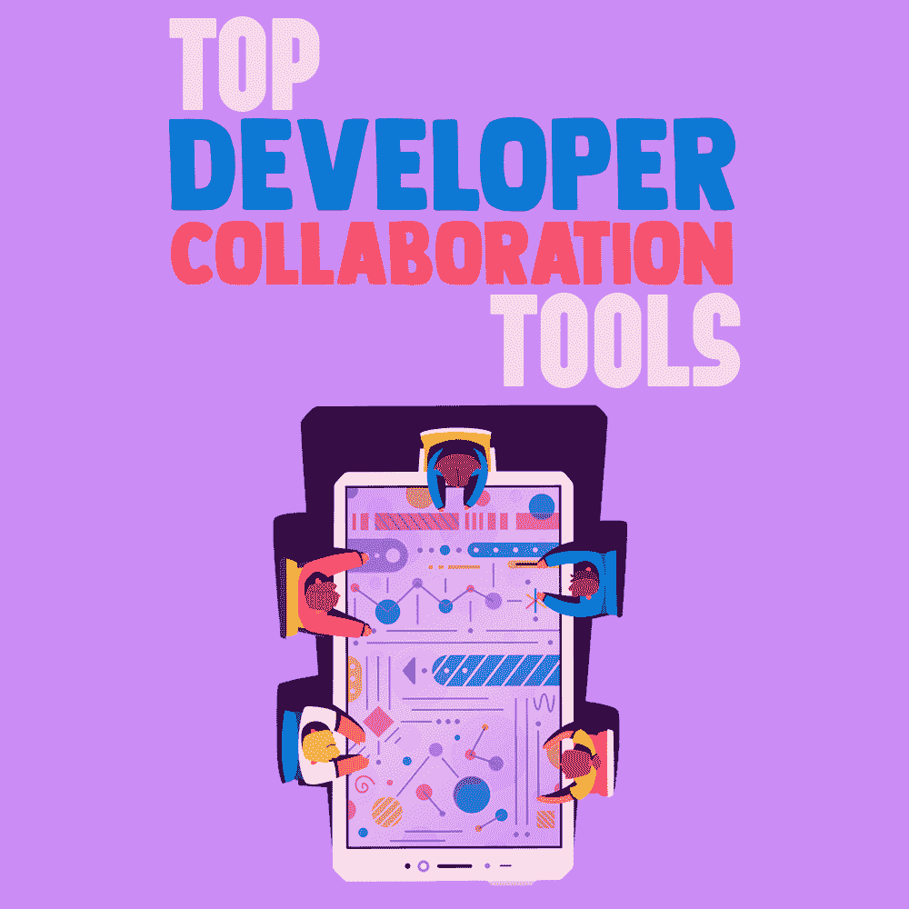

# 顶级开发人员协作工具

> 原文:[https://simple programmer . com/top-developer-collaboration-tools/](https://simpleprogrammer.com/top-developer-collaboration-tools/)

<figure class="alignright is-resized">

</figure>

如何把你的项目逼入绝境？如果你想知道，有多种选择。最可靠的一个是沟通错误。考虑到你不能读懂你的客户的想法，而其他开发人员通常有完全不同的观点，将所有这些观点结合起来是一个成功项目的基石。

有道理，不是吗？糟糕的是，对于大多数开发团队和企业来说，这只是一个理论。根据 Atlassian 的研究，59%的团队认为缺乏适当的沟通是他们成功的最大障碍。

既然*没有*的意义。如果理论上我们都明白顺畅沟通的好处，那么现实中又有什么会出错呢？问题是，协作中最重要的不仅仅是框架，还有执行。交流是一种干扰——特别是对于那些比起团队会议更喜欢编码冲刺的开发人员。

沟通不畅是项目经理的错吗？是的，因为在一天结束的时候，改变合作的方式足以挽救一个绝望的局面。奇怪的是，许多被认为是创新和自动化专家的开发人员一直忽略一个简单的规则:

沟通，就像开发和自测一样，应该是*自动化*。

虽然每天早上进行传统的站立会议仍然很流行，但最好将这些传统方法与专用工具结合起来。

记住这一点，让我们来谈谈 web 开发协作工具。

## 什么是协作工具，它们有什么作用？

协作软件是为团队交流、集体代码共享和编辑、错误监控以及屏幕捕获和图像共享而设计的。它还为团队提供了关于其生产力、截止日期、已执行任务和同步待办事项列表的最新见解。

如果你已经采用了[敏捷](https://simpleprogrammer.com/agilesoftdev)或 DevOps，你很可能已经在使用基本的沟通工具。然而，真正的敏捷协作在寻找最有效的团队合作方法和尊重开发人员的个人兴趣之间找到了平衡。

一方面，软件工程师应该能够做他们想做的事情——当你处于“最佳状态”时，你不可能对另一个单口相声感到高兴。另一方面，通过对话进行头脑风暴可以让员工作为团队的一部分成长，坚持公司和个人的目标。

<figure class="wp-block-image">

<figcaption>*devo PS 和敏捷要求所有团队成员之间有多个沟通链接*</figcaption>

</figure>

## 协作软件的必备标准

为了让协作软件变得有用并真正提高生产力，它需要具备某些重要的特性。简而言之，这些是:

*   **无隐私侵犯**。如果您想关闭这些通知，您应该能够做到。如果您现在无法接听电话，您可以稍后收听录音版本。
*   **独立目标与集体目标相结合**。最好的协作软件是透明的。您可以看到其他人正在做什么，并添加您的建议。敏捷开发框架意味着每个人都知道每个团队成员的功能。
*   **代码控制的共享访问**。如果你的一个团队成员去度假了，另一个应该可以马上加入进来，没有瓶颈。因此，好的合作软件应该包括日志，当代码改变时通知每个人，并防止技术债务。
*   重要任务的自动化。您应该能够自动完成诸如计划会议、安排电话、上传报告和设置截止日期等任务。
*   **不同团队之间的协调**。您应该能够在项目的任何阶段与测试人员和 UI/UX 设计人员共享您的设计人员/开发人员协作工具。

既然我们已经建立了一个完美协作系统的愿景，那么让我们看看开发人员协作工具的功能如何帮助我们实现目标。在测试了 30 多项服务后，我们创建了一个关键功能的终极列表，并将它们分为以下六类。

### 沟通管理

你需要注意沟通的两个关键方面。首先，你需要向利益相关者解释工作流程，并从客户那里获得建设性的反馈。其次，你必须与相关的项目参与者交谈——开发人员、设计人员、测试人员和管理人员。

*   Skype 用于官方交流，所以它是你报道第一个方面的最佳选择。使用 Skype 与客户会面、与整个团队进行电话会议以及召开管理会议。
*   [Slack](https://slack.com/) 是内部沟通的工具。有趣的界面、多个频道，全部免费且无广告，是无缝工作环境的完美选择。
*   [Google Hangouts](https://chrome.google.com/webstore/detail/google-hangouts/nckgahadagoaajjgafhacjanaoiihapd?hl=en) 是团队网络研讨会和教育会议的完美解决方案。您甚至可以采用每周例会的传统，在例会上，一位有经验的开发人员、经理或测试人员将会分享对某个特定项目或一般技术的见解。

### 任务管理

为了保持工作动力，你需要看到更大的图景。拥有详细的待办事项和产品报告可以让你检查并给人一种切实的进步感。另一方面，任务管理是基于将任务分成更小的子任务——这样你就不会被截止日期压垮。

*   [吉拉](https://www.atlassian.com/software/jira)是由开发人员为开发人员创建的，完美地融合了 [Scrum 和敏捷方法](http://ddi-dev.com/blog/programming/7-best-software-development-methodologies-pros-and-cons/)。Scrum 和看板、直观的路线图和全面的敏捷报告给你一个更大的图景。数以千计的官方插件和安全的云存储为实验创造了一个完美的游乐场。
*   Asana 允许设置带有自动通知的详细待办事项列表，将成员与任务联系起来。该工具有自定义模板—日程安排、积压工作、待办事项列表和设计主题，可帮助您立即投入工作。
*   Trello 包括所有重要的协作功能(截止日期、优先处理常规和紧急任务、添加任务和创建文件夹)和其他几个功能，对开发人员尤其有用。例如，它提供了代码和分支名称的呈现视图。使用彩色标签可以让你的待办事项变得可读和直观。

### 时间跟踪

<figure class="alignright is-resized">

</figure>

由于开发人员的工作是按小时计酬的，所以经理和客户都需要知道成员是如何管理时间的。

作为开发人员，你的任务是确保任何时间跟踪工具都不会侵犯你的隐私。我们的首选是:

*   [Toggl](https://toggl.com/) 。它可以追踪你在网上和桌面软件中的活动，兼容 Windows、Mac、iOS、 [Android](https://simpleprogrammer.com/history-internet-part-15-android/) 和 Linux。每天结束时，您会收到一份关于您的活动的综合报告，包括花费的小时数和最常见活动的列表，以及您的时间成本。
*   [小时](https://www.hourstimetracking.com/)。这是一个追踪线上和线下活动的网络和移动应用程序。如果您忘记设置定时器或有离线工作活动(会议或站立)，时间线功能允许编辑您的日程安排。这个界面是迄今为止我们在时间追踪器中看到的最好的。

### 应用程序性能监控

使用应用程序性能监控(APM)，您可以准确地知道您的项目是成功还是失败，并且您可以及时地知道。APM 软件运行系统性能检查，验证系统响应和平均事务时间，检测基本错误，并分析后端代码。通过在早期分析您的项目，您可以快速检测并修复关键问题。

*   [New Relic](https://newrelic.com/) 是一款用于全面技术堆栈分析的免费增值工具。该软件支持 Java、Python、PHP、Ruby、NET、Goland、Node.js 等流行语言。免费版本对小团体有用，但是对于大项目，值得考虑付费订阅。
*   Munin 监控计算机、应用程序、网络和 San。你可以使用这个工具来分析你的硬件状态，也可以测试你自己的应用。数百个附加插件是 Munin 的显著特征。默认情况下，有 300 多个附加功能可用，而一个官方存储库由 200 个补充插件组成。
*   Nagios 评估服务器容量，检测失败的协议和网络中断。它还可以识别失败的功能、主要错误和批处理作业。日志服务器保存关于用户活动、网络安全、数据泄露风险和可扩展性进展的全面报告。

### 维基项目

在某些情况下，您需要找到项目的具体细节。在一台服务器上收集所使用的技术、服务器和测试场景的完整列表是非常好的。您可以使用 wiki 项目经理来维护项目的数字百科全书，供所有团队成员使用。稍后，它可以分发给新的团队成员或在与客户的会议中使用。

*   TeamMeta 允许在单个数据库中记录项目的每个细节。它还连接软件开发词汇表和百科全书。如果你遇到一个未知的术语或技术，只要突出显示这个词或短语，你就会看到解释。
*   Redmine 是一个开源的任务和时间追踪工具。它也是一个完整的数据库，直观地展示了项目的进展和团队的活动。该工具将产品的所有信息收集在一个类似 wiki 的文件中，并且可以集成到其他项目管理系统中。

### 测试环境

<figure class="alignright is-resized">

</figure>

协作工具如何帮助我开发项目？您不仅可以将这些工具用于交流，还可以用于代码改进。测试环境是一个安全的平台，专门为运行测试用例和执行代码更改而创建。测试环境连接开发人员和测试人员，并提供对多种浏览器和操作系统的访问。工程师可以通过一台设备在多种环境中工作，而不是购买多个硬件系统。

*   [TestNG](http://testng.org/) 是 [Java](https://simpleprogrammer.com/thinking-in-java) 的通用测试框架，执行端到端、单元和功能测试。使用这个工具来自动化最常见的测试用例，并在一个非常复杂的设置菜单中定制您的测试活动。额外的好处是 HTML 报告生成，测试用例的并行执行，以及在多种浏览器上的测试执行。
*   [Selenium](https://www.seleniumhq.org/) 是一个 web 应用程序的开源测试环境。您可以在 Windows、Mac 和 Linux 上的各种浏览器中同时执行多个并行测试场景。它还支持几十种编程语言，使其成为最通用的 web 测试环境之一。不过，这是最简单的方法之一。
*   [酱实验室](https://saucelabs.com/)。在 700 多种浏览器上运行测试用例。它兼容 Windows、Mac、PC、Android 和 iOS。该软件有预先设计的测试用例，随时可以运行。测试协议 Sauce Connect 检查应用程序的安全性。另外，Sauce Labs 与吉拉集成在一起——你可以将自动化测试用例直接链接到任务管理器。

## 协作软件给开发者带来的五大好处

使用每个类别的工具，您可以防止项目期间可能出现的几乎任何沟通问题。所以，只把自己局限在一个工具上是没有意义的。让我们来看看这种协作交流提供了哪些好处，以及可以轻松避免哪些潜在的冲突问题。

### 项目规划和解决问题

如果责任在成员之间平均分配，开发项目就能成功。你不希望在一个团队中，一个人突然发现自己要对出现的所有问题负责(有一天，这个人可能就是你)。如果团队不知道谁对问题负责，情况可能会更糟，问题仍然没有解决。

软件协作工具通过在所有成员之间平均分配责任来帮助有效地分配任务。

### 划分责任

借助分布式开发的远程配对协作工具，每个人都可以跟踪整个项目以及每个单独任务的进度。如果你做错了什么，它会在早期被发现——省去了很多麻烦。

### 代码维护

如果您的团队在分布式模型中工作，您将不得不处理联合编码。在这样的系统中，每个开发人员都在一个特定的代码段上工作，将最终版本添加到主分支中。

<figure class="wp-block-image">

T4】</figure>

*2018 年， [Stripe 的研究](https://stripe.com/files/reports/the-developer-coefficient.pdf)显示，开发人员每周工作时间中仅科技债务就占了 13.5 小时*

在现代软件开发的现实中，你不能只等一个开发人员完成代码，你可以从下一个特性开始。

我们有截止日期和生产力跟踪器，这意味着我们经常盲目地工作，看不到更大的图景。为了让联合系统工作，您引入了一个协作工具来检查代码质量，并使用 Git 存储库实现无缝代码共享。

### 缩短反馈循环的原型工具

使用原型工具允许整个团队更仔细地查看项目并进行测试——基本上，它将是一个最小可行的产品，或 MVP。这样，您可以立即发现问题，并提供一个简短的反馈循环。此外，您可以将模型发送给客户，并在项目的最早阶段进行更改。

### 招募新成员

每当有新成员加入团队，你通常都要开始一段试用期。新的开发人员或测试人员必须观察其他成员，熟悉代码和技术，并了解项目的目标。这需要大量的时间和资源。

每当成员被引入团队时，您可以简单地将他们重定向到保存的文件。新手可以立即投入工作，你可以得到合格的帮助，客户也不会有任何问题。

## 最终合作清单

在你翻开合作的新一页之前，让我们给你一个简短的分步指南。现在您已经拥有了所有这些工具，您将能够以渐进、连贯的方式实现它们。

*   从实现任务管理软件开始，因为它为你的工作进程提供了一个清晰的框架，并创造了一个更大的图景。
*   整合至少两种沟通工具，一种用于内部沟通，另一种用于正式会议和客户会议。
*   从项目的最早阶段就保留项目 wikis。每个成员都应该能够访问 wiki 文件，但是最好也指定一个负责人。
*   将时间追踪器用于个人动机，而不是间谍活动。使用追踪器来设定个人记录，提高你的个人生产力。
*   努力缩短反馈循环——这样，整个团队都在同一页上。使用代码控制工具很容易做到这一点，因为严重的问题会被自动检测出来。
*   在测试环境中运行您的测试用例，在寻求最终项目批准或发布产品之前执行跨浏览器和跨平台测试。

顺畅的沟通是防止[筋疲力尽](https://simpleprogrammer.com/avoiding-burnout-software-developer/)和赶在最后期限之前的最可靠的方法。当每项任务都被安排、讨论和测试时，你就大大减少了面对错误或误解的机会。通过将经过时间验证的方法与创新的工具相结合，您可以坚持最佳的编码实践，并且进步得更快。