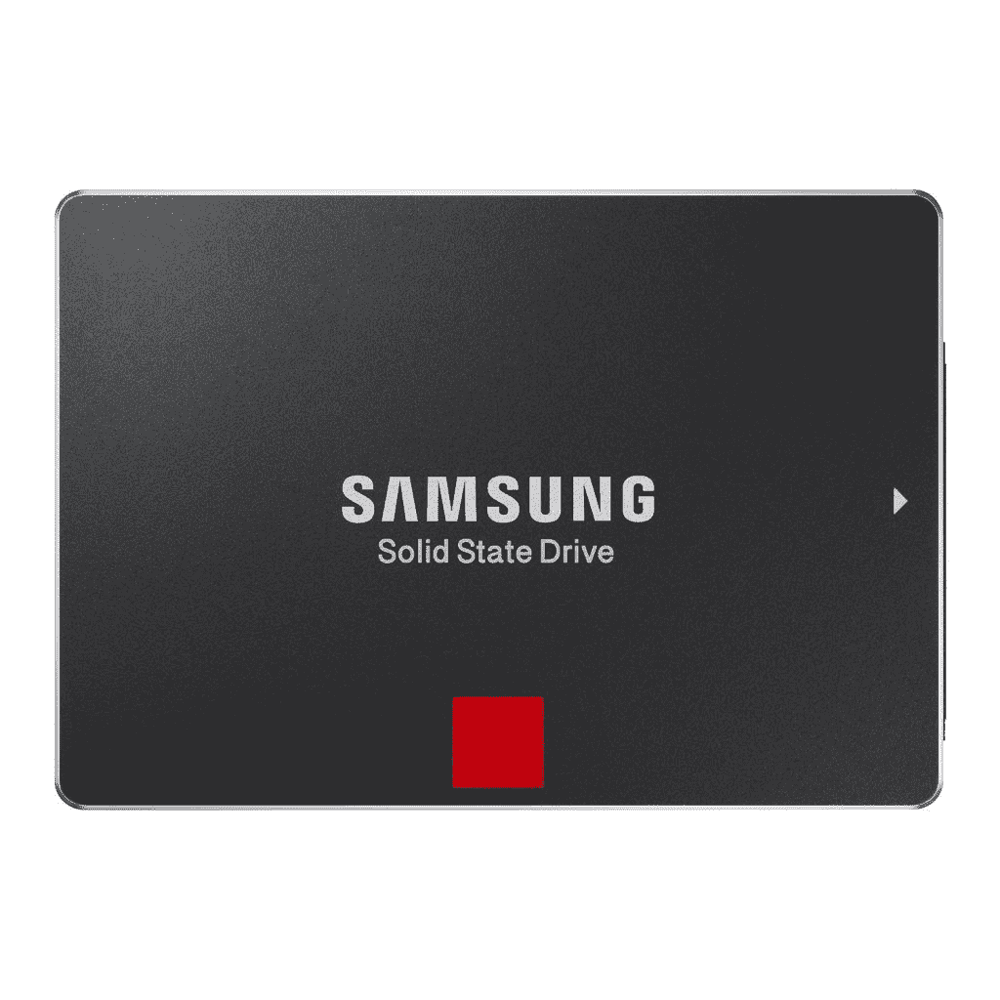
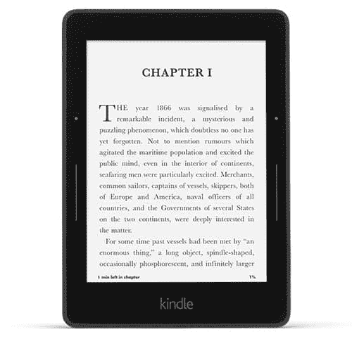
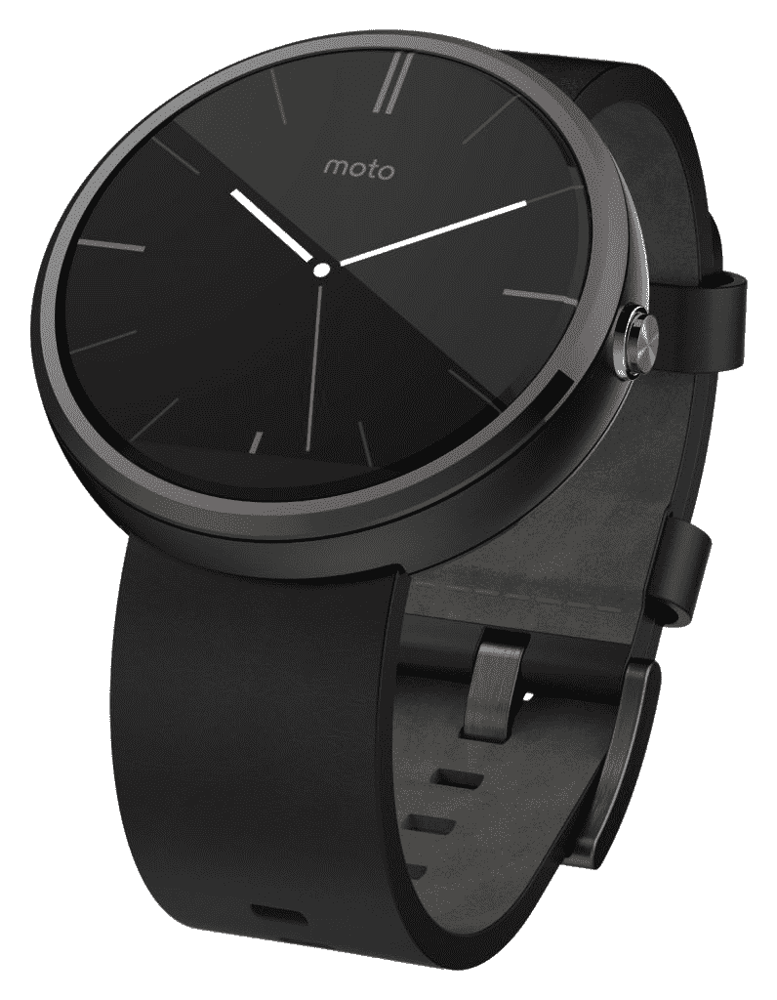
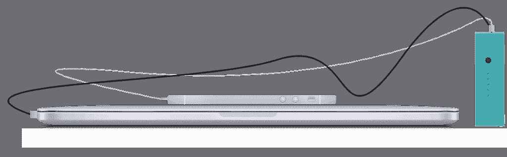
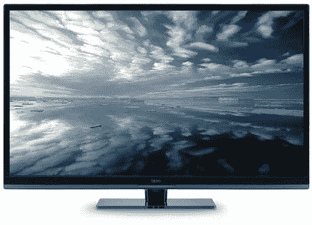
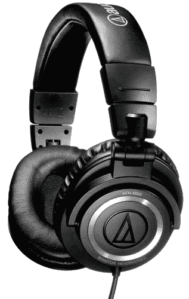
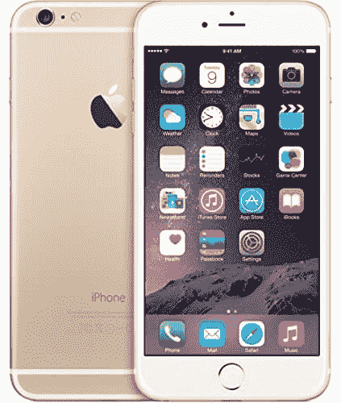
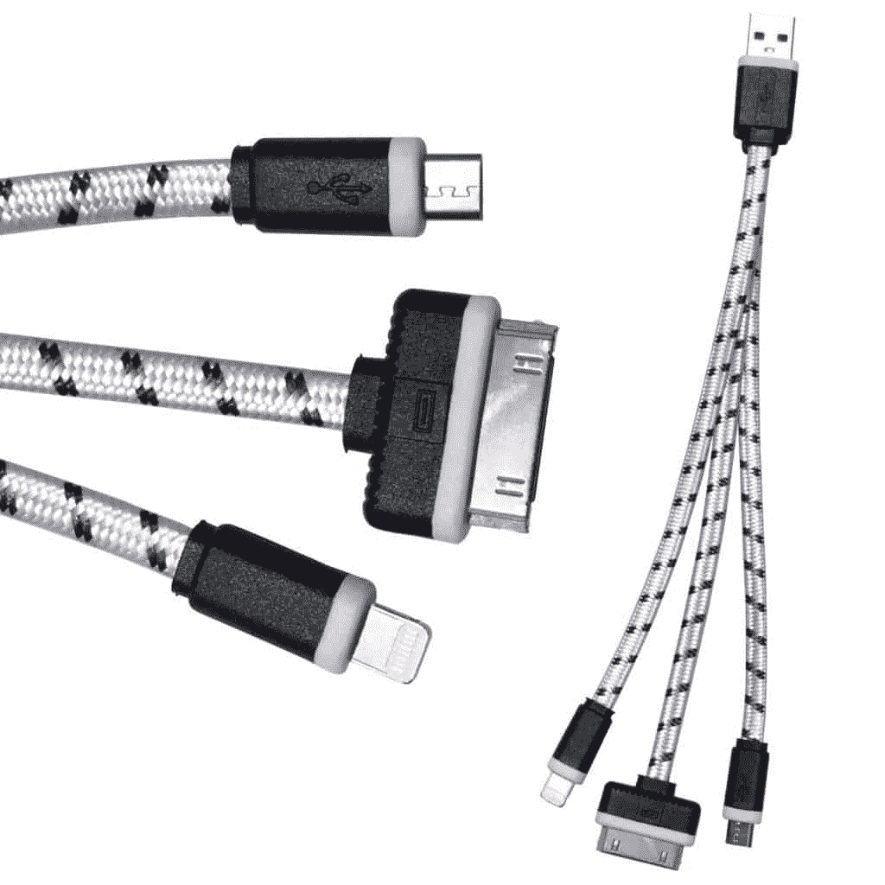
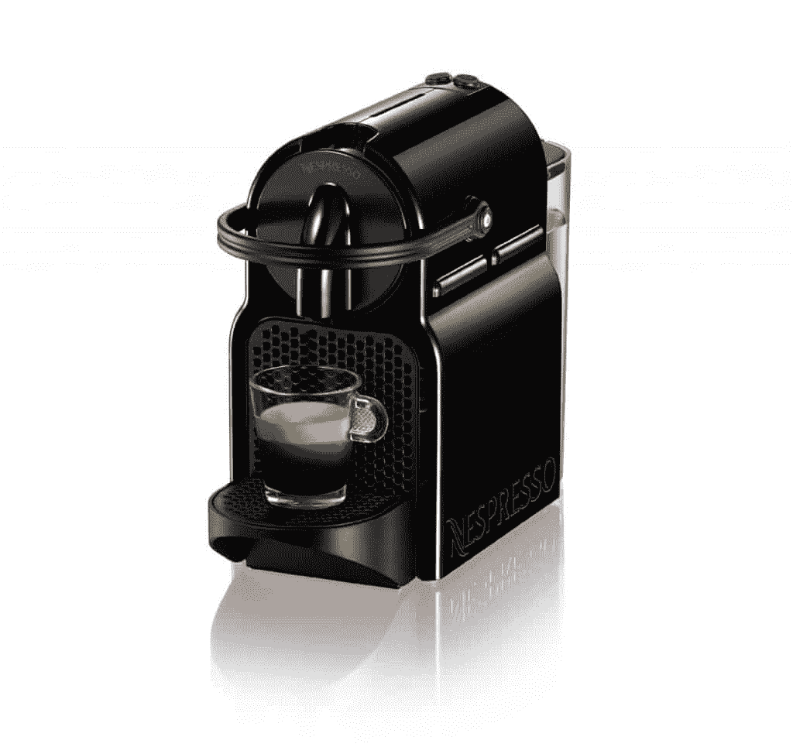

# 顶级开发者礼物(和技术极客礼物)

> 原文：<https://simpleprogrammer.com/top-developer-gifts-tech-geek-gifts/>

## **更新:[点击这里查看最新的 2020 年软件开发者礼物清单](https://simpleprogrammer.com/gifts-for-programmers/)**

随着假期的临近，我认为这将是一个很好的时间来做另一个总结，我认为这是今年给软件开发人员、程序员和其他技术极客的最好礼物。

如你所知，给软件开发人员买礼物是非常困难的，因为，嗯，软件开发人员对礼物有非常特殊的品味。

所以，这就是我要帮你的地方:

如果你正在为软件开发人员、程序员或其他技术爱好者寻找礼物，那你来对地方了。

如果你自己是一名软件开发人员，就把这个链接传给那些负责在这个假期给你送礼物的人——或者，就给自己买这些东西，就像我知道你无论如何都会做的那样。

我试图今年只加入新的东西，或者至少是去年加入的任何东西的更新版本，但是去年的许多礼物仍然是相关的。

**[更新:2015 年榜单来了！](https://simpleprogrammer.com/2015/11/30/software-developer-gifts-and-other-tech-geek-gifts-2015/)T3】**

你可以在这里查看去年的礼物清单。

## [三星 850 Pro 固态硬盘](http://www.amazon.com/gp/product/B00LF10KNA/ref=as_li_tl?ie=UTF8&camp=1789&creative=390957&creativeASIN=B00LF10KNA&linkCode=as2&tag=makithecompsi-20&linkId=W7E4I7DD5M7ZJWG6)

购买固态硬盘可能很难，但这个假期很容易。

就速度和价格而言，这款固态硬盘显然是大赢家。这个真的不会错。另外，它还附带了一份免费的刺客信条联盟。

我自己也有一个这样的硬盘，速度非常快。我真不敢相信市场上基本上最好的固态硬盘的价格有多便宜。

不过有几个选择:

*   [128 GB](http://www.amazon.com/gp/product/B00LF10L02/ref=as_li_tl?ie=UTF8&camp=1789&creative=390957&creativeASIN=B00LF10L02&linkCode=as2&tag=makithecompsi-20&linkId=CKOKTEIY2N2EQRCY)
*   [256 GB](http://www.amazon.com/gp/product/B00LF10KNA/ref=as_li_tl?ie=UTF8&camp=1789&creative=390957&creativeASIN=B00LF10KNA&linkCode=as2&tag=makithecompsi-20&linkId=W7E4I7DD5M7ZJWG6)
*   [512 GB](http://www.amazon.com/gp/product/B00LF10KTO/ref=as_li_tl?ie=UTF8&camp=1789&creative=390957&creativeASIN=B00LF10KTO&linkCode=as2&tag=makithecompsi-20&linkId=TULVRT5RFB2TUZM2)
*   [1 TB](http://www.amazon.com/gp/product/B00LF10KTE/ref=as_li_tl?ie=UTF8&camp=1789&creative=390957&creativeASIN=B00LF10KTE&linkCode=as2&tag=makithecompsi-20&linkId=XRAFVZHX6JVWBBXN)

我建议要么选择 256 GB，要么选择 512 GB，因为两者都非常超值。我发现 256 GB 对我来说足够大了，但我知道一些开发者可能更喜欢 512 GB。

此外，三星包含的软件使您可以轻松地将硬盘转移到这款新的固态硬盘上。不到 30 分钟，我就上线运行了。

## [点燃航程](http://www.amazon.com/gp/product/B00GDQDRPK/ref=as_li_tl?ie=UTF8&camp=1789&creative=390957&creativeASIN=B00GDQDRPK&linkCode=as2&tag=makithecompsi-20&linkId=H7BR6LFUX2OCN7EZ)

我甚至无法告诉你 [Kindle Voyage](http://www.amazon.com/gp/product/B00GDQDRPK/ref=as_li_tl?ie=UTF8&camp=1789&creative=390957&creativeASIN=B00GDQDRPK&linkCode=as2&tag=makithecompsi-20&linkId=H7BR6LFUX2OCN7EZ) 有多棒。我在进行超过 10 个小时的飞行之前为我的航行充电，一周后我回来时，我仍然有超过一半的电池寿命。

航程非常轻，实际上正好适合我的口袋。

我过去常常在 iPad Mini 或 Android 手机上看书，但我很高兴我改用了 Kindle Voyage。现在我可以在白天看书了，这意味着我可以在更多有趣的地方看书。

## 【Android 版 Moto 360 智能手表

所以，我实际上没有，但我肯定想要一个。

在 Android 智能手表领域， [Moto 360](http://www.amazon.com/gp/product/B00NC8PMUK/ref=as_li_tl?ie=UTF8&camp=1789&creative=390957&creativeASIN=B00NC8PMUK&linkCode=as2&tag=makithecompsi-20&linkId=XTNSV33LFI7OHAZW) 似乎是明显的赢家。

我唯一犹豫的是，我不确定我是继续使用我的安卓手机还是换成 iPhone 6 Plus。

这款手表非常棒。它看起来非常时尚，拥有 Androidwear 平台的所有功能。此外，它还可以进行所有的健康跟踪，包括心率。

## [微软乐队](http://www.amazon.com/gp/product/B00P2T2WVO/ref=as_li_tl?ie=UTF8&camp=1789&creative=390957&creativeASIN=B00P2T2WVO&linkCode=as2&tag=makithecompsi-20&linkId=ZYUK6EEFAIBSSMNK)

很想买这一个。现在，微软乐队看起来像是终极健身乐队。它似乎拥有最多的功能，可以与 Windows 手机、iOS 和 Android 兼容。

我想不通为什么亚马逊不卖这个。看来你必须直接通过微软获得它[——至少现在是这样。](http://www.microsoft.com/microsoft-band/en-us/sizing)

## [电池盒](http://mandrillapp.com/track/click/30248239/getbatterybox.com?p=eyJzIjoiTG55S0FrSzBRWk9TRFVYbTAxUHdnV0RJZjYwIiwidiI6MSwicCI6IntcInVcIjozMDI0ODIzOSxcInZcIjoxLFwidXJsXCI6XCJodHRwczpcXFwvXFxcL2dldGJhdHRlcnlib3guY29tXFxcLzI0OTk1Njk3NFwiLFwiaWRcIjpcImYxNjYyZDI4MWRkNjQzNDViYTlkNjBiODBhMGEyZGQ4XCIsXCJ1cmxfaWRzXCI6W1wiYWY2MDk1ZDU1ZDI4ZmRjMTM2N2NlMjI5YzU2MmFkMzBkZDNiZGU0YlwiXX0ifQ)

我对[电池盒](http://mandrillapp.com/track/click/30248239/getbatterybox.com?p=eyJzIjoiTG55S0FrSzBRWk9TRFVYbTAxUHdnV0RJZjYwIiwidiI6MSwicCI6IntcInVcIjozMDI0ODIzOSxcInZcIjoxLFwidXJsXCI6XCJodHRwczpcXFwvXFxcL2dldGJhdHRlcnlib3guY29tXFxcLzI0OTk1Njk3NFwiLFwiaWRcIjpcImYxNjYyZDI4MWRkNjQzNDViYTlkNjBiODBhMGEyZGQ4XCIsXCJ1cmxfaWRzXCI6W1wiYWY2MDk1ZDU1ZDI4ZmRjMTM2N2NlMjI5YzU2MmFkMzBkZDNiZGU0YlwiXX0ifQ)超级兴奋。事实上，我刚刚预订了一个。

电池盒是一个非常小的外部电池/充电器，基本上可以为你的 MacBook Pro 提供 6 小时的额外电池寿命，或为你的 MacBook Air 提供 12 小时的电池寿命，基本上可以为你的 iPhone 或 Android 手机提供 80 小时的电池寿命。

它也很小，而且价格合理。我有一种感觉，我会经常使用这个东西——尤其是在旅行的时候。

我很乐意扔掉我所有的小 iPhone 充电器，只带着这个小电池盒。最棒的是它真的很小。我几乎想要两个。

## [精机 4K 显示器(电视)](https://simpleprogrammer.com/2013/11/11/seiki-se39uy04-39-inch-4k-ultra-hd-review-3840-x-2160/)

我现在正坐在办公桌前，盯着两台精机 4K 显示器。

拥有这么大的屏幕空间真是太棒了。[我已经回顾了我最初购买 Seiki SE39UY04 39 英寸 4K 超高清显示器的情况，](https://simpleprogrammer.com/2013/11/11/seiki-se39uy04-39-inch-4k-ultra-hd-review-3840-x-2160/)但我在这里再次提到它，因为它仍然是如此划算。

这是我买到的最物有所值的科技产品之一。

该显示器的分辨率与四台 1080p 显示器相同。我强烈推荐。查看我的完整评论了解更多细节。

这款[三星 28 寸超高清 LED 显示器(U28D590D)](http://www.amazon.com/gp/product/B00IEZGWI2/ref=as_li_tl?ie=UTF8&camp=1789&creative=390957&creativeASIN=B00IEZGWI2&linkCode=as2&tag=makithecompsi-20&linkId=4DMHNJMUAH7W6S4P) 也是另一个不错的选择。比显示器小一点，但分辨率更清晰。

## [ATH 音响技术公司-M50](http://www.amazon.com/gp/product/B00HVLUR86/ref=as_li_tl?ie=UTF8&camp=1789&creative=390957&creativeASIN=B00HVLUR86&linkCode=as2&tag=makithecompsi-20&linkId=7NCRLD46KZ4KQ4G2)

好吧，我知道我去年的名单上有【that 音频技术公司的 M50s ,但是今年我一直在使用我的耳机，它们已经成为我去哪里都带着的主要耳机。

他们真的很棒。

这些耳机的性价比真的很难打败。它们听起来很棒，也不贵。

当然，你可以买到听起来更好的耳机，但就价格而言，这是目前你能买到的最好的耳机。它们和价格贵两到三倍的耳机一样好。

## [iPhone 6 Plus](http://www.amazon.com/gp/product/B00NK5KER6/ref=as_li_tl?ie=UTF8&camp=1789&creative=390957&creativeASIN=B00NK5KER6&linkCode=as2&tag=makithecompsi-20&linkId=K6HPB26W7XKW6ELO)

这有点奇怪，但我把它放在这个列表上只是因为我认为这个设备实际上可以合并两个设备。

我在等待我的合同到期，但我打算买一部 iPhone 6 Plus，扔掉我的安卓手机和 iPad Mini。

我知道有些人说它太大了，但对我来说，它是完美尺寸的设备。为什么？因为基本上就是一个 retina iPad Mini 也是手机。我喜欢用一台设备取代我现有的两台设备的想法。

## [Betrlyfe 3 合 1 优质扁平编织充电电缆](http://www.amazon.com/gp/product/B00KRMCMFC/ref=as_li_tl?ie=UTF8&camp=1789&creative=390957&creativeASIN=B00KRMCMFC&linkCode=as2&tag=makithecompsi-20&linkId=I5BZ53A2K22SDJOE)

我甚至没有意识到这个 [3 合 1 充电线](http://www.amazon.com/gp/product/B00KRMCMFC/ref=as_li_tl?ie=UTF8&camp=1789&creative=390957&creativeASIN=B00KRMCMFC&linkCode=as2&tag=makithecompsi-20&linkId=I5BZ53A2K22SDJOE)的存在，但它极其有用。我在考虑再买几个。

当我旅行时，我会随身携带多种不同的电缆，以便为不同的设备充电。但是，这简单的电缆是我现在所需要的。很高兴找到了这个。而这个高级版正好是送人的合适价格。

## [Nespresso in isia 浓缩咖啡机](http://www.amazon.com/gp/product/B00KMSLHDY/ref=as_li_tl?ie=UTF8&camp=1789&creative=390957&creativeASIN=B00KMSLHDY&linkCode=as2&tag=makithecompsi-20&linkId=DBHNZ4SIBBDSC5JM)

我不知道我怎么直到现在才知道这些东西的存在。

前几天晚上我在商场，他们正在用一台 [Nespresso 机器](http://www.amazon.com/gp/product/B00KMSLHDY/ref=as_li_tl?ie=UTF8&camp=1789&creative=390957&creativeASIN=B00KMSLHDY&linkCode=as2&tag=makithecompsi-20&linkId=DBHNZ4SIBBDSC5JM)做样品。我被吹走了。一杯真正的、好的浓缩咖啡，制作简单又不贵？

软件开发人员喜欢咖啡因，这基本上是一个咖啡因机。

也有一些更高端的型号，但这个似乎有很好的评论。

## [机器乌龟游戏](http://www.amazon.com/gp/product/B00HN2BXUY/ref=as_li_tl?ie=UTF8&camp=1789&creative=390957&creativeASIN=B00HN2BXUY&linkCode=as2&tag=makithecompsi-20&linkId=ZCCIQ63KWJCZHM25)

这对软件开发者爸爸来说是一个很好的礼物。这是一个棋盘游戏，教学龄前儿童一些基本的编程概念(非常基础。)

我和我 3 岁的孩子玩这个游戏，她非常喜欢。

## [我的东西](https://simpleprogrammer.com/products/)

让我们不要忘记一些来自简单程序员的礼物。

[查看我的产品页面](https://simpleprogrammer.com/products/)找到我的课程、书籍和其他产品——所有这些都是给软件开发人员或其他技术专业人员的一份伟大而独特的礼物。

事实上，如果你在 12 月 14 日之前订购我的新书[《软技能:软件开发人员的生活手册》](http://www.manning.com/sonmez/?a_aid=simpleprogrammer)，它将会在圣诞节前送到你手中(除非出现一些不可预见的情况，比如印刷量丢失)。)

## 奖金！送一份同样能帮助你保持健康的礼物怎么样？

这里有一个很棒的礼物主意:

打印出我写的这篇文章:[工作时在跑步机办公桌上行走的完整指南](https://simpleprogrammer.com/2014/10/07/treadmill-desk-walking/)并准备一个漂亮的跑步机办公桌或站立式办公桌。

我用一个就减掉了 50 多磅，没费什么力气。

## 我漏掉了什么吗？

这是我今年的清单。我今年早些时候试着把它贴出来，所以你实际上有时间得到一些作为礼物的东西。

如果我错过了什么好的东西，我可能会更新这个列表，所以一两周后再来看看。

还有，你有什么东西是我一定要列入这个清单的吗？

另外，如果你想在我更新这个列表时得到通知，或者有任何其他给程序员的节日礼物建议，[加入这个简单的程序员社区，你会每周收到我的帖子和其他有用提示的电子邮件。](simpleprogrammer.com/email)