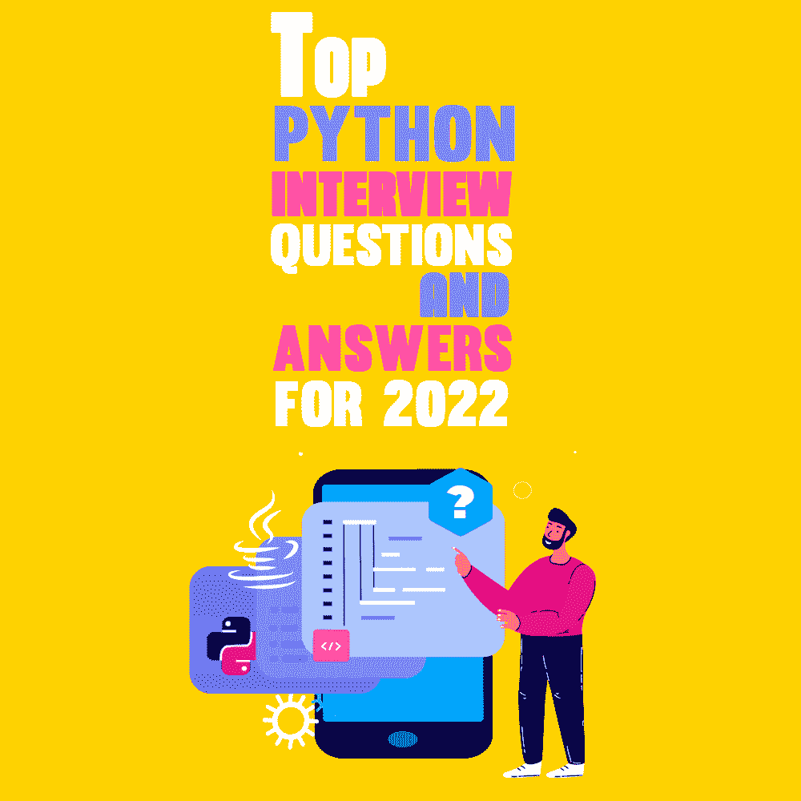
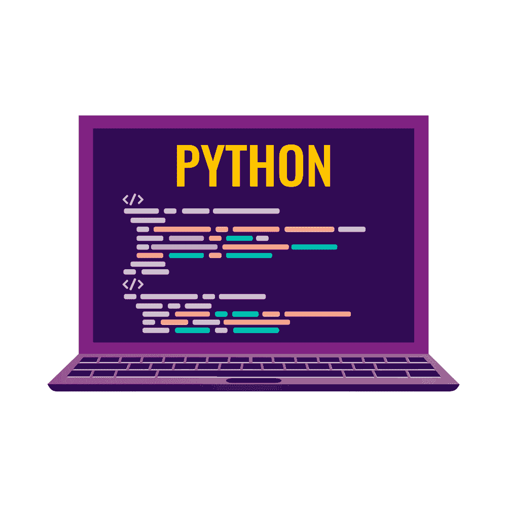

# 2022 年热门 Python 面试问答

> 原文：<https://simpleprogrammer.com/top-python-interview-questions/>

Python, created by Guido van Rossum and released on February 20, 1991, is one of the most frequently used programming languages. Python's popularity is soaring due to its simplicity and ability to accomplish several functions with fewer lines of code.

Python 被用于[机器学习](https://simpleprogrammer.com/machine-learning-blogs-2022/)、[人工智能](https://nearlearn.com/courses/ai-and-machine-learning/machine-learning-with-python-training)、Web 开发和 Web 抓取等领域，因为它能够通过使用强大的库来处理复杂的计算。

因此，全世界对 Python 开发人员的需求都很高。

公司愿意为这些开发者提供难以置信的优势和特权。

在本帖中，我将向你展示最常被问到的 Python [面试问题及其答案](https://simpleprogrammer.com/programming-interview-questions/)，这将有助于你茁壮成长并获得出色的工作机会。

## Python 面试问答

Python 允许面向对象的编程，经常用于通用编程。因为 Python 是解释型的，所以它允许结合动态语义。此外，它是一种免费的开源语言，语法非常简单明了。

这些特点简化了[学习 Python](https://nearlearn.com/python-classroom-training-institute-bangalore) 的过程。而且有了下面的问答，你对 Python 的理解会变得更加简单。

### Python 有什么优势？

Python 是一种通用的高级解释编程语言。

作为一种通用语言，Python 可以通过适当的工具/库创建几乎任何形式的应用程序。

此外，Python 包括对象、模块、线程、异常处理和自动内存管理，所有这些都有助于现实世界问题的建模和解决这些问题的应用程序的开发。

Python 语法简单易懂，易于学习。它重视可读性，降低了程序维护的成本。此外，Python 支持脚本编写，是完全开源的，并通过使用第三方包鼓励模块化和代码重用。

它的高级数据结构，加上动态类型和绑定，吸引了相当大的开发人员社区来快速开发和部署应用程序。

### 动态类型语言的定义是什么？

在我们能够理解动态类型语言之前，有必要理解什么是类型。

类型是一个术语，指的是编程语言中发生的类型检查。

例如，“1”+2 将导致高类型语言(如 Python)中的类型错误，因为这些语言不提供“类型强制”(数据类型的隐式转换)。

另一方面，具有弱类型系统的语言(如 JavaScript)将简单地输出“12”作为结果。

打字可以分两个阶段完成:

*   **静。**在执行之前，对数据类型进行验证。
*   **动态。**在执行过程中，对数据类型进行验证。

Python 是一种解释型语言，这意味着每条语句都是逐行执行的。因此，类型检查会在执行过程中动态进行。因此，Python 是一种动态类型语言——它是同时编写和检查的。

### 什么是被解释的语言？

被解释的语言逐行执行它的语句。Python、Javascript、R、PHP 和 Ruby 都是解释型语言的优秀实例。

用解释语言创建的程序直接从源代码开始执行，中间没有编译步骤。

### PEP 8 到底是什么，为什么有必要？

Python 增强提案(PEP)是一个官方认可的设计文档，用于通知 Python 社区或描述 Python 或其流程的新功能。

PEP 8 特别重要，因为它为 Python 代码建立了风格规则。

对 Python 开源社区做出贡献似乎需要真诚和严格地遵守这些风格规则。

### Python 的作用域是什么？

Each object in Python has a scope. In Python, a scope is a piece of code within which an object remains relevant.

命名空间用于唯一标识程序中包含的所有项目。但是，这些名称空间有一个为它们建立的作用域，在这个作用域中，它们的对象可以在没有前缀的情况下使用。

以下是 Python 代码执行期间创建的范围的几个示例:

*   一个**局部范围**表示在当前函数中可访问的项目。
*   术语**全局范围**指的是自代码产生以来在整个代码执行过程中可用的项目。
*   一个**模块级作用域**指的是当前模块中可访问的全局对象。
*   一个**最外层的作用域**包含了所有可以在程序中调用的内置名称。

最后在作用域的对象中搜索引用的名称。请记住，使用诸如全局、局部范围对象这样的关键字可以与全局范围对象同步。

**阅读更多**–[Python 面试问答书籍](https://www.amazon.in/Python-Interview-Questions-Youll-Likely/dp/1946383821/ref=asc_df_1946383821/?tag=googleshopdes-21&linkCode=df0&hvadid=396988721232&hvpos=&hvnetw=g&hvrand=2032049759284149025&hvpone=&hvptwo=&hvqmt=&hvdev=c&hvdvcmdl=&hvlocint=&hvlocphy=9300600&hvtargid=pla-838866927811&psc=1&ext_vrnc=hi)

### 什么是元组和列表？

列表和元组都是 Python 中的序列数据类型，可用于保存一组事物。两个序列都可以包含不同数据类型的对象。

他们被给予明显的视觉指示，以区分哪个是哪个。方括号表示列表['sara '，6，0.19]，圆括号表示元组(' ansh '，5，0.97)。

两者之间的关键区别是列表是可变的，而元组是不可变的对象。

这意味着尽管列表可以实时更新、追加或切片，但元组保持不变，不能以任何方式改变。

要验证差异，请在 Python IDLE 中执行以下示例:

`my_tuple = ('sara', 6, 5, 0.97) my_list = ['sara', 6, 5, 0.97] print(my_tuple[0]) # output => 'sara' print(my_list[0]) # output => 'sara' my_tuple[0] = 'ansh' # modifying tuple => throws an error my_list[0] = 'ansh' # modifying list => list modified print(my_tuple[0]) # output => 'sara' print(my_list[0]) # output => 'ansh'`

### 什么是 Python 模块和包？

Python 包和 Python 模块是使 Python 程序员能够编写模块化代码的两种技术。模块化的优点是简单性和可重用性。

简单:专注于一个模块能让你专注于手头可管理的任务。这简化了开发并降低了出错的可能性。

模块旨在在不同的问题域之间强加逻辑边界。如果模块是以一种最小化相互依赖的方式构造的，那么对一个模块的修改就不太可能影响程序的其他部分。

**可重用性:**模块定义的功能可以很容易地被应用程序的其他组件重用。

模块通常建立自己的名称空间，这有助于避免与程序标识符的其他部分混淆。模块本质上是扩展名为 a.py 的 Python 文件，其中包含一组已声明和已实现的函数、类或变量。

import 语句可用于一次性导入和初始化它们。如果只需要一部分功能，使用 foo import bar 来导入必要的类或函数。

包使模块名称空间能够使用点标记法进行分层结构化。由于模块有助于避免全局变量名之间的冲突，包有助于避免模块名之间的冲突。

创建包的过程很简单，因为它利用了系统内置的文件结构。因此，只需将模块放在一个文件夹中，瞧，文件夹名就是包名。

从该包中导入模块或其内容时，包名必须用作前缀，后跟一个点。

请注意，从技术上讲，您也可以导入该包。但是，它没有将包中包含的模块导入到本地名称空间，这使得它几乎没有价值。

### 在 Python 中，什么是全局、受保护和私有属性？

全局变量是在全局范围内定义的。global 关键字用于引用函数中全局范围内的变量。

受保护的属性通过在它们的标识前加下划线来定义，例如 _sara。它们仍然可以从定义它们的类外部访问和修改，但是谨慎的开发人员应该避免这样做。

私有属性是那些标识符前面有双下划线的属性，例如 __ansh。不能从外部直接访问或更新它们，任何这样做的努力都会导致 AttributeError。

### Python 中 Self 服务的目的是什么？

Self 用于表示类的实例。在 Python 中，该关键字允许您访问类的属性和方法，并将属性与传入的参数相关联。

Self 用于各种上下文中，经常被误认为是一个术语。但是，与 C++不同，self 不是 Python 关键字。

### Python 的单元测试有哪些？

Python 的单元测试框架被称为单元测试。单元测试是独立评估软件不同组件的过程。

你能想出为什么单元测试是必要的理由吗？

考虑以下场景:您正在开发利用三个组件的软件；现在考虑你的程序在未来某个时候失败的可能性。您将如何确定哪个组件导致了软件失败？也许是组件 A 出了故障，这反过来又导致了组件 B 的故障，从而导致了整个软件的故障。

许多这样的组合是可能的。

这就是为什么彻底测试每个组件是至关重要的，以便我们可以确定哪个组件最有可能是软件失败的原因。

### 什么是 Python Docstring？

A documentation string or docstring is a multiline string that is used to describe a particular section of code. The docstring should contain a description of the function or method.

### 什么是 Python 切片？

顾名思义，“切片”就是移除部分的行为。切片的语法是[start: stop: step]。

“Start”指定开始对列表或元组进行切片的索引，“stop”是终止索引或停止的位置，“step”表示完成跳转所需的步数。

默认情况下，Start 设置为零，stop 设置为项目数，step 设置为 1。字符串、数组、列表和元组都可以切片。

### 描述如何使 Python 脚本在 Unix 系统上可执行。

#!/usr/bin/env python 必须开始脚本文件。

### Python 中数组和列表的区别是什么？

在 Python 中，数组只能包含相同数据类型的组件，即数组的数据类型必须是同类的。它是 C 语言数组的轻量级包装器，使用的内存比列表少得多。

Python 列表可以包含几种数据类型的元素，也就是说，它们的数据类型可以是异构的。列表的缺点是消耗大量内存。

`import array a = array.array('i', [1, 2, 3]) for i in a: print(i, end=' ') #OUTPUT: 1 2 3 a = array.array('i', [1, 2, 'string']) #OUTPUT: TypeError: an integer is required (got type str) a = [1, 2, 'string'] for i in a: print(i, end=' ') #OUTPUT: 1 2 string`

**阅读更多**–[Python 招数](https://www.amazon.in/Python-Tricks-Buffet-Awesome-Features/dp/1775093301)

### Python 中的名称空间是什么？

在 Python 中，命名空间确保对象名称是唯一的，并且可以无冲突地使用。

Python 将这些名称空间实现为字典，每个“名称作为键”对应一个“对象作为值”这使得许多名称空间可以共享相同的名称，并将其映射到不同的对象。以下是命名空间的几个示例:

*   **局部命名空间**用于定义函数内的局部变量。命名空间在函数调用期间形成，然后在函数返回后被删除。
*   **全局名称空间**包含当前项目中使用的所有导入包/模块的名称。这个名称空间是在脚本导入包时形成的，并且一直持续到脚本执行为止。
*   **内置名称空间**包含基本的 Python 函数和多种类型异常的内置名称。

名称空间的生命周期由它被分配到的对象的范围决定。当对象的范围过期时，名称空间的寿命也过期。因此，不可能从外部命名空间访问内部命名空间中的对象。

## 继续学习，继续练习

在本文中，我向您展示了 Python 开发人员最常被问到的一些面试问题。这些问题，加上定期的问题解决会议，将帮助你在任何基于 Python 的面试中取得成功。

这些年来，Python 在开发人员社区中越来越受欢迎，这是因为它的简单性和支持大量计算的能力。因此，对有能力的 Python 开发人员的需求持续增长。

尽管如此，值得注意的是成为 Python 开发人员的[好处是相当不错的。除了 Python 的理论知识，重点还放在编写高质量代码的能力上。](https://simpleprogrammer.com/5-benefits-of-python/)

因此，继续学习和实践问题，你无疑会在任何面试中取得成功。