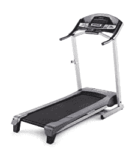
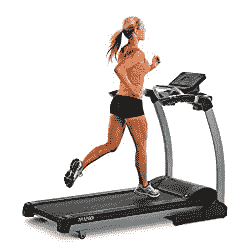
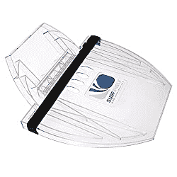
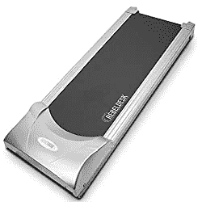
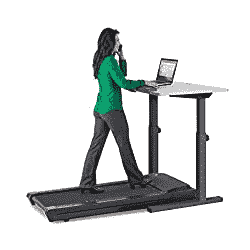
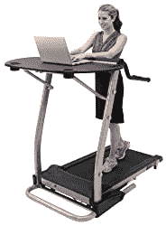
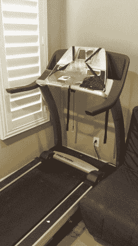
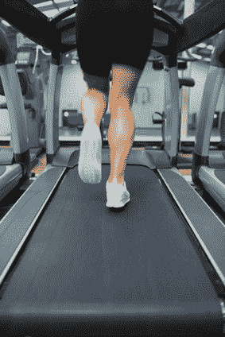

# 工作时跑步机办公桌行走完全指南

> 原文：<https://simpleprogrammer.com/treadmill-desk-walking/>

几乎每天，我都会在工作的时候花至少一部分时间在跑步机办公桌上行走。

我大约四年前开始这样做——虽然我并不总是坚持这样做——我发现这是一种非常简单的方法，可以在一天中燃烧一些额外的卡路里，并从不整天坐着中获得一些健康益处。

基本的想法很简单，但是在计划你自己的跑步机办公桌设置，甚至决定是否值得努力时，有许多事情需要考虑。

在这篇文章中，我将详细介绍如何设置跑步机工作站——包括我正在使用的设置。我还会详细介绍你在工作时走路可能燃烧的卡路里，以及一些帮助你开始并从中获得最大益处的建议。

显然，如果你像我一样在家工作，你会比在办公室更容易得到一个跑步机办公桌，但我发现今天许多公司都愿意接受员工使用跑步机办公桌的想法。一些公司甚至已经有了供员工使用的办公桌。

但是，即使你不在家工作，你的老板不相信你需要在工作时走路，你仍然可以在家里设置你自己的跑步机办公桌，当你在家工作、回复你自己的私人邮件，甚至只是阅读一本书时，你可以在工作时走路。

## 装备

让我们从谈论你在家里或办公室设置跑步机办公桌所需的设备开始。

有两条主要路线，你可以用你的跑步机办公桌。你可以用跑步机和站立式办公桌或其他东西来放置你的笔记本电脑，或者你可以买一个预制的跑步机办公桌。

对于我的特殊设置，我选择创建自己的，部分是因为我便宜——咳咳，节俭——部分是因为在我考虑创建跑步机办公桌的时候，没有人制作它们。

## 滚动你自己的跑步机办公桌

你需要自己滚动跑步机办公桌的第一件事就是跑步机。如果你只是用跑步机来走路，你可能不必像用它来跑步那样挑剔。你可能仍然想要一台足够长的跑步机，这样你就不会有掉下来的危险，但是在大多数情况下，一台便宜的标准跑步机就可以了。

然而，你可能想确保无论你选择什么跑步机都提供了一个合适的坡度范围，因为一旦你习惯了，你会在斜坡上行走时燃烧更多的卡路里——但是，我们将在稍后对此进行更多的讨论。

对于一个非常便宜的选择，你可能要考虑: [Weslo Cadence G 5.9 跑步机](http://www.amazon.com/gp/product/B007O5B0LC/ref=as_li_tl?ie=UTF8&camp=1789&creative=390957&creativeASIN=B007O5B0LC&linkCode=as2&tag=makithecompsi-20&linkId=NUXTXR6FDR3QCIT4)

  

It's a highly rated and cheap treadmill, but it does have one problem. The incline is only two-position. It can either be set at 1.5 percent or 6 percent.

然而，它非常紧凑，这是一个很大的好处，当你试图移动它。

如果你想要更好的东西，你可以在上面真正的跑步，看看这个:[寿命 TR 1200i 折叠跑步机](http://www.amazon.com/gp/product/B0030EW7Q8/ref=as_li_tl?ie=UTF8&camp=1789&creative=390957&creativeASIN=B0030EW7Q8&linkCode=as2&tag=makithecompsi-20&linkId=FQY7H4OGNTZIFXJL)

  

It goes up to 11 miles per hour and has 15 incline levels. Has very solid reviews on Amazon, but it's about twice the weight as the Weslo.

你可能还会幸运地在 Craigslist 上找到一台二手跑步机，但是要知道，搬运一台 200 到 300 磅重的设备并不容易。

一旦你有了跑步机，你基本上有两个选择:

*   在跑步机上安装一些东西来固定你的笔记本电脑
*   买一张可以放在跑步机上的立式桌子

## 将您的笔记本电脑安装在跑步机上

最便宜也是最简单的方法——也是我自己采用的方法——就是在你工作的时候做一个架子来放置你的笔记本电脑。

我一直在用: [SurfShelf 跑步机办公桌:笔记本电脑和 iPad 支架](http://www.amazon.com/gp/product/B001M04RBK/ref=as_li_tl?ie=UTF8&camp=1789&creative=390957&creativeASIN=B001M04RBK&linkCode=as2&tag=makithecompsi-20&linkId=UQQNY65GPJS5YASW)

  

I've had my SurfShelf for about four years and I've found it works just great. The only issue is that I can't really use a mouse, so I have to use the trackpad on my laptop. I don't have it setup now, but I've also mounted an extra monitor on the wall or ceiling to add another display that I could plug my laptop into.

## 使用立式办公桌

好吧，所以你可能想知道如何在普通跑步机上得到一个站立式办公桌。

事实证明，对于大多数普通跑步机来说，你可以只取下控制面板的顶部，或者你可以把桌子做得足够高，让它正好从上面通过。

但是，如果你不喜欢这些选项中的任何一个，你可以购买类似于: [Rebel 跑步机 1000，用于立式跑步机办公桌](http://www.amazon.com/gp/product/B00G124PV6/ref=as_li_tl?ie=UTF8&camp=1789&creative=390957&creativeASIN=B00G124PV6&linkCode=as2&tag=makithecompsi-20&linkId=XTFKJGOXDCMLLMBD)

  The only problem with these types of treadmills is that they typically don't have any kind of incline.

不管怎样，你都需要一张立式办公桌。这里最大的考虑是得到一个底部没有横杠的。你可以想象在它下面有一个跑步机的情况下，这是如何的不太好。我找到了 [Rebel Desk 高度可调的柚木桌面站立式书桌](http://www.amazon.com/gp/product/B00GRB6JKG/ref=as_li_tl?ie=UTF8&camp=1789&creative=390957&creativeASIN=B00GRB6JKG&linkCode=as2&tag=makithecompsi-20&linkId=QGZK2HXOXDFLXWEH)

to be a great desk with many positive reviews.

The Rebel desk is adjustable, so you can get it to work with different height treadmills, but you'll want to take some measurements to make sure that everything is going to work correctly.

你可能还想考虑一下 TrekDesk 跑步机办公桌

.
  This is a bit of a cheaper made desk, b

ut it makes up for it by being adaptable to just about any treadmill. You can see in the picture that the desk is going right over the regular sized treadmill. It also affords you quite a bit of space and has drink holders.

## 使用一体式跑步机办公桌设置

好的一体化解决方案可能有点贵。但是，如果你打算每天都使用它，并且喜欢开箱即用的东西，这是一个不错的选择。有不少选项可以选择，但是这个[寿命 TR1200-DT5 跑步机办公桌](http://www.amazon.com/gp/product/B006M2PJV0/ref=as_li_tl?ie=UTF8&camp=1789&creative=390957&creativeASIN=B006M2PJV0&linkCode=as2&tag=makithecompsi-20&linkId=MHG34FIDAGQPND5C)

is a good choice and has excellent reviews.
  

同样，这里唯一的问题是没有倾斜。

更便宜的选择，看看[exerputic 2000 work fit 高容量台式跑步机](http://www.amazon.com/gp/product/B00761HK3Q/ref=as_li_tl?ie=UTF8&camp=1789&creative=390957&creativeASIN=B00761HK3Q&linkCode=as2&tag=makithecompsi-20&linkId=IP6DGI3R47XWDHF7)

.
  

The construction is not quite as sturdy, but it does offer incline and is about half the price. It also looks like it folds up to be pretty compact. The length is a bit short as well, but it's definitely one I'd consider.

## 我的跑步机办公桌

对于我的设置，我只是使用一个非常标准的，有点旧的跑步机，和 [SurfShelf 跑步机办公桌:笔记本电脑和 iPad 支架](http://www.amazon.com/gp/product/B001M04RBK/ref=as_li_tl?ie=UTF8&camp=1789&creative=390957&creativeASIN=B001M04RBK&linkCode=as2&tag=makithecompsi-20&linkId=UQQNY65GPJS5YASW)

. It works pretty well for me, but I'm only on there for about an hour a day right now. If I were walking longer, I would probably want to be able to use a real mouse instead of my trackpad.

## 其他设备

工作时在跑步机办公桌上行走，你可能需要考虑一些其他的设备问题。

我特别发现我的笔记本电脑有时会从冲浪架上滑落。我的解决方案——至少对我的 Mac Book 来说——是利用一个有小脚的盒子。我用的是[iPearl mCover 13 英寸型号 A1425 / A1502 MacBook Pro(配 13.3 英寸 Retina 显示屏)的硬壳套——磨砂透明](http://www.amazon.com/gp/product/B00A1A4KHS/ref=as_li_tl?ie=UTF8&camp=1789&creative=390957&creativeASIN=B00A1A4KHS&linkCode=as2&tag=makithecompsi-20&linkId=V4MUUIWSKXEQ27V6)

, but a rubberized case would probably work just as well.

**你可能也想买一双好的步行或跑步鞋**。我只是在跑步机上行走时穿跑鞋，没有任何问题。但是，在过去，当我穿着礼服鞋走路时，这不是一个非常舒适的体验。不推荐。

服装也是如此。你可能想换身衣服，这样你会感觉很舒服。运动短裤可能是最好的，但大多数休闲裤应该没问题。只是不要尝试穿着紧身牛仔裤走几个小时——你可能会经历一些……开玩笑。

最后，如果你使用某种计步器，值得考虑一下你把它戴在哪里。我用了一段时间 [Fitbit Flex](http://www.amazon.com/gp/product/B00BGO0Q9O/ref=as_li_tl?ie=UTF8&camp=1789&creative=390957&creativeASIN=B00BGO0Q9O&linkCode=as2&tag=makithecompsi-20&linkId=QU5D7ZLEFGFZLZU3) ，因为我把它戴在手腕上，没有真正移动手腕，它没有记录我的步数。如果你想精确记录你的步数，Fitbit Zip 可能是一个更好的选择。

## 跑步机办公桌上燃烧的卡路里

好吧，那么边工作边走路到底有多有效呢？

我发现使用跑步机办公桌是一种非常好的帮助减肥的方法，而且不需要太多额外的努力。对我来说，这是使用跑步机办公桌的主要好处。

但是，你到底能减掉多少体重呢？

为了找出答案，你需要知道你在跑步机办公桌上行走时会燃烧多少卡路里。

对于这篇文章中的所有计算，我使用了 Android 应用程序[跑步机卡路里计算器](https://play.google.com/store/apps/details?id=com.feetstech.treadmill&hl=en)。我在网上寻找其他计算器，我找不到比这个应用程序更准确的东西。

现在，根据我读过的一篇文章，基于梅奥诊所的一项研究，你在工作时在跑步机上行走，每小时可以燃烧 100 到 130 卡路里。不错，但也不太好。如果你一天走 5 到 6 个小时，那真的可以累积起来。

我不知道你怎么样。我个人想知道我到底燃烧了多少卡路里，倾斜度如何影响这个数字，所以让我们来比较一下实际的数字。

## 以每小时 2 英里的速度行走

首先，让我们看看最常见的场景:以 2 英里/小时的速度行走，不倾斜。这可能看起来很慢，但是你不可能走得比这更快，也不可能真正完成工作。事实上，当你第一次开始的时候，这甚至可能有点太快了——但是，一会儿再谈这个问题。现在，让我们看看你在一个小时内实际燃烧了多少卡路里。

我目前体重约 217 磅。

因此，根据我的计算，如果我以每小时 2 英里的速度 0 度倾斜行走 60 分钟，我将燃烧大约 260 卡路里。

如果你体重 150 磅，你会燃烧大约 180 卡路里。

假设你不多吃，比如说，每天多燃烧 200 卡路里，每周会减少将近半磅体重。对于在跑步机上行走来说还不错。

但是，我们可以做得更好…

## 利用斜坡

现在，当你第一次出发时，你可能不能做太多的倾斜。但是，我发现，虽然我真的不能以超过 2 英里/小时的速度工作，但我可以增加倾斜度，并且工作得一样好(一旦我适应了)。)

但是，我一直想知道在斜坡上行走实际上燃烧了多少额外的卡路里。

事实证明，很多。

当我在跑步机上行走时，我以 10%的倾斜度行走。那是一个相当高的斜坡，但是我一点一点地向上爬。

根据我的计算，我体重 217 磅，如果我在跑步机上以 10%的倾斜度行走 1 小时，我会燃烧高达 544 卡路里的热量！

这足够一周减掉整整一磅的热量。

如果你的体重约为 150 磅，你会燃烧约 376 卡路里，这仍然相当不错。

## 结论:跑步机行走对减肥非常有效

所以，基于这些数字，我很确信这是值得努力的。如果你每天工作的时候花一个小时在跑步机上散步，你会发现不需要太多努力就能获得很大的好处。如果你每天花几个小时散步，你会得到更大的好处。

不过，在你兴奋之前，让我提醒你两件事。

**首先，如果你在跑步机上行走燃烧更多的卡路里，你会更饿**，所以除非你小心饮食，否则你很容易吃回你燃烧的东西。

第二，你可能渴望每天步行 8 小时，但我发现这不现实。有一段时间，我一天要走 3 个小时，但这通常很不舒服，需要一些时间来适应。我发现设定更小的目标，比如一天一两个小时，比让自己因过于雄心勃勃而筋疲力尽要好得多。

除了减肥，还有其他健康益处需要考虑。[人们发现长时间坐着对人类非常有害](http://apps.washingtonpost.com/g/page/national/the-health-hazards-of-sitting/750/)，所以一天中的一部分时间站起来走走，甚至是站着，可能会对健康有一些长期的好处。

## 入门指南

好了，现在你知道如何设置你的跑步机办公桌，而且它确实对减肥有效，让我们来谈谈如何开始吧。

我建议你做的第一件事是做出某种承诺。制作一个便于保存的小盒子。也许承诺每天只散步 30 分钟，每天如此。

为了成功，你需要养成一种习惯——尤其是如果你正在减肥的话。工作时在跑步机上走一两次不会有太大的好处，从长远来看，一天走 8 小时马拉松也不会对你有太大帮助。最有效的方法是养成每天散步的习惯。随着时间的推移，所有这些 30 分钟或 1 小时的步行将会累积起来，所以从小事开始，确保你坚持下去。

从每小时 1 英里开始。我知道慢。但是，你需要习惯边工作边走路。任何人都可以走一个小时，假装在跑步机上工作，但如果你打算这样做，你还不如以每小时 3 或 4 英里的速度走路，只是听听音乐或一本有声书。如果你真的想从你所花的时间中获得额外的好处，你需要真正学习如何边走边工作，慢慢开始会帮助你做到这一点。

最终达到 2 英里/小时，但不要超过这个速度。我知道你可能认为你可以超过 2 英里每小时，但好处将是微不足道的，它将变得非常难以工作。

随着时间的推移增加倾斜度比增加速度更有效。

为什么？

因为，在保持对电脑控制的情况下，你的行走速度是有限的，但是，一旦你习惯了，倾斜度的增加似乎不会影响到你。我甚至没有注意到在斜坡上行走和不在斜坡上行走之间的区别。

这就把我带到了下一步，**随着时间的推移，慢慢地增加你的倾斜度**。你可以从上面的数据中看到，增加倾斜度对你燃烧的卡路里总量有很大的影响。所以，如果你想最有效，开始增加倾斜度，但是要慢慢来。

## 一些最后的提示

以下是我的一些最终建议，可以帮助你成为一名更好的跑步机办公桌工作人员:

*   跑步机办公桌行走对于回复邮件这样的任务来说是非常棒的。你会发现有些任务比其他任务更适合边走边工作。我发现在走路的时候很难思考真正复杂的问题，所以我尽量在走路的时候少做一些计算性的工作，比如回复邮件或者打电话。
*   看书或听有声书是另一个不错的组合。你可能不喜欢边走边用电脑工作，但你也不能错过利用跑步机进行多任务处理的好处。我经常在散步的时候读一本书或者听一本有声书。如果你不能在家工作，或者你的办公室里没有跑步机办公桌，你可以利用这段时间通过消费书籍和其他教育媒体来扩展你的视野，增加你的技术知识。
*   对于跑步机办公桌来说，电话交谈或会议非常有用。是的，你可能呼吸有点大声，但如果你走得足够慢，别人知道你在走路的唯一方式是听到背景中的跑步机声。我在跑步机上参加了很多 SCRUM 会议。事实上，问我的速度和倾向是什么是一个常见的笑话。
*   不要走得太快。这个我已经讲过了，但是说真的，不要这么做。2 英里/小时和 2.5 英里/小时之间消耗的卡路里没有太大差别，但是 2.5 英里/小时是一个更难达到的速度。增加倾斜度而不是增加速度。
*   发展协调能力需要时间，不要气馁。这不像是你拿着笔记本电脑跳上跑步机就能感觉舒服。你需要一段时间才能适应。在你放弃之前，至少给自己几个星期的时间。花时间发展这项技能是值得的。
*   **分手的时候。**走整整一个小时或更长时间会很困难，但走 20 分钟甚至 10 分钟通常没那么糟糕。你没有理由不把一天中的时间分开，让事情变得更容易。

好了，你知道了。不可能回答每一个关于跑步机办公桌的问题。但是，如果你有我没有提到的，请在下面问他们。

如果你喜欢这篇文章，[加入 6000 多名其他软件开发人员和 IT 专业人士的行列，他们是简单程序员社区的一部分](http://eepurl.com/BlQH5)。此外，如果你对立式办公桌感兴趣，你可能想看看我的朋友，乔希·厄尔的网站，[办公桌黑客](http://deskhacks.com/)。