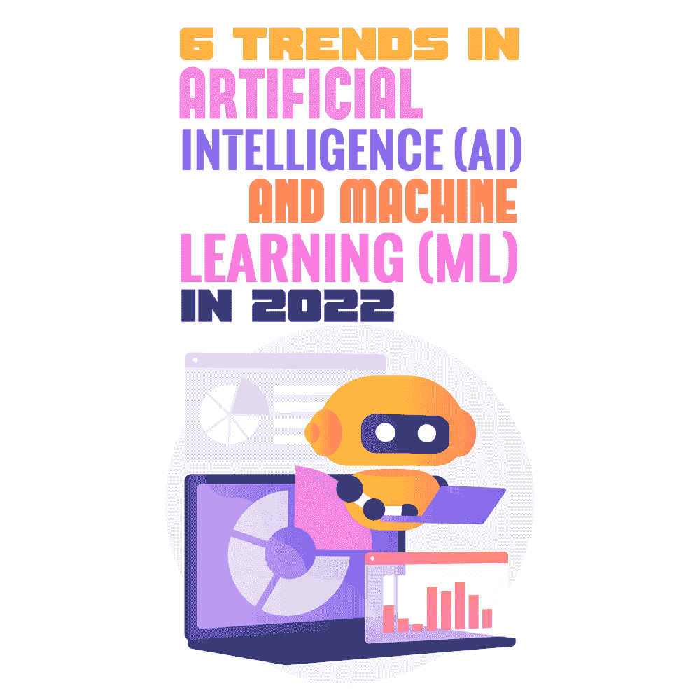

# 2022 年人工智能(AI)和机器学习(ML)的 6 大趋势

> 原文：<https://simpleprogrammer.com/trends-ai-and-ml-2022/>

Artificial intelligence (AI) and machine learning (ML) are two of the most used terms that are not confined in a specific domain but have universal adoption. Owing to their exclusive properties to create new-edge tools/systems/softwares, AI and ML have taken over the technology and innovation domains.

有无数令人惊讶的方式在后台利用机器学习和人工智能来影响我们的日常生活，例如推荐电影、产品或服务的推荐引擎、[语音助手](https://www.thirdrocktechkno.com/blog/alexa-the-future-of-voice-technology/)、智能设备上的语音识别等等。

毫无疑问，来自不同行业的企业，如 SaaS、IT、流媒体、电子商务、游戏、电子学习和其他企业，已经出于各种目的采用了人工智能和人工智能——改善观众体验、营销、促进观众互动、增强用户界面等等。

统计数据显示，人工智能驱动的语音辅助将在 2023 年达到 80 亿次，而人工智能可以将 T2 的商业生产率提高 40%。而且不是这样；有无数的因素和应用使 AI 和 ML 在世界范围内备受追捧。

在这篇博客中，我将分析 2022 年人工智能和人工智能的顶级预测，以便你知道在不久的将来会发生什么。

## 什么是人工智能(AI)？

人工智能是计算机科学的一个分支，它帮助创建智能设备、解决方案和机器来执行需要人类智能的任务。

例如，每当你浏览网飞频道时，你会发现基于你以前看过的电影、喜欢的连续剧或你搜索最多的类型的推荐。这可能感觉像是一个人在名单后面，但实际上，它是网飞的推荐引擎，配备了人工智能，为您提供实时建议。

简而言之，人工智能模仿人类的智能，但通过机器、工具和软件来展示。一般来说，AI 主要有四种:

*   **有限记忆人工智能:**自动驾驶汽车，带有可以识别交通信号、陡峭道路或行人过马路的传感器
*   **心智理论 AI:** 能够理解另一个类似机器人或系统的心智的机器人或系统
*   **有自我意识的人工智能:**具有自我模拟能力的机器人
*   **反应式 AI:** IBM 的深蓝，网飞的推荐引擎

## 什么是机器学习(ML)？

机器学习是计算机科学和人工智能的一个分支，它模仿人类的学习，并通过利用相关数据和通过算法来提高能力。ML 是人工智能的一个子集，它基于这样一个概念，即智能系统可以识别数据模式，可以从数据中获取知识，并且可以在不需要任何重要的人类交互的情况下做出决策。

与人工智能一样，我们可以将 ML 分为四种主要类型:

*   **监督:**回归问题的线性回归
*   **半监督:**文本文档分类器
*   **无监督:**层次聚类
*   **强化:**自动驾驶汽车

现在你有了关于 AI 和 ML 的基础知识，我们来讨论一下 2022 年 AI 和 ML 的预测。

## 对 2022 年人工智能和人工智能的预测:你需要知道的一切

人工智能和人工智能正在快速发展，并取决于许多因素，如它们的可用性、需求、新的创新、新的尖端技术的发明等。然而，在所有这些的基础上，我列出了 2022 年 AI 和 ML 的顶级预测。

### 更广泛地采用人工智能和人工智能

人工智能和人工智能不再只是少数专业人士使用的额外工具，而是在更广泛的业务、行业和领域中多样化。这种趋势很可能会继续下去，人工智能和人工智能的更广泛应用即将出现。

人工智能和人工智能的应用将无处不在，这将成为 2022 年最热门的话题之一。

### 高级 DevOps

DevOps 可以定义为一套实践，如文化哲学和工具，以便将软件开发和 IT 运营结合起来。DevOps 的主要目标之一是缩短开发周期以交付高质量的软件和更高的效率。

随着 ML 的引入，DevOps 的功能、运作结构和产出将发生巨大变化。因此，MLOps(机器学习 DevOps)将占据中心位置，同时提供先进的 ML 解决方案，并在三个主要领域(人员、流程和技术)保持平衡。

这种配备了 ML 的高级 DevOps 将确保以更加安全、可扩展、自动化和健壮的方式交付结果。反过来，DevOps 的七个关键领域将会有更新的版本:配置管理、持续集成、自动化测试、基础设施即代码、持续交付、持续部署和持续监控。

从数据摄取到模型监控，ML 将在升级实验周期的同时改善一切，包括算法选择、特征工程、参数调整、训练和验证。

### 更好的平台支持

由于人工智能和人工智能将接管大多数部门和各种领域的关键功能，对更先进的平台和更好的支持的需求将会很高。

例如，基于人工智能的工具，如智能助理、社交媒体监控系统、自动化金融投资工具等。需要最新、灵活的平台来无缝运行。由于这些工具非常受欢迎，2022 年对此类平台的需求也将上升。

此外，AI/ML/数据科学平台将获得更多的欢迎，这样的平台也需要与主/其他平台轻松集成。毫无疑问，这将简化数据分析、处理和构建 ML 模型的任务，从而在各自的平台和领域中提供所需的解决方案。

因此，在 2022 年，根据人工智能和人工智能的操作/使用来选择平台将变得至关重要。例如，一些顶级的人工智能平台是谷歌人工智能平台，TensorFlow，KAI，微软 Azure，Watson Studio 和 Rainbird。一些最好的 ML 平台包括亚马逊 SageMaker、微软 Azure 机器学习工作室、SAS 和 TIBCO 软件。

不仅对此类平台的需求会增长，而且对更好的平台支持的需求也将在 2022 年进一步激增。

### 提高安全性

AI 和 ML 主要处理需要访问、分析和处理的各种数据。随之而来的是数据泄露、网络攻击和其他与数据访问相关的安全问题的风险。

随着网络安全问题的增加，在该领域工作的专业人员的重点将是安全的数据访问。网络安全规则、协议和合规性将得到更广泛的采用，以确保数字数据和敏感信息的保护。AI 和 ML 都是如此。

例如，人工智能和人工智能广泛用于欺诈和异常检测。配备 AI 和 ML 的欺诈检测引擎可以轻松检测复杂的诈骗模式，其分析仪表板可以提供详细的见解，以提前预防网络威胁。在 2022 年，当涉及到实施人工智能和人工智能时，数据安全将围绕数据访问领域。

### 对合成数据日益增长的需求

Synthetic data is quite a common term in the world of artificial intelligence and machine learning. It refers to data that has the properties to replace real-time data.

这些数据是由计算机[算法](https://www.amazon.com/dp/0262033844/makithecompsi-20)或模拟产生的。与实时数据相反，合成数据是在数字世界中生成的，是由[计算机程序](https://www.amazon.com/dp/0321751043/makithecompsi-20)或系统、算法或软件执行的过程的结果。这些数据在人工智能和人工智能的分支和应用中将变得更加抢手，以便执行多项任务:

*   训练 ML 模型
*   验证数学模型
*   创建数据仓库
*   优化培训期间的成本和隐私

2022 年，合成数据使用的增加将显著改变人工智能和人工智能中的数据建模、培训和所有相关活动。

### 改进的内部人工智能用例

人工智能不仅将在多个应用中按需提供，而且还将改善商业、it 领域和工业部门内部使用的用例(人工智能在不同领域或部门的使用，如发明智能工具和系统)。

将在 2022 年引人注目并在未来几年进一步流行的一些顶级内部人工智能用例如下:

*   金融交易
*   市场分析和个性化
*   欺诈检测
*   数字营销
*   电子邮件营销
*   财务和会计
*   人力资源
*   机器人流程自动化(RPA)可提高生产率和效率
*   售前、销售和分析自动化

简而言之，在 2022 年，内部运营、用例以及生产力将主要取决于 ML 和 AI 为行业领导者和利益相关者铺平新的道路。

## 人工智能和人工智能的趋势将会继续

人工智能和机器学习将成为 2022 年以后的趋势。随着人工智能和人工智能的功能和优势使它们达到需求增长的顶峰，它们都将产生持久的影响，其重要性将进一步上升。

正如我在这篇文章中向你展示的，AI 和 ML 拥有无限的潜力，这已经使它们的使用广泛。随着时间的推移，几个因素将有助于使它们更受欢迎:对智能新发明的需求，人工智能和人工智能领域前沿技术的引入，人工智能算法的发展，等等。

人工智能和人工智能将在全球所有领域的日常活动和应用中占据更重要的部分，这一天已经不远了。