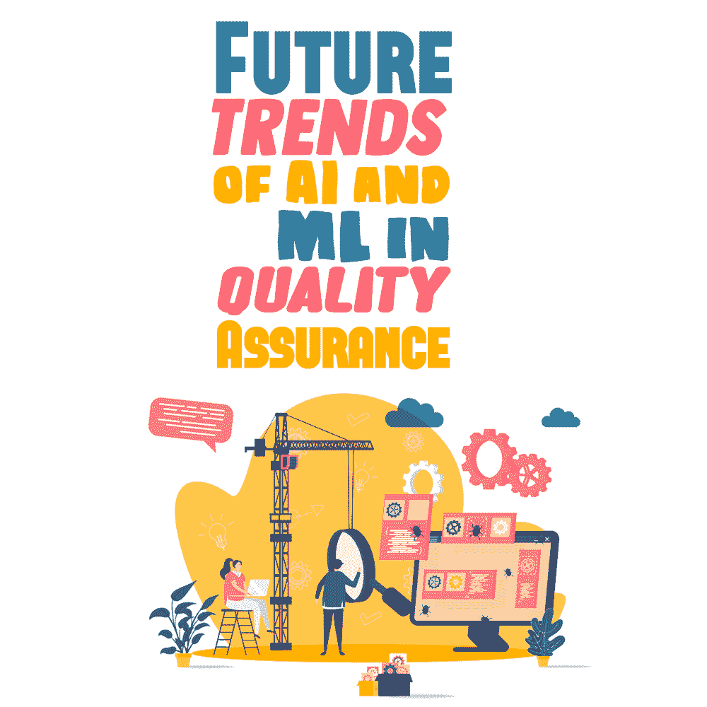
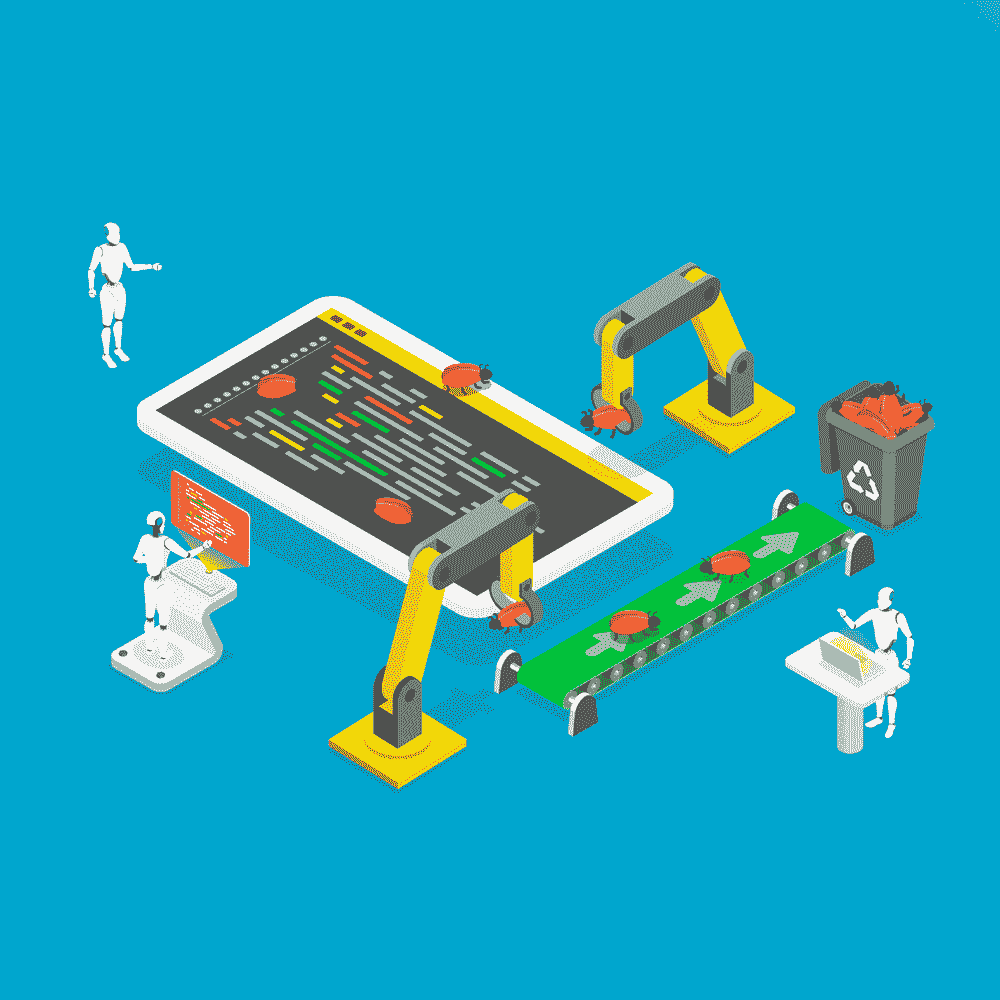

# 人工智能和 ML 在质量保证中的未来趋势

> 原文：<https://simpleprogrammer.com/trends-of-ai-and-ml/>

Quality Assurance (QA) plays an important role in the software development process because it not only helps discover defects early in the development cycle but also saves a lot of time, money, and frustration. Using analytics, artificial intelligence (AI) and machine learning (ML) can be a part of your business strategy as the first step to grow revenue in companies and deliver a better customer experience.

虽然很难完全取代人的因素，但通过结合人工智能和人工智能，有可能改善组织中的 QA 测试，正如我们将在这篇文章中看到的更多细节。

据 Gartner 称，到 2023 年，人工智能将推动基础设施决策。推进人工智能试点进入生产需要专门的基础设施资源，人们可以扩展和发展。为了确保高性能率，企业 IT 团队应该定期优化 AI 模型。他们可能需要将 ML 模型或标准化数据管道与实时数据源相结合，以获得实时决策。

在这篇文章中，我们将仔细研究 AI 和 ML，特别是它们如何帮助 QA 测试过程，从总体上极大地提高您的生产力和操作。

## 人工智能和机器学习的区别

[人工智能](https://www.amazon.com/dp/0134610997/makithecompsi-20)被描述为机器对人类智能的模拟。对于人类来说，这是一个简化的解决问题的过程，并允许软件在没有明确编程的情况下管理任务。人工智能旨在涉及推理、学习和感知。这项技术在不同的行业中得到广泛应用，包括医疗保健和金融。

[机器学习](https://www.amazon.com/dp/1999579577/makithecompsi-20)则是 AI 的一个应用，帮助机器访问信息，并在执行各种任务时为其提供支持。 [ML 技术](https://simpleprogrammer.com/building-machine-learning-tech/)帮助我们理解学习算法，让系统获得秘密洞察。

从智能扬声器和智能咖啡机，到智能手机和智能汽车，这些设备可以简化我们的日常生活，让我们的工作变得更容易。人工智能和机器学习等先进技术已经成为金融、汽车和医疗等高风险行业的通用技术。

DevOps 团队应该实施强大的 QA 测试策略，以确保您通过集成 AI/Ml 技术开发的应用程序对公众来说是安全的，并保护他们的个人数据免受网络犯罪分子的侵害。

## 了解软件测试的最终目标

一旦完成了开发，就可以进入系统开发生命周期(SDLC)的测试阶段。QA 团队需要确认最终用户可以按照他们的期望使用应用程序。有必要评估[端到端测试](https://www.bugraptors.com/blog/end-to-end-testing-why-is-it-important)的以下部分:

*   研究的范围
*   有针对性的错误/缺陷
*   顾客行为
*   计划的测试用例的实现

确保部署成功取决于 E2E(端到端)测试计划。准备短而快的测试周期是至关重要的，尤其是当你有特定的时间限制和不断变化的需求时。基于您有效的测试用例或测试周期，您可以确保高质量的应用程序并满足最终用户的特定需求。

## 用 AI 和 ML 改进测试过程的最佳方法

考虑到所有这些，接下来的问题是:人工智能和人工智能如何帮助我们改进 QA 测试？未来当然会有惊人的机会，但是下面列出的五个领域是你现在可以开始考虑的。

### 考虑如何执行回归测试

由于需要更快速的部署，考虑如何执行回归测试是极其重要的，特别是当您作为一个人不能产生准确的结果时。当改变应用程序的用户界面时，ML 和 AI 有助于检查和确定形状、大小和颜色。

在手动测试时，大多数 QA 测试人员错过了一些必要的步骤，比如对更改的验证，而这些您可以用 AI 更好地完成。因此，每当处理更繁琐的任务时，公司都应该使用 AI 进行回归测试。另一方面，机器学习可以用来生成成功的测试用例。

### 选择一种节省时间的方法

人工智能可以让你节省软件测试的时间，这是手工测试所不能做到的。AI 可以帮助您解决复杂的任务，例如早期检测 bug、增加整体测试覆盖率和提高准确性。它允许团队专注于创造创新的新特性。

在软件测试过程中引入人工智能的好处是，QA 人员和开发人员都能够在规划、优化、编写和维护端到端测试上花费更少的时间。此外，使用人工智能可以让您腾出资源来开发新产品，并帮助您加快交货时间。

### 选择正确的测试

你必须知道你需要多少测试才能通过 QA。通过 QA 之后，您应该验证在应用程序中引入新的变更之后没有发现问题。

对于这个过程，您可以使用 ML，因为它有助于确定每次代码更改所需的测试数量，使您能够分析过去的测试和更改的结果。使用 ML 进行测试有助于您识别受影响场景的唯一子集和失败率。ML 是目标测试的理想选择。

### 一致性在测试中是可以实现的

AI has enormous potential to help humans in every aspect of the way they live and work. However, most individuals understand this fact as a cautionary note. A [recent survey](https://www.datarobot.com/blog/how-to-achieve-consistent-quality-in-ai/) reported that 77% of Americans stated that AI will have a “very positive” or “mostly positive” impact in the next 10 years on how people live and work.

另一项民意调查报告称，约 82%的美国人认为应该小心管理人工智能。有了这些关于人工智能的不同观点，组织应该提高构建的质量。此外，人工智能技术可能是新的常态，但历史表明，自动化和标准化是实现软件质量一致的关键因素。

例如，使用 [DataRobot](https://www.datarobot.com/) 很容易为您的数据挑战找到正确的机器学习模型，DataRobot 是领先的端到端人工智能企业平台，有助于自动化和改善您从数据到价值的每个阶段。它不是基于黑盒测试，但它可能会使用最新一代的人工智能，就模型如何工作以及它如何适合做出最佳商业决策提供更多用户友好的解释和见解。它允许公司进一步降低风险，并确保与客户需求、业务规则和法规保持一致，因此有助于防止意外错误。

### 了解故障根源

如你所知，在测试中失败的可能性是存在的。因此，开发人员和 QA 测试人员都应该了解他们的职责，并在测试任何应用程序时识别根本问题。这包括检查数千行代码。

然而，AI 提供了日志文件，并允许您在几秒钟内检测错误和扫描代码。因此，当集成到 QA 过程中时，AI 可以帮助您修复代码中的特定问题，以满足质量要求。

## 利用自动化的力量

机器学习和人工智能是互联网上经常看到的两个热门词汇。虽然很难完全取代人类，但公司使用许多融合了人工智能和人工智能的工具。例如，Functionize、Testim.io、Appvance IQ、Test.ai、Applitools 和 AI Testbot 是一些基于人工智能和人工智能的顶级工具，可以用于移动应用测试。

在软件测试过程中包含人工智能和人工智能有助于公司改善组织内部的质量保证测试。AI 和 ML 可以改变测试的地图，所以你应该知道[测试自动化](https://simpleprogrammer.com/software-testing-trends-2021/)的力量，它允许你以最好的方式执行 UI 测试、回归测试和 API 测试，即使在最复杂的情况下，它也是实现有效质量保证的便捷方法。