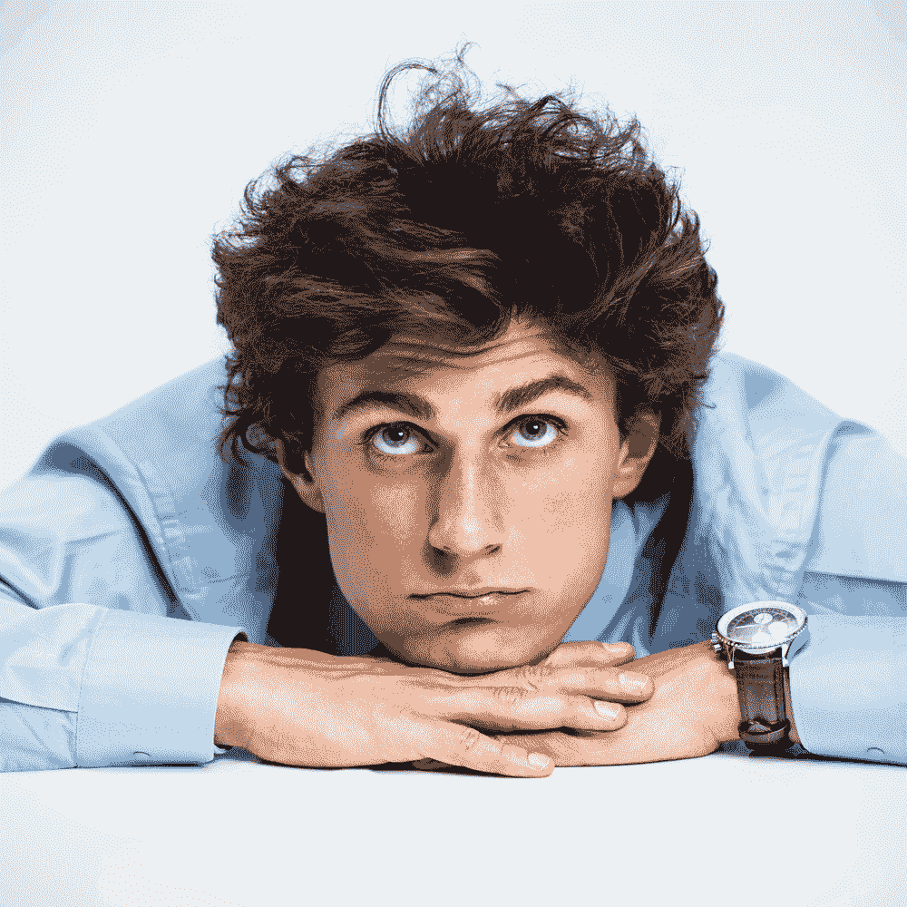
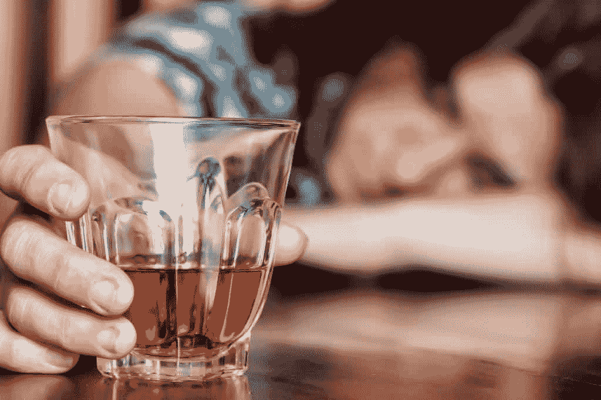
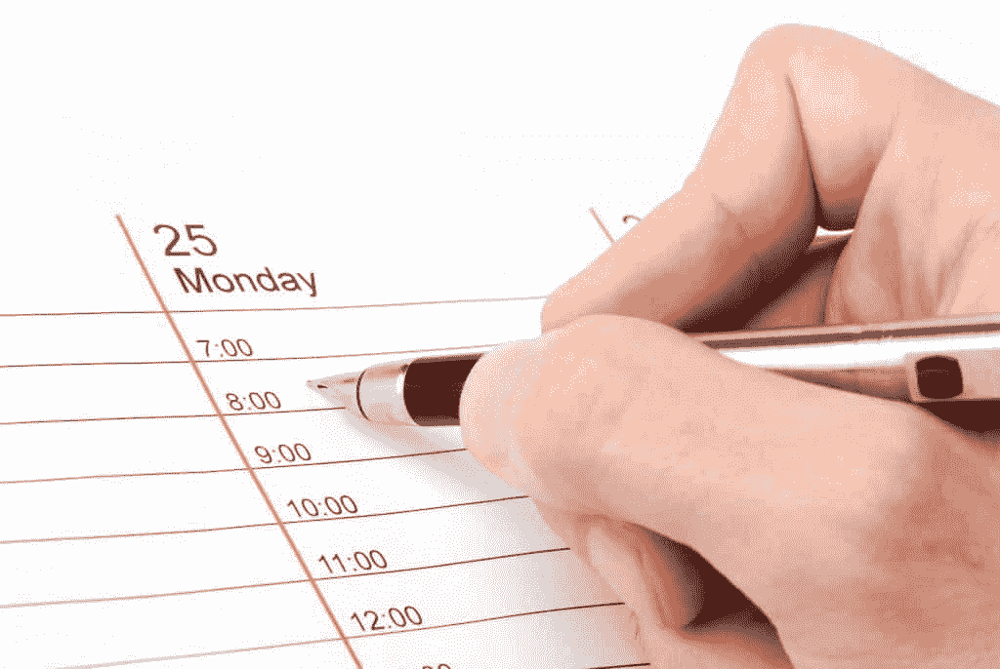
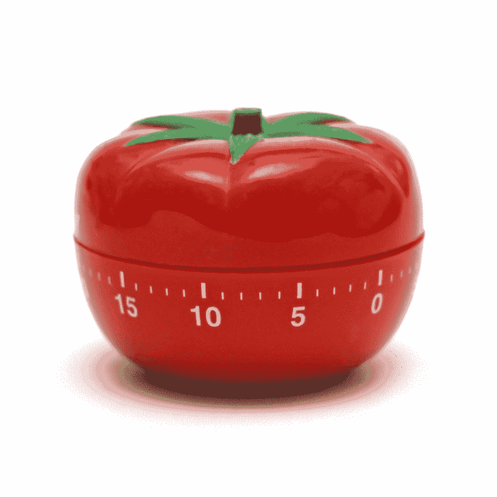
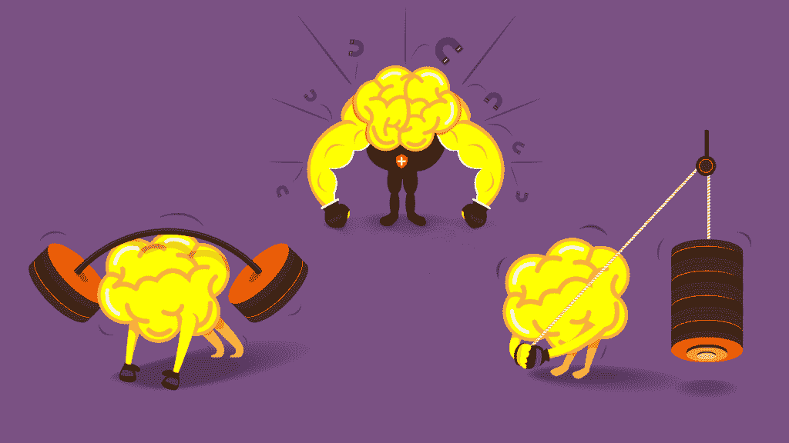
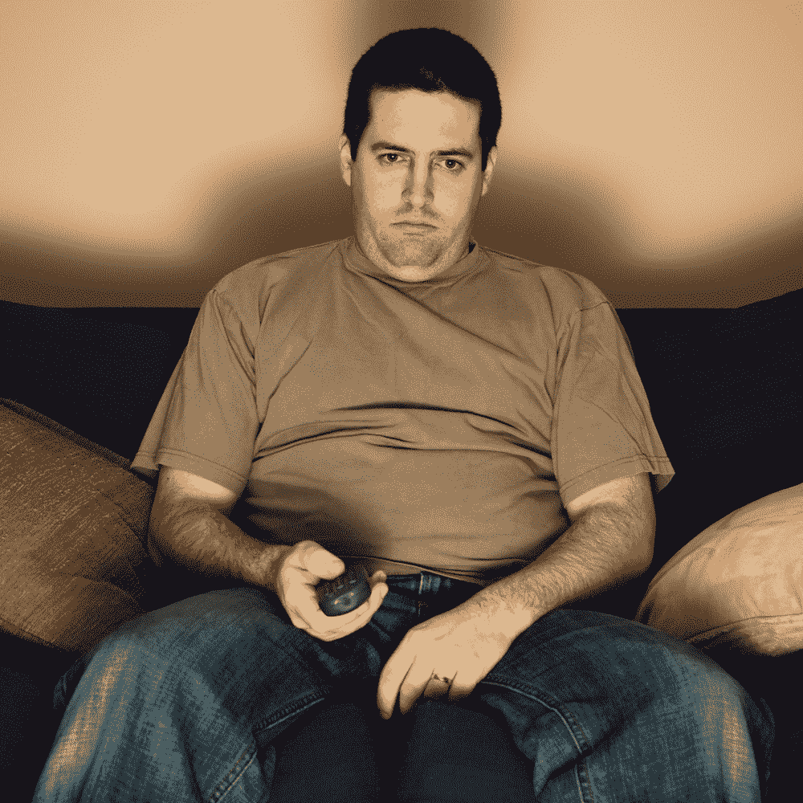
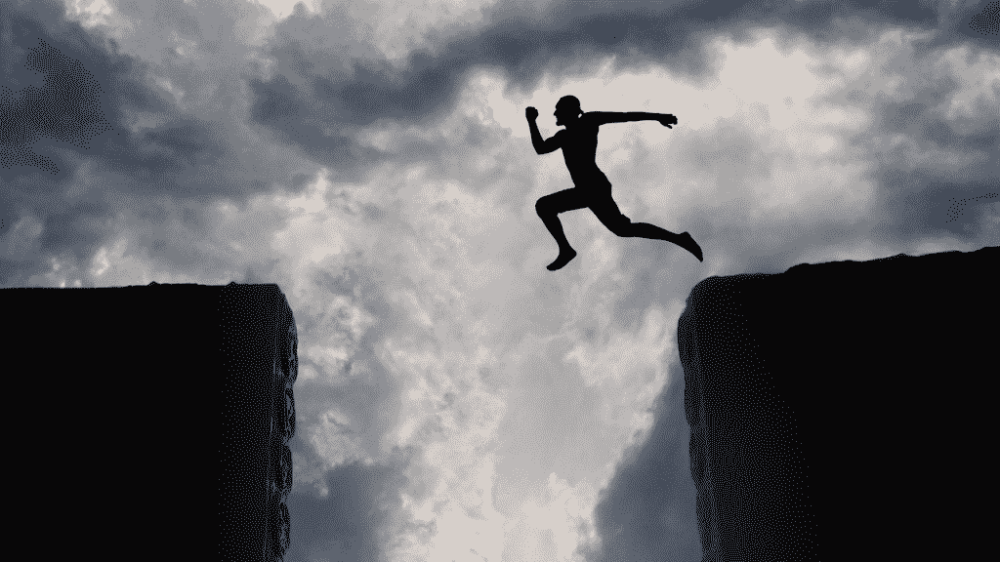

# 我如何把我的多动症变成一种超能力

> 原文：<https://simpleprogrammer.com/turn-adhd-super-power/>

你可以向下滚动阅读整篇文章，都在那里。

或者，如果您希望赶上进度，您可以点击此处查看最新部分:

阅读 **[第一部分](#Part 1)**—*2016 年 5 月 30 日更新*

阅读 **[第二部](#Part 2)**—*2016 年 6 月 13 日更新*

阅读 **[第三部](#Part 3)**—*2016 年 6 月 27 日更新*

* * *

**T2】**

<small>第一部分</small>

## 严格来说，我有多动症。

我甚至不知道那是什么意思，真的。

小时候，我记得被幼儿园开除的事。这太愚蠢了——完全是某种误会。

很明显，或者我应该说“据说”，我正在扯一些女孩的头发，我爬上书架，从一个书架跳到另一个书架，假装我是一只猴子。

即使在回家的路上，我也不会停下来或者说一句人话。

我依稀记得，在学校里有过一些问题。

幼儿园很棒，因为我的老师——我仍然记得他的名字，Roudebush 先生——一直给我更具挑战性的作业，直到我做两位数的加减法。

但是，学校的其他部分…并不太好。

他们很快就发现我需要服用利他林。

### 药物和镇静剂。

我真的不能责怪他们。我有点，嗯，疯了。我可以缠着一个人几个小时。我可以大喊大叫，跑来跑去造成各种混乱，我不会听任何人试图告诉我冷静下来。

但是利他林没有持续很久。我很快拒绝了。

甚至在很小的时候，**我就知道我不想成为被某种药物** 控制的[。](https://www.cognitune.com/best-natural-adderall-alternatives/)

我想做我自己。即使这意味着我是一个人，假装是一只狗，假装是一个人，我需要对任何试图和我说话的成年人吠叫，而且我需要连续两天不打破这个角色。

## 我仍然不相信多动症真的存在

但如果是的话，我知道了。绝对的。

我的意思是，这是国家心理健康研究所的“官方定义”:

***注意力缺陷/多动障碍(ADHD)是一种大脑障碍，其特征是持续的注意力不集中和/或多动-冲动模式，干扰功能或发育。**T3】*

***注意力不集中**指的是一个人在任务上走神，缺乏毅力，难以保持专注，而且没有条理；而这些问题并不是因为违抗或者理解不足。*

***多动症**是指一个人似乎不停地走动，包括在不合适的情况下。不适当的时候，过度坐立不安、轻拍或说话。对于成年人来说，可能是极度的不安或者是因为他们的活动而使他人疲惫不堪。*

***冲动是指一个人在没有事先考虑的情况下做出仓促的行动，这种行动很有可能造成伤害；或者渴望立即得到回报，或者不能延迟满足。一个冲动的人可能会在社交上侵扰他人，过度打断他人或做出重要决定，而不考虑长期后果。***

**让我们看看。**

### **我注意力不集中吗？**

**是的，我现在只是在专注地写这篇博客，因为我有一个番茄计时器在计时，迫使我坐下来写东西，什么也不做。**

**在我的脑海里，一个声音在大声尖叫，“检查你的电子邮件。FACEBOOK 上发生了什么。天啊，你的 BICEP 真大。我想知道你现在是否应该起来在地板上打滚。”**

**尽管我违背了我的本性，但我天生就想轻易放弃，不想专注。我当然喜欢离开我的任务。**

**好的，下一个…**

### **多动症。**

**嗯，我兴奋吗？**

**我坐下时肯定会坐立不安。众所周知，我的活动会让人筋疲力尽。**

**我并不经常争吵，但如果我这样做了，我保证你会比我早一天结束。我可以心平气和地就一个话题辩论几个小时。**

**不过，这些症状在我小时候比成年后更常见。**

### **最后，冲动。**

****

**这是一个困难的问题。**

**我当然会冲动。同样，这很难衡量，因为我似乎已经控制住了那些冲动……冲动……但是，我确实容易犯冲动行为的错误。**

**在我暴饮暴食的时候，我会把它发挥到极致。如果你曾经看过我玩吃角子老虎机，听到我说“再来一个”，你也知道当我最终离开时，我在与我的本性作斗争——太多的时间和“这是最后 20 美元”的陈述。**

**我觉得总的描述有点“好听”**

**我小时候的儿童清单非常适合我。毫无疑问，我可以核对这些项目中的每一项。**

*   **容易分心，经常忘记事情**
*   **从一个活动切换到下一个活动太快**
*   **在方向上有困难**
*   **白日梦太多了**
*   **难以完成家庭作业或杂务等任务**
*   **经常丢失玩具、书籍和学习用品**
*   **坐立不安和蠕动了很多**
*   **不停地说话，打断别人**
*   **经常到处跑**
*   **触摸和玩耍他们看到的一切**
*   **很是不耐烦**
*   **脱口而出不恰当的评论**
*   **很难控制自己的情绪。**

**但是，事情是这样的。当我看着那个孩子名单的时候，我的一部分忍不住说“搞什么？”**

**我是认真的。这份清单上有一半的事情不是“问题”，它们只是不一定“坏”的性格特征。**

**我得到的印象是，许多所谓的症状并不属于需要药物治疗的人。更确切地说，它们属于那些按照自己的规则行事，不会被其他人控制的人——他们觉得没有必要遵守社会的压迫性规则，按照他们的规范行事。**

**我是说真的，谁来定义太容易分心是什么意思？也许你很无聊，所以我才不想理你！我的时间太宝贵了，不能为了礼貌而礼貌。**

**谁来定义从一个活动快速切换到下一个活动意味着什么？我已经从活动 A 中得到了乐趣，学到了我想要的一切，现在我想体验活动 b。如果其他人反应迟钝，容易被逗乐，那是他们的问题，与我无关。那如果和你的日程不吻合呢？**

****

**方向有问题。 **F* & %你指点，我按我的方式去做！****

**白日梦太多？再说一次，你让我厌烦。我脑子里有很多事情。很多想法。我需要一些时间让他们疯狂。这叫做创造力和想象力。也许你所有的方向和坚持无聊的活动已经杀死了你，但不是我。我仍然有抱负和希望。**

**[完成任务有困难。](https://simpleprogrammer.com/2014/12/29/want-accomplish-goals-become-finisher/)好吧，我给你那个。但是，我真的讨厌家庭作业。尤其是你不告诉我为什么这么做。如果我觉得工作很忙，我就没有动力去完成它。但是，我确实有
倾向，一旦任务变得无聊，我也不会完成自己的任务——所以你让我明白了。**

**丢东西。好吧，是的，我输了。但你也会失去一切。我认为这是胡扯。你只是想作弄我。**

**坐立不安和蠕动了很多。这叫能量。还不错。我们真的要挑剔坐立不安和蠕动吗？我们真的要称之为问题吗？或许，你应该让我站起来四处走动。那有什么害处呢？**

**不停地说话，打断别人。那叫刺激和激情。我并不想打断你，但是我实在是太激动了，我不得不说出我的想法，但是我又不能很快地把话说出来——我甚至打断了自己。**

**经常跑来跑去。当你需要一个中指时，中指的表情符号在哪里？说真的。当你又老又胖，而我还在“跑来跑去”，我会是那个笑着给你吃降压药的人。**

**触摸和玩弄我看到的一切？哦，妈的，我们最好叫“不要碰”警察。让我们不要与我们的环境互动。也许我触摸和玩我所看到的一切的原因和我从一个活动跳到下一个活动并变得“容易分心”或不遵循指示的原因是一样的。**

**我很好奇。我想用自己的方式探索周围的世界。我想尽快收集尽可能多的数据，然后继续前进。我想把这一切都吸收进去，而不是呆在剪纸站里剪纸，直到你告诉我我完成了。我要胶水，我要画画，我要把那些装满水的小杯子扔向墙壁。**

**至于不耐烦，我会百分百诚实。是因为你又慢又无聊。我的大脑在以闪电般的速度运转。当你说出句子的前三个字时，我已经知道你要说什么了。我们继续吧。**

**现在我们开始脱口而出不恰当的评论。到底什么是合适的评论？我的评论不恰当是因为你不喜欢它，还是因为这是事实？也许这与你试图控制孩子的社会规范不符，这削弱了你的权威。**

**最后，如果有人告诉你，你表达的每一个想法和你的本性都是错误和糟糕的，需要接受药物治疗，以符合社会正确和良好的期望，我认为你也很难控制自己的情绪。**

**所以，你让我明白了…我想。混蛋。**

**哎呦。该死，这太不合适了。我的错。**

## **这真的是我们在对我们的孩子做的吗？**

**我不认为孩子天生就有多动症——如果存在的话。**

**那些被贴上多动症标签的人往往是那些我们未能打破其意愿的人。但是如果是自然的，我们应该能够让他们顺从(或者至少“表现得更好”)，而不需要使用药物。**

**我们想知道为什么我们的社会充满了一群没有大脑的僵尸，他们看电视，在 FaceBook 上发表政治言论，直到周末或者他们每天下班打卡喝几杯酒来消磨时间。**

**也许，仅仅是也许，是因为他们身上那个有创造力、无拘无束、充满活力、诚实而真实的孩子被人踢了一脚脸，被人用棍子打了一顿，直到她胆怯地爬到角落里睡了大半天，**像一只被虐待的狗**。**

**但是，是的，我不知道我在说什么。**

**我不知道，我只是觉得人类不应该生活在笼子里。但是，就像我说的，我可能是错的。也许年轻的灵魂需要被碾碎，社会才能正常运转。**

**毕竟，那些被严重虐待的狗通常最终会有体面的气质。他们基本上是按要求做的，不会造成任何伤害。**

****

## **但是等等。这难道不是关于你如何利用你的多动症作为优势吗？**

**好吧。所以我有点咆哮了。**

**我只想向你解释为什么——当人们问我为什么我认为多动症不存在——我说“我有，但它不存在。”**

**如果你还没有从我写的东西中得到信息，这里就是，简单明了:**

**对于儿童和后来的成年人来说，多动症是一个狗屁诊断，他们不符合社会规范，拒绝坐下来，闭嘴，做他们应该做的事情。**

**社会不喜欢这种行为，也无法处理它，所以我们没有奖励这种无所畏惧的行为，而是对它进行诊断和治疗。**

**你不必同意我。但如果你没有，你就错了。**

**显然，持这种观点的不止我一个人。)**

**现在你明白了，我承认我有 ADHD 的特征，尽管我拒绝承认它是一种残疾或障碍，我要告诉你我是如何在社会中发挥作用的，作为一个不在社会中发挥作用更舒服的人，以及我实际上是如何完成任务的。**

## **没有护目镜的独眼巨人**

**我知道我有点自大和自恋，但我喜欢自然地认为自己是没有护目镜的独眼巨人。**

**我天生的多动症倾向于无拘无束，到处发射高能光束，摧毁我看到的任何东西。**

**就像我之前说的，我认为这在孩子中比大多数人想象的更普遍。人类天生如此，但是社会倾向于把他们的眼睛戳出来，而不是找到一种方法来集中所有的自然能量和力量。**

**我的策略有点不同。像独眼巨人一样，我制作了一个遮阳帽，让我获得能量的所有好处，但把它集中在我希望它去的方向。**

**在这篇文章的第二部分，我将告诉你关于那个护目镜，我是如何制作它的，以及它如何帮助我把大多数人认为的缺点变成一个巨大的优点，帮助我变得超级高效和多产。**

* * *

 **<small>第二部分</small>**

## **制作面罩:规则和限制**

****

**拥有大量额外的权力是很棒的——只要你能正确地引导它。**

**想象一条巨大的河流。在某些时候，那条河的力量有可能造成大洪水，随之而来的是毁灭。**

**但是如果你在那条河的战略要点上建一座大坝，并在大坝上安装一些涡轮机，你就可以利用这些能量发电。**

**关键是大坝。**

**它将力量和能量引向一个特定的方向。**

**它限制和控制原始力的使用方式，并将其从一种形式转换成另一种形式。**

**我就是干这个的。我可以教你怎么做。**

**我创造了一系列规则和约束来管理我的生活。T3】**

**这些规则和约束是自我强加的，这是世界如何处理多动症和我如何处理的关键区别。**

**一个是赋权，另一个是去权。**

**现在，当我写这篇文章的时候，我有一个番茄闹钟在快乐地滴答作响。**

**我有一张写在黑板上的小卡片，它告诉我今天我需要花两个番茄来完全专注于写作。(如果你不知道什么是番茄，不用担心。我将在这一部分的后面详细讨论它。)**

**目标是每天写 1000 字左右。这应该在大约 50 分钟内完成。**

**没有那个结构，**没有那些自我强加的约束，**我真的很难坐下来写作。**

**我甚至很难开始写作，每写完一句话，我就想看看我的电子邮件，看看脸书发生了什么，然后去散步。**

**有了这些约束，我可以像疯子一样写作，我可以朝着我的目标不断前进。**

## **避免判断电话**

**你可能不知道，但我的判断力真的很差。**

**记住多动症的一个主要问题是冲动控制。嗯，这基本上和说一个人判断力差是一回事。**

**"嘿，约翰，想不想喝点酒，然后吊在大楼边上？"**

**“嗯，好的，我们开始吧。这听起来是个好主意。”**

**我当场做出了一些非常糟糕的决定——而且我很擅长为它们辩护。**

**例如，我可能会想，嗯，如果我明天跑 60 英里，吃那个两磅重的里斯牌杯子一点也不会影响我的饮食。好的，我们开始吧。**

**但是当我不在“当下”的时候，我是如此痴迷和过度分析，以至于我实际上可以做出一些非常好的决定。**

**因此，**我的一个主要策略是** [**通过预先计划尽可能多的情况并为自己设定规则来完全避免判断电话**](https://www.youtube.com/watch?v=PCZ7E0RX1dk) ，这样我就知道在任何给定的时间该做什么。**

**我把决策因素从决策中剔除。**

## **计划我的膳食**

**我做出判断的最糟糕的地方之一是决定吃什么和吃多少。**

**也许有这个问题的不止我一个人？**

**或许，即使你没有多动症，你也经历过类似的问题？**

**ADHD 只是人类自然行为的一种极端和无节制的形式的另一个原因:**开始剥夺人们的东西，并将他们置于绝望的境地，他们也会缺乏冲动控制**。**

**总之，重点是如果你去餐馆，或者冰箱，或者你只是说，“该死，我饿了。我该吃什么？”大多数时候你会做出错误的选择——我也是。**

**我没有那样做，而是计划好每天吃什么，什么时候吃。现在对我来说，一天只吃一顿饭其实挺容易的，但是不管你吃多少顿饭都管用。**

**通过建立这种约束，并确切地知道我应该吃什么和什么时候吃，我可以避免做出冲动的判断，并决定点塔可钟菜单上的所有东西，因为这是周二晚上，我饿了。**

**我在日常锻炼中也做同样的事情。**

**我确切地知道我要跑哪一天，以及我要跑多远。我确切地知道我要锻炼的时间，我要做多少次，我要做什么托举，等等。**

**当我把同样的原则应用到我的工作中时——就像我现在做的一样——我一天能做更多的事情。**

## **确切地知道你应该做什么**

****

**我有一个由来已久的规则，那就是每当我坐在办公桌前时——在我的手指触摸键盘之前——我需要确切地知道我要做什么，以及认为它完成的标准是什么。**

**这只是将避免评判的原则应用到我的工作中的一种方式，以确保我不会偷懒和分心。**

**这并不意味着你不能有任何乐趣。**

**这只意味着你应该总是做你打算做的事情。**

**我完全有理由说，“我要坐下来看三个小时网上的傻猫视频。”我只需要在坐下来做之前就已经打算好了。**

**[**当你以一种非你本意的方式利用时间时，你只是在“浪费时间”**](https://simpleprogrammer.com/2014/11/10/dont-enough-time/) **。****

**如果你按照你计划的方式使用时间，你就不会浪费时间，不管这个活动看起来有多“浪费”。**

**就像判断电话一样，决定是提前做出的。**

**这既减少了冲动控制问题，也减少了注意力分散问题。**

## **番茄工作法**

**我发现的最能有效利用我所谓的 ADHD 的东西之一是番茄工作法。**

**这是如此简单的技术，但它是一个非常有效的工具，以集中的方式引导能量，而不是到处都是，就像没有护目镜的独眼巨人一样。**

**基本想法是这样的:**

*   **选择一项任务。**
*   **设置一个 25 分钟的计时器。**
*   **只专注于那个任务，不要打断，不要转换任务，百分之百的专注。**
*   **当计时器响起时，休息五分钟。**
*   **再次启动。**

**很简单，我知道，但是非常有效。**

****

**就像我说的，我现在用这个技巧来写这篇博文。**

**它如此有效的原因是它从多动症的症状列表中剔除了大量的“问题”。**

**以下是它要解决的主要问题:**

*   **容易分心，经常忘记事情。**
*   **从一个活动切换到下一个活动太快。**
*   **在方向上有困难。**
*   **白日梦太多。**
*   **在完成作业或家务等任务时有困难。**
*   **坐立不安和蠕动了很多。**
*   **非常不耐烦。**

**通过非常清楚地了解到底需要做什么，就更容易不分心并遵循指示——尤其是当他们是自己设定的时候。**

**它还可以防止白日梦和活动之间的切换。**

**知道有一个计时器在计时，而且注意力只需要保持一定的时间，这使得个人任务更容易完成，并解决了不耐烦的问题。**

**我可能会厌倦写作，但我知道如果我继续下去，计时器最终会降到零。
过分专注**

**我发现被诊断患有 ADHD 的人通常对他们感兴趣的事情或他们沉浸其中的事情有一种强迫性的专注。**

**这也是番茄工作法如此有效的另一个原因。**

**它迫使你专注，一旦你进入专注模式，就很难打破它。 [挑战在于进入专注模式，当有非常明确的目标和界定游戏规则的界限时，这更容易实现。](https://simpleprogrammer.com/2015/09/17/help-i-dont-know-what-to-focus-on/)**

**一旦我能让自己进入那种高度集中的状态，我发现它更难打破。我可以利用这种沉迷于《魔兽世界》的倾向，不停地玩它来完成真正的工作。这只是击中最初焦点的问题。**

**这种趋势的另一个可以被善加利用的方面是它的游戏性。我当然发现，我可能会痴迷于魔兽世界或在线扑克，因为有一套明确的规则，也有竞争的一面。**我的想法自然是希望优化结果，并尝试将系统推向极限。****

**通过围绕我的常规工作创建一个基于规则的结构——例如，必须在一天内做 X 番茄——我用明确定义的规则制作了一个游戏，我可以沉迷于最大化那个结果。**

## **多产**

**同样，我使用同样的策略来帮助我尽可能多产。如果你注意到了，我倾向于做任何极端的事情。**

**[我不只是做 YouTube 视频；我每天发布大约两个视频。](https://www.youtube.com/jsonmez)**

**[当我写我的书](https://simpleprogrammer.com/softskills)的时候，我是**一天写一章**，我还把这本书做了接近 500 页的长度。**

**当我做 [Pluralsight 课程](https://simpleprogrammer.com/pluralsight)时，我每两周做一次，一年内发布 30 多个课程。**

**达到这种职业道德水平的关键是让它成为一个有规则的游戏，让自己沉迷于打破这些规则，并从游戏中获得最大回报。**

**我正在把纯粹的过度活跃引导到非常有益的事情上。我允许我的极端本性有益于我，而不是阻碍我。**

## **引导冲动**

****

**冲动可能不好——尤其是在你喝了几杯酒的情况下。**

**但是冲动也有好处，因为它让你能够**承担更大的风险**并且做一些其他人通常不会考虑的事情。**

**关键是练习和引导冲动向善而不是向恶。**

**我脑子里有各种疯狂、冲动的想法，但我不会全部付诸行动。通过我的自我约束系统，我为自己的冲动建立了一种安全网。**

**我能够控制我最具破坏性的冲动，通过提前制定规则来防止我犯下巨大的错误。**

**比如我平时根本不喝酒。**

> **如果我完全不喝酒，我就不会过度饮酒，我也不会达到这样一种程度，即我的自制力被人为地降低到让我的冲动完全接管的程度。**

**这并不意味着我没有任何乐趣或我永远不会喝酒。这只意味着我提前考虑了各种情况，并设置了安全措施，以确保当我冲动时，它永远不会具有超级破坏性。**

**我本质上是提前创造了我自己的界限。**

**提前安排我的一天和计划我的一周也有类似的目的。**

**一旦我有了这个安全网，我就可以让我的冲动肆意横行。**

**我积极练习通过随意与人交谈或做让我感到不舒服的事情来降低我的抑制力。我的冲动通过给我足够的动力去做大多数人不会考虑去做的事情来推动这些努力。**

**有一次，当我在一个扭曲的巡回演唱会的展台工作时，我看到了来自 Blink-182 的马克·霍普斯，并开始和他交谈。他问我是否知道附近有电影院，我控制住冲动，邀请他和乐队的其他成员挤进我的 Geo Metro，溜进电影院看《美国派》。**

**他一定也有多动症，因为令人惊讶的是，他说是的。我有图片为证。**

## **不遵守规则**

**太多的人为了安全起见，只是遵循生活中的规则。我不知道。**

**我的“不足”部分是因为我认为规则是为别人制定的**——****它们对我不适用。****

**有些人认为这是一种损害，但同样，如果我建立自己的规则，并培养坚持这些规则的自制力，我就可以无视别人的规则和界限，按照我认为正确的方式生活，不管别人怎么说。**

**这给了我生活中的巨大优势，因为我不受社会规范的约束。我可以打破禁忌，在大多数人受到约束的体系之外运作。**

**作为一名企业家，这一点尤其有用，因为作为一名企业家就是要弯曲和打破社会规则。**

**这是关于认识到除了你为自己创造的规则之外没有其他规则。**

**通常，我能够找到别人看不到的问题的解决方案，只是因为我愿意打破规则或违反社会规范来实现最终结果。**

**是的，如果仅仅为了破坏规则而不加掩饰地破坏规则，这种趋势可能是破坏性的——这就是无政府状态。**

**然而，通过首先了解如何遵守规则，并有遵循自己规则的自律，**当你事先仔细权衡了后果后，你就可以有选择地打破社会规则**。**

## **包装它**

**我还有一篇文章要发表，我将在两周后发表。**

**到目前为止，我已经谈论了 ADHD 的定义，为什么我认为它并不真正存在——或者至少为什么它不是一个缺点或障碍——以及我如何建立一个规则和约束系统来利用这种原始力量。**

**接下来，我将告诉你发展这个系统和处理被归类为患有多动症的人的实际问题产生了什么。**

**全靠自律。**

* * *

 **<small>第三部分</small>**

## **如果你愿意，请允许我吹嘘一下**

****

**当我看着普通人并将自己与他们比较时——我并不想自恋，但我从来不擅长谦逊——**我注意到我在一些领域表现出色**，而我的多动症本性决定了我不应该在这些领域表现出色。(该死，这听起来确实很自恋。)**

**第一， **[我极其自律](https://www.youtube.com/watch?v=0Bxgk_CnQxU)** 。我现在坐在飞机上，不是在看电影，也不是在玩游戏。我正在写我承诺每天要写的 1000 字。**

**我每天都去健身房跑步，我几乎从来没有错过一天，除非有我无法控制的情况阻止我锻炼——即使这样，我也通常会补上一天。**

**我能够比我认识的任何人都更好地管理自己的情绪。我也不只是把它们吞下去。我处理和管理他们——而不仅仅是控制他们。我很少被激怒，但是当我选择的时候我会表现出来。我很少不高兴。我几乎总能保持头脑冷静。**

**我能比大多数人更好地控制自己的冲动。我对很多事情都没有反应；相反，我会花点时间考虑我的行为，然后做出回应。我几乎所有的行动都是经过深思熟虑和计算的。**

**尽管我倾向于为生活制定自己的规则，但我能像其他人一样遵守规则。你给我一套要遵循的指示，如果我同意遵循，你可以期待 100%的遵从。(如果我不同意，那就是另一回事了。)**

**就注意力持续时间和毅力而言，我可以艰难地度过最艰难的时刻。我可以磨出这么长时间，你会认为我在做一些单调的工作。**

**延迟满足怎么样？我也把那件事搞定了。我 [**每天禁食到下午五点**](https://www.youtube.com/watch?v=UAScRmlcHaE) 。这意味着我不吃任何食物，直到晚餐；是的，我只吃一顿饭，仅此而已。**

**你给我 100，000 美元，我会投资 95，000 美元。好吧，我在撒谎。我可能会投资全部 10 万美元。**

**再说一次，我说这些并不是为了吹牛——尽管我不得不承认，我对自己印象非常深刻……daaamn son——**我强调这些具体的性格品质，因为它们与患有 ADHD 的人应该拥有的**完全相反。**

**我不仅有这些性格品质，而且我擅长这些。换句话说，我最大的缺点变成了我最大的优点…但是怎么做到的呢？**

## **这就是事情变得有趣的地方**

**我和 20 年前大不一样了。**

**事实上，我刚才在最后 400 个单词中吹嘘的所有“优点”都是真正的缺点——就像你对患有多动症的人的期望一样。**

****

**在我童年的大部分时间和青少年的大部分时间里，我真的与所有经典的多动症问题作斗争。**

**我无法集中注意力。我当时极度冲动。我缺乏自律，无法集中注意力。我没有推迟快乐的能力。我的情感是我的主人。哦，我也非常懒——不确定这是否与多动症有关。**

**我在学校表现不好。我**的表现一直低于我的潜力**。我总是惹麻烦，而且我几乎没有做任何有成效的事情。我只是花了很多时间玩电子游戏，为女孩憔悴，为自己难过。**

**生活中有很多我想要的东西我都得不到，因为——正如我当时所想的——**我有点不对劲**,事情就是这样。**

**我想成为一名软件开发人员。我想早点退休，在生活中拥有自由。我想成为一名运动员。我想变得好看。我想和我现在迷恋的任何一个女孩结婚。**

**在某个时刻，我意识到如果我想要得到我想要的任何东西，我就必须做些什么。**

**与其像许多人一样依赖我的优势，我将不得不开始开发我的弱点并克服它们。**

**我之前谈过这个，但是有一天早上我顿悟了，我醒来问自己，“**为什么不是我？****

## **为什么不是我？**

**我意识到，我可以成为任何我想成为的人，只要假装直到我成功，在这种情况下，这意味着表现得好像我已经成为我想成为的人，然后成为它。**

**关于那个故事，我没有告诉你的是到达那里所涉及的工作。**

**什么都没有马上出现。**

**几乎每件事都是一场斗争。**

**把自己想象成你想成为的人是一回事；令人信服地扮演这个角色是另一回事。**

**所有正派的演员都知道，你不能只是假装。你必须相信并成为其中的一部分。**

****

**如果我想停止懒惰，我必须培养这样做所需的自律。我不得不强迫自己做我不想做的事情，因为我有一个更大的使命，一个更高的目标。**

**所以，事情发生了。一点一点，一点一点，我想象，我行动，我改变。**

**那些被认为是多动症的弱点开始消失，因为我学会了如何控制自己，以便从生活中得到我想要的东西。**

**缺乏自律变成了钢铁般的意志。**

**冲动被深思熟虑和**深思熟虑的行动**所取代。**

**为了管理我的情绪，我发展了一种斯多葛派的生活哲学。我学会了如何不执着于结果，并尽可能消除期望。**

**这不是突然发生的。事实上，我正朝着我的理想不断前进。我**还是一直搞砸**。我仍然有很多关于我的角色的方面是混乱的。**

**我并不完美，我也不渴望完美，但正是这些弱点，这些最初的“劣势”，让我比没有它们时更伟大。**

## **我为什么要告诉你这些？**

**此时，你可能会想，**“我靠，真是个自恋的混蛋。你真的在 20 分钟内继续吹嘘你自己和你克服的困难吗？”****

**我做到了。但正如我之前所说的，尽管我可能喜欢吹牛，但这并不是我告诉你这些的原因。**

**此外，我可以想出比告诉你更好的吹牛故事，我是一个沮丧的失败者，一无所有。**

**不管你是否患有或者相信你患有多动症——或者即使你没有——我的信息很简单:**如果你让你的弱点成为你最大的优点**。**

**你看，我们大多数人只是接受生活本来的样子——这就是我们的样子。我们让别人告诉我们有多动症或其他残疾，并通过药物治疗让我们恢复正常。**

**现在，对于一些人来说，这可能是一个很好的方法，但是——不管喜欢与否——它总是会成为一个拐杖。**

**我之所以相信这个世界被过度用药，与那些可以通过改变大脑中的化学平衡来“修复”的问题没有多大关系。相反，我相信那些所谓的缺陷不仅仅是为了被克服，而是用来作为一块磨石来塑造我们比正常人更好的性格。**

## **多动症，不管它是否真的存在，都是发生在我身上最伟大的事情**

**是的，我有过挣扎。是的，我小学的 GPA 因为这个很糟糕。是的，我把我父母逼疯了，以至于他们可能想杀了我。**

**但是，如果没有那些带给我的逆境和障碍(T2 ),我永远也不会培养出坚持和克服困难的性格。**

**你看，我们大多数人认为自己的优势是理所当然的，所以我们从来没有真正欣赏或发展它们。**

**小时候，我天生擅长科学和绘画，但沟通能力很差。今天，我根本不做什么科学研究，当然我也不是艺术家，但我基本上是以写作和演讲为生。**

**我不是说有些人没有发展他们的优势，在他们天生擅长的方面变得很棒——但是让我们面对现实吧，大多数人都没有。**

**大多数人都认为自己的优势是理所当然的，而这些优势只能让他们发挥到目前为止。**

**大多数人都太相信那些优势可以定义他们，以至于他们只是假设有些事情他们擅长，有些事情他们不擅长，然后就这样了。**

**他们过着平庸的生活，缅怀过去，因为他们没有意识到时间是最大的均衡器。**

**如果天生的力量让你产生错误的自信，不去做你认为天生就有的事情，它就会成为你的致命弱点。**

**当有天赋的聪明孩子上了大学，却悲惨地被退学时，你会经常看到这种情况。**

**龟兔赛跑的古老故事完美地诠释了我的意思。**

## **不要认为多动症是一种障碍**

****

**所以，我要对你说的是——尤其是如果你确实患有多动症——不要把它当成一种障碍或损害。甚至不要关注它能给你带来的好处，就像我在这篇文章前面提到的那样。相反， **[专注于做艰苦而深入的工作](http://www.amazon.com/exec/obidos/ASIN/1501111108/makithecompsi-20)，这是将你的弱点转化为真正的优势所必需的。****

**同样，这不仅仅适用于多动症。它适用于任何有弱点的人——我很确定包括我们所有人。**

**不要像许多人那样忽视弱点，而是清除它们并克服它们。**

**优点是伟大的，因为它们可以推动你前进，但缺点是阻碍你前进的东西。**

**如果你不努力克服弱点，你就像一根绷得太紧的橡皮筋，当你的优势推动你前进，而你的弱点继续拖你后腿时，你最终会折断或退缩。**

**随着时间的推移，弱点往往有可能变成比你天生的优势更强的优势，因为你必须有条不紊地去克服它们。**

**弱点被培养并发展成优势。相比之下，天生的优势很少得到这种程度的照顾。**

**我们天生会做的事，我们都是出于本能。我们不理解它，所以我们通常不能增强它。**

**我们必须自己努力和发展的东西，我们非常理解和欣赏。**

**所以，这就是为什么我说【去他妈的多动症】。**

### **去他妈的让弱点来定义你。**

**去他妈的让任何人来诊断和定义你，说那只是你的方式。这取决于你。一直都是。**

**拥有导致我被诊断为多动症的最初性格特征是我一生中最美好的事情——对你也是如此。**

**感谢您关注这个系列。我关于多动症的演讲到此结束…目前为止。但是，如果你想了解更多关于我优化生活和提高程序员技能的计划，请确保在下面添加你的电子邮件地址，这样你就可以将我的帖子直接发送到你的收件箱。你也可以看看我的课程[快速学习任何东西的 10 个步骤](https://simpleprogrammer.com/store/products/learn-anything-quickly/),里面有一些可靠的方法可以最大化你的学习，同时最小化你的时间投入。**