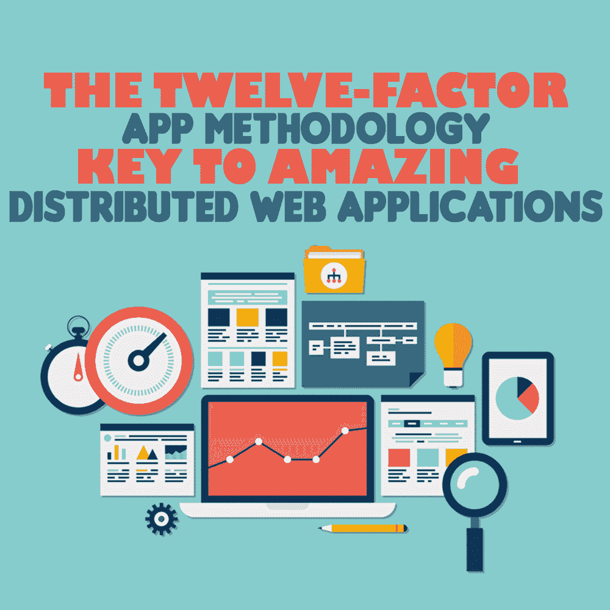

# 十二因素应用程序方法论——惊人的分布式 Web 应用程序的关键

> 原文：<https://simpleprogrammer.com/twelve-factor-app/>

<figure class="alignright is-resized">

</figure>

随着云计算的出现，开发 web 应用程序的动力发生了翻天覆地的变化。这一转变并非一帆风顺。

以前习惯于部署到一台服务器的开发人员，现在不得不处理多台服务器和负载分布的问题。他们还必须考虑不同文件之间的组合，以及来自不同服务器的文件。

为了解决开发人员的困惑，Heroku T1 的联合创始人亚当·威金斯和他的团队提出了一个叫做 T2 T3 的过程，即“十二因素应用方法论”

由于该方法是开发大量应用程序的结果，其指导方针确保了生产率和可伸缩性。这种格式主要是受马丁·福勒的书《企业应用架构的 *[模式](https://simpleprogrammer.com/patterns-enterprise)* 和 *[重构](https://simpleprogrammer.com/refactoring)的影响。*

你可能会问，为什么要遵循它呢？

不遵循它意味着你将会重蹈这种方法的创造者和其他高级开发人员的覆辙，浪费你的时间去解决系统问题。

相反，遵循这种方法可以让你利用现有的经验，从长远来看可以节省你的时间。

考虑到这些原因，让我们来回答一个最明显的问题:**十二因素 App 方法论到底是什么？** 

## 什么是十二因素 App 方法论？

十二要素应用程序方法是一套指南，提供了开发现代复杂 web 应用程序的最佳实践和有组织的方法。

它提出的原则并不局限于任何特定的编程语言或数据库。这些原则足够灵活，可以用于任何编程语言或数据库。

这套指南旨在实现两个特定的目标；在讨论实际的十二个因素之前，关注它们是很重要的。它们是:

*   十二因素应用程序方法论具体想达到什么目的？
*   它是如何努力实现的？

让我们看看[官网](https://12factor.net/)对这些目标有什么说法。

### 第一

***“使用声明式格式进行设置自动化，以最小化新开发人员加入项目的时间和成本”***

[通过声明性语法实现开发设置的自动化，最大限度地减少新开发人员设置项目和加入生态系统的时间和成本](https://simpleprogrammer.com/coding-bootcamp/)。

当所提供的服务规模开始增大时，这种做法会有所帮助。

### 第二

***“与底层操作系统有一个清晰的契约，在执行环境之间提供最大的可移植性”***

这旨在通过将软件元素从底层操作系统中分离出来，在不同的执行环境中提供最大的可移植性。由于软件已经变得独立于平台，它提供了巨大的力量。

### 第三

***【应用程序应该】适合在现代云平台上部署，消除对服务器和系统管理的需求】***

这个建议消除了配置您自己的服务器及其管理的需要，通过开发软件来轻松部署在现代云平台上，如 [AWS](https://aws.amazon.com/) 、 [Azure](https://azure.microsoft.com/) 、 [GCP](https://cloud.google.com/) 等等。

如果有人想在云之外的基础设施上设置它，它提供了灵活性，同时还简化了部署过程。

### 第四

***“最小化开发和生产之间的差异，实现持续部署以获得最大的敏捷性”***

这通过使用[连续部署(CD)的概念，最大限度地减少了生产和开发环境之间的差异。](https://searchitoperations.techtarget.com/definition/continuous-deployment)这样做使开发人员的调试过程更加容易。

### 第五

<figure class="alignright is-resized">

</figure>

***“[应用程序]无需对工具、架构或开发实践进行重大更改即可扩展”***

这允许软件升级和降级，没有任何麻烦。这是当今软件世界的一个基本特征。

现在，让我们讨论这些目标是如何通过这些因素体现出来的，这些因素是这种方法的核心。

## 十二因素应用程序

该方法中的每个因素在其提议的实践和架构中都扮演着独特而重要的角色。

让我们从简单地讨论每个因素开始。

### 1.代码库

***“版本控制中跟踪一个代码库，多个部署”***

这意味着您的项目源代码应该由一个集中的版本控制系统来维护和跟踪。这使得开发人员更容易访问。

一个人应该有一个不同环境(部署)的代码库。

第一个因素中包含的建议提出了不构建另一个代码库的原则，只是为了在不同的环境中进行设置。例如，一个代码库不应该有两个存储库(生产和开发)。这是一种不好的做法。

不同的环境代表不同的状态。无论状态如何，它们都共享相同的代码库。从技术上讲，一个状态可以被认为是 Subversion 控制系统上下文中的一个分支，比如 [Github](https://github.com/) 。

为了更好地理解，考虑另一个例子:你正在与 3 个团队成员一起构建一个 Todo 应用程序。一个糟糕的方法是在每个成员的系统中创建三个文件夹(todo-app-development、todo-app-staging 和 todo-app-production)，因为每个团队成员很难跟踪项目和进度。

一个好的方法是在任何中央版本控制系统(如 Github、Gitlab 等)中创建一个名为 todo-app 的存储库，然后创建两个分支，开发和登台。然后将“主”命名为生产/发布分支(您对分支名称的看法可能不同，这完全没问题)。

### 2.属国

***【明确声明并隔离依赖】***

这主要意味着不应该假设持有代码库的目标系统已经安装了所有的依赖项(外部库)。

将依赖关系与代码库一起上传是一种不好的做法，因为这可能会产生诸如底层平台依赖关系之类的问题。例如，如果上传的模块来自 Windows PC，而使用 Mac OS 的开发人员下载了代码库，他们无疑会在运行项目时遇到麻烦。

使用类似于 [npm](https://www.npmjs.com/) 、 [YARN](https://yarnpkg.com/) 或类似的包管理器——取决于技术栈——通过读取表示依赖项名称和版本的特定文件，将依赖项下载到您各自的系统上，这始终是一个好的做法。

### 3.配置

***【在环境中存储配置】***

配置信息不应存储在文件中。我们不希望像数据库连接信息或其他机密数据这样的敏感信息被公开。此外，我们的配置主要取决于它所处的环境。

例如，如果您正在开发一个医院管理系统——对于产品，您有基于云的数据库服务凭证，如 [AWS Dynamo DB](https://aws.amazon.com/dynamodb/) ,但是对于在您的本地系统上进行测试，您想要使用本地 [MongoDB](https://www.mongodb.com/) 服务器进行测试——您会一次又一次地更改代码，还是以这样一种方式设置变量，即您只需更改其环境(如 [Node.js](https://nodejs.org/) 中的 [dotenv](https://github.com/motdotla/dotenv) )就可以让您的代码库完美运行？我会选择后者。

### 4.后勤服务

***“将后台服务视为附属资源******”***

<figure class="alignright is-resized">

</figure>

首先，后备服务是任何需要网络连接才能成功运行的资源。它可以是一个数据库，如 [PostgreSQL](https://www.postgresql.org/) 或任何资源。

为了简单起见，让我们假设我们正在用 Nodejs 和 PostgreSQL 进行一个项目。在开发环境的过程中，我们有一个本地 PostgreSQL 服务器在我们的机器上运行。现在，我们想通过在另一台服务器上运行这个数据库来投入生产。

我们做什么呢

我们应该改变配置信息可用的环境，而不是改变代码。唯一的区别将是不同于开发的网址。

### 5.构建、发布和运行

***【严格分离、构建和运行阶段】***

通过划分每个组的阶段，这促进了方法关注点的分离。它促进三个阶段，描述如下:

*   首先是**构建阶段**。开发人员完全控制这一阶段，标记新版本并修复任何错误。最好只在构建阶段更改代码，不要在其他阶段干扰它。
*   二、**发布阶段**。在这里，构建阶段的代码在目标环境中执行，提供了真实世界的感觉。进行测试是为了检查一切是否正常工作。
*   第三，**运行阶段**。这是运行应用程序的最后阶段。它不应受到任何其他阶段的干预。

假设你正在为一家餐馆建立一个管理系统。如果您忽略这些阶段并开始开发，您将浪费时间来解决您的系统和目标餐馆系统之间的问题。

### 6.处理

***“将 app 作为一个或多个无状态进程执行”***

代码库的状态部分应该与流程或应用程序实例分开。它应该只存在于数据库和共享存储中。

当在云平台中进行多节点部署以实现可伸缩性时，这非常有用。数据不会保存在这些节点中，因为如果这些节点中的任何一个崩溃，数据都会丢失。

例如，会话数据不应该存储在应用程序的进程中，因为如果它是基于云的和/或某个节点以某种方式崩溃，应用程序将要求您再次登录。将会话数据存储在诸如 [Redis](https://redis.io/) 之类的数据存储中总是一个好的做法。

### 7.端口绑定

***【通过端口绑定导出服务】***

其他服务应该可以通过 URL 访问您的应用程序服务。这样，您的服务可以在需要时充当其他服务的资源。这促进了应用程序的自包含。

您可以使用这个概念为其他应用程序构建 REST APIS。

例如，您希望您开发的社交媒体 web 应用程序中的帖子能够被其他人访问，您可以向他们提供 API URL(类似于:https://www.xyz/api/posts:5000)和一些请求令牌，以便其他人访问您的数据。这是最好的方法，因为现在你的网络应用已经成为另一方的后台服务。

### 8.并发

***【通过流程模型向外扩展】***

应用程序中的每个进程都应该能够根据需求进行伸缩、重启或自我克隆。这样做会提高可伸缩性。

使用上面提到的方法，您可以通过将每个工作负载分配到一个进程类型(PID)来构建能够处理不同工作负载的应用程序。例如，HTTP 请求可以委托给 web 进程，而长时间的后台任务可以委托给工作进程。

### 9.一次性

***【快速启动和平稳关闭最大化鲁棒性】***

<figure class="alignright is-resized">

</figure>

这表明这些过程应该耗时更少，能够快速启动和停止。除此之外，他们还应该能够处理故障。如今，像 [Docker](https://www.docker.com/) 这样的容器对于执行这一功能非常有用。

例如，像 [RabbitMQ](https://www.rabbitmq.com/) 这样健壮的排队后端系统可以用来处理进程的突然死亡和关闭。在这种情况下，当客户端断开连接或关闭时，手头的任务将返回到队列中。

### 10.开发-生产平价

***“保持开发、试运行和生产尽可能相似”***

从事一个项目的团队应该使用相同的操作系统、支持服务和依赖关系，以使开发和生产之间的差异最小化。

因此，开发所需的时间更少。这也促进了[快速应用开发(RAD)](https://en.wikipedia.org/wiki/Rapid_application_development) 的思想。

通过减少开发和生产阶段之间的差异，[持续部署](https://searchitoperations.techtarget.com/definition/continuous-deployment)的过程变得更加轻松。

### 11.日志

***【将日志视为事件流】***

您的应用程序不应该负责日志的存储和管理。它应该只是相应地打印，以检查您的应用程序的流程。

像 [Nodejs](https://nodejs.org) 中的 [Bunyan](https://github.com/trentm/node-bunyan) 这样的程序可以帮助我们在各种环境中检查应用程序的流程，比如测试和开发。它比简单的“console.log()”强大得多

### 12.管理流程

***“将行政/管理任务作为一次性流程运行”***

最后一个因素建议您的管理任务应该从相似的生产服务器上执行。

管理任务可能是进行数据库迁移和从应用程序中收集分析数据，以便从中获得洞察力。这些任务通过正在发布的应用程序代码在应用程序上实时运行。

## 十二因素应用程序方法的优势

我们已经看到了“十二因素应用程序”方法如何使开发变得没有麻烦，并可以加快生产率。此外，在理解和实现这些指导方针上投入的时间可以帮助我们节省大量的软件成本。

在有些情况下，偏离上面的几个因素是有意义的，比如日志，但是最好尽可能采用所有的十二个因素。

如果您正在[设计](https://simpleprogrammer.com/dont-get-obsessed-design-patterns/)微服务架构，请务必考虑这些因素，并认真对待它们。

当您在五个独立的环境中运行 10 多个服务时，现在看起来微不足道的事情可能会变得非常重要。如果您已经在运行微服务，看看是否有您遗漏的因素，也许它们可以帮助您解决您之前没有注意到的问题。

总而言之，这些指南为构建分布式 web 应用程序和微服务提供了一个很好的基础。从长远来看，这种方法可以帮助您平稳地扩展和维护应用程序。

祝好运和快乐的设计！