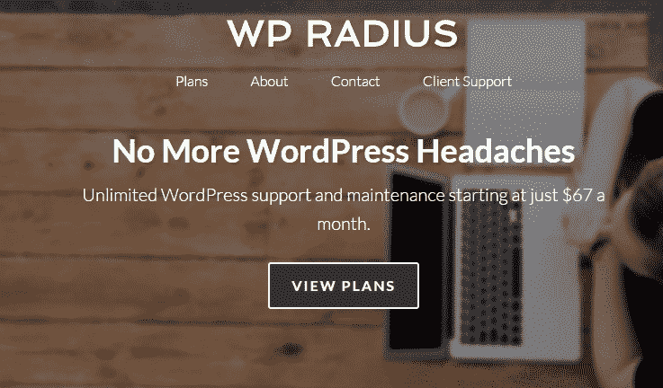
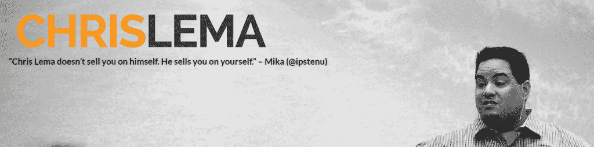

# 两个程序员成为 WordPress 的企业家

> 原文:[https://simple programmer . com/two-programmers-turned-WordPress-entrepreneurs-profiled/](https://simpleprogrammer.com/two-programmers-turned-wordpress-entrepreneurs-profiled/)

自从我开设了“[如何创建一个博客来促进你的职业发展](http://devcareerboost.com/blog-course/)”课程以来，我已经参与了 WordPress 社区相当一段时间。

因此，我对 WordPress 开发世界正在发生的事情非常感兴趣。我收到了一些关于 WordPress 开发信息的请求，但是我自己真的不是专家，所以我一直依赖其他人的专业知识。

关于 WordPress，我有很多经验的公司之一是 [WP Radius](https://simpleprogrammer.com/wpradius) 。两位创始人:Todd Schwartzfarb 和 Brandon Yanofsky 回答了我的许多问题，并为 WordPress 博客提供了出色的支持，这样他们就不必成为 WordPress 专家。

我对 Brandon 做了一个[视频采访，我让 Todd 写了这篇文章，我把它收录在下面。](https://www.youtube.com/watch?v=r6DPbYznB3s)

如果你有机会，[去 WP Radius 看看他们的服务](https://simpleprogrammer.com/wpradius)。这是一个非常好的概念。他们基本上会维护你的 WordPress 站点，但是最棒的是他们提供无限的电子邮件支持和站点工作。这意味着如果你有关于 WordPress 的问题，你可以问一个专家，他会亲自回答你的问题。是的，他们实际上会解决你的问题。这项服务已经节省了我大量的时间，我希望它会继续这样做。

我讨厌浪费时间试图找出为什么有些东西不工作或调整主题，而我可以用我的时间写博客。

无论如何，不再拖延，这里是托德关于两个程序员成为 WordPress 企业家的帖子

许多程序员拥有成为成功企业家所需的特质和技能——比如智力、创造力、解决问题的能力和创造的欲望。难怪程序员会成为世界上最好的企业家。人们只需要看看比尔·盖茨和马克·扎克伯格这样的“极客”程序员变成亿万富翁就可以说明这一点。

近年来，许多希望成为企业家的技术人员已经利用 WordPress 作为建立他们公司的基础。WordPress 既免费(使得启动成本低)又在市场上建立了良好的信誉(使得一个巨大的潜在客户群成为可能)。

如果你是一名程序员，并且曾经想过开始一项基于 wordpress 的业务，你会想要阅读更多关于两位 WordPress 企业家的介绍——赛义德·巴尔基和克里斯·马乐。

## 赛义德·巴尔基

赛义德是 WPBeginner.com 的创始人，这是关于 WordPress 最大最受欢迎的免费网站之一。

顾名思义，WPBeginner 为初学者提供免费教程、指南、建议、帮助、新闻和文章，告诉他们如何使用 WordPress 并从中获得最大收益。

除了 WPBeginner，Syed 还是其他几家基于 WordPress 的公司的创始人，包括 OptinMonster(一家插件公司)、List25(一家媒体公司)和 ThemeLab(一家主题开发公司)。这些公司中的几家每年的收入都超过 7 位数！

7 岁时，赛义德第一次尝到了创业的滋味，当时他在自己的祖国巴基斯坦开始经营销售节日贺卡的生意。9 岁时，他在附近开了一家小小吃店。

搬到美国后，Syed 在学校学习编程，并开始为客户提供自由网络开发服务。他建立了一个稳定的企业；然而，当他的客户开始要求改变他们的网站时，他跟不上了。为了减轻维护负担，Syed 将他所有的客户网站转移到了一个新的(当时)单一的，易于使用的平台上，叫做 WordPress。当客户开始询问关于 WordPress 的问题(它是什么，如何使用等等)时，Syed 决定启动 WPBeginner 作为他的答案的储存库。

Syed 将他的创业成功归功于他自我描述的“竞争”天性。他说，“从我记事起，我就非常争强好胜，这让我做任何事都全力以赴。”当同行们描述 Syed 时,“hustle”这个词经常出现。Mattreport.com，一个受欢迎的 WordPress 博客和播客，特别指出 Syed 是“努力成为 WordPress 企业家”的人。

他对那些可能想成为企业家，但可能缺乏信心或觉得太内向而无法与合适的人交谈的开发人员有什么建议？

“是的，这不是火箭科学”，巴尔基说。“他们(有影响力的人)只是普通人。他们也是人……去做一个正常人，进行一次对话。”

## 克里斯马乐

克里斯·马乐是 CrowdFavorite 的首席技术官兼首席策略师。crowd favorite 是一家网络开发和营销机构，其客户包括星巴克和沃尔玛。他也是 WordPress 作者、博客作者、演讲者和数字战略家。

多年来，Chris 在企业软件领域有一份“常规”的技术工作。然而，在业余时间，Chris 对 WordPress 越来越感兴趣，并参与其中。他在 chrislema.com 开设了一个每日 WordPress 博客。与此同时，他帮助初创公司开发 WordPress 网站，并开始在 WordPress 社区获得知名度。他最终成为了圣地亚哥单词营的组织者。

现在，除了担任 CrowdFavorite 的 CTO 之外，Chris 还销售关于产品开发的数字指导服务，就如何利用 WordPress 向公司提供咨询，每天写关于技术的博客，并且可以作为顾问和演讲者。

这看起来好像有很多帽子要戴。然而，许多企业家会发现自己身兼数职。让克里斯如此擅长的是他围绕自己形成品牌的能力。克里斯的博客(当然是用 WordPress 建的！)是展示

他的个人品牌。bog 不仅用户友好，有很强的个人风格，而且清楚地展示了他对 WordPress 的贡献(博客、电子书、视频、电子邮件课程)和才能(公共演讲、咨询)。他的网站包括个人简历、专业媒体照片，并多次呼吁那些希望雇佣他的人采取行动。

那些对建立个人品牌和网络形象感兴趣的人可以好好研究一下克里斯。

克里斯对辅导创业公司特别感兴趣。对于那些有兴趣成为 WordPress 企业家的人，Chris 给出了这样的建议:“在我看来，企业犯的最大错误是他们不顾一切地从自己的错误中学习。这需要很长时间，而且可能会让你沉沦。埃莉诺·罗斯福说过‘从别人的错误中吸取教训’。你不可能活得足够长来自己做所有的事情。”(引自对 WP 初学者网站 Chris 的采访)。因此，克里斯经常给有抱负的企业家的一条建议很简单——“寻求帮助！"

## **结论**

希望这两个简介能启发并教会那些想成为企业家的人一些好的建议。像大多数好建议一样，最后真的很简单——不要害怕说出来(毕竟如果你不说，谁会替你说呢？)并从别人的错误中吸取教训，因为时间是宝贵的。

你得到过的最好的创业秘诀是什么？

*托德·施瓦茨法布是 [WP Radius](https://simpleprogrammer.com/wpradius) 的联合创始人，这是一家为 WordPress 网站的支持、维护和管理提供负担得起的月度计划的公司。*