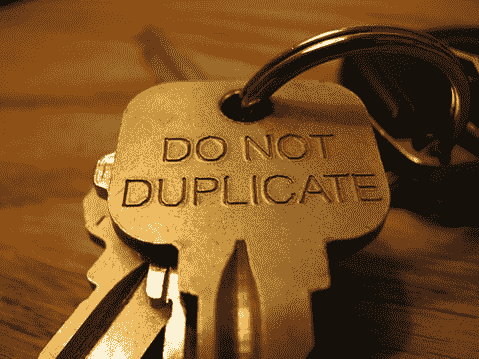

# 代码中重复的类型

> 原文：<https://simpleprogrammer.com/types-of-duplication-in-code/>

重构代码的最大原因之一是消除重复。在我们的代码中很容易引入重复，要么是无意的，要么是因为我们不知道如何防止或消除它。

## 复制的三种类型

我发现有三种基本类型的重复可以从我们的代码中消除，它们成功地建立在彼此的基础上。

*   数据
*   类型
*   算法

大多数开发人员倾向于停留在数据层面，但是在这篇文章中，我将向您展示如何识别类型和算法重复，并从您的代码中重构它。

## 数据复制

最基本的复制类型是数据复制。它也很容易辨认。

看看这些方法:

这里很容易看出什么需要重构。

大多数开发人员不需要任何帮助就能意识到，您可能应该将这段代码重构为如下所示的方法:

在本例中，数据是重复的。具体来说，传递给 move 的方向的字符串数据是重复的。我们可以通过创建一个方法来消除这种重复，该方法将数据所表示的差异参数化。

## 类型复制

现在，数据复制是大多数开发人员止步的地方，但是我们可以走得更远。在许多情况下，两种方法之间的区别仅仅在于它们操作的类型。

通过在 C#中使用泛型，我们可以重构出类型，并且参数化这个概念。

看看这个例子:

这里我们有两个方法做几乎相同的事情，但是它们只是操作的类型不同。泛型给了我们重构类型信息的能力，就像我们重构数据一样。

通过重构上述方法，我们消除了重复。我们通过重构类型实现了这一点。

## 算法复制

如果对委托和函数式编程没有很好的理解，很少有开发人员会考虑重构算法副本，但这是很容易做到的。

看一下这个例子:

这是一个非常基本的例子，但是它强调了我经常在许多代码库中看到的那种重复。C#中的委托允许我们像对待数据一样对待函数。有了这种能力，我们可以很容易地重构这两种方法的共性，得到类似这样的结果:

我们还可以通过使用抽象基类并让继承的类定义它们自己的适应性活动来重构这种重复，但是使用委托创建了一种更简单的方法，并且将问题归结为重构任何其他类型的数据。

## 将它们结合在一起

我经常发现在一个类的几个方法中存在几种不同类型的重复。

在这种情况下，通常可以应用数据、类型和算法复制重构技术来找到最简单、最优雅的解决方案。

我也发现这是一项必须练习的技能。当我第一次真正开始在 C#中使用泛型和委托时，我很难找到它们的用途，因为我不容易识别需要它们的复制模式。但是，随着时间的推移，我发现越来越容易认识到这些技术可以应用于减少我的方法中的重复。

我还发现消除重复的关键有时是首先夸大它。通常我会故意采用两种我知道有一些重复的方法，并使它们看起来更加重复，以便能够清楚地看到重复在哪里。我可能会做几个小的重构步骤，以达到容易识别哪些数据、类型或算法被重复的程度。