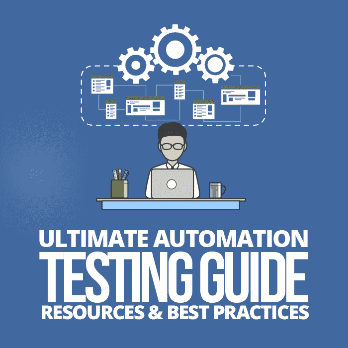

# 自动化测试的终极指南:74 种测试自动化的资源、工具和最佳实践

> 原文:[https://simple programmer . com/ultimate-automation-testing-guide/](https://simpleprogrammer.com/ultimate-automation-testing-guide/)

Automation testing takes a manual test case and applies a tool or programming language to automate its execution. As more teams shift left, there is a need for tests to run earlier and faster in the development lifecycle.

传统上，在回归测试期间，人工测试人员将采用现有的测试用例过程，并逐步执行它。这既耗时又容易出错，因为这是手工完成的。

由于上述原因，为了节省时间，许多公司试图将他们的手工测试用例转换成自动化测试用例。然后，自动化测试工具自动执行测试步骤，无需人工干预。

听起来很容易，但是团队在开始他们的测试自动化之旅时会遇到很多陷阱。在本教程中，我将解决人们面临的最常见的自动化问题，并希望帮助您开始您的自动化项目。

这是一个很长的指南，所以这里是我们将要涵盖的内容的概述:

1.  什么是自动化测试？
2.  [手动测试的问题](#issues-with-manual-testing)
3.  为什么自动化测试是必要的？
4.  [自动化测试注意事项](#automation-testing-considerations)
5.  自动化测试陷阱
6.  [自动化是一项团队工作](#automation-is-a-team-effort)
7.  [应该自动化的测试](#tests-that-should-be-automated)
8.  [ROI:测试自动化的成本](#roi-the-cost-of-test-automation)
9.  什么不应该自动化？
10.  什么是自动化测试框架？
11.  [自动化测试设计模式](#automation-testing-design-patterns)
12.  [测试自动化过程](#test-automation-process)
13.  [测试自动化最佳实践](#test-automation-best-practices)
14.  [如何挑选自动化测试工具](#how-to-pick-an-automation-testing-tool)
15.  [测试自动化指标](#test-automation-metrics)
16.  [自动化测试框架和工具列表](#automation-testing-frameworks-and-tools)
17.  [API 自动化测试工具列表](#api-automation-test-tools)
18.  [在云中或移动设备上运行自动化测试](#run-your-automated-test-in-the-cloud)
19.  [自动化测试管理工具列表](#automation-test-management-tools)
20.  [自动化测试课程](#automation-testing-courses)
21.  [测试自动化会议](#test-automation-conferences)

让我们从定义自动化测试开始。

## 什么是自动化测试？

功能自动化测试使用专门为自动化设计的工具来模拟用户与应用程序的交互，并使用编程断言来验证测试步骤。

许多人也称这些测试为自动化“检查”或自动化检查。

这种区别是为了提醒测试人员，自动化和自动化的实现是一个检查器——它不会取代您的测试策略。从某种意义上说，自动化测试也是愚蠢的，因为它只能测试你让它测试的东西；如果你不断言它，它就不会被检查。

此外，重要的是要记住“自动化”不仅仅适用于用户界面(UI)端到端测试。事实上，我想说的是，与庞大臃肿的端到端测试套件相比，你从较低级别的自动化测试(比如单元测试)中获得的好处更多。

在我们更深入地研究自动化测试之前，让我们先来谈谈手工测试的一些问题。

## 手动测试的问题

为什么严重依赖手工测试的测试策略会导致问题，原因有很多。以下是一些例子:

*   它使用了大量的资源，如时间和测试人员。
*   很费时间。
*   它有时缺乏适当的报道。
*   由于它的重复性，当手动执行时，测试人员可能会厌烦并错过步骤，导致可能的不一致。
*   如果您计划转向持续集成/持续部署模型，太多的手动测试将会减慢您的团队的速度。

自动化测试会有所帮助。

但是当您将自动化测试引入到您的组织中时，您可能面临的第一个障碍是错误地认为自动化可以用自动化取代您所有的测试人员和测试。

事情是这样的:

自动化测试不会取代测试人员。

一些人认为因为测试活动是自动化的，这意味着它取代了人类测试人员。然而事实上，恰恰相反。自动化测试对于精确和快速地运行测试来说是非常好的，但是它们绝不会取代人类测试人员。

自动化测试也非常适合反复运行相同的步骤，但是它们不会思考。

我喜欢用彼得·泰尔在他的书 *[零对一](http://www.amazon.com/exec/obidos/ASIN/B00M284NY2/makithecompsi-20)* 的“人与机器”一章中解释自动化的方式:

> “计算机是人类的补充，而不是替代品。未来几十年最有价值的企业将由那些寻求赋予人们权力、而不是试图让他们过时的企业家创建。”

尽管我们同意自动化测试不能取代其他测试活动，但是在今天的软件开发环境和持续集成实践中，它是至关重要的，不能被忽视。

那么使用自动化测试的原因是什么呢？

## 为什么自动化测试是必要的？

With the increased speed in which we develop software, we need automation testing. As more companies move toward [Agile](https://www.agilealliance.org/agile101/the-agile-manifesto/) and [DevOps](https://www.atlassian.com/devops), automation is more important than ever before.

像持续集成和交付这样的实践需要快速可靠地运行测试。大量的手工测试将会阻止你实现软件开发速度的能力。

我甚至可以说，在今天的现代开发环境中，如果没有自动化，我们就不会成功。

虽然团队尝试创建自动化测试的主要原因是为了节省公司的时间和金钱，但是给开发人员快速的反馈也是很重要的，这样当他们签入代码时，他们会尽快得到警告，他们签入的更改破坏了某些东西。

自动化测试的一些其他原因是:

*   软件新版本的验证
*   解放测试人员，让他们专注于更具探索性的测试
*   自动化测试更具可重复性
*   数据总体
*   精确的基准测试
*   更少由于人为错误导致的错误失败
*   更大的测试覆盖范围
*   复用性
*   更快发布软件
*   在软件签入失败时，向开发人员提供快速反馈
*   节省时间
*   能够利用编程能力

虽然这些都是自动化的好理由，但是许多人没有考虑到维护大型自动化测试套件所花费的时间和金钱。

那么创建自动化测试还有其他缺点吗？真实的故事是什么？

## 自动化测试注意事项

由于自动化测试通常依赖于编程语言来创建，因此自动化成为一项成熟的开发工作。你所做的是开发一个软件来测试另一个软件。

自动化测试是困难和复杂的，就像大多数其他开发软件项目一样。它也提出了许多与其他软件程序相同的问题。像对待开发代码一样对待自动化代码是至关重要的。遵循您将用于任何其他软件开发项目的相同过程和最佳实践。

为了了解更多信息，John Sonmez 在他令人敬畏的 Pluralsight 课程[中介绍了许多最佳实践，用 Selenium 创建自动化测试框架](https://simpleprogrammer.com/creating-automated-testing-framework-selenium/)。

## 自动化测试陷阱

团队经常声称自动化测试“不起作用”但是这种态度通常是由糟糕的测试自动化设计造成的。

如果您在创建您的测试自动化框架时，记住下面列出的问题，您可以提前避免这些自动化陷阱。

许多问题是由设定不切实际的目标引起的，例如，设定达到 100% UI 自动化测试覆盖率的目标。团队通常认为自动化测试会发现更多新的缺陷，因此他们有一种虚假的安全感。你的自动化只和你的测试一样好。

团队也低估了维护自动化所花费的时间。他们通常会创建大型的端到端测试，但是测试应该是原子的，这样当他们失败时，你就知道为什么了。

团队面临的其他几个常见问题是:

*   只关注 UI 自动化
*   没有受控的测试环境
*   忽略失败的测试
*   没有适当的测试数据策略
*   不重用自动化代码
*   开发人员没有使他们的代码自动化
*   没有在测试中使用正确的同步
*   没有让你的自动化测试具有可读性
*   创建不增加价值的自动化测试
*   硬编码测试数据

## 自动化是团队的努力

为了自动化在一个组织中取得成功，您需要教育团队中的每个人对您的测试的期望是什么。为您的自动化工作创建一个完整的团队方法也是至关重要的，这意味着不管一个人在团队中的角色如何，开发和测试(以及最终交付一个特性)都需要整个团队的努力。测试不应该是由指定的测试人员在 sprint 结束时才进行的活动。

质量需要从一开始就融入到软件中，而不是在事后。做到这一点的唯一方法是让每个人都努力使开发中的应用程序尽可能可测试。这需要整个团队一起工作来交付高质量的产品。

我看到的许多自动化失败不是由技术问题引起的，而是由公司的文化问题引起的。

Once you have the whole team on board with automation, and your manager’s expectations have been correctly set, it’s time to write your automated tests.

记住——自动化是一项耗时的测试活动。只有当它有意义时，你才想使用它。应该鼓励其他的测试活动，比如探索性的工作。

自动化只是测试人员可以使用的多种测试活动中的一种。

此时，我经常被问到的另一个常见问题是，“哪些测试应该自动化？”

## 应该自动化的测试

我通常看到的最大问题是团队开始试图自动化一切。问题在于，并非所有事情都是自动化的。当计划自动化哪些测试用例时，您应该寻找确定性的、不需要人工交互的、难以手动测试的、需要多次运行的测试。

您还应该寻求自动化任何可以节省工程师时间的手动过程(不一定是正式的“测试”过程)，以及关注应用程序的资金或风险领域的测试。

其他有助于自动化的测试有单元测试，以及针对不同数据集运行的测试，这些测试关注应用程序的关键路径，需要针对多个版本和浏览器运行，并用于负载/压力测试。

重复执行越多，测试就越适合自动化测试。但是，每种情况都不一样。

最终，您应该考虑对任何节省团队时间的活动使用自动化。它不一定是一个纯粹的测试活动；您可以利用自动化来帮助减少软件开发生命周期中任何地方的任何耗时活动。

在这一点上，你们中的一些人可能会问，“测试自动化的投资回报率(ROI)是多少？”

## ROI:测试自动化的成本

确定您的自动化测试工作的 ROI 可能是棘手的。下面是一些人用来粗略估计他们的测试自动化成本的常用计算方法。这也可以帮助你决定一个测试用例是否值得自动化，而不是手工测试。

**自动化成本=工具成本+创建自动化测试的人力成本+维护自动化测试的成本**

因此，如果您的自动化成本计算低于测试的手工执行成本，这表明自动化是一个好的选择。

此外，ROI 会随着自动化测试套件的每次重新运行而快速增加。

因为获得测试自动化投资的良好回报是至关重要的，所以有些事情您不应该自动化。

## 什么不应该自动化？

当然，凡事都有例外，但是一般来说，您可能不希望自动化下面的测试用例场景:

*   一次性测试
*   基于特定的测试
*   没有可预测结果的测试
*   可用性测试
*   没有开发可测试的应用程序

除了不要自动化什么之外，一个成功的自动化项目的另一个要素是拥有一个自动化框架。

## 什么是自动化测试框架？

An automation framework is a common set of tools, guidelines, and principles for your tests. Having a framework helps to minimize test script maintenance.

我喜欢将自动化测试框架分解成关注的特定领域，或者我称之为自动化框架的“四个 p ”:人员、计划、过程和性能。

第一个是测试自动化框架的人员方面。

**人**

正如我们之前已经提到的，您想要确保您已经设定了您的经理和团队对您的自动化策略的期望。为了帮助确保您的自动化是协作性的，是整个团队的努力，我建议您在您的 sprint 团队的 done 定义中包含自动化。

下一个阶段是自动化框架的规划部分。

**策划**

在编写一行代码之前，在发明自己的库或工具之前，一定要查看是否有现成的库或工具可以使用。将你的自动化框架分解成抽象层，这样如果有任何变化，你只需要在一个地方做出改变。使用已经建立的自动化测试设计模式，就像我们在这篇文章后面提到的，应该是计划阶段的一部分。

当你必须对你的框架进行修改时，将你的测试从你的框架中分离出来也会有所帮助。

此外，计划使您的方法和实用程序可重用，以避免代码重复。让你的测试和代码尽可能的可读(它们应该像英语一样)将会对防止混乱和代码重复大有帮助。

最后，当计划您的测试时，了解您的测试需要什么测试数据是很重要的。很多时候，测试在不同的环境下运行，这些环境可能没有您所期望的数据，所以要确保有一个测试数据管理策略。在框架中包含对模仿和存根的支持也有助于解决一些测试数据问题。

**流程**

拥有一个让团队成员对自动化负责的过程是框架的另一个重要部分。因为自动化就像任何其他开发项目一样，所以确保使用开发人员已经遵循的相同过程和最佳实践，比如使用版本控制和对所有自动化测试执行代码审查。

**性能**

在开始你的自动化框架的时候，一定要牢记目标。测试需要可靠和可维护。他们也应该尽可能跑得快。

沿着这些思路，确保您的开发人员为您将不得不在测试中与之交互的每个元素创建唯一的 id。这样做将帮助您避免诉诸糟糕的自动化实践，比如依赖基于坐标的方式与元素通信。

测试自动化脚本性能的另一个杀手是在测试中没有使用正确的同步/等待点。过多的硬编码等待会降低测试套件的速度。使用首选的[显式等待](https://www.joecolantonio.com/2014/04/01/the-1-killer-of-selenium-script-performance-and-reliability/)方法进行同步。

当您编写测试脚本时，请考虑如果您必须并行运行，它们会如何执行。预先考虑可能的并行问题将会避免当你开始在网格或者像 [Sauce Labs](https://saucelabs.com/) 这样的基于云的服务上再次扩展你的测试套件时出现的问题。

为了确保您的测试尽可能地预先格式化，只要有可能，就重构速度慢或者写得不好的代码。在您的框架中包含报告和日志将帮助您快速识别运行不佳的代码。

为了确保团队遵循所有这些指导方针，确定培训和再培训框架用户的策略。

这还不是全部…

## 自动化测试设计模式

众所周知，您的应用程序会随着时间的推移而变化。因为你知道变化将要发生，你应该从一开始就使用最佳实践或设计模式。这样做将使您的自动化更具可重复性和可维护性。

这里有一些常见的自动化测试设计模式，许多团队使用它们来帮助他们创建更可靠的测试自动化。

### 页面对象

在创建您的测试自动化时，一个流行的策略是对您的应用程序的行为进行建模。创建简单的[页面对象](https://github.com/SeleniumHQ/selenium/wiki/PageObjects)来模拟你正在测试的软件部分可以做到这一点。

例如，你可以为登录写一个页面对象，或者为主页写一个页面对象。正确遵循这种方法就利用了单一责任原则。

如果有任何变化——比方说，一个元素 ID——您只需要到一个地方进行更改，所有使用 page 对象的测试将自动获取这些更改，而无需您做任何其他事情。测试代码只需要在一个地方更新。

页面对象还将关于 HTML 字段和 CSS 类的技术细节隐藏在具有易于理解的名称的方法后面。在命名您的方法时要小心，这有助于创建一个易读的测试应用程序编程接口(API ),一个不太专业的自动化工程师可以很快开始使用它来实现自动化。

### 剧本模式

页面对象是开始使您的测试可维护的一个好地方，但是如果您不小心的话，随着时间的推移，它们会变得无法控制。[剧本模式](https://ideas.riverglide.com/page-objects-refactored-12ec3541990#.ekkiguobe)获取页面对象并将它们分割成非常小的块。一些测试人员告诉我，这使得他们的测试更加可维护和可靠。

另一个显著的好处是，它使得测试脚本更具可读性。

### 端口和适配器

[端口和适配器](https://spin.atomicobject.com/2013/02/23/ports-adapters-software-architecture/)设计努力确保你使用单一责任原则，这样一个对象应该只做一件事，并且有一个改变的理由。

当您将此应用于测试自动化时，请确保分离您的测试代码，以允许您用快速模拟器交换慢速组件，以便您可以在同一个流程中运行您的测试和您正在测试的应用程序。

移除所有网络和输入/输出，这样就不会降低测试套件的速度。当然，这并不容易做到，但是在创建 UI 自动化时，你越是尝试这样做，你的情况就会越好。

### 演示者优先

[Presenter First](https://atomicobject.com/resources/presenter-first) 是对[模型-视图-控制器](https://simpleprogrammer.com/software-design-patterns-hiding/) (MVC)组织代码和开发行为的方式的修改，使用测试驱动开发(TDD)方法创建完全测试过的软件。

我第一次听说这种模式是在采访 Seb Rose T1 的时候，他是 Cucumber 项目的贡献者之一，也是《Java 的 Cucumber》一书*[的作者。](http://www.amazon.com/exec/obidos/ASIN/1941222293/makithecompsi-20)*

他提到，如果你把 MVC 模式画成块和箭头，你可以看到视图，也就是你的 UI，与模型和控制器有明确定义的通信渠道。如果您可以在运行时用您的测试创建和控制的模型和控制器来替换它们，那么您就没有理由不测试 UI 以您想要的方式运行。

你也可以设置你的模型和控制器来模拟各种奇怪的行为，比如网络瘫痪。

## 测试自动化过程

I like to follow a six-step cyclical process when planning my test automation efforts that have the following phases: Analyze, Write, Execute, Evaluate, Communicate, and Repeat/Refactor.

*   **分析**—了解你的功能测试目标。了解需要哪些测试数据。需要测试什么？知道需要验证什么。如果你是敏捷团队的一员，一个很好的起点就是你对准备会议的定义。这将允许您在开始开发新功能进行测试之前，查看您即将到来的 sprint，并查看您的自动化的所有方面是否都已被考虑在内。
*   **编写**—将需求转化为自动化的解决方案。了解每个测试的开始和结束条件。测试应该完全独立于其他测试。添加适当的断言检查，以确保您的应用程序按照您的规范运行。每个测试都应该有特定的目的。
*   执行—你的测试应该是可靠的。在签入代码之前，每个测试至少要连续运行三次。如果您计划使用像 Jenkins 这样的持续集成工具，那么从在您计划使用的环境中执行您的第一个测试开始。
*   **评估**—验证自动化脚本正在做您期望它做的事情。让手动测试人员证明它正在按预期工作。请记住，如果它没有被断言，就不会被检查。测试可靠吗？
*   **沟通**—确保团队中的每个人都知道结果。古怪的测试应该尽快修复，否则你将冒着团队忽视你的测试结果的风险。
*   **重复/重构**—如果你注意到一个不可靠的测试，重构它以使它更可靠。最重要的是，删除任何不可靠的和没有在给定时间框架内修复的测试。当查看您的自动化回归测试时，询问团队是否仍然需要它，或者它是否增加了价值。从长远来看，删除旧的测试将节省您的维护时间，并确保您只运行对您的团队有价值的测试。

## 测试自动化最佳实践

以下是一些高级的良好自动化实践，您应该更详细地遵循:

### 原子测试

原子测试是一种确保每个测试完全独立的策略。也就是说，它不应该依赖于其他测试的结果来建立它的状态，并且另一个测试不应该以任何方式影响它的成功或失败。

此外，当自动化测试失败时，您需要知道原因。如果您的测试失败了，那么拥有一个只测试一件事情的命名良好的原子测试将帮助您快速识别出是什么出了问题。

此外，您应该尽可能快地向您的开发人员提供反馈，最好的方法是使用一个快速的、命名良好的测试。

如果您计划在一个 [Selenium Grid](http://www.seleniumhq.org/docs/07_selenium_grid.jsp) 中并行运行自动化测试，这也是至关重要的。

### 测试尺寸

测试规模很重要，因为测试需要快速运行。

在这一点上，许多人想象一个传统的[测试金字塔](https://martinfowler.com/bliki/TestPyramid.html)，它以单元测试为基础，集成测试在中间，图形用户界面(GUI)测试在顶部。

但我更多考虑的是测试规模。就测试规模而言，我指的是比其他测试更快的测试。

虽然我知道如果你必须创建一个 UI 测试，需要运行 UI 测试，但是要尽可能的快。

### 可读性

测试代码可读性的一个快速要点——您知道开发人员花在阅读代码上的时间比实际编写代码的时间还多吗？

编写代码的人很少同时也是需要修改代码的人。更糟糕的是，有多少次你写了代码，几个月后再来看，却不知道它在做什么？

正如我们提到的，由于自动化代码是软件开发，您应该在头脑中为代码的读者创建您的测试代码——而不是计算机。

这不仅有助于提高测试的可维护性，还有助于确保您不会因为不知道现有代码在做什么而重复代码。

这可能看起来是一个小问题，但是忽视自动化测试的可读性是很危险的。

在看了 Cory House 的 Pluralsight 课程[Clean Code:Writing Code for Humans](https://simpleprogrammer.com/get/writing-clean-code-humans)之后，我真正认识到了代码可读性的重要性。

### 易测性

可测试性需要从一开始就融入到我们的应用程序中。作为 sprint 规划的常规部分，开发人员应该考虑如何让他们的应用程序代码更具可测试性。他们可以通过为他们的应用程序字段提供惟一的元素 id 和 API 来帮助创建可以在他们的自动化测试中使用的应用程序挂钩。

他们还应该考虑他们对应用程序所做的任何代码更改将如何影响现有的自动化测试，并相应地制定计划。

如果你不这样做，你不会在自动化上成功很久。

记住，你不能自动化不可测试的东西。

### 稳定的环境

这是许多团队自动化工作的常见障碍。

没有一个始终处于已知状态的稳定的测试环境，您的团队将很难在他们的自动化工作中取得进展。

由于环境问题而不是实际的应用程序问题导致的测试失败会导致您的团队很快对您的测试反馈失去信心。

一旦团队开始忽略自动化结果，您的测试努力就变得毫无用处。

一些有助于创建更加稳定和可重复的环境的工具有 [Docker](https://www.docker.com/) 、[流浪者](https://www.vagrantup.com/)和 [Skytap](https://www.skytap.com/) 。

## 如何选择自动化测试工具

自动化测试没有“正确的”测试工具。最终，这完全取决于您团队的独特需求和技能。

我一直建议您对您正在考虑的每个工具进行为期两周的概念验证(POC ),并在使用工具之前将您团队的反馈包括在内。

第一步是查看产品路线图，并确保您选择的工具将处理未来的功能和技术。为了避免将来的兼容性问题和由于错误的概念导致的冗长的框架重构，不要跳过这一步。

接下来，你要评估成本，包括维护。如果您计划让您的整个团队帮助完成自动化工作，请确保使用与您的开发人员使用的工具和语言相同的工具。

不要假设某个工具会对你有用。为每个工具创建一个小型 POC，并在投入任何工作之前获得团队反馈。问团队:工具是可扩展的吗？使用和上手有多容易？它提供报告和调试功能吗？它能识别应用程序中的所有对象吗？它能与其他工具如版本控制、测试管理工具和持续集成工具集成吗？

最重要的是，找出该工具是否有活跃的用户群，并选择其他公司正在使用的工具。您不希望选择一个不是由社区积极维护的开源解决方案。您可能需要询问需要多少培训才能让您的团队快速使用该工具。最后，确定雇佣那些拥有创建自动化测试所需技能的人有多容易。

## 测试自动化度量

提出团队可以用来确保他们在轨道上的度量标准是困难的。这些应该被用作监控你的团队进展的快捷方式，而不应该被用作硬性规定。

**平均诊断时间(MTD)**—调试一个失败的自动化测试需要多长时间？高 MTD 表明您的自动化测试代码不是高质量的。

自动化发现的错误——这有助于确定您的自动化工作带来了多少价值。

理想情况下，这应该是零，但是这是一个很好的指标来知道你的自动化测试是否可靠。

**自动与手动比率**—您的手动测试越多，判断您的应用程序是否准备好发布的时间就越长。这有助于你了解你的释放工作需要多长时间。它还使您能够了解团队是否正在自动化(或者没有自动化)正确的事情。

## 自动化测试框架和工具

This is not an exhaustive list, but rather a quick summary of some of the more popular test tools that I’m aware of.

### 开源工具

*   Selenium—这已经成为基于浏览器测试的事实上的测试工具标准。请记住:您不能将 Selenium 用于非浏览器应用程序；不是所有东西都可以是自动化测试 Selenium 脚本。
*   Appium 是应用程序的自动化。到目前为止，Appium 似乎是移动测试领域的赢家。
*   这是一个用于自动化测试的开源 Ruby 库。Watir 与浏览器的交互方式和人们一样:点击链接、填写表格和验证文本。
*   [WinAppDriver](https://github.com/Microsoft/WinAppDriver) —Windows 应用驱动是支持 Windows 应用 UI 测试自动化的服务。
*   [White Framework](https://github.com/TestStack/White) —White 是一个基于 Win32、WinForms、WPF、Silverlight 和 SWT (Java)平台的富客户端应用程序自动化框架。这是。NET，不需要使用任何专有的脚本语言。事实上，使用 White 的测试自动化程序支持你的写作。NET 语言、集成开发环境和您已经在使用的工具。White 还提供了一致的、面向对象的 API，隐藏了微软 UI 自动化库(White 所基于的)和 Windows 消息的复杂性。
*   AutoIt v3 是一种免费的类似 BASIC 的脚本语言，旨在实现 Windows GUI 和通用脚本的自动化。许多团队将 AutoIT 与 Selenium 集成在一起，处理出现在自动化测试工作流中的非浏览器窗口。
*   Serenity—这是我最喜欢的自动化框架之一。Serenity 是一个很棒的开源工具，因为它就像 Selenium 和行为驱动开发(BDD)工具(如 jBehave 和 Cucumber-JVM)的包装器。这意味着 Serenity 中有许多内置功能可供您使用，如果您必须创建自己的 BDD 框架，这些功能会处理您通常必须从头开始编写的许多事情。Serenity 真正令人敬畏的是创建令人难以置信的报告。开箱即用的 Serenity 创建了动态文档，不仅可以用来查看 Selenium BDD 测试结果，还可以作为应用程序的文档。
*   [Gauge](https://gauge.org/) —Gauge 是一个由 ThoughtWorks 开发的测试自动化解决方案；它是跨平台和开源的。它支持多种语言，包括 Ruby、Java、C#、Python 和 JavaScript，并且即将支持其他语言，比如 Golang。
*   你需要知道的第一件事是 Sahi 有两种版本:开源版本和专业版本。Sahi Pro 是开源项目的企业版。它包括许多大型组织梦寐以求的功能，如专业风格的报告。
*   机器人框架(Robot Framework)—如果您想使用 Python 进行自动化测试，使用机器人框架是不会出错的。Robot Framework 是一个成熟的解决方案，它是为测试人员创建的，并使用关键字驱动的方法来使测试可读并易于创建。它还有许多测试库和其他工具，可以用来编辑、运行和构建测试。
*   redwood HQ—这与列表中的其他工具略有不同。它创建了一个网站界面，允许多个测试人员一起工作，并从一个 web 可访问的位置运行他们的测试。
*   [Galen 框架](http://galenframework.com/)—如果你的自动化工作集中在用户体验设计/布局测试上，Galen 可能是你需求的完美契合。
*   Cypress 是一个更加以开发人员为中心的测试自动化工具。它的目标更多的是让开发人员将 TDD 变成现实。

### 基于供应商的自动化测试工具

*   [Applitools](https://applitools.com/) —Applitools 集成了供应商和开源解决方案。这里列出的大多数工具都是用于功能测试自动化的，Applitools 从用户的角度帮助你进行可视化验证测试。
*   统一功能测试(UFT ) UFT 专业版([LeanFT](https://software.microfocus.com/en-us/products/automated-continuous-testing-integration-delivery-tools/overview))——通过将 Selenium 与目前在[UFT](https://software.microfocus.com/en-us/products/unified-functional-automated-testing/overview)(quick test Professional【QTP】)中发现的一些关键功能进行变形，本质上结合了基于供应商和开源世界的优点。
*   [微软编码 UI](https://docs.microsoft.com/en-us/visualstudio/test/use-ui-automation-to-test-your-code)——使用 Selenium 帮助测试 Chrome 和 Firefox 浏览器。但是与 Selenium 不同，Selenium 只用于基于 web 的测试，编码 UI 的独特之处在于它允许您自动化一系列不同的技术，并且不限于浏览器。
*   smart bear[test complete](https://smartbear.com/product/testcomplete/features/)—允许您自动化 web、桌面和移动应用程序。最重要的是，您可以选择无脚本、拖放功能，或者 JavaScript、Python、VBScript、JScript、DelphiScript、c++脚本或 c#脚本作为脚本语言。
*   IBM Rational Functional Tester——像大多数公司一样，IBM 的测试组合随着像 Rational 和 Green Hat 这样的工具的获得而增长。看起来它的功能测试工具的优势来自于它对众多技术的支持，包括 Windows、Mac 和移动平台。
*   trice ntis—自称为“持续测试公司”，这与许多独立工具评论一致，如 Gartner 的发现，其优势之一是其支持敏捷测试和持续改进流程的广泛努力。
*   [Worksoft](https://www.worksoft.com/) —Worksoft 以其企业资源规划业务端到端解决方案而闻名。
*   test plant—上市的为数不多的对苹果平台有强大支持的测试自动化工具之一。事实上，由于其独特的基于图像的识别方法，它有能力测试难以自动化的应用程序，尤其是那些有对象识别问题的应用程序。不幸的是，任何做过基于图像的功能测试自动化的人都知道维护这些类型的测试有多困难，一些客户已经注意到这是一个问题。
*   [rano rex](https://www.ranorex.com/)—支持各种平台上的大量技术——全部来自一个工具。然而，值得注意的是，它缺乏完整的端到端解决方案，并且主要关注功能测试自动化。
*   [Progress](https://www.progress.com/)—对于那些可能不熟悉这家公司的人来说，Progress 最近收购了 Telerik，这是流行的免费调试工具 Fiddler 的所在地。此外，我知道一些测试工程师实际上使用 Progress 的 Test Studio 作为他们 Selenium 测试自动化工作的前端。Progress 的优势在于它与 Visual Studio 及其支持的语言的集成。
*   [随处自动化](https://www.automationanywhere.com/)—与众不同的是，它是唯一一个专注于“按需机器人”的过程自动化平台。尽管此列表中的一些其他工具能够测试大量技术，但 Automation Anywhere 不支持对 SAP 等打包应用程序的测试，也不支持对本地移动应用程序的测试。
*   TestIm–利用机器学习来加速自动化测试的创作、执行以及最重要的维护。他们的目标是帮助你开始信任你的测试。

## API 自动化测试工具

### 开源 API 工具

*   Rest-Assured 是一种开源的特定于 Java 领域的语言，它使得 Rest 服务的测试变得简单。它消除了使用样板代码测试和验证复杂响应的需要，从而简化了事情。它还支持 XML 和 JSON 请求/响应。
*   这是一个简单的 REST 和. NET 的 HTTP API 客户端。
*   Postman 是一个 REST 客户端，最初是一个 Chrome 浏览器插件，但最近推出了 Mac 和 Windows 的原生版本。
*   [soap ui](https://www.soapui.org/open-source.html)—这是世界领先的用于 API 测试的开源功能测试工具。它支持多种协议，如 SOAP、REST、HTTP、JMS 和 AMF。
*   Fiddler 是一个允许您监控、操作和重用 HTTP 请求的工具。Fiddler 做了许多事情，允许您调试网站问题，使用它的许多扩展之一，您可以完成更多。查看我关于[如何开始小提琴手](https://www.joecolantonio.com/2014/12/09/getting-started-debugging-fiddler/)的文章。
*   因为空手道是建立在 Cucumber-JVM 之上的，所以你可以像任何标准的 Java 项目一样运行测试并生成报告。但是，您不用 Java，而是用一种旨在简化 HTTP、JSON 或 XML 处理的语言来编写测试。
*   [Citrus Framework](https://www.citrusframework.org/)—使用该工具为 HTTP、REST、JMS、TCP/IP、SOAP、FTP、SSH、XML、JSON 等技术的消息协议和数据格式创建自动化集成测试。

### 供应商 API 工具

*   由于免费版本是开源的，你实际上可以获得完整的源代码，并根据需要进行修改。pro 版本更加用户友好，并具有额外的功能，包括表单编辑器、XPath 断言向导和 SQL 查询生成器。
*   [UFT API](https://software.microfocus.com/en-us/products/unified-functional-automated-testing/overview)—在之前的版本中，惠普有单独的产品用于功能测试。QTP 用于测试 GUI 应用程序，服务测试用于测试非 GUI 技术。惠普最新发布的测试工具——UFT——结合了这两种产品，其前端将不同的工具合并成一个通用的用户界面。

### 测试执行报告工具

*   这是一个开源框架，旨在为团队中的每个人创建清晰的测试执行报告。

## 在云中或移动设备上运行您的自动化测试

这里有一些供应商，它们可以让您通过在云和多个操作系统、设备和配置上运行测试来节省大量时间。摆脱必须维护自己的内部实验室/网格的头痛。

*   [酱实验室](https://saucelabs.com/)
*   完美
*   [浏览器堆栈](https://www.browserstack.com/)

## 自动化测试管理工具

*   [泽法](https://www.getzephyr.com/)—管理软件质量的所有方面——集成 JIRA 和各种测试工具，促进协作，并获得实时可见性。
*   QA symphony—这个工具有一个名为 qTest 的平台，用于软件测试和为敏捷开发的 QA 工具。

## 自动化测试课程

最后，这里列出了我最喜欢的自动化测试课程:

*   使用 Selenium 进行自动化 Web 测试
*   用 Selenium 创建自动化测试框架
*   [惠普统一功能测试 API 测试快速指南](https://simpleprogrammer.com/api-testing-hp-unified-functional-testing) —Joe Colantonio
*   使用 CodedUI 进行自动化测试
*   使用 Java 的 Selenium 2 WebDriver 基础知识
*   [用 C#完成 Selenium web driver–构建框架](http://courses.ultimateqa.com/courses/selenium-with-c) —Nikolay Advolodkin
*   [机器人框架](http://www.robotframeworktutorial.com/courses/)—布莱恩·兰姆
*   Java Selenium 指南—戴夫·海夫纳

## 测试自动化会议

*   [自动化公会](https://automationguild.com/)—自动化公会是一个 100%在线的年度会议和社区，100%致力于帮助*你*完善创造自动化奇迹的工艺，并加速你的自动化事业。
*   SeleniumConf —SeleniumConf 汇集了来自世界各地的 Selenium 开发者和爱好者，他们可以分享想法、进行社交，并共同努力推进项目的现在和未来的成功。
*   软件测试专家会议是测试领导、管理和策略汇聚的主要事件。
*   Sauce con—汇集了 Sauce Labs 用户和自动化测试专家的全球社区。