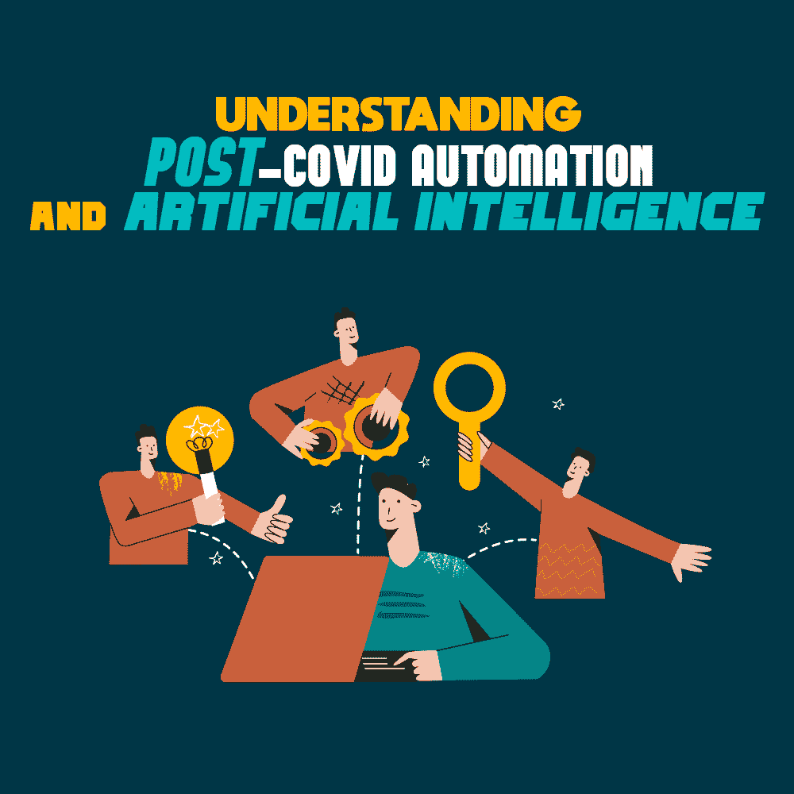

# 理解后 Covid 自动化和人工智能

> 原文:[https://simple programmer . com/understanding-post-covid-automation/](https://simpleprogrammer.com/understanding-post-covid-automation/)

In the space of a few days, the world went from functioning as we’ve always known into a global shutdown. Businesses were forced to adapt to this change, and quickly. For many, this meant dealing with a remote workforce for the first time. It’s fair to say that the Covid pandemic caused a lot of turbulence for businesses.

但这不仅仅是工作场所的后勤工作；通用流程也遇到了麻烦。这意味着供应链、网络安全以及更多方面的中断。系统暴露在外，许多企业难以跟上。突然间，组织需要部署自动化系统来维持运营。

事实是，这种变化是不可避免的。在 Covid 之前，我们已经看到了人工智能驱动的机器人过程自动化的发展趋势。疫情只是加速了这种变化。能够最快适应的企业是那些已经采取措施实现自动化的企业。

如果你是自动化领域的新手，你可能想知道什么是机器人过程自动化，或者你可能希望加深理解。那么，让我们从这里开始:自动化的过程到底是什么？

## 什么是机器人过程自动化？

机器人过程自动化(广泛称为 RPA)是一种不同于任何其他形式的自动化。自动化完全依赖于编码，这是一个具有预设结果的过程，而 RPA 使用人工智能( [AI](https://simpleprogrammer.com/trends-ai-and-ml-2022/) )来更加自主地完成任务。人工智能在公众心目中的口碑很差——很大程度上要归功于流行文化——但它还不是一个即将接管世界的可怕机器(至少，现在还不是！).

简而言之，人工智能就是机器试图模仿人类的思维模式来完成某些任务。在当今世界，这种技术随处可见，从自动驾驶汽车到种族识别技术。

RPA 使用人工智能来处理任务，消除了人为错误的因素。想想你的业务中所有不同的流程。每一个都可能需要一个有经验的工人来监督。无论出于何种原因，如果员工无法激活流程，您的业务可能会陷入停顿。

人工智能不仅可以让您的业务高效运行，还可以提供基于数据的见解，帮助改进流程。采用 RPA 的组织已经看到了[全面的改进](https://www2.deloitte.com/ro/en/pages/technology-media-and-telecommunications/articles/deloitte-global-rpa-survey.html)。这包括提高合规性(92%)、提高质量/准确性(90%)、提高生产率(86%)和降低成本(59%)。

## 自动化如何改变工作场所

几乎每个现代企业都存在某种形式的自动化，您的组织很可能已经投资了以下形式:

销售:销售时，你不太可能自己处理订单。大多数组织都有处理和跟踪订单的系统。进行人群测试总是一个好主意，以确保你的商店正常运行。

客户服务:越来越多的企业转向自动聊天机器人来处理某些查询。这有助于减少您的电话占线，并意味着代理可以专注于更困难的查询。此外，VoIP 软件，如 Vonage 或这些 [Vonage 竞争对手](https://www.dialpad.com/blog/vonage-alternatives/)中的一个，是人工智能在工作场所的另一个出色应用。

网站:你的网站可能包含几个自动化元素。这可能包括联系表单、邮件列表注册或可下载文件。为了所有这些不同的元素顺利运作，你需要正确的支持(来自 AI！).

如果有兴趣了解更多关于人工智能驱动的自动化如何改变工作场所的信息，请查看 Debanjana Dasgupta 的[Intelligent Automation Simplified](https://www.amazon.co.uk/Intelligent-Automation-Simplified-Enterprise-Use-cases-ebook/dp/B09KV3LX45/ref=sr_1_1?qid=1654517090&refinements=p_27%3ADEBANJANA+DASGUPTA&s=books&sr=1-1&text=DEBANJANA+DASGUPTA)，其中提供了一些精彩的见解。

## RPA 对我的业务意味着什么？

付诸行动，人工智能驱动的自动化可以影响你组织的几乎每个方面。让我们来看看这项技术的一些好处，以及为什么是时候在你的企业中改造[自动化](https://www.getomnify.com/blog/how-to-automate-your-business-operations-with-omnify-and-zapier)了。

### 加快流程并削减成本

使用 RPA，可以在几秒钟内将数据拷贝到电子表格中，并且大大降低了数据输入过程中出现(人为)错误的风险。时间和误差的减少，是足以看到 AI 价值的理由。

想想处理手工流程的困难。您可能正在收集大量数据。即使在执行[流程映射](https://processbliss.com/process-mapping/)后，数据也可能难以跟上，因为信息需要正确存储，以便以后可以访问。

正确存储数据有两个重要问题。首先，有一个时间因素要考虑。您的员工正在手动输入每一条数据，而数据的规模意味着这项任务可能需要未知的时间。第二，只要有一个微小的错误，你的数据就会变得毫无用处，除非你花更多的时间去寻找一个正确的错误。

请记住，数据添加到数据库的速度越快，就能越快地用于改善您的业务。例如，这可能意味着新的和创造性的营销形式。或者它可以用来帮助向[展示如何提高产品质量](https://www.globalapptesting.com/how-we-help/improve-product-quality)。

此外，RPA 是降低成本的好方法。有了自动化系统，你将需要雇用更少的人，为你节省一些现金。你雇佣的员工可以离开数据录入，把他们的技能用在其他有价值的任务上，帮助你发展业务。

### 遵守法律

Another aspect of properly handling data is the legal side. Today, people are much more aware of their data and how it’s being used, and this has brought about [new legislation](https://simpleprogrammer.com/improve-customer-experience-web-design/) to regulate the ways businesses can collect and handle data.

许多新法律都附带着令人痛苦的罚款。例如，欧盟的《通用数据保护条例》(通常被称为 GDPR)规定罚款高达 2000 万€。公平地说，大多数罚款都不会接近这个数字，但这确实表明了这个问题得到了多么严肃的对待。

这些新法律给许多企业带来了挑战，无论是大企业还是小企业。为了降低违反法律的风险，最好将数据访问权限限制在尽可能少的员工范围内。同样，这也是 RPA 派上用场的地方。因为流程是自动化的，所以对人工监督的需求有限。

### 更安全的数据

许多企业越来越担心数据泄露的问题。根据最近的一份报告，中小型企业每六个月就会遭受一次网络攻击。同样，感染一个电脑病毒会对你的数据造成极大的损害。

你的数据越不安全，你的声誉受到的损害就越大。

一些人表达了对 RPA 以及该系统可能会被轻易利用的担忧。但是这种担心很大程度上是没有根据的，你有责任向客户展示他们的信息在你手中是安全的。大多数现代 RPA 工具都带有端到端加密，这意味着您的数据非常安全。

**重要说明:**进行深入研究，确保您选择的 RPA 解决方案具备适合您公司的[安全功能。](https://simpleprogrammer.com/cybersecurity-basics-for-new-programmers/)

### 提供更好的客户支持

客户支持是企业的生命线。如果您遇到问题，您的支持热线是您与客户保持良好关系的最佳机会。但是处理客户支持并不容易。当谈到重视客户支持时，许多企业因缺乏关注而遭受损失。

你需要优先考虑客户支持。当一个组织没有得到你的支持时，你很有可能经历过挫折。这通常意味着长时间排队等待，却发现您的查询没有得到解决。普通顾客也会有同样的挫败感。

客户支持缓慢的主要原因之一是员工陷入了管理任务中。尽管这些工作显然很重要，但它们是重复性的，并且经常占用大量时间(尤其是在需要仔细注意的情况下，比如数据输入)。

借助 RPA，您可以自动执行这些任务，这样它们就不会因委派的职责而消耗您员工的宝贵时间，并将更多时间分配给客户支持。换句话说，更短的队列和更多的查询帮助！

重要的是你要学会如何计算 CSAT，看看客户是否对你的改变有积极的反应。

要获得克服客户支持常见问题的更多帮助，请查看 Sarah Hatter 的客户支持手册。

### 利用数据

在现代世界，数据是王道。有了正确的数据，我们可以改善组织的各个方面。这可能包括改进工作流程，创造更好的营销，或者制作一个更有吸引力的网站。但是首先你需要收集正确的数据。您还需要合适的分析软件来将数据分解成对您的业务有用的信息。

RPA 根据持续不断的数据进行操作，您可以通过多种方式了解这些信息。例如，您可以将 RPA 数据放入机器学习算法中，该算法可用于发现流程中的问题并建议优化步骤。这样，您可以提高组织的整体效率。

### 更好的电子邮件自动化

电子邮件是与客户保持联系的一种很好的方式——大多数企业使用电子邮件进行营销。通过电子邮件推荐计划，你甚至可以扩大你的客户群。

但是手动发送所有邮件是不切实际的。出于这个原因，几乎每个企业都使用某种形式的电子邮件自动化。这可确保客户定期收到信息，并减少员工的工作量。但是这种自动化还能改进吗？

RPA 可以通过多种方式帮助您实现电子邮件自动化。虽然其他自动化工具需要您编写代码行，但 RPA 不需要。它被特别设计成无需任何编程经验就能快速轻松地集成。

这意味着您的 RPA 可以开始安排您的电子邮件、验证电子邮件地址和清理您的电子邮件列表。

它还可以适应和修改，以适应您不断变化的电子邮件需求，而不必雇用经验丰富的程序员。您不仅可以节省资金，还可以根据需要灵活地修改您的电子邮件活动。

### 改善管理

没有人喜欢做行政工作，但这是一种不可避免的罪恶。RPA 可以让这种烦恼成为过去，处理琐碎的任务，让员工专注于更重要的事情。

例如，它可以完成发票处理的数据输入，帮助新员工入职，并通过检查时间记录和生成工资支票从头到尾支持工资流程。它还可以帮助对账、下销售订单和更新客户信息。

您也可以结合使用 RPA 和其他工具来进一步帮助管理。例如，[免费的在线合同生成器](https://www.pandadoc.com/contract-generator/)可以帮助减少建立合同所花费的时间。RPA 可以为您的团队提供无限的支持。

### 这会影响我需要的工人数量吗？

You might be thinking that with the rise of AI, you won’t need staff at all. But this isn’t quite the case. Bringing automation into your organization will reduce the number of manual tasks that you’ll need to complete—say goodbye to time-consuming data entry, basic customer service, and emails! This will inevitably mean a smaller number of staff is needed. But effective automation needs a knowledgeable workforce to go alongside it.

人工智能有局限性，远远没有发挥其全部潜力——有些任务超出了人工智能的技能范围。也就是说，如果要有效地完成这些任务，你需要拥有合适技能的员工。同样，虽然人工智能可能能够学习，但你不能给它分配[创新挑战](https://angelhack.com/blog/ultimate-guide-innovation-challenge.html/)，因为它不能创造性地思考。

将强大的员工队伍与合适的 RPA 技术结合起来使用，可以打造一支强大的团队。

### 我的员工需要改变吗？

自动化是未来。无论你从哪个角度看，世界都在变化。但是随着技术的改变，员工也必须改变。这并不罕见。看看 30 年前的世界与现在相比:技术发生了巨大的变化，现在的工人拥有不同的技能来完成任务。

展望未来，这种变化将需要再次发生。您现有的员工需要时间和培训来适应新技术。员工需要能够从后端使用人工智能系统。

例如，这可能包括在处理供应链时学习使用无人机。他们还需要知道如何[测试自动化指标](https://www.globalapptesting.com/blog/testing-metrics-how-to-demonstrate-the-value-of-testing-with-quantifiable-metrics)以确保系统正常工作。

你还应该考虑你在新员工身上寻找的技能。如果你想找到合适的人，这些也需要改变。介绍已经有人工智能工作经验的人总是好的，这样他们可以与他们的队友分享他们的专业知识。

## 现在就开始准备

向自动化的转变正在顺利进行。如果这种变化看起来令人生畏，这是可以理解的；新的系统和程序可能很难让你理解。然而，毫无疑问，自动化可以推动您的业务发展。

正如我们在这里所探讨的，您的业务中没有哪个方面不会受益于自动化。从人力资源到财务，从客户服务到市场营销，RPA 可以彻底改变您开展业务的方式，让您的员工生活更轻松。但是，请记住在引入新系统时不要着急，并真正评估哪些业务领域将受益最大。仔细检查每个部门，确保你执行了[自动化测试](https://www.codemotion.com/magazine/devops/qa-testing/automated-testing-guide-what-and-what-not-to-automate-when-testing-software/)以确保它正常工作。

当然，改变需要自下而上。你的员工也需要支持来适应。确保你有时间进行培训，并且你的员工知道可以提问。

所以，现在就开始准备，今天就拥抱未来！