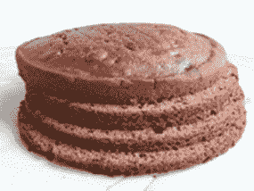

# 了解垂直切片

> 原文:[https://simple programmer . com/understanding-the-vertical-slice/](https://simpleprogrammer.com/understanding-the-vertical-slice/)

分解积压工作的最大挑战之一是知道如何将工作从积压工作中分割成大小合适的部分。

我已经谈到了越小越好的概念，但是我们还没有真正解决如何划分一个 backlog 以使它更小的问题。

## 默认路径

大多数试图将 backlog 分解成更小块的开发人员会自动走上使用“水平切片”的道路

这是我们倾向于思考的方式。

我说的水平切片是什么意思？

水平切片基本上是通过水平划分架构的特性或 backlog 的切片。

大多数东西都是这样建造的。

如果你要建一栋房子，你可能会从水平分割项目开始。

你首先要倒地基。然后竖起墙。然后装上屋顶和更多的台阶，把收尾工作留到最后。

在敏捷开发中，同样的想法通常被应用于打破积压。

建造一栋一次完成一个房间的房子似乎很愚蠢。

## 敏捷软件开发是不同的

然而，以敏捷的方式开发软件和建造房子之间有着明显的区别。

最大的区别在于，在敏捷软件开发中，真正的敏捷开发，在你完成构建之前，你不知道你要构建什么。

对于房子来说，这种情况很少发生。

有了房子，你就有了一些提前画好的蓝图。你知道每面墙和每个插座的确切位置。你甚至可能在那之前建造过非常相似的房子。

当构建软件时，除非你采用瀑布方法并预先计划好一切，否则在完成之前你不知道你真正在构建什么。

在你反对这种说法之前，请想一想:

**这就是敏捷开发的要点。**

敏捷意味着对变化做出反应。

建造房屋时，你不会期望顾客说:

“嗯，是的，我不太喜欢那面墙。”

"事实上，我想我们现在需要 5 间卧室."

在软件开发中，您期待类似于上面的语句！

## 那么什么是垂直切片呢？

简单来说，一次建一个房间。

但是没有功能！谁想要一个一个房间的房子？！？

正确！它没有房子的功能，但我们可以浇筑更多的地基，改变我们如何做其余的房间，甚至推倒墙壁，重新开始，而不会产生巨大的成本。

“一次一个房间”构建我们的软件的要点是，我们给客户一个机会，让他们看到产品是以对他们重要的方式构建的，并使他们能够测试它。

当然，在这一切完成之前，他们不会住在里面。但是，他们将有能力走进一个房间，想象里面有他们所有的家具。

顾客不关心地基和墙内框架。作为一名开发商，你可能可以看到一些地基和框架，想象房子会是什么样子，但客户不能，更糟糕的是，它不能被测试。

软件开发中的垂直切片是将可能有一些数据库组件、一些业务逻辑和一个用户界面的积压工作分解成小的逐步进展，其中每个步骤贯穿每个切片。

这个想法不是将待办事项分解成以下几项:

*   为 A、B 和 C 实现数据库层
*   为 A、B 和 C 实现业务逻辑层
*   实现 A、B 和 C 的用户界面

积压被分解成如下内容:

*   从头到尾实现一个
*   从头到尾实现 B
*   从头到尾实现 C

## 听起来很简单，为什么要争论？

因为不容易。

我不想对你撒谎。横向分割 backlog 要容易得多。

作为开发人员，当我们计划 backlog 的实现时，我们倾向于考虑水平切片。

我们倾向于通过一次构建一层来实现事情。

考虑如何将一个积压分成垂直的部分，需要我们跳出对代码和实现的理解，转而考虑工作功能小部分的积压。

对于大量的积压工作，几乎总是可以找到一些功能的进展。

我的意思是，在软件开发中，为了生产和最终结果，几乎总是可以在功能上创建更小的步骤或演进。

有时候，垂直分解积压工作所需的步骤会导致一些浪费。

有时你会有目的地创建一个基本的用户界面，你知道当你实现更多的垂直切片时，你会重做它的一部分。

这样就可以了！

计划少量的返工比一次构建一个完整的特性，然后不得不返工特性中没有计划的大部分要好。

## 那么好处是什么呢？

你可能会想，这听起来像是更多的工作，却没有太多的好处。那么，我为什么要费心纵向分解一个积压呢？

真的有那么重要吗？

我已经暗示了垂直切片的一些好处。

垂直切片背后的真正动力是敏捷方法的基石。这是关于尽快交付工作功能。

我们不打算在敏捷开发中涵盖这一思想背后的全部推理。我假设您已经认同尽快交付工作功能是重要且有价值的想法。

仅仅基于这个前提，你就可以看到水平切片直接违反了敏捷方法的核心租户之一。

令我感兴趣的是，有多少人强烈支持将整个系统分解成功能块，一次交付一个功能块，但在处理单个待办事项时却反对在小范围内这么做。

如果你反对我所说的关于垂直切片的观点，你真的要问问自己，你是否真的认同应用于更大层面的相同观点，因为真的没有区别。

如果你有技能，但你看不到你在职业生涯中应得的成功，那么一定要参加我们简单的程序员课程[“如何作为一名软件开发人员推销自己”。](https://simpleprogrammer.com/store/products/how-to-market-yourself/)T3】