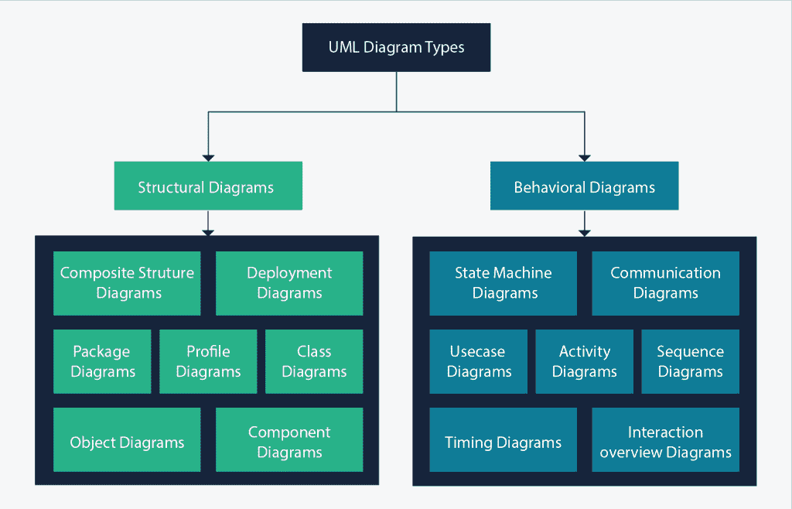
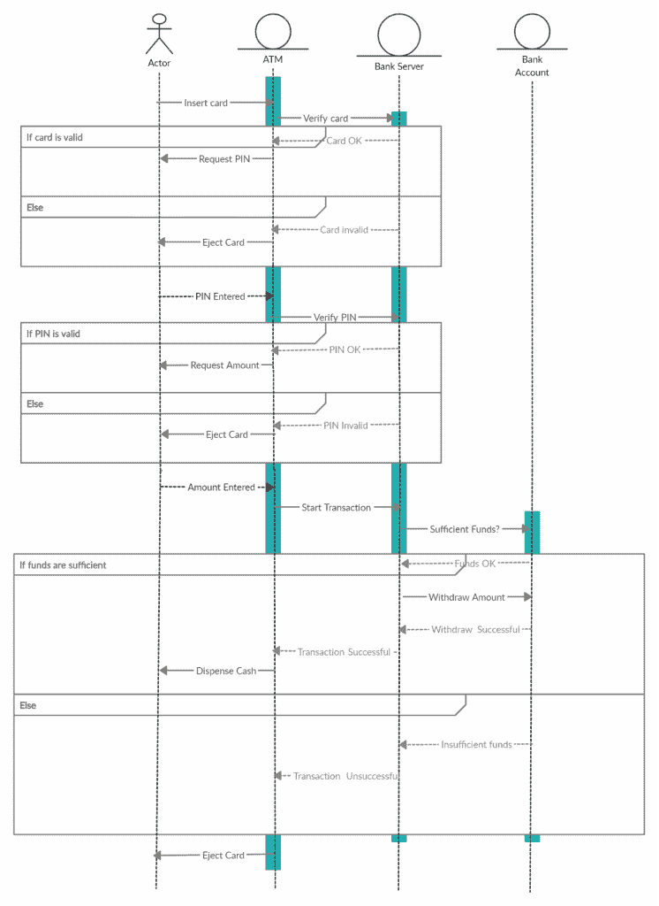
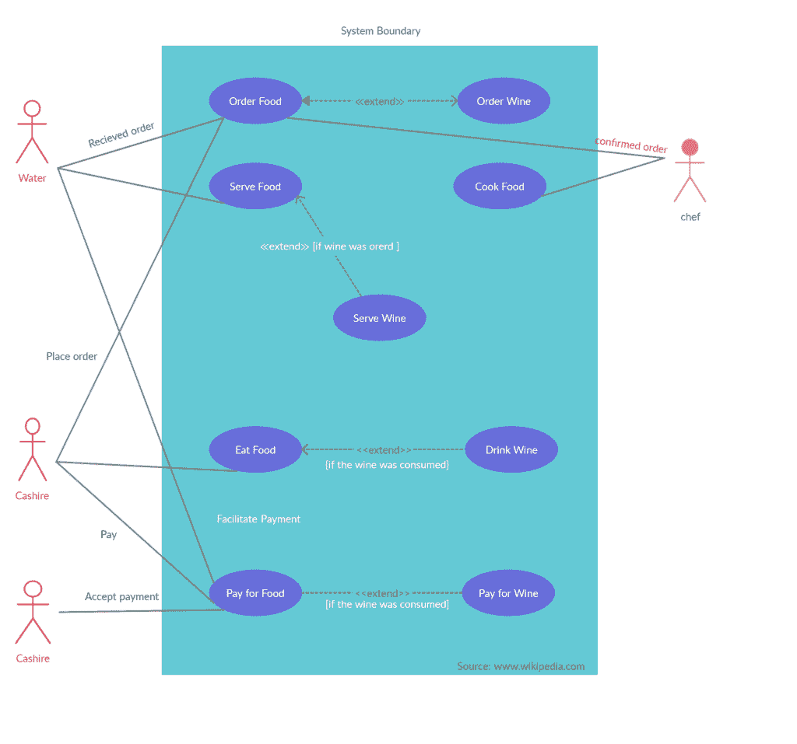

# 敏捷时代的 UML:为什么它仍然相关

> 原文：<https://simpleprogrammer.com/unified-modeling-language-age-of-agile/>

Development is a constantly evolving field and as developers we are always looking for quicker and more efficient ways to solve problems. Throughout the years, the ways we approach and adapt to problems have changed.

敏捷开发过程作为一种将软件视为一系列需要解决的迭代问题的方法，已经变得越来越流行。敏捷的测试、学习和适应模型已经导致了更多的边做边学，这减少了像统一建模语言(UML)这样的广泛框架概念的使用。

UML——包括创建和可视化整个系统的过程以及它们如何相互作用——被认为是过时的。但是忽视像 UML 这样的基本概念是有后果的。

在这篇文章中，我将分析 UML 如何仍然在开发过程中发挥重要作用，以及它如何使我们成为更好的编码者和思考者。然而，在我们深入研究这些之前，让我们先来看看统一建模语言到底是什么。

## 什么是 UML？

UML 最初创建于 1994 年，是为了标准化软件设计中不同的符号系统。它基本上是一种统一的建模语言，包括一组集成的图表，创建这些图表是为了帮助软件和系统开发人员可视化、指定、记录和构建软件系统工件和非软件系统以及业务建模。

统一建模语言是在复杂系统建模中非常成功的工程最佳实践的汇编。

UML 确实是开发软件开发过程和面向对象软件不可或缺的组成部分。它主要利用图形符号来表达软件项目设计。使用 UML 帮助项目工作团队进行交流，探索潜在的设计，并验证软件的架构设计。

## UML 的使用:不同种类的应用程序

统一建模语言有许多不同的应用。您可以使用它来开发图表，并为程序员提供富有表现力的现成建模示例，这些示例基本上描述了系统的[结构和行为。](https://www.amazon.com/dp/0262510871/makithecompsi-20)

一些 UML 工具交付来自统一建模语言的程序代码。您可以使用 UML 来建模不依赖于平台语言的特定系统。

此外，UML 拥有超越软件开发的应用，比如制造业中的流程。这解决了敏捷所不能解决的问题，并允许您在整个业务环境中看到您的开发需求。这种预先的或“瀑布”式的过程允许您立刻考虑整个系统，并让您灵活地看到不同的系统如何相互作用。

## UML 的好处

今天使用 UML 有几个好处，并且找到将它合并到您的开发过程中的方法可以改进您的思维过程并导致更大的组织效率。下面是一些使用 UML 图可以有所帮助的方法。

### 让新开发人员或团队成员快速上手

在开发人员开始编码之前，统一建模语言图可以帮助项目中的每个团队成员达成共识。由于这些图表的简单性，你也可以让新的团队成员快速上手。

此外，通过理解他们试图构建的系统，开发人员可以委派他们的工作，在实际工作开始之前找出潜在的问题，然后朝着共同的目标高效地工作。

### 定制 UML 图中的元素

使统一建模语言非常需要并且非常适合软件开发的是它的高度灵活性。您可以自由地在统一建模语言图中定制您的建模交互和元素，特别是为了适应您正在使用的技术或领域。

### 在编程之前规划出新的特性

统一建模语言有助于在任何[编程](https://simpleprogrammer.com/best-programming-books-2019/)之前规划新特性。这允许您在开发开始之前识别问题或潜在的问题区域。这可以降低任何程序实现过程中的开销。

此外，统一建模语言模型图很容易更改，而对某个代码段重新编程可能会非常耗时和乏味。

### 更轻松地与技术和非技术受众交流

统一建模语言的最大优势之一是它允许与技术和非技术受众进行简单的交流。

例如，如果您正在考虑使用 UML 来解释不同的软件设计模型，那么可以有把握地假设大多数软件专业人员在某种程度上都熟悉 UML 图。这使得来回通信变得容易。

此外，您只需要了解 20%的统一建模语言，就可以描述 80%的建模需求。在 UML 图的帮助下，您不需要理解或知道完整的符号来有效地交流。

## UML 图的类型

UML 图甚至可以整合到您的敏捷开发中。通过更好地理解不同类型的 UML 图及其用途，您可以开始根据您的特定需求创建自己的 UML 图。

### 结构图

这些图显示了建模系统中的事物和元素。更专业地说，它们显示了一个系统的不同对象。

*   类图(Class diagram)——这些是几乎所有面向对象方法的关键，也包括 UML。类图描述了系统的静态结构。
*   **组件图**–这些图描述了物理软件组件组织，包括可执行程序、运行时代码和源代码。
*   **部署图**–部署图显示了系统的物理资源，包括组件、节点和连接。
*   **复合结构图**–这些图描述了一个类的内部部分。
*   **对象图**——对象图说明了系统在某一时刻的静态结构。你可以用它们来测试类图。

### 行为图表

这些图表显示了系统如何运行以及如何与自身和其他实体(用户、其他系统)交互。它们显示数据如何在系统中移动，对象如何相互通信，时间的流逝如何影响系统，或者什么事件导致系统改变内部状态。

**序列图**–这些图展示了不同类之间随着时间的推移在消息交换方面的交互。

这个序列图显示了在自动柜员机上与客户的交互。它可视化了系统如何交互以及以什么样的顺序交互，允许你更好地理解如何最优地建立开发流程。

**活动图**–这些图通过模拟从一个活动到另一个活动的控制流来描述系统的动态特性。活动表示对某个特定类的操作，该操作会导致系统状态的改变。通常，您可以使用活动图来建模内部操作和业务流程或工作流。

**用例图**——这些图使用用例及参与者对系统的功能进行建模。

用例图有助于你更好地跟踪和可视化参与者如何在给定的系统中移动。这是一种很好的低技术含量的方法，可以识别潜在的问题以及系统可能会在哪里崩溃。

## UML 已经死了。UML 万岁

我们的开发技术需要与时俱进。虽然敏捷在如何处理和解决问题方面有不可否认的好处，并且可能更适合当前的软件需求，但重要的是我们在这个过程中不要忘记开发的 T2 基础。

像 UML 这样的技术可以改进我们的过程，让我们不仅成为更好的开发人员，而且成为更好的思考者。找到将 UML 这样的实践整合到当前开发模型中的方法，可以让您拥有一个强大的基础框架，同时保持敏捷和创新。