# Unity VR 开发简介

> 原文：<https://simpleprogrammer.com/unity-vr-development/>

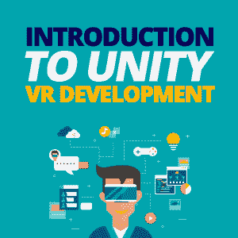

The virtual reality (VR) market has been taking giant steps in the last couple of years. The VR industry is now backed by giants like Facebook, Microsoft, and Samsung. This pushes the market even further by decreasing prices of VR headsets and improving the quality of those gadgets.

全球[虚拟现实市场](https://www.zionmarketresearch.com/report/virtual-reality-market)在 2016 年价值 20 亿美元，预计到 2021 年将增长十倍[。虚拟现实的发展也顺应了这一趋势。](https://www.zionmarketresearch.com/news/virtual-reality-market)

但是作为一名开发人员，这为什么会引起您的兴趣呢？

第一个原因是挑战。在完成一个新项目后，用一种完全不同于你习惯的技术来做这个项目可以刺激和刷新你的大脑。

第二个原因是虚拟现实已经存在。我们可以预计，越来越多的开发人员将从目前的职位转向 VR 相关的职位。因此，当虚拟现实开发成为行业中薪酬最高的工作之一时，如果 web 开发变得过时，不要感到惊讶。

尽早开始意味着利用先发优势，这肯定会带来长期的好处。毕竟，[离开自己的舒适区](https://simpleprogrammer.com/which-of-these-fears-is-holding-you-back/)从来不会伤害任何人。

如果你决定冒险尝试 VR 开发，第一步是选择要使用的设备和平台。让我们从设备类型之间的基本差异开始。

## 入门:选择设备

两种主要的 VR 设备类型是移动 VR 和控制台 VR。移动虚拟现实是一个独立的设备，连接到 iPhone 或 Android 手机。它是无线的，不需要额外的硬件，使它更容易访问。另一方面，控制台 VR 连接到计算机或游戏控制台，如 PlayStation。目前，与其他需要强大计算机来运行 VR 游戏和模拟的主机相比，移动 VR 头戴设备的成本相对便宜。

移动 VR 和主机 VR 的主要区别在于体验的沉浸感。

由于硬件限制，移动 VR 无法提供完全沉浸式的体验，因为它只能实现陀螺仪跟踪，因此用户可以 360 度环视。控制台 VR 通过使用传感器来跟踪玩家在房间尺度内的位置，以及他们的手和手指运动，从而为体验增加了更多的自由度。正如您可能猜到的那样，这提供了一种完全身临其境的体验。

如果玩家想在使用移动虚拟现实时四处移动，他们可以通过转移视线或蓝牙控制器的模拟翻译来实现。这个动作会导致头晕，必须仔细调整和测试，以使动作尽可能平稳。

开发人员现在正在竞相为 VR 环境创建解决方案，并解决 VR 使用的一些问题(如晕车)。另一方面，主机 VR 大部分时间使用手部瞬移和模拟控制输入。尽管如此，开发人员仍在开发其他解决方案，以提供无缝的沉浸式体验。

如前所述，市场上有多种 VR 头戴设备。最受欢迎的是 HTC Vive、 [Oculus Rift](http://www.amazon.com/exec/obidos/ASIN/B073X8N1YW/makithecompsi-20) 、PSVR，以及其他针对移动 VR 的设备，如谷歌 Cardboard 和[三星 Gear VR](http://www.amazon.com/exec/obidos/ASIN/B074GB37V8/makithecompsi-20) 。由于目前的技术可能会在一年内过时，所以在选择开发设备时，请考虑一下[即将推出的耳机版本](http://vrborg.com/review/is-psvr-still-worth-buying-should-i-get-it-or-wait-for-next-generation)。我们可以期待 PlayStation (PSVR)、HTC 和 Oculus 在不久的将来发布新产品。

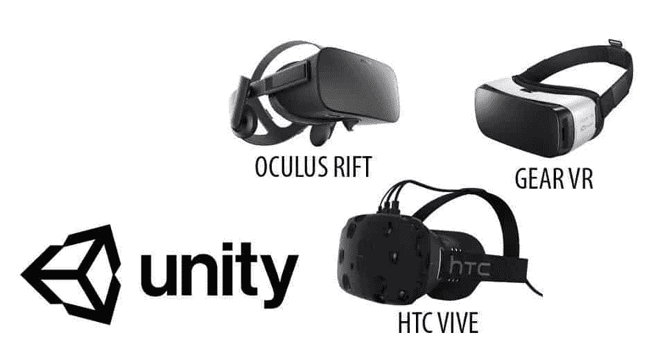

## 选择一个平台

选择设备后，下一步是选择平台。为 VR 开发需要对游戏引擎有一些基本的了解，也需要一些编码知识。许多开发人员正在探索成为 VR 开发人员的选择，因为市场每天都在扩大，而没有足够的人可以为这个特定的平台开发。

目前，有一系列的体验可以在 VR 中提供，包括第一人称视角的游戏，玩家用手射击和驾驶车辆；商业方面，公司开发虚拟现实解决方案，培训员工完成特定任务；观看风景；和建筑可视化。最常见的 VR 开发平台有 Unity、Unreal、Android、iOS。

虚幻是艺术家的首选，因为它有一个更好的材质系统的质量，照明和可用性；简单的资产导入；更广泛的建筑工具；和预建的地形系统。虚幻项目可以部署到 Windows、Mac、Linux、手机上；然而，Android 的支持并不像 Unity 那样广泛。由于昂贵的耳机，大多数 VR 项目都是在纸板上测试的，在这种情况下使用 Unity 更有意义。使用原生 Android 和 iOS 平台构建应用程序也是可能的，但对于初学者来说，这可能是太多的工作。

## VR 开发教程

一旦你选择了虚拟现实的设备和平台，就该开始学习教程了。

出于本指南的目的，我们将针对 [Oculus Rift](https://www.oculus.com/rift/) 。为了开发虚拟现实，你需要一个叫做软件开发工具包的东西。互联网上有多个针对每个平台的 SDK，比如 Oculus SDK、OpenVR SDK、VRTK、GVR 等等。

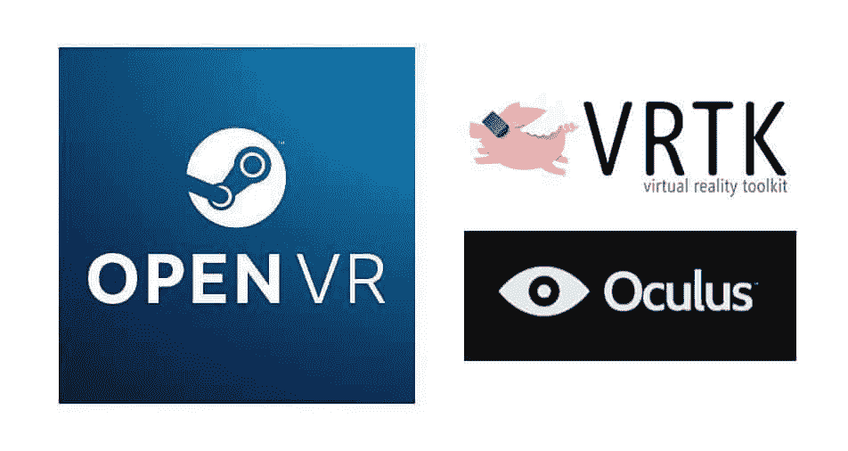

要开始使用 Unity 3D 游戏引擎为 Oculus Rift 或 Vive 开发，你需要对如何使用该引擎有一个基本的了解——例如，如何向这些对象添加游戏对象和行为，以及如何导入资产。如果你对此不熟悉，我建议你查阅 Unity 手册和入门教程。没有这些步骤就无法继续。我们将使用由 Steam 开发的 OpenVR SDK，它针对市场上的一些 VR 设备，如 Oculus 和 Vive。

首先你需要[下载安装](http://store.steampowered.com/steamvr) Steam 和 SteamVR。一旦你安装并运行了 SteamVR，并将 Oculus 连接到你的计算机或开发平台，你将会看到一个弹出的确认消息，告诉你 SteamVR 已经准备好了。

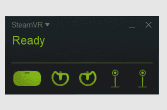

然后，您需要启动一个新的 Unity 项目，将其标记为 3D 项目，并选择一个您想要保存它的目录。

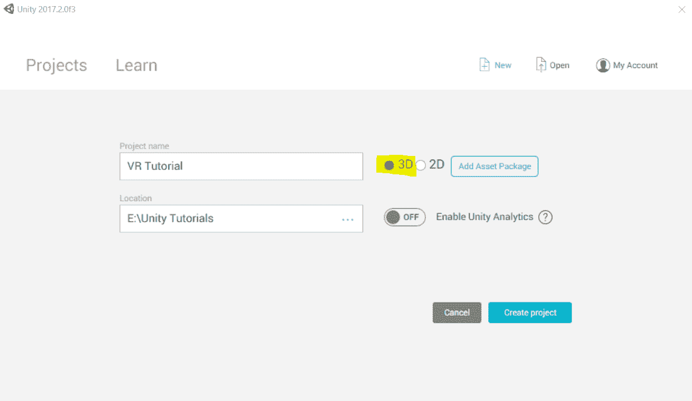

Unity 界面基础和改动可以在 [Unity 官方教程](https://unity3d.com/learn/tutorials)页面查看。在那里，您还可以了解更多关于界面和引擎的信息。

创建项目时，需要在引擎内部启用 VR 模式，启用 VR 开发。这可以通过*编辑>项目设置>玩家> XR 设置*来完成，然后勾选“支持虚拟现实”按钮。

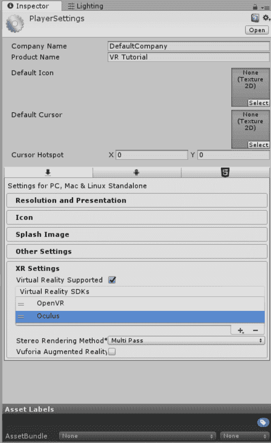

然后，你需要确保 OpenVR 在 Oculus 或列表中的其他 SDK 之上。如果它们在层次结构中设置不正确，这可能会导致一些冲突。

接下来，你需要从 [Unity 资产商店](https://assetstore.unity.com/packages/templates/systems/steamvr-plugin-32647)页面下载并导入 SteamVR 插件到 Unity 项目中。

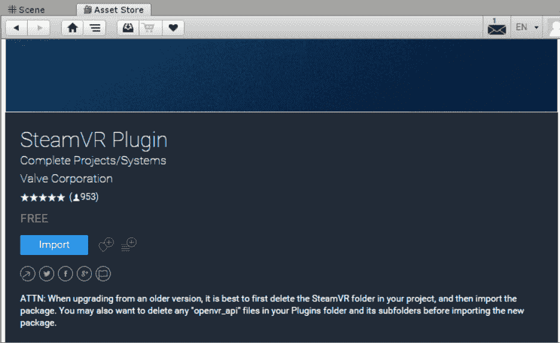

一旦你导入了插件并设置了支持 VR 的项目，你就可以戴上你的 Oculus 并看到你正在开发的场景。

当您启动项目时，场景中的主摄像机可以充当立体 VR 摄像机。你需要把相机放在场景中正确的位置。然后，您可以添加像立方体和平面这样的对象作为参考。

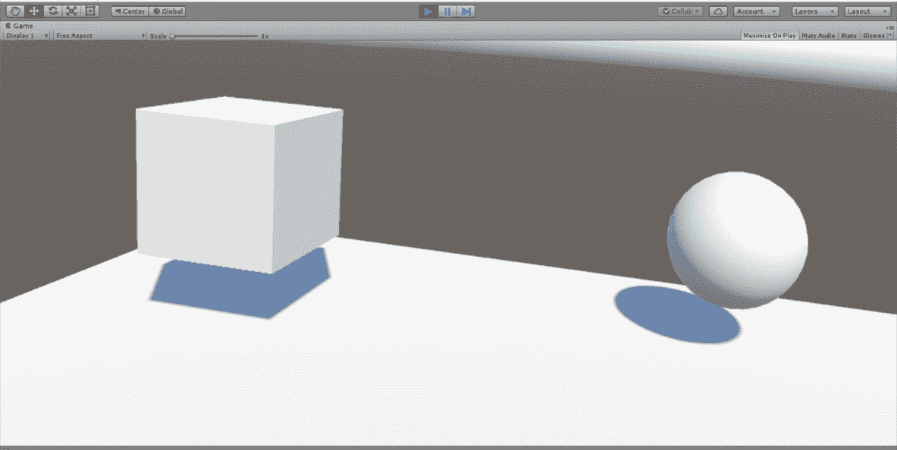

现在，为了更多的功能，我们还需要启用手部跟踪。为此，我们可以将*预设*对象放入一个名为 **CameraRig** 的 SteamVR 插件中，或者我们可以用相机设置场景。

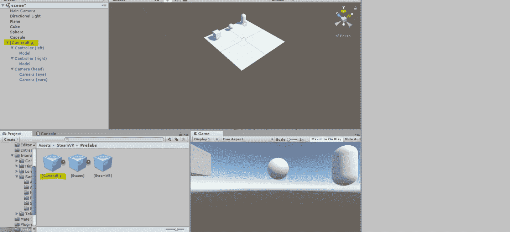

在你的项目结构中，浏览 SteamVR 插件文件并找到*预置*子文件夹。这包含像 CameraRig 这样的对象，一个预先制作的游戏对象，它为控制器(左和右)游戏对象启用了控制器跟踪，并附加了 *SteamVR_TrackedObject* 脚本。

现在，如果你玩这个游戏，你可以看到你的 Oculus Touch 控制器被场景中的 Oculus Touch 模型跟踪。

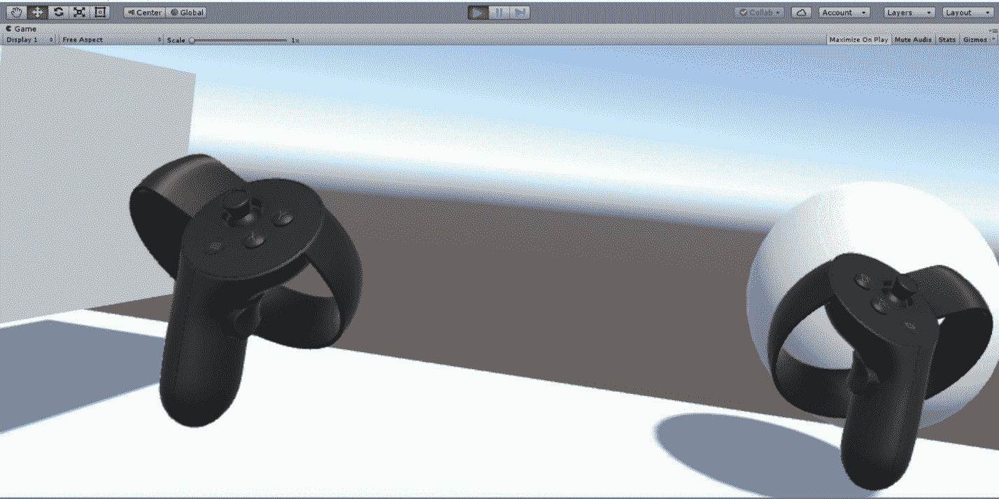

现在，通过这个简单的演示，您可以探索您在 VR 中创建的虚拟世界。你有头部跟踪和双手跟踪。

您可以在不打开引擎的情况下构建并测试这个进程，这可以从上面的菜单栏(*文件>构建设置>构建)*轻松完成。现在，您已经有了一个不使用引擎就可以运行的可执行文件。

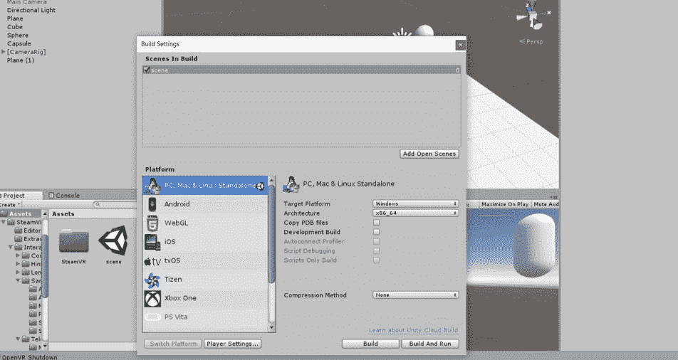

使用本教程完成的内容，您将能够创建一个 VR 漫游，在其中您可以显示任何 VR 内容，如模型和动画。然而，在虚拟现实的世界中，这被称为“被动体验”，因为你不与场景互动或对场景做出贡献；“玩家”只是显示和查看内容。

## 虚拟现实已经存在

虚拟现实是一个正在成长的行业，它应该成为任何开发人员的目标，成为这项技术的早期采用者。除了前面讨论的挑战和个人发展，我们可以预计，在未来十年，该领域的招聘将呈指数级增长。

基于你的项目，你需要决定你想要在场景中实现哪些 VR 机制。例如，在建筑可视化中，最重要的机制是在场景中移动和导航。但是，您可以添加另一个功能，在该功能中，您可以更改场景中的模型，甚至更改模型上的材质，从而为用户提供更具交互性的体验。

你可以用 SteamVR 做很多很酷的事情，比如在场景中传送和移动，甚至通过携带或投掷其他物体来与它们进行交互。这些主题稍微高级一点，我们可能会在其他指南中涉及到。