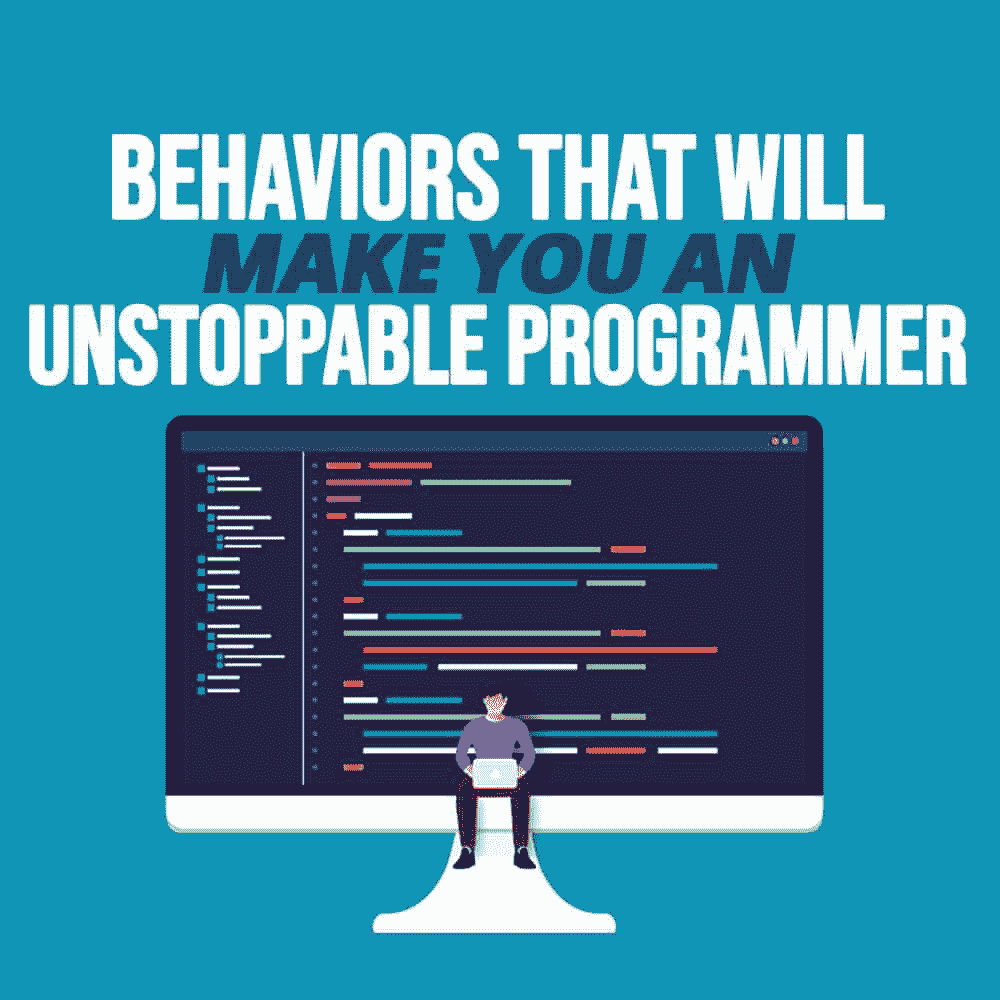
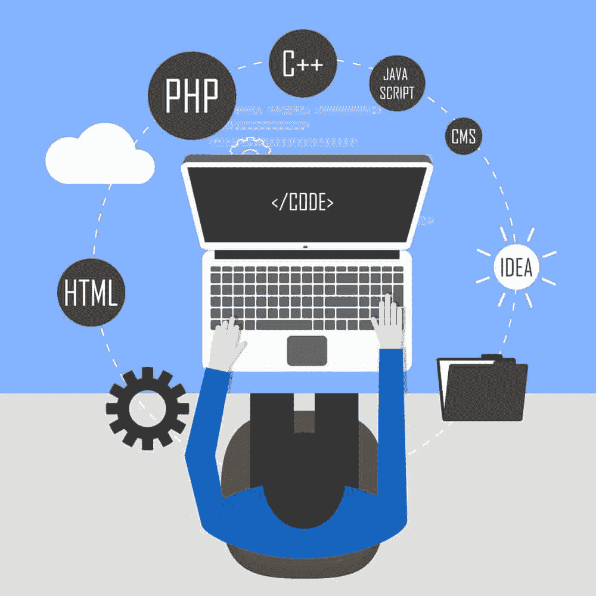

# 让你成为不可阻挡的程序员的行为

> 原文:[https://simple programmer . com/unstopped-programmer-behaviors/](https://simpleprogrammer.com/unstoppable-programmer-behaviors/)

<figure class="alignright is-resized">

</figure>

无论您是一名拥有几个 Hello Worlds 的初涉开发人员，还是一名拥有 10 多年经验的资深软件工程师，每个开发人员都会在某个时候想到一个问题:

“我如何成为一名不可阻挡的程序员？”

好吧，也许不应该这么说——但是你明白了。关键是要像他们一样。

我们都见过*他们*:那些在睡梦中编写代码的专家，他们似乎总是知道任何问题的正确解决方案。他们是 10 个不同开源项目的最大贡献者，他们的 GitHub 贡献图是纯绿色的，他们甚至可以在一夜之间为你最古怪的功能想法提供原型。

那么，你如何成为他们中的一员呢？

好吧，这个问题的答案是没有灵丹妙药，因为“不可阻挡的程序员”意味着不同的东西，取决于有问题的开发人员。但是，不要担心，因为开发人员仍然可以做很多小事来磨练他们的技能，使编写优秀的代码变得轻而易举，即使他们在前进的道路上面临一些糟糕的日子。

先说最重要的:练习。

## **养成规律的习惯**

首先也是最重要的一点，除了有规律的、有意识的练习之外，没有一个开发人员在编程方面做得更好。编程是一种技能，就像任何技能一样，需要时间、耐心和不断的挑战才能变得更好。

一些练习的方法可能是:

### **面试问题**

最近几年，一些顶级科技公司的大量面试问题已经出现在网络上。现实世界中有成千上万的面试问题，从基本的到非常难的都有，所以初学者和专家都可以找到一些有用的概念来练习。

如果回答一系列问题听起来很无聊，那么总会有[intervaling . io](http://interviewing.io)这是一项免费服务，它将谷歌等公司的工程师与希望练习面试技巧的人联系起来。

### **代码卡塔斯**

在武术的意义上，形指的是帮助练习者掌握他们正在学习的任何动作的小练习。

对于代码形，概念很简单:每天练习一个小练习，一遍又一遍，每次都实施它，并做一些小的改进，直到你知道它向前，向后，和每一个方向。

每个形的目标是提供一个练习新概念的空间，以便内化它们，使你的形解决方案在每次迭代中更好更优雅。

就像面试问题一样，万维网上不缺少表格，从众包列表到精选，以及围绕提供引人注目的代码表格而建立的整个业务。

## **不要孤立地练习**

<figure class="alignright is-resized">

</figure>

当谈到磨练编程技能时，你只能靠自己走这么远，找一个更有经验的人可能是更快提高的最好方法之一。

有其他人在旁边回答问题，这可能是因为你找不到合适的关键词而花了三个小时试图找到问题的解决方案，与找到一个在第一个结果下完全符合你要求的库之间的区别。

幸运的是，编程通常是一种合作的体验，你将有机会与更有经验的程序员合作，他们在你的职业生涯中与你有着相同的经历。

这种协作的形式可以是提交拉式请求并让它们得到审查，参加会议，或者编写文档供其他开发人员阅读。

见鬼，即使你没有被更有经验的程序员包围，你仍然可以去 Stack Overflow 这样的地方找到那些等在周围回答你的问题并提供指导的人*。*真是个世界。

更重要的是，自己回答关于堆栈溢出的问题是巩固你已经学到的技能的好方法。毕竟，他们说，除非你能向别人解释，否则你不会真正理解一件事。

## **吊儿郎当！**

无论是新的数据科学库、新的测试套件，还是您从未使用过的前端框架，阅读文档永远无法取代直接的经验。

即使只是从软件的快速入门指南中复制和粘贴代码片段，也能产生很大的不同。作为一名程序员，实际运行代码并自己动手操作是你可以养成的最好习惯之一。

本质上就是玩玩！

在最基本的层面上，这可能仅仅意味着尝试函数并观察它们的输出，也可能意味着故意破坏一个脚本并把它重新组合在一起。你甚至可以尝试[为你感兴趣的事情创建一个定制的移动应用](https://topflightapps.com/ideas/custom-mobile-app-development-guide/)。

随着您对正在使用的代码越来越熟悉，您可以尝试用自己的代码来扩展它，以更好地满足您的需求。

## **回头看看你的旧代码**

任何编程时间长短的人都必须与过去的自己作斗争。“过去的你”有非常好的意图，当他们每次需要一个特定的数据时，他们就索引那个列表。过去，你不可能知道字典会是一个更经济的解决方案。

重要的是“现在的你”能够指出你的错误，并且知道下次你该如何更好地执行。

查看自己的代码，虽然有时会很痛苦，但这是一种很好的方式来记录你作为一名程序员已经走了多远，并在面临新问题时提供你继续前进所需的动力。你会知道“未来的你”会支持你。

## **学习新语言**

<figure class="alignright is-resized">

</figure>

向各地程序员推荐的经典书籍之一是安德鲁·亨特和戴维·托马斯写的《实用程序员 》。在这篇文章中，作者为希望在各个领域做得更好的程序员提出了许多建议:从业务开发到更好的代码重用习惯。

然而，书中有一条建议已经完全渗透到了编码的时代精神中，那就是每年学习一门新的编程语言。现在，这可能听起来像一个高要求，但很难否认掌握几种语言带来的优势。

这听起来有些愤世嫉俗，但懂得几种语言的好处之一是它可以让你非常有市场。了解 Python *和* [JavaScript](https://simpleprogrammer.com/get/javascriptgoodparts) *和* PHP 不仅能让你申请更多的潜在职位，而且在简历上看起来也很棒(只要你能备份！).

当然，还有另一个明显的好处——当你解决一个新问题时，你将有另一种语言可供选择。但是更重要的是，你会开始理解为什么你应该选择一种语言。

例如，您可能会了解到，Erlang 字符串本质上是一系列整数，并且您可能应该转向 Python 来满足您的自然语言处理需求，同样，您可能最好转向 JavaScript 来满足您的 HTML/DOM 控制需求。

学习新的语言对你来说可能听起来是一个太大的承诺。在这种情况下，你应该致力于另一个不可阻挡的程序员的关键技能:熟悉你的工具。

## **学习你的工具**

现在，没有必要在这里点燃由来已久的 Vim 与文本编辑器之争(或者但愿不要发生 Vim 与 Emacs 之争)。相反，让我们坚持一般的建议，你应该学会尽你所能使用你的工具。

你的编辑器，是的，就是这些工具中的一个，并且有令人信服的理由去学习各种形式的 vi 或 Emacs，即使有一天你回到你舒适的文本编辑器。

然而，即使你不选择走这条路，那也不是不了解它的一切的借口。学习键盘快捷键，学习如何安装附加包，找到你喜欢的 linter，如果你的编辑器可以设置断点(他们几乎都可以)，那就使用它们！

也不要只关注你的编辑。了解您最常用的命令行实用程序的所有标志，理解您选择的 shell(并考虑学习用它编写脚本)，并确保您总是阅读手册

学会使用你的工具不仅让你在门外汉面前看起来像个巫师，还能显著提高你的工作效率。

## **专攻**

好吧，我们仍在努力不去煽动任何互联网纠纷，但这不得不说:**全栈开发者并不真正存在。**

现在，在干草叉出来之前，开发人员不可能学到构建和管理一个成功的软件所需的所有东西。

更确切地说，没有一个全栈开发人员能够以同等的能力完成所有这些事情。在任何全栈开发团队中，可能有人更喜欢管理基础设施和安全问题，或者有人喜欢摆弄前端的东西，等等。

专业化意味着选择一个你喜欢的专业领域，通过增加补充你专业知识的技能来更深入地钻研。显然，你不会忘记所有其他的技能，没有比在你感兴趣的领域拥有广博的知识更能给雇主和同事留下深刻印象的了。

也就是说，你绝对可以成为一个成功的万事通，但要确保你是某个领域的大师，而不是一个都不精通的 T2。

## 保持下去！

这就是全部了！做到以上所有的事情，别无他求，我保证你会成为一名不可阻挡的程序员。

不，很明显那是个笑话。成为更好的程序员有许多不同的方法，不可能在一篇文章中列出所有的方法。如果这些建议都不能引起你的共鸣，那就寻找其他方法来提高你的技能。重要的是你要不断尝试。

<figure class="alignright is-resized">

</figure>

许多程序员发现自己患有冒名顶替综合症，认为在对自己的技能有信心之前，他们需要成为世界上最好的程序员。讽刺的是，为自己破除这个神话是成为一个真正不可阻挡的程序员的关键一步。

不管是初学者还是专家，只要你每天努力学习更多，你会发现自己有如此大的动力，你将无法成为不可阻挡的人。