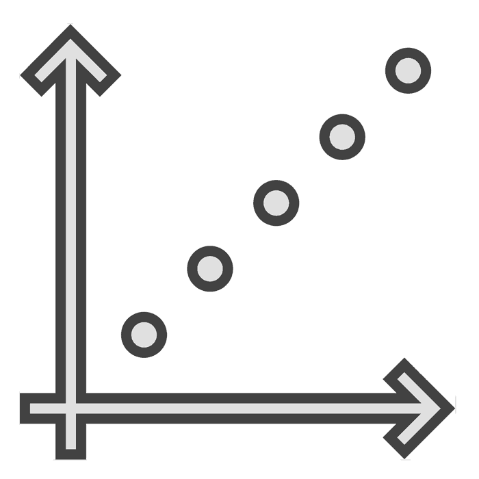
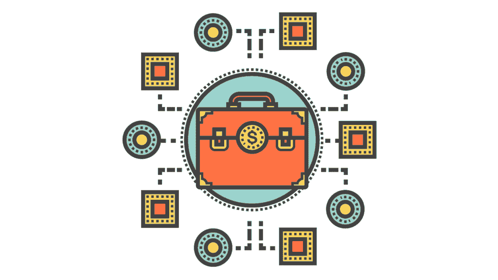

# 如果它没有被打破:在一个传统的世界里争论升级

> 原文：<https://simpleprogrammer.com/upgrading-legacy-code/>

Jonathan Boccara 上个月写了一篇很棒的文章,讲述了当我们必须处理遗留代码时，良好态度的重要性。但是，当不仅仅是遗留代码，而是整个系统都需要升级时，该怎么办呢？在这种情况下，您有机会提出升级遗留系统的理由。

可能是你有机会做一个正式的演讲，或者是某个重要的人问你对这个系统的看法。了解如何支持升级或更换遗留系统非常重要，这样当机会到来时，您就能做好准备。

我从小就听父亲重复那句老话，“如果它没坏，就不要修理它。”这一直困扰着我。从小到大，我喜欢建造东西，并试图找到改善现状的方法。你所拥有的可能会起作用，但是如果有一种方法能让它更好地发挥作用呢？

“更好”，在这里，可能意味着工作更快，使用更少的资源，操作更简单，或者在截止日期前完成更多的工作。这可能意味着更少的停机时间和更少的维护成本。

驱动“如果它没有坏，就不要修理它”信念的一个误解是，保持事物的原样比冒险花费时间和精力去改进已经运行的事物更容易。这在短期内是正确的，但从宏观角度来看，已经多次被证明是错误的。当我们着眼于更长时间内的复合节约(比如说两到四年)时，系统升级的初始投资相比之下通常显得很小。

我认为我们应该永远努力改进。马和车一点也没有坏；然而，这并没有阻止内燃机的发明和进步。不幸的是，在 IT 领域，这句老话被如此热情地应用和执行，以至于我们现在有大量的遗留系统，这些系统正在消耗我们的资源，降低质量和效率。

2014 年，Windows XP 满 12 岁。从软件的角度来看，这是一个永恒。然而，在那个时候，超过 95%的自动取款机仍在运行 Windows XP。因为微软已经决定停止支持和修补 XP，这种情况对银行来说是一个非常大且非常昂贵的问题。

然而，软件并不是解决遗留问题的唯一 IT 资产。传统硬件带来了自己的一系列问题。由于 IT 和软件开发之间的紧密联系和相互依赖，这种令人不安的趋势对程序员产生了巨大的影响。

## 可维护性

一般来说，遗留系统越老，维护就越困难，也越耗费资源。我的一位机修工朋友曾经建议我，虽然保留我的旧车似乎更实惠，但实际上它会“一分一毫地让你去死”。

他的意思是，一辆车龄超过 30 年的车必然会出现许多小问题和维修。相对于购买一辆新车来说，这些维修费用可能很小，但随着时间的推移，它们会越积越多，从长远来看，成本会高得多。

在考虑是否升级您的遗留系统(包括软件和硬件)时，记住这一点很重要。当软件公司停止应用程序支持和更新时，维护产品就成了内部 it 部门的工作。

除非您有源代码和专门维护该产品的开发团队，否则您无法充分发现和修补漏洞和问题。一旦硬件制造商停止为您的系统生产部件，您就有可能因为二手部件的稀缺而支付非常高的价格。所有这些因素都会造成一场遗留下来的噩梦，使企业陷入瘫痪。

几年前，一位顾客将一台电脑带到我工作的商店进行维修。这就是传统的定义，因为它运行的是 Windows 95。她坚持说必须修好它，因为这是唯一一台可以运行她生意所依赖的刺绣设备的电脑。

她的整个业务依赖于在原始硬件上运行的 Windows 95 操作系统的持续功能。我尽我所能修好了它，并强烈建议她考虑升级她的设备，或者想办法在更新的软件上运行它。您对传统硬件放任越久，遭受严重故障的可能性就越大。

## 可扩展性

可伸缩性是当今 IT 和商业界的热门词汇。它指的是硬件和软件动态调整以满足不断变化的需求水平的能力。虚拟计算和带宽速度的提高创造了一种前所未有的能力，可以根据需要调整您的资源，以保持最高效率。

遗留系统会极大地阻碍公司扩展资源的能力。使用遗留的方法或实践会阻碍可伸缩性，因为许多是过时的过程，没有利用当前的技术。

在计算机的早期，数据库管理系统(DBMS)并不存在，所以所有信息都存储在文本文件中。随着存储和处理能力的增长，DBMS 被创建来更好地存储和检索信息。

我在一个 IT 部门工作，管理着大约 200 家零售店。该部门使用多个 excel 文件来存储每个商店的不同信息。过去，当他们拥有不到 50 家店铺时，这个系统运行良好；然而，它未能适当地扩展。所有文件中的信息都不匹配且已过期。

由于一个过时的系统，大量资源被浪费在试图维持这种遗留方法上，这种方法在过去行之有效，但已不再适用。这种资源损失严重阻碍了 IT 部门与其他业务部门一起扩展的能力。

传统硬件也可能会抑制扩展，因为它无法处理更大的容量。同样重要的是要记住，缩小规模的能力和扩大规模的能力同样重要。如果需求减少了，但硬件已经被购买了，那么花大量的钱给遗留系统增加更多的部件来满足需求会伤害到你。

## 灵活性

在考虑任何系统时，灵活性都是一个关键因素。随着新设备和技术的快速输出，每一种都有可能极大地影响当前的商业世界，修改系统并扩展或改变其用途的能力是至关重要的。使用通用的框架可以确保您不需要随着需求的发展和变化而改变或添加新的系统。

许多遗留系统缺乏灵活性。由于硬件的限制，许多旧系统高度专业化，用于特定的任务，以实现更高的效率。一个系统越专业化，修改它就越困难，即使是很小的修改。在遗留系统的环境中，添加或更改特性的任务变得比在新系统中更加艰巨，而新系统的目标是更加通用和灵活。

## 和睦相处

兼容性可能是维护遗留硬件和软件造成的最明显的问题之一。无法处理现代协议和数据会使传统系统比使用新系统花费更多的时间和资源。

当我在 IT 行业做自由职业者时，我的一个客户开始了另一项业务。为了省钱，他们购买了一台大型独立式多功能打印机，这是 Windows XP 时代的早期产品。我可以自信地说，他们购买这样一台旧机器所省下的任何钱都超过了让它工作的成本。

在她的网络上获得基本功能需要复杂的解决方案，即使是很小的改变(比如给办公室增加一台新电脑)也需要现场访问才能正常工作。这些问题都是由于系统与当今常见的硬件和软件协议和配置不匹配造成的。

## 费用

许多雇主会把成本作为不升级系统的理由。他们认为，更换和升级遗留系统的成本要比继续沿用以前的方式高得多。

由于这种误解，区分资本成本和管理费用是很重要的。遗留系统本质上没有资本成本，因为不需要购买任何东西。相比之下，升级或更换这些系统通常需要很高的管理费用。

但是，您还必须考虑间接成本的长期影响。许多较新的系统在初始投资后有低得多的开销成本，而遗留系统不断地消耗资源，增加开销成本，正如我们在本文中所讨论的。

据 FCW 报道，2011 年，美国政府将超过 70%的 IT 预算用于维护现有系统，而只有 25%用于开发新系统。这还没有考虑到这些系统因硬件过时而停机维护或运行缓慢所造成的生产力损失。

当遗留系统对最终用户体验产生负面影响时，私有企业甚至会遭受客户和销售的损失。当考虑所有这些资源的货币价值时，继续使用遗留系统的间接成本就变得很明显了。必须比较当前系统和潜在系统的资本成本和间接成本，才能准确了解什么对公司最有利。

## 知道何时行动

并非所有的遗留系统都是坏的，我也不是建议你明天冲进老板的办公室，要求升级所有的东西。然而，当这些系统成为您公司的资源寄生虫时，您必须知道如何正确评估情况并采取最佳行动。

作为软件开发人员，我们工作的一部分是找到达到期望状态的最有效的方法。有时这意味着涉足我们自己领域之外的领域，比如业务或 IT。

我们需要对整个公司负起责任，而不仅仅是我们写的几行代码。我希望，如果你曾经不得不反对遗留系统，那么这篇文章可以作为一个起点，帮助你改善你的公司。如果我们相信改变是有益的，那么我们就不应该害怕提出和提倡这个想法。