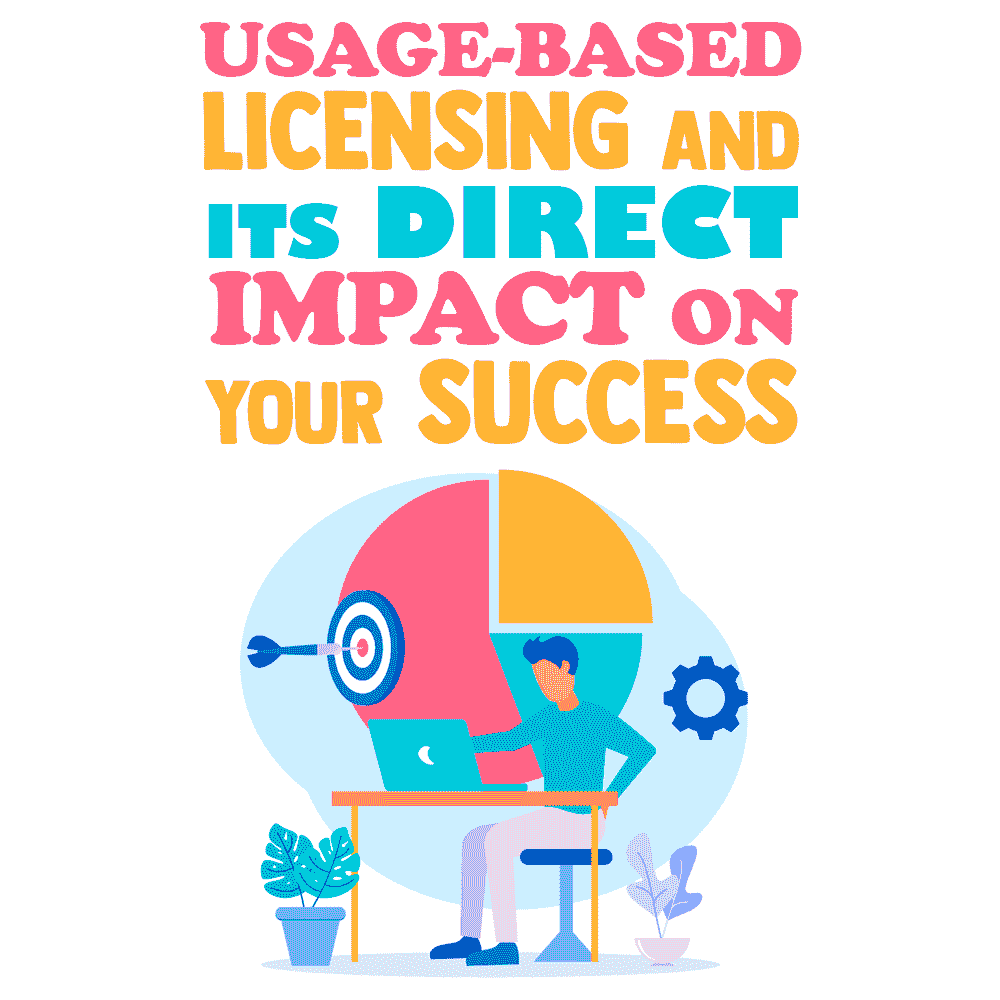

# 基于使用的许可及其对您成功的直接影响

> 原文：<https://simpleprogrammer.com/usage-based-licensing/>

In the world of technology, improvements and advances happen virtually every second of every day. What doesn’t evolve at the same rate, but should, is the way developers and engineers alike distribute and license their software and applications to not only secure the integrity of their work but also to increase profitability.

久而久之和越来越多的应用程序和软件程序推出，看来这两个问题是最后一个对开发人员的想法。

让我们将应用安全性和盈利能力重新放在首位。

在这篇文章中，我将与你分享所有你需要知道的基于使用的许可。从您的应用程序中获取收入的最成功的方法之一是基于使用的许可，因此了解您的选择对您的产品的成功至关重要。

## 什么是基于使用的许可？

由于我们大多数工程师和开发人员相对熟悉基于使用的许可的概念，我将简单地把它分解一下作为复习。简而言之，它是最终用户在必须购买更多功能之前，可以在您的应用程序中访问或执行的特定功能的预先约定的使用和/或操作次数。

这些使用、信用或令牌可以预先购买一定数量，也可以在最终用户使用或访问应用程序时支付

现在让我们仔细看看基于使用的许可是如何工作的。

## 基于使用的许可有什么作用？

基于使用的许可，有时也称为基于消费或按使用付费的许可，是实现上述两个目标的有效方法，在几个方面对开发者和最终用户都有好处。

### 增加经常性收入

基于使用的许可[通过强制执行您为最终用户可以执行的使用和操作数量设置的条款来创造经常性收入](https://simpleprogrammer.com/software-licensing-model-maximize-revenue/)。当您实施基于使用的许可时，您会在最终用户要求使用您的软件的每个实例中创建收入收集点。一旦你的终端用户用完了，他们必须购买更多来继续使用你的应用或服务。比如说，假设你在卖一个成像软件；嗯，每次打印图像时，该任务都会消耗终端用户的一个令牌。一旦他们用完了，他们将不得不购买更多来继续使用你的软件或应用程序。

### 增强客户支持

通过基于使用的许可，您可以更有效地处理和指导客户支持问题。由于每个客户都可以访问您的整个应用程序套件和/或购买了特定功能的使用，他们可以直接指出您的软件的哪个特定部分出现了问题。然而，如果您要提供一个广泛的产品套件，而客户说您的产品有问题，那么您就必须判断它是否:

*   对最终用户来说是独一无二的。
*   某个操作系统的所有用户都会遇到的问题。
*   与驱动程序问题有关。

通过基于使用的许可，可以快速回答以上答案。这将使您的支持团队能够快速诊断、记录和纠正您的最终用户可能遇到的任何和所有问题。

如果产品很难使用，或者如果他们的问题没有得到快速有效的解决，不满意的客户不太可能继续购买更多的产品。根据这一逻辑，专注且目标明确的客户支持是最终用户的一项优势，它极大地提高了客户忠诚度，从而增加了经常性收入。

### 提高应用安全性

通过一个有效的基于使用的许可模式，你可以防止你的软件被过度使用、重新发布和/或非法出售。例如，假设您正在向一家拥有 50 名员工的公司销售一个应用程序，该公司正在内部服务器上使用该应用程序。如果没有基于使用的许可，这 50 名员工可以使用和受益的特性和功能将不受限制，甚至可以非法访问和试图重新分发。因此，在这种情况下，基于使用的许可使您能够保持对您的应用程序的控制，并保护它免受非法分发和/或再分发，从而导致受感染或损坏的副本，这将直接影响您的声誉。

但是，通过基于使用的许可，您可以从每个最终用户执行的每个操作中获益。在这种情况下，基于使用的许可不仅提高了应用程序的安全性，还增加了收入潜力。

基于使用的许可是一种经常被忽视的保护和分发应用程序的方法，但是它仍然是最有效的方法之一。它在众多应用程序、行业甚至利基市场中完美工作的能力几乎是无与伦比的。话虽如此，它并不适合所有人。

## 基于使用的许可是最好的选择吗？

尽管基于使用的许可为[提供了一长串的优势](https://www.keylok.com/resources/insights/advantages-usage-based-licensing-software-vendors-and-buyers)，但一些开发者可能会在另一种许可模式中发现更多或更大的好处，比如基于功能的许可或基于时间的许可。以下是非常适合基于使用的许可的应用程序的一些特征。

应用程序的使用是高度事务性的。举例来说，大多数支付处理应用程序都很适合这种模式，因为很容易向客户收取每次处理的固定费用。

应用程序的使用时断时续。在数据库应用中可以找到这种使用的一个很好的例子。用户为每次下载图像、报告或其他信息付费。这种类型的使用不是连续的，因为用户可能一个月只需要一两个报告，但是下个月需要 15 或 20 个。

的确，如果您选择实施基于时间的许可策略，例如按月付费，这种使用方式可能会随着时间的推移而平衡，并保证您稳定的收入。然而，基于时间的许可可能会让用户感觉他们有时没有得到他们所支付的东西，而基于使用的许可提供了使用和成本之间更紧密的联系。

这个应用程序安装在一个被很多人访问的服务器上。通过基于使用的许可，您可以从每次使用您的应用程序中获得收入。这意味着一家公司不能在 100 台电脑上安装它，也不能让 100 个人免费使用它的功能。

### 何时不推荐基于使用的许可？

For some applications, usage-based licensing might not be the best way to go. Here are some examples of when another licensing model may be better.

使用实际上是连续的。对于几乎每天都在使用的应用程序，如网飞或微软的 Office 套件，衡量使用情况将是乏味且无意义的，并且可能会让客户觉得他们支付了过多的费用。在这些情况下，基于时间和基于特征的模型更好。

该应用程序通常由独立的最终用户使用。当您的最终用户不属于某个用户组(如公司)时，他们往往会有不同的需求，基于功能的许可可能会更好地满足这些需求。

## 如果另一种许可方法也有效呢？

更进一步的考虑是，选择基于使用的许可并不意味着排除其他许可方法。开发人员经常结合两种方法来创建最有效的定制许可策略。

一个例子是将基于使用的许可(固定的分钟数)与基于时间或基于订阅的许可(每月付费，超过使用限制需要额外付费)相结合的手机计划。

另一个例子是以分级定价的形式将基于功能的许可与基于使用的许可相结合。这可以通过创建提供给最终用户的不同信用包来实现，例如，信用数量的变化或附加功能的使用。

这种模式允许用户选择他们认为最有价值的套餐，同时也让你有机会吸引更多的潜在客户。

## 基于使用的应用许可

毫无疑问，对于许多软件开发者来说，基于使用的许可是明智之举。对你的应用来说是不是最好的选择？你可以为最终用户提供被认为物有所值的产品，因为用户每次都能得到他们所支付的东西。

基于使用的许可让您可以快速查明问题和缺陷，然后同样快速地解决它们，以确保客户满意度并赢得客户忠诚度。结果是增加了经常性收入和良好的声誉。