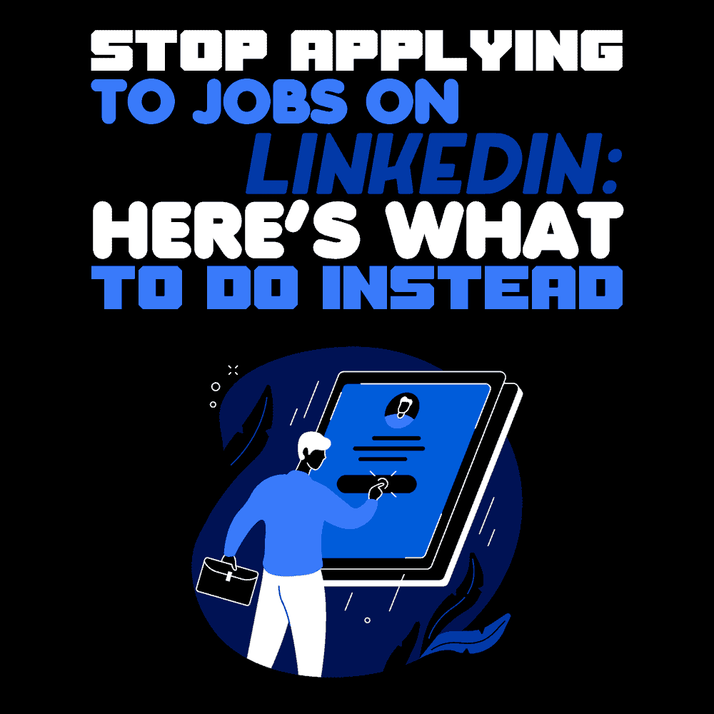

# 停止在 LinkedIn 上申请工作:以下是你应该做的

> 原文：<https://simpleprogrammer.com/use-linkedin-programming-job/>

Go to LinkedIn. Scroll through jobs. Find postings you may have a good chance of getting hired for. Click on job posting. Upload resume. Submit. Repeat, over and over.

工作过程感觉像是一场废物射击，不是吗？你经常会觉得自己是在向招聘界的苍穹发送简历。当你收到“不回复”或“我们不会和你一起前进”的邮件时，你不会感到惊讶。

但是你申请了也没什么损失，对吧？

不对。你会失去一切:至少，时间和精力。

现在大多数人通过招聘启事申请工作。一份工作可能会有超过 200 名申请者。当你提交简历时，招聘人员可能会看一下。他们会看你的简历六秒钟，意识到你没有他们想要的，然后继续看下一份简历。

但是我有好消息告诉你:有一个更好的方法。

在这篇文章中，我会给你一些行之有效的策略，帮助你吸引面试和获得工作机会。你会得到真实人物的回应。听起来不错吧？继续读。

## 将你的心态从“现在”转移到“稍后”

我在找工作的时候，一直在想“我昨天*就想要一个*”很有可能你想要一份工作，而且你现在就想要一份工作。

保留欲望，但让我们来磨炼它。

有一句话是这么说的:“你们中有谁能通过担忧给自己的生活增加一个小时？”你必须意识到你明天不会开始那份新工作。事实上，即使你今天找到了一份新工作，你也很有可能在阅读这篇文章的两周后才开始工作。

LinkedIn 的联合创始人雷德·霍夫曼在他的书《你的初创企业中谈到了很多关于信任一个系统的问题。如果你相信一个能产生结果的系统，工作就会找上你。

停止屏息等待下一个角色的到来。深呼吸。它会来的。

## 认同和平的人并与他们联系

有时候，生活会把那些能以意想不到的方式帮助你的人放在你的面前——你所要做的就是开口。我遇到过许多这样的人，并从中受益匪浅。我把这些人称为“爱好和平的人”

爱好和平的人有多种形式:

*   你在 LinkedIn 上添加的随机联系人可以给你推荐你感兴趣的公司。
*   你在那家酒吧认识的一个朋友的朋友想雇一个有你这种技能的人。
*   当地的校友可以把你介绍给能雇用你的人。
*   高中时的老朋友正在创业，想雇佣他们熟悉的人。
*   你第一份工作中的那个家伙现在是一家大型科技公司的招聘经理。

弄清楚这些人对你来说是谁。通过 LinkedIn 以个人和真诚的方式联系他们。不要传达你能得到什么的信息。相反，试着给他们的一天增加价值。你可以这样做:

*   突出他们在 LinkedIn 个人资料上列出的一项成就或工作经历，并真诚地告诉他们为什么它会吸引你。
*   研究他们会感兴趣的新闻。如果他们的公司做了一些值得注意的事情，比如推出了一个产品或筹集了 A 轮融资，祝贺他们，并说为什么你认为这很酷。
*   提起一段美好的回忆(例如，你们第一次见面的时间)，并向他们提及。

当生活以意想不到的方式将人们放在你面前时，抓住机会伸出援手。保持信息的个人化，并以他们为中心。记住，你的目标是给对方的生活增加价值。你联系的人会意识到你不仅仅是另一个想从他们那里得到什么的联系人，他们会把你视为他们网络中有价值的一员。当你坚持增加价值的承诺时，他们会非常乐意在你需要的时候帮助你。

## 提前两周建立关系

在 LinkedIn 上建立关系网不会有立竿见影的效果。

我的建议？用两周的时间在 LinkedIn 上建立联系。

不要要求任何东西。

在你和某人联系上之后，使用 LinkedIn 的平台来参与他们所说的或所做的。如果你在他们的订阅源上看到一个帖子，评论一下你为什么喜欢他们发布的内容。如果你觉得大胆，告诉他们为什么他们的帖子鼓励或挑战了你。如果你需要勇气升级，看看 *[两小时求职](https://www.amazon/dp/1984857282/makithecompsi-20)。*

喜欢一个帖子很好，但你想从所有人当中脱颖而出。你可以通过采取额外的步骤以个人方式参与进来而脱颖而出。我最喜欢的与人交流的方式之一是告诉他们他们的内容是如何迫使我采取行动的。我的熟人奥斯汀写了一篇关于父母职业建议的帖子。你可以在这里看到我是如何参与并评论帖子[的。](https://www.linkedin.com/posts/austenallred_unpopular-opinion-dont-take-career-advice-activity-6703345116037349376-GZif)

如果您在 LinkedIn 订阅源上没有看到您的联系人的任何帖子，请查看他们的个人资料，并了解他们都参与了哪些活动。他们的帖子可能没有到达你的订阅源，或者他们在 LinkedIn 上可能不太活跃。

在以相关的方式参与了两周之后，“提出你的要求。”

你如何提出要求？好吧，让我告诉你…

## 现在个性化，以后扩展

Some of you have gotten in the habit of copying and pasting your networking messages.

**住手。**

我喜欢你思考创造系统的方式，但是请停止。取而代之的是，精心制作个人信息，为他人的生活增添价值。

而不是:

“你好，我叫丹尼尔，目前正在找工作。我注意到你在亚马逊，我想知道你是否能给我推荐一个我正在寻找的数据科学职位。你能帮我吗？”

说:

“你好，Ryan，我最近了解到 Accelerate 推出了企业数据安全系统。热烈祝贺该产品上市。如此多的人将受益，尤其是更多的人远程工作。

“最近，你在 LinkedIn 上的数据科学内容真的让我很受鼓舞。我一直试图进入数据科学领域，并从您的帖子中受益匪浅。尽可能用最简单的方式解决问题对我的学习过程意义重大。

“我想联系您，看您下周是否有时间打一个 20 分钟的电话。我很想听听你在数据科学工作中最满意和最具挑战性的是什么。我也很感谢你对我如何进入数据科学职业生涯的建议。

《丹尼尔》

[个性化你的信息](https://simpleprogrammer.com/how-to-get-a-programming-job/)是获得回应的最有效方式。如果有什么安慰的话，我会系统地进行个性化。让我们来分解一下我的信息:

你好[某人][你注意到此人或其公司做的很酷的事情][此人做的或写的你认为有帮助或令人钦佩的事情][你寻求建议的深思熟虑的行动号召]

但以理

立即个性化您的消息，了解适合您的内容，然后进行扩展。如果你想知道你的信息是否足够私人，请随意查看 Linkedin 的子页面。Redditors 会坦诚地告诉你，并引导你制作最终的个性化信息。

## 你已经准备好建立关系并获得一份新工作

花时间滚动 LinkedIn 很容易。上传简历并点击“提交”按钮很容易。但这不会让你得到面试机会，也不会让你找到工作。

当你花时间建立关系时，我保证你会看到结果。你会得到面试机会，你会得到工作机会。你很想加快这个过程，但是我强烈建议你慢慢来。网络可能不会像上传简历那样给你即时的满足感，但它会产生指数级的更好的结果。

尽你最大的努力去发现那些能在你前进的道路上帮助你的人。人们愿意伸出援手；你只需要问一下。当你问的时候，用一种个人的真诚的方式。复制粘贴带有个人色彩的外联信息会阻碍你有效地建立关系网。

建立真正的关系需要多一点时间。如果你想要一份工作，你必须愿意投资于能帮你找到工作的人和关系。

你已经准备好建立关系，吸引面试，得到你一直想要的工作。