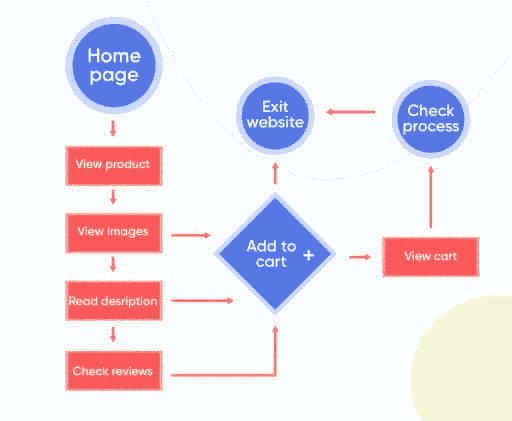

# 应用程序开发的用户流:初学者指南

> 原文：<https://simpleprogrammer.com/user-flow-for-app-development/>

Some time ago, a friend of mine came across a health and fitness app that promised to do exactly what she wished for, so she keenly hit the download button. A moment later, the app launched, and she was ready to get started, but she stopped for a moment and uninstalled the app at once. Do you know why? Here’s what she told me afterward.

该应用程序一启动，就要求她注册一个账户，给出她的位置，启用推送通知，浏览整个教程，等等，以便登机。换句话说，她被要求一气呵成地做除了使用 app 以外的所有不必要的事情。

如果她从来没有使用过这个程序，那么这个程序再聪明也没用。对大多数用户来说，只需要一秒钟就可以形成决定他们是否会留下来的第一印象。根据成长大师陈楚翔的说法，大约 77%的用户会在安装一个应用程序的前三到七天内放弃它。这也是为什么[用户流量对移动应用开发如此重要的原因之一。](https://simpleprogrammer.com/flowcharts-for-programmers)

在这篇文章中，我将与你分享你需要知道的关于用户流的所有信息:它是什么，它是如何工作的，以及如何确保你的应用程序针对其目标用户进行优化。

## 什么是用户流，它是如何工作的？

用户流展示了用户在第一次切换屏幕或尝试单个移动应用程序或应用程序本身的特定功能时可能采取的路线图。用户流量对于一个成功的应用至关重要。事实上，在你的应用中有效地实现[用户流设计](https://www.amazon.com/dp/B071DX6KD4/makithecompsi-20)会给你带来大量的注册和较低的跳出率。

许多人可能认为用户流是不需要的、次要的过程。然而，在现实中，用户流是一个实际的、基础的轮廓，它以最理想的方式缓和了[用户的加入过程和之后的体验](https://simpleprogrammer.com/user-onboarding-a-simple-guide)。

用户流量就像一张图片地图。它们由步骤组成——从用户开始使用应用程序，直到达到预期目标。这些步骤指导用户使用不同的功能和屏幕。让我们借助一个例子来理解它是如何工作的。

用户流程图插图

假设用户下载了一个电子商务应用程序来购买一支新笔。用户流程图将在这里使用——在开发阶段，它可能看起来像上图所示。更详细的:

1.  用户安装应用程序并开始使用。
2.  应用程序打开并欢迎用户。
3.  他们去主页。
4.  他们滚动浏览“查看产品”,然后是图片。
5.  用户可以向下滚动详细信息来了解产品的更多信息，或者将产品添加到购物车中。他们可以选择任何一个。
6.  如果他们打算购买产品，点击“添加到购物车”，然后是“查看购物车”，然后是“检查过程”现在用户要么购买，要么“退出网站”，如上图所示。

这就是用户流量的工作方式。如果我用一个类比，这是一个服装店的蓝图，其中一个柜台通向 B and B 到 c。一些柜台是为了一次性访问，而另一些不是。人们会继续逛商店，就像一个新用户会如何使用应用程序进行第一次购买一样。

在应用开发过程中正确实施用户流程图(ufd)和[技术栈](https://www.under30ceo.com/mobile-app-development/)可以使开发过程更进一步。让我们深入其中，了解用户流量对于 app 开发的重要性。

## 为什么用户流量对 App 开发很重要？

用户流定义了用户在使用应用程序时可能采取的途径。因此，它们在应用程序开发中很重要，尤其是当涉及 MVP(最小可行产品)时。

### 减少重新设计产品的时间

从头开始编写一个应用程序，然后重新编写一个已经构建好的版本，这并不是从 MVP 开始的最佳方式。然而，如果从一开始就考虑了用户流程图，那么根据客户的需求修改代码或重新编码就会变得容易得多。

设计一个 UFD 将允许你回溯和修改代码，也可以随时改变用户界面/UX 功能。此外，可以在开发的早期阶段发现和预防各种潜在的问题。

### 保持一切井然有序

[手机 app 开发](https://www.resourcifi.com/resources/ebooks/mobile-app/9-stages-mobile-app-development?utm_source=SimpleProgrammer&utm_medium=Offsite)不是一个人的工作。交付一个有前途的应用需要一个专门的专家团队，在此期间，应用本身经过许多人的手，如果缺乏用户流，这可能会摧毁应用。让我告诉你怎么做。

假设正在开发一个约会应用程序，开发者认为它应该具有让用户使用他们注册的手机号码找到伴侣的功能。开发人员想象这个数字会被后端人员存储在数据库中。数据库被创建，不知何故，后端开发者允许用户通过注册的电子邮件地址和密码注册或登录他们的帐户，但没有手机号码。

在这种情况下，既没有被要求的号码，也没有登记。所以，当没有注册的手机号码时，用户发现有人使用它的可能性为零。结果，最终编译的版本会有错误或者完全崩溃。

在这种情况下，用户流量会非常有用。他们消除了这种偶然的假设，确保每个人都在同一页上。通过这种方式，开发者可以专注于开发一个有前途的应用，而不是寻找和解决可能不时出现的故障。

### 不仅仅是原型

虽然原型模仿了最终的结果，但是用户流在一个框架中立即显示了所有的可能性。一旦你有了一个独特的用户流，开发者或 UX 团队可以按照他们的时间表随时开始使用它。因此，在这里，我们拥有完全的灵活性，不再需要等待团队来启动流程。

通常，应用程序中的某个功能在未来的更新中可能会变得比最初想象的更复杂。需要在不损害用户体验的情况下谨慎地重新检查这些功能。用户流在这方面也有帮助。即使路径过于复杂，它也可以揭示该特征的位置。

## 顺应潮流，打造成功的应用

如今，[应用开发](https://www.resourcifi.com/blog/app-development?utm_source=SimpleProgrammer&utm_medium=Offsite)中的用户流最为重要。有如此多的选项可供选择，用户现在不再需要在应用程序中导航。一个完美设计的用户流通过保持用户参与度来显著降低放弃率。因此，每当你想到开发一个 MVP 或移动应用程序时，先花点时间设计它的 UFD。