# 用户入门:创建用户入门流程的简单指南

> 原文：<https://simpleprogrammer.com/user-onboarding-a-simple-guide/>

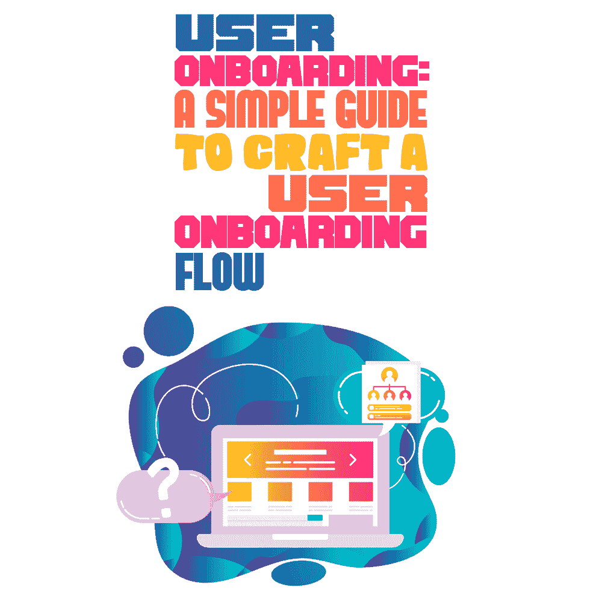

A few years ago, Chanty’s team faced the following situation: We’d done a good job with our product, an alternative to Slack and easy-to-use team chat, and we expected thousands of active users.

然后，我们打开我们的分析工具，发现我们未能按照我们预期的方式转化用户——他们正在离开。几个月的开发、测试和调整我们的团队聊天似乎被浪费了。

哪里出了问题？答案显而易见:[通过深思熟虑的客户入职流程，可以提高转化率和保留率](https://simpleprogrammer.com/website-usability-for-applications/)。这是许多创业公司陷入的陷阱:没有意识到入职带来的影响，公司失去了他们的用户，而不是获得预期的认可。

对 Chanty 来说幸运的是，这个故事有一个好的结局。在这篇文章中，我们的团队将为那些需要[帮助制定入职流程的人](https://www.amazon.com/dp/B07GNVZ4KF/makithecompsi-20)分享我们的建议、技巧和策略。让我们开始吧！

## 首先分析你的竞争对手

第一步很简单，但是很有用。分析竞争对手入职流程的每一部分。就当是必要的准备阶段吧。你能从他们身上学到什么最佳实践？由于我们的初创公司是 Slack 的替代方案，我们研究了 Slack 的利弊。

我们注意到他们的入职流程已经发生了变化。一些很酷的改进包括

*   现在，新的 Slack 用户在注册过程中不需要创建密码。就转化率而言，这是一个很好的想法，因为它缩短了用户的旅程。
*   应用程序内的工具提示简短且信息丰富。
*   2016 年，Slack 让账户创建流程更加动态化、个性化。

尽管如此，Slack 的入职邮件仍然是垃圾邮件和混乱的。这是我们决定要改进的事情:戏剧性地精心设计 Chanty 的入职流程。

## 一个好的入职系统的组成部分

让我们从头开始:入职流程是你的用户与你的产品之间的持续关系。换句话说，使用你的产品应该转化为用户的新习惯。坏消息是养成习惯可能很难(记得开始学习一门新语言或坚持去瑜伽班是多么困难)。

问题来了:如何养成习惯，创造一个真正吸引人的入职？我们决定在最初几周尽可能多地接纳、教育和支持每一位新用户。是什么给了我们力量？我们知道我们为什么而战:

*   我们想阻止用户离开。
*   我们想了解为什么我们的潜在客户在 Chanty 特性上苦苦挣扎的原因。
*   我们想知道他们对我们的团队聊天感到沮丧的步骤。
*   我们希望根据用户的行为对他们进行细分。
*   我们希望用户升级到付费层。
*   诸如此类。

展望未来，一封简单的欢迎邮件不足以实现上述所有目标。你和用户的关系从注册服务的第一步就开始了……永远不会结束。

但是，请不要急于一蹴而就！说到我们的经验，我们没有足够的时间和资源来涵盖入职的所有方面。当你刚刚开始你的优秀入职流程之旅时，有一个“最小入职包”它执行入职流程的两个主要任务:向新用户介绍你的产品，并激励他们长期坚持下去:

*   **注册和欢迎电子邮件**欢迎首次登录的新用户，并鼓励他们迈出设置帐户的第一步。
*   **产品之旅**引导用户走向他们的“啊哈”时刻，并展示高价值功能。
*   几封交易和教育邮件将新用户转化为忠实用户，并最终转化为付费客户。
*   **文档**(首先是可选的)。

简而言之，我们最初的入职流程考虑了真正的用户目标。我们专注于他们想要实现的目标。换句话说，我们忘记了突出 Chanty *的特性*，尽最大努力帮助用户尽可能容易和可预测地达到*的结果*:

*   我们为用户提供了一个清晰明了的路线图。
*   我们不断发出提醒。
*   我们为用户保留了潜在症结的有用资源。

让我们更深入地了解一下 Chanty 的用户入职流程是如何开始的。

## 创建简单的注册来激发情感

每一次入职体验都始于注册。在注册过程中，您开始与用户建立关系，并收集关于他们的有用信息。有这么多关于如何创建完美注册流程的提示，仍然没有“一刀切”的解决方案。事实是，简单的一次点击注册不再能打动任何人。现在都是创意引发情绪。要创建一个*习惯养成应用*，你应该[将你的产品与用户的日常事务和情绪](https://www.amazon.com/dp/1591847788/makithecompsi-20)联系起来。

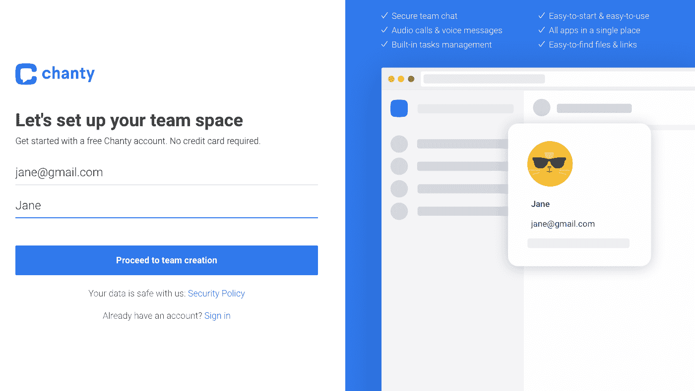

*Chanty 注册表单*

你有没有注意到右上角有一个简短的列表？我们用用户使用你的工具将得到的额外好处来补充 Chanty 注册表单。这是一种积极的强化，表明用户实际上是在注册一些很棒的东西。所以不要犹豫，用用户使用你的工具将得到的好处来赞美你的注册表单。

此外，我们试图保持注册尽可能简单。所以，我们的注册表单没有要求用户留下太多的信息。在我们的团队聊天中，我们只要求:

*   姓名和电子邮件在第一步(你已经看到了上面的截图)
*   团队名称
*   发送到电子邮件的确认码

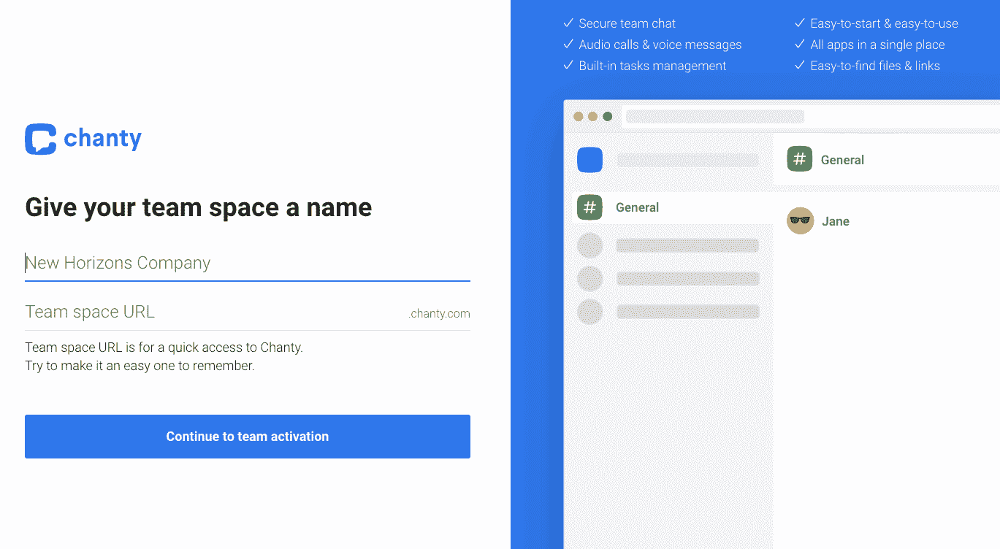

这是我们最初的注册表格。很难有比这更简单的了。然而，随着时间的推移，我们决定增加一个额外的步骤来收集一些对我们来说绝对重要的营销信息。帮助我们自动填充数据的是自我分段问题:

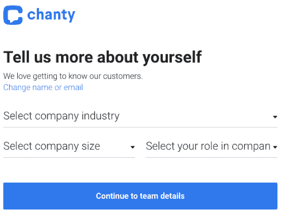

在这里，您可以查看首次登录时的欢迎消息:

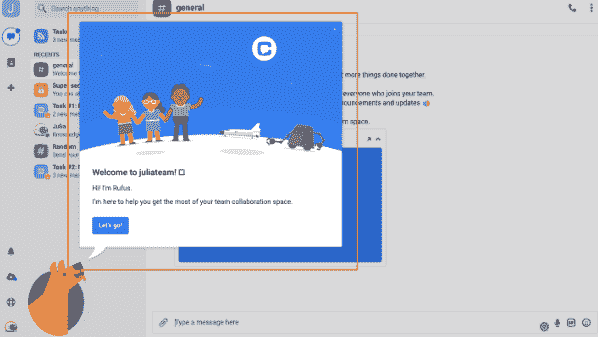

然而，虽然我们的简单注册很酷，但我们的主要目标是长期支持用户。这就需要将产品参观整合到您的入职工作流程中。产品参观为您的社区提供关于使用应用程序的点播课程。让我们在下一节深入探讨 Chanty 产品之旅。

## 通过产品之旅引导用户使用你的应用

功能太多。时间太少了。在产品之旅中，你应该向用户展示什么？您应该如何以及何时解释工具的其余功能？有不同的方式来展示产品教程，从应用程序内的“入门”清单到不同功能旁边的教程按钮。

我们为 Chanty 进行的产品之旅教会了我们一些宝贵的经验:

*   **你的产品之旅应该包括最多五个提示**——新用户迫不及待地开始从你的应用中获益。为了尊重他们的时间，确保你的产品参观不会太长。少即是多——许多步骤只有[增加摩擦力](https://www.appcues.com/blog/how-to-uncover-user-frustrations-and-get-insights-that-really-matter)。所以，排除干扰，用最直接的方式引导你的用户。三到五个步骤足以满足你的入职流程。
*   **您的产品之旅应该在 40 秒内完成**——人们倾向于跳过长期定制的产品入门之旅，自己探索产品。
*   你的产品之旅应该以用户为导向，不要强迫用户做任何事情。相反，通过“下一步”按钮，让他们在你的应用程序中轻松导航到正确的位置。
*   **允许用户在准备好之后再次参观产品之旅**–同样，不要强迫用户参观产品。他们可能想先自己探索产品。也许，他们以后会重返巡演。只是保留再次参观产品之旅的可能性。
*   **不要试图展示所有的功能**——抵制一下子展示你所有最先进功能的冲动。如果你坚持使用基本功能，新用户会有更多的机会认识到你的应用的价值。你的软件最复杂的功能可能不适合普通用户的需求。解释你应用程序的每一个角落只会让用户恼火。考虑到这一点，只突出代表产品核心价值的特性。稍后可以引入其他功能。

不要害怕嬉戏:尝试。测试不同的用户界面元素、形状、颜色、大小等。以下是我们的产品之旅:

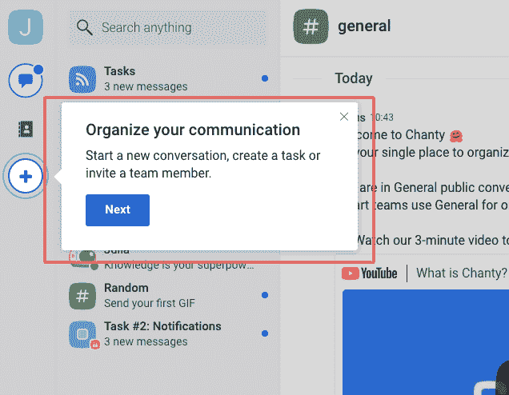

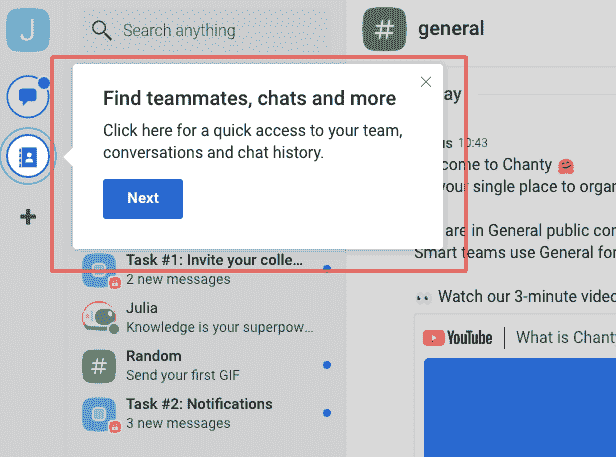

当简短的产品参观结束后，您如何无缝地突出您产品的其他重要功能？为了应对这一挑战，我们将游戏化融入到我们的应用中，因为庞大的数字表明，游戏化可以使参与度指标增加[150%](https://www.researchgate.net/publication/283211242_Studying_Gamification_The_Effect_of_Rewards_and_Incentives_on_Motivation)。更重要的是，[在培训体验中加入类似游戏的元素](https://simpleprogrammer.com/gamification-lms-features/)，可以吸引用户并激励他们继续学习。

这样一来，产品之旅就“延长”了，让用户不讨厌。探索“任务”功能，用户找到适合他们的任务。完成这些小任务后，他们对 Chanty 的功能有了更多的了解:

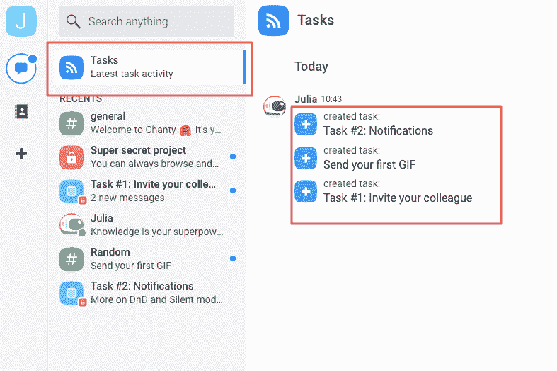

*Chanty“任务”功能*

此外，我们还为我们想要强调的每个重要功能制作了专门的视频:

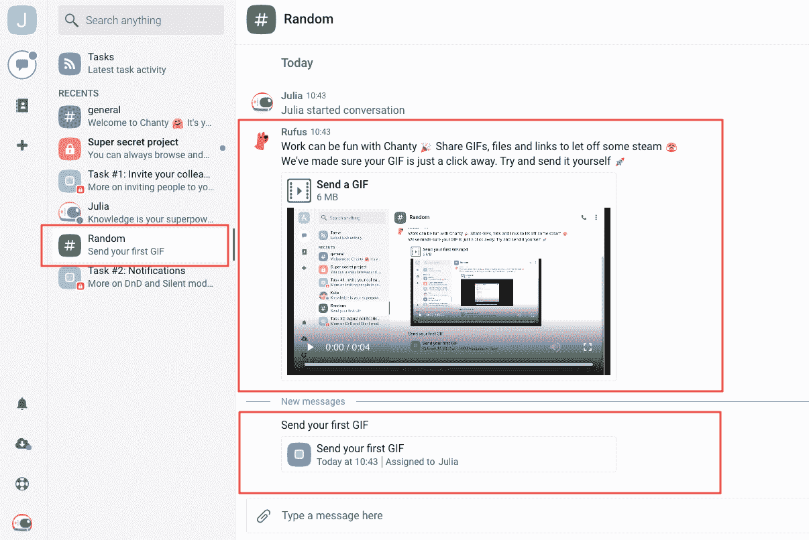

## 通过电子邮件让用户参与并接受教育

对于客户入职，电子邮件是一个强大的工具。然而，有一个问题:如何进行真正有价值的入职电子邮件活动，并避免淹没您的潜在客户？答案很简单:你发送的邮件应该真正帮助你的用户。句号。

这是我们通常发送的欢迎邮件。在这封邮件中，你会发现没有什么过分的。仅帐户详细信息和文档链接:

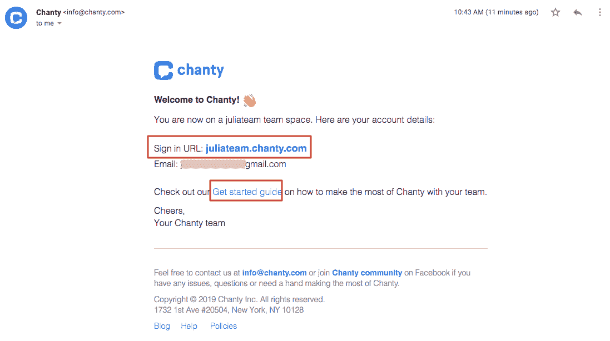

一旦我们发送了[欢迎电子邮件](https://www.omnisend.com/blog/best-welcome-emails/)，是时候前进到教育电子邮件，解释我们的顶级功能提供的价值，以保持我们的新用户参与和接受教育。在制作教育邮件时，我们坚持基本原则“每封邮件一个概念/功能”过多的信息或过多的功能可能会让用户感到困惑。相反，让他们一次迈出一步，通过每封邮件发出一个有说服力的行动号召。这将极大地提高用户参与度。

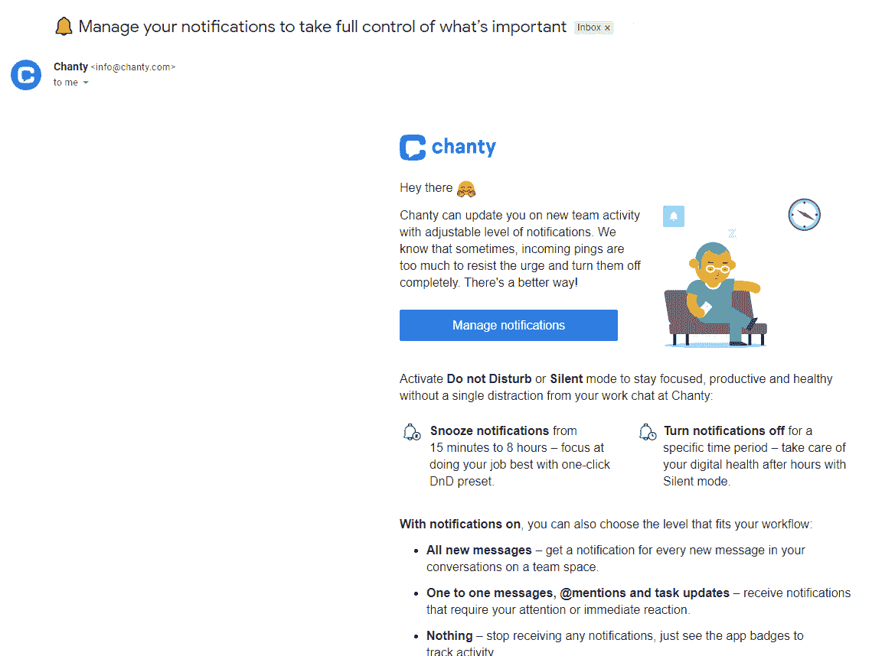

*在这封邮件中，我们描述了管理通知的基本要素*

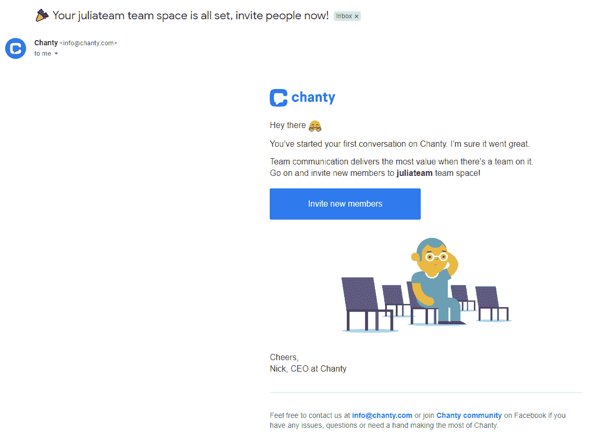

*这里我们鼓励用户邀请新成员加入团队聊天*

有一系列屡试不爽的技巧帮助我们制作出真正吸引人的教育邮件:

*   **保持简洁**——入职邮件不必太短。不过，它们应该超级容易消化。在制作 Chanty 的邮件时，我们不断地问自己“我们的用户能在两秒钟内理解邮件的主要信息吗？”
*   **每封邮件只介绍一个新概念和 CTA**-这将帮助你有效地吸引新用户更深入地参与你的应用。
*   **通过添加基于行为的触发器**使你的入职电子邮件个性化——这样做，你将创建比一般的[基于时间的电子邮件](https://venngage.com/blog/best-time-to-send-an-email/)更相关的信息。根据用户体验个性化您的电子邮件，您将看到高达 [100.95%的点击率](https://robbenmedia.com/email-marketing-stats/)和[18 倍的收入](https://myemma.com/strategy/eighteen-stats)。

## 记录重要的事情

如果您刚刚开始创建入职流程，请跳过此步骤。但是如果你准备好了并且有足够的时间和资源，你应该知道文档是任何入职体验的重要元素。如果一切顺利，你的文档中心将不再需要。然而，易于访问和理解的文档可以帮助你确定当用户真的遇到困难时，他们可以得到指导。

## Chanty 在纳入用户入职流程后的结果

调整[客户入职](https://www.chanty.com/blog/saas-customer-onboarding-strategies-every-startup-can-learn/)的每个角落和缝隙的过程给你留下了很多测试和进一步改进的空间。测试的范围是无限的:你可以对不同的用户群使用不同的方法；改变你传递信息的渠道；为 web、桌面和移动应用程序制定单独的入职流程；等等。

在入职培训的帮助下，我们成功改进了一些入职培训指标:

*   用户登录的频率。这个指标增加了一倍。
*   他们保持登录状态的时间。用户保持登录的时间平均延长了 50 分钟。
*   他们使用了多少功能。普通用户采用的功能数量增加了 35%。

这些指标对每个 SaaS 企业都至关重要。原因很简单:如果用户没有在你的应用上花费足够的时间，没有使用你提供的功能，他们就不会理解你的应用的价值。最终，他们不会买它。

这还不包括用户转化为付费客户的比率。我们成功的主要保证是持续优化和全面的应用内分析。举几个更鼓舞人心的例子，Pinterest 的客户激活量大幅增加，在[用户体验个性化](https://medium.com/@Pinterest_Engineering/personalizing-pinterests-new-user-experience-abroad-60f8f55177ac)的帮助下，回头客增加了 10%。调整了之前导致用户流失的进度指标 clearer，Intercom 经历了通过入职流程中最关键步骤之一的人增加了 [12%](https://blog.intercom.com/designing-first-run-experiences-to-delight-users/) 。

## 让我们的经验为你所用

他们说你只有一次机会留下第一印象。在经过深思熟虑的客户加入的帮助下，我们不仅将用户的注意力吸引到我们的团队聊天上，还让他们与我们呆在一起。但这是一项艰难的工作。以下是我们学到的重要经验:

*   传递价值。主要目标是展示产品提供的价值，并鼓励客户使用它。
*   分析竞争对手。对最佳实践的研究将告诉你从哪里开始和应该避免的事情。
*   将入职流程分成单独的工作流程。
*   专注于重要的事情。不要试图同时做所有的事情。
*   尽可能简单地进行入职培训。越简单越好。
*   测试、实验和优化。选择对您的业务至关重要的指标，并优化您的入职培训以获得更好的结果。

此外，还有许多很棒的操作方法文章、白皮书和资源，介绍如何让客户充分参与进来。

你可以看看以 [Groove](https://www.groovehq.com/support/great-examples-of-customer-onboarding) 为特色的 10 家顶级软件公司的入职案例，或者看看 [50 多篇关于不同公司的入职流程](https://www.useronboard.com/user-onboarding-teardowns/)的评论。 [Smartsheet](https://www.smartsheet.com/advanced-guide-customer-onboarding) 可以帮助你制定一份入职清单，这篇 [CXL](https://conversionxl.com/quick-guide-user-onboarding-saas-products/) 文章讲述了测试你的入职情况。在 [Appcues](https://www.appcues.com/user-onboarding-academy) 和 [Userpilot](http://userpilot.com/blog/user-onboarding-best-practices/) 的博客文章中有一些有用的资源和技巧。

对我们有用的也可以对你有用。如果你遵循这些最佳实践，你会看到更多的用户留下来并成为长期客户。

你对客户入职流程有什么想法？有什么对你有用的小窍门吗？