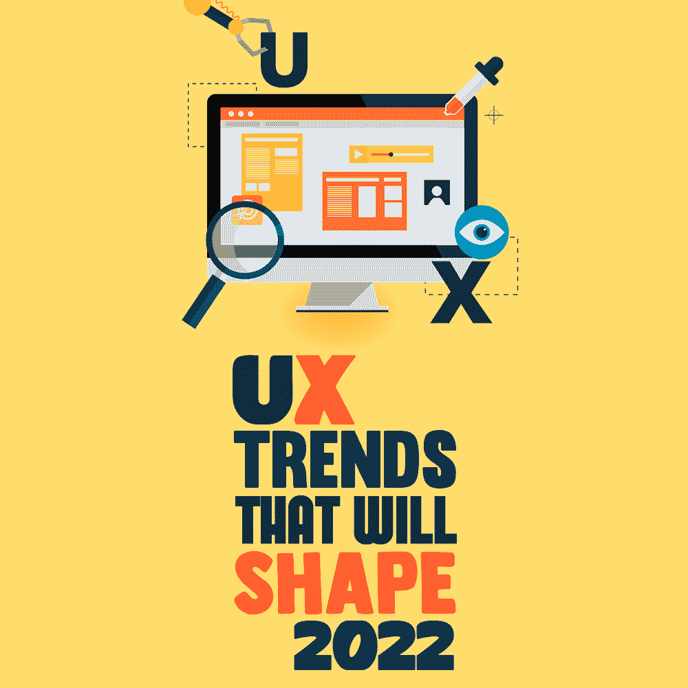
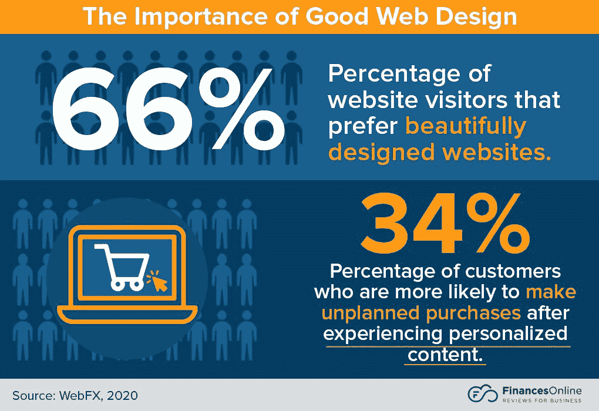
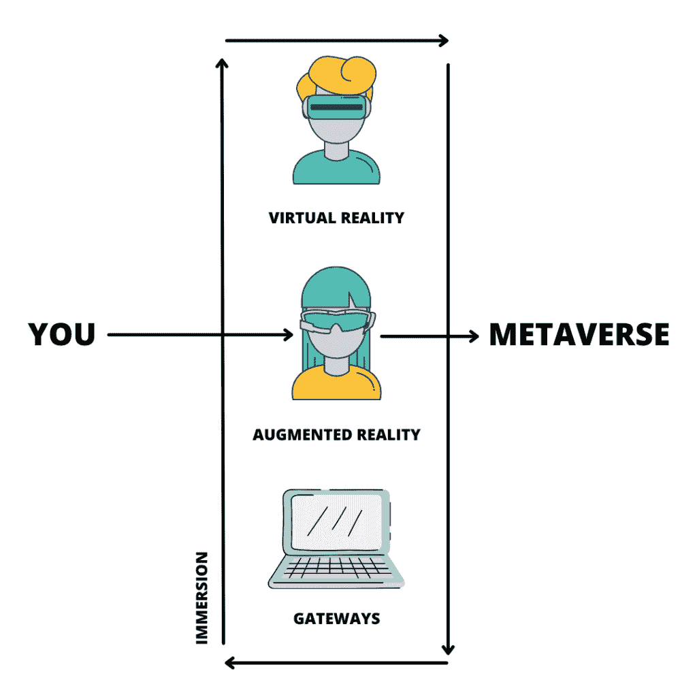
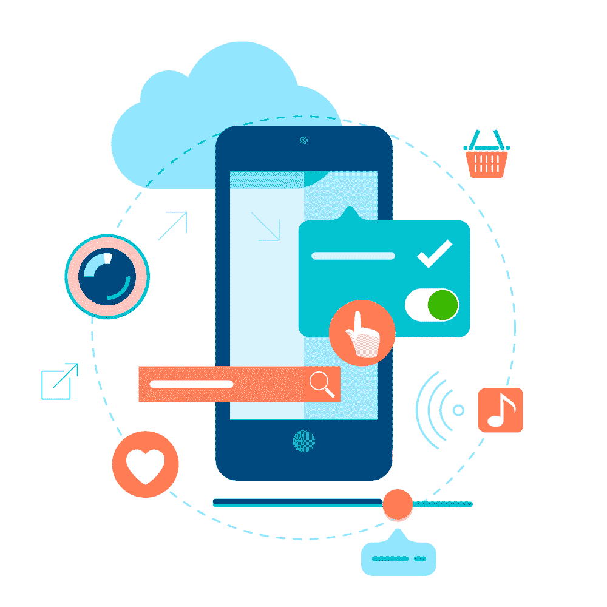

# ‌Will 塑造的 2022 年用户体验趋势

> 原文：<https://simpleprogrammer.com/ux-trends-2022/>

Efficient UX design is based on an [innovation process](https://angelhack.com/blog/6-key-principles-that-will-accelerate-innovation.html/) where designers are always trying to learn more about their users. They make sure to create beautiful interfaces that flow, while also giving users impactful emotional experiences.

UX 设计基于两个原则:消费者体验和解决问题。这些原则被用来创造美学产品设计。产品可以是实体的，也可以是数字的，但核心目标是一样的:当用户与你的产品互动时，提升用户体验并提供价值。

例如，几个拼车应用程序给用户奖励积分，他们可以将这些积分兑换成现金，捐给几个慈善机构。数字出租车服务没有提供这一功能的实际理由，但它确实存在。这是因为具有额外功能的应用程序为用户增加了价值感，创造了情感体验。

现代消费者希望赢得同情。当他们感到品牌关心他们的问题时，他们也会与品牌积极互动。

好的 UX 设计会让用户踏上一段有意义的旅程。这就是为什么 UX 设计团队将内容战略家、创意思想家和交互设计师结合在一起。所有这些专业人士都有一个共同的目标:通过巧妙的设计提供价值。我们将看看 UX 为什么重要，它与 UI 的区别，并研究一些令人兴奋的趋势，我们将在 2022 年在 UX 看到更多，涉及增强现实，虚拟现实和人工智能等。

## 为什么 UX 设计很重要？

据《福布斯》报道， [UX 的投资回报率为 9900%](https://99firms.com/blog/ux-statistics/#gref)，这对于那些旨在扎根于用户心中的品牌来说是一桶金。也就是说，在 UX 投资 100 美元可以获得近 1000 美元的回报。

好的 UX 设计可以增加顾客的忠诚度，并为你的品牌建立积极的联系。快乐的用户也更有可能把他们的体验告诉他们的网络，为你赢得新客户。强大而美观的 UX 设计应该是一个品牌营销计划的核心焦点，尤其是基于数字空间的营销计划。

亚马逊网络服务公司报告称，超过 80%的在线客户如果没有令人满意的网络互动，就会放弃某个品牌。以混乱和不直观的设计为特色的网站会导致用户将他们所代表的企业永久列入黑名单。

对于推出新产品或应用的品牌来说，UX 设计应该是当务之急。早期的应用测试是开发者和设计者在发布前修复任何错误的好方法。据《UX 星球》报道，一旦你的应用程序启动，找出漏洞的成本[可能是](https://99firms.com/blog/ux-statistics/#gref)的 100 倍以上，并且正在进行的过程可能会妨碍[应用程序的性能](https://www.globalapptesting.com/blog/3-characteristics-of-top-performing-apps)。

所以，不要忽视这里墙上的文字；将目光投向优秀的 UX 设计。给用户一个他们喜欢的体验，并从中获益。

[图像来源](https://financesonline.com/web-ux-design-statistics/)

## 用户界面和 UX:有什么区别？

人们经常一起使用 [UI 和 UX 设计](https://simpleprogrammer.com/improve-ui-ux-application/)。有时，他们会混淆这些术语，用一个表示另一个。UI 和 UX 是有联系的，但它们并不相同。

*UX 设计*着眼于数字或实体产品的功能。 *UX 设计师*研究用户需求，寻找有效的方法为他们创造独特的体验。他们被称为交互设计师，因为他们从头到尾规划用户的旅程。

交互设计师与信息架构师一起工作，识别用户的痛点和需求，并找出解决方法。交互设计师都开发原型和线框来确保令人满意的用户体验。

[好的 *UI 设计*](https://www.sme-news.co.uk/what-makes-good-ui-design-and-how-to-implement-it/) 涉及视觉和直觉。 *UI 设计师*，也被称为视觉设计师，负责调色板、排版和图形。他们的目标是创造赏心悦目的布局。他们还处理交互式图形，如菜单、按钮和文本框。

一个成功的用户体验是 UI 和 UX 设计师完美和谐工作的顶点。二者缺一不可，无缝设计只有在一起使用时才会发生。

以[中](https://careerfoundry.com/en/blog/ui-design/8-sites-with-great-ui/)为例。这是一个在线发布平台，用户可以在这里阅读和撰写文章。它具有简洁的线条和简约的设计(UI ),便于导航。

当用户想写点什么的时候，他们只需点击一个文本框，它会立刻打开一个更大的页面，里面有无限可定制的选项(UX)。没有加载时间或混乱拒绝用户。

## 2022 年 UX 趋势值得关注

如果做得好，UX 设计可以提高客户保持率和转换率。需要注意的三件事是:简单的*、*实用的*和视觉震撼的*。

记住它的重要性，让我们看看 2022 年 UX 的一些加速发展的趋势。

### 1.增强现实、虚拟现实和元宇宙

至少有一个你认识的人，如果不是你自己，最近会去元宇宙参加培训或研讨会。目前有五种流行且开发良好的 metaverses，它们都使用虚拟现实(VR)和增强现实(ar)的组合来给用户提供独特的体验。

像古驰和路易威登这样的公司已经使用 VR 和 AR 在零售体验中给消费者提供了更多选择。元宇宙为 UX 设计开启了几乎无限的可能性，并在其中发挥着至关重要的作用。使用 VR 和 AR 的应用程序给了交互设计师进一步设计的机会。

建立连接到元宇宙的应用程序或网站基础设施，通过从 2D 到基于 3D 的应用程序的过渡，为创新提供了新的可能性。

[图像来源](https://usabilitygeek.com/from-users-to-players-the-future-of-ux-design-in-the-metaverse/)

对于那些有兴趣继续讨论人工现实，如 VR，AR 和 MR(混合现实)的人来说，这本书是一个有趣的读物:[沉浸式元宇宙电子商务:元宇宙·UX 热情洋溢](https://www.amazon.com/dp/B084R6LPCS/makithecompsi-20)。

### 2.人工智能

想想亚马逊的 Alexa 或者苹果的 Siri，你已经登陆 AI 了。现代科技让计算机化的学习触手可及，而且还在实时发展。有三种人工智能，其中一种(这里的重点)正在以创新的方式颠覆 UX 的设计。

*人工弱智能* (AWI)检测行为模式，并能够做出基于数据的预测。例如，每个人的脸书时间表是不同的。这是基于他们的兴趣和搜索历史，包括他们可能加入的任何团体。

UX 设计是 AWI 革命所必需的。从品牌的角度来看，智能设计意味着您的消费者可以接触到他们想要的建议，并获得附加值。加分，如果设计流动，让他们点击你想要的链接。

想象一下(双关语):你正在 Pixabay 上浏览[免费图片](https://pikwizard.com/)。你搜索过狗骑自行车的照片。您将看到来自 Pixabay 的结果列表，但页面顶部会显示更好的图像。

这些将被安排在一个有吸引力的旋转木马，你会想了解更多。不知不觉中，你已经登陆了 Shutterstock，在那里你将付费获取高质量的图片。

这是优秀 UX 设计的精妙之处。它打破杂乱，解决用户的问题，并向他们展示附加值。它的设计以用户为中心，专注于为用户提供他们需要的东西。AWI 用户将获得个性化的有影响力的体验，随着 UX 设计师继续用它来打造体验，这种体验将变得更快更准确。这在电子商务中非常适用。

### 3.黑暗模式的兴起

黑暗模式仍然相对较新，即设计师正在将典型的[用户体验](https://simpleprogrammer.com/user-experience-design/)从亮变暗。苹果可能声称它开创了黑暗模式的潮流，但开发者知道这不是真的。无论哪种方式，每个拥有智能手机的人都可以选择按下一个按钮来打开黑暗模式。背景变得暗淡，文本由黑变白，亮色减少。

UX 的设计师倾向于黑暗模式，因为这是极简主义。这种美学有一种平静的效果，当与黑色搭配时，视觉效果自动看起来更优雅。

传统上使用白色色调的应用程序正在转向黑色。这需要新层次的映射和路径创建。Wix 在这方面做得特别好。用户可以将他们的站点切换到黑暗模式，而不必编写代码。

UX 设计越来越多地被用来在黑暗中给用户带来简单的体验。信息架构师喜欢在上面工作，因为在黑屏上阅读更容易。他们不断尝试为最终用户完善这一流程。

### 4.拟人化的动画

在互联网上滚动是一种个人体验。不是用户有意识去想的。有理由相信收到通知会激活大脑中的多巴胺受体。多巴胺是一种快乐的化学物质，互联网上也有。

从科学上讲，你在网上度过的时间是一段情感时间。UX 设计师的目标是为用户创造情感体验，让他们不断回来。拟人化的动画是他们使用的工具之一。

拟人化或拟人化的动画是一种快速的动画，可以产生效果。例如，如果您搜索销售支持工具的[列表，并在列表框中看到动画信息图，您会记住它。动画可以是基本的，像一个闪烁的弹出窗口或文本气泡，但它会帮助你记住信息。](https://www.dialpad.com/blog/top-sales-enablement-tools/)

UX 的设计师们正在摆弄这些动画，尤其是在网页上。它们可能看似简单，但仍能取得成效。用户喜欢与应用程序和网站上的动画内容互动。如果品牌想要提高他们的参与度，就应该抓住这个趋势。

### 5.小工具的胜利

互动才是王道。脸书改变了游戏规则，他们推出了喜欢、分享和反应按钮，给用户一种新的方式来表达他们对所消费内容的感受。这也让分享变得直观，为病毒式传播铺平了道路。

以喜欢按钮作为一个微交互的例子。每当用户喜欢某样东西时，应用程序就会更好地理解他们的选择。UX 设计师是研究用户行为和制作直观界面的专家。

2022 年微互动成为趋势。目的是通过让用户享受这些小互动来提高参与度。例如，当你滚动浏览某些网站时，它们会放大按钮。其他人把小工具放在巧妙的位置，让你想互动。

美观的小部件和按钮也可以改变普通软件的游戏。想想[电子签名软件](https://www.pandadoc.com/blog/best-electronic-signature-software/)。对任何企业主来说，这都是相当标准的，但不是一次令人兴奋的经历。UX 设计师可以通过放置用户喜欢的彩色按钮或小部件来使这种体验变得引人入胜。

## 聚焦:自动化 UX 测试

品牌意识到 UX 设计越来越重要。这些 2022 年的趋势将继续演变成其他趋势。对于设计师和战略家来说，这是一个创新的时代。他们日以继夜地工作，因此用户可以收获他们的劳动成果。

虽然我列出了今年的最大趋势，但请记住，随着技术的进步，数字用户的行为也在演变。《为不断发展的数字用户设计产品:研究 UX 行为模式、在线社区和未来数字趋势》这本书[是任何想要紧跟新 UX 和用户界面趋势、给自己的品牌带来所需优势的产品设计师的必读之作。UX 的设计师关注用户的需求。](https://www.amazon.com/dp/B08KL828DS/makithecompsi-20)

UX 设计通过移情创造体验。无论是无缝设计、微交互、[用户参与](https://simpleprogrammer.com/measure-user-engagement-in-mobile-apps/)，还是动画，UX 设计都能做到。这是科技运动和社交媒体平台的核心。这个过程可以通过自动化进一步简化。

Automated UX testing is one of the [types of automation testing](https://www.globalapptesting.com/blog/what-is-automation-testing) that can be used. It simplifies the design process for businesses. Automation involves performing tasks with little to no human aid. Testing UX can include A/B testing, where users interact with an interface and give feedback. Automating this process streamlines feedback, cuts down on costs and can be used to identify design problems.

UX 的设计师使用自动化测试来突出他们设计中的缺陷。自动化测试允许高覆盖率和变化。有可能在无止境的场景下测试你的设计，比如网速慢、不同的智能手机和设备以及用户行为。

自动化测试也降低了成本。针对多种场景的测试确保了 UX 的设计者可以修复他们在预发布时发现的任何错误。发布后精简 bug 的成本相对较高，自动化测试会负责这一点，确保您的产品利润更高。

它还承诺了更高的投资回报(ROI)。测试过程可以与软件的所有涉众共享。他们可以添加评论、关注或改进。持续的反馈收集流程是高效的，提供了竞争优势，并允许个性化的解决方案。

通过找到直接满足您需求的工具来启动您的自动化测试。你需要一个收集定性和定量数据的工具。它还应该以简单直观的方式显示结果。您将能够与您的团队分享您的发现，并在创纪录的时间内获得他们的反馈。你需要的只是合适的工具。

现在是时候开始 UX 设计了。有了自动化测试，好的设计可以做的事情就没有限制了。品牌应该结合 [UI 和 UX 设计](https://simpleprogrammer.com/figma-ui-ux-design/)为他们的终端用户创造真实的互动体验。