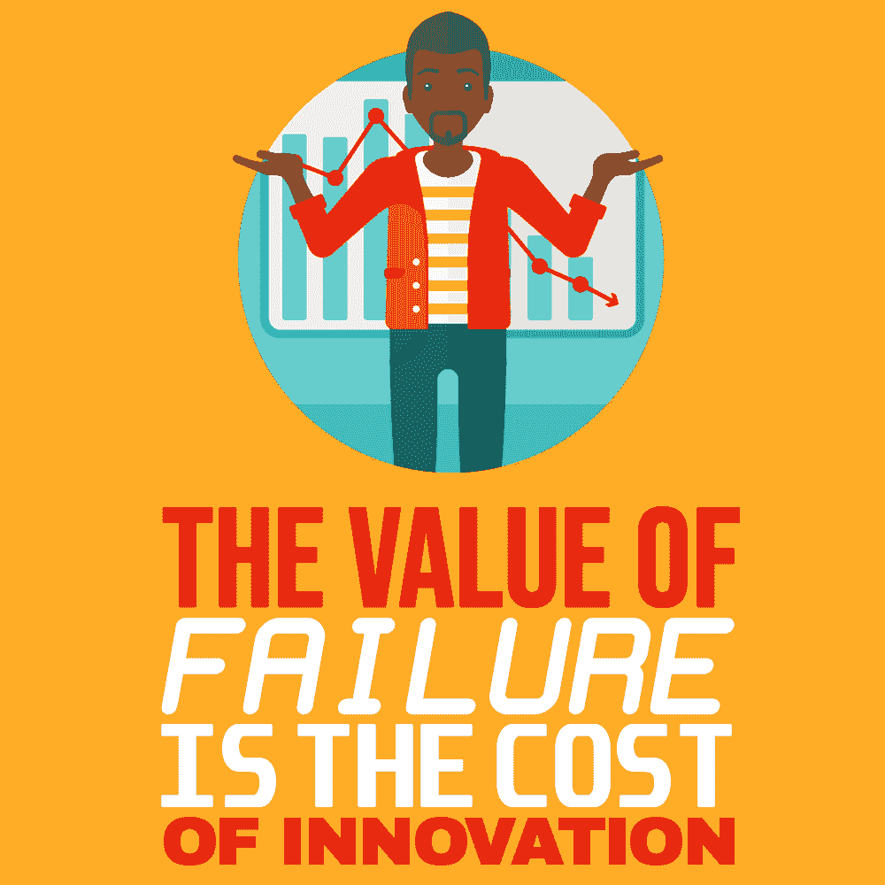
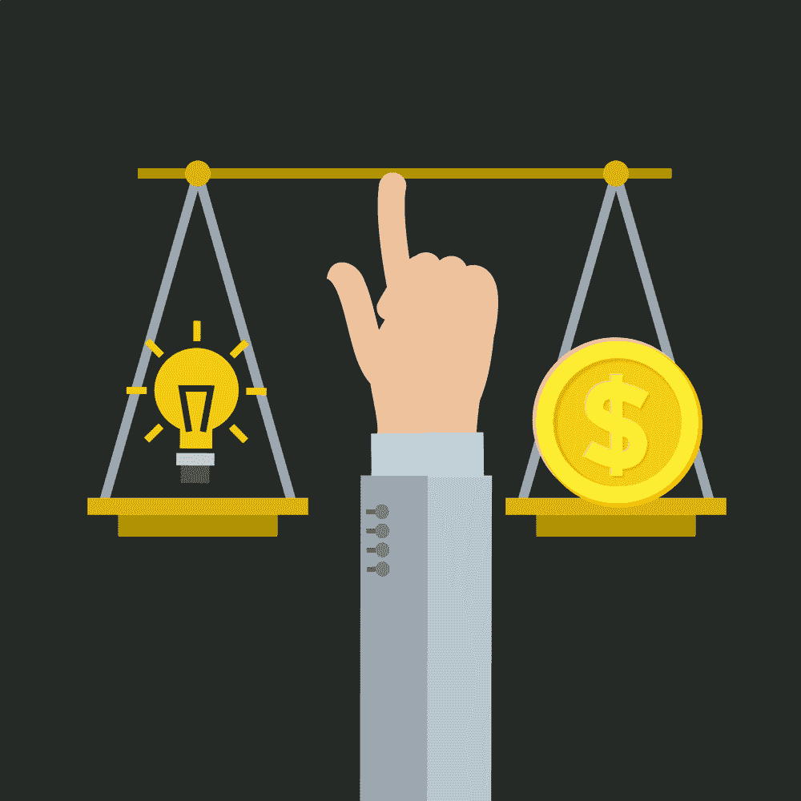

# 失败的价值是创新的成本

> 原文：<https://simpleprogrammer.com/value-of-failure/>

New products are developed yearly. If we only take a look at the Mobile App Market, there are currently over 2 million apps online with average revenue of $130 million in the first quarter of 2019 ($84 million was iOS revenue, and $51 million Google Play).

要在软件开发行业取得成功，最大的挑战也不过如此。人们渴望快速创造出适销对路的产品；在另一家公司抢在前面之前，为客户的问题和困难提供解决方案。

那些服务于利基商业行业的软件产品又如何呢？有必要添加有竞争力的特性和功能，以及创建一个易于使用和直观的设计。

在这些领域，走[定制软件解决方案](https://dreamix.eu/)的路线有很大的好处，可以创造出满足公司所有需求的产品。它允许工具的灵活性和最大效率，用于处理大量的日常工作。

软件行业对及时交付的渴望如此强烈，以至于有时用华而不实的设计和微小的调整来重新创造已经存在的东西，比走上创新之路并冒着失败的风险更容易。

失败是我们在个人生活中经常遇到的事情，也是我们职业成长的一部分。虽然逃避的冲动是强烈的，也是可以理解的，但从挫折和负面经历中可以获得很多东西，这些东西后来会成为成功的支柱。

## 软件项目失败意味着什么？

在行业中，有多种因素被观察以决定一个产品是否成功。

*   除了投入生产的成本之外，产品是否有足够的利润？
*   它符合时间框架和预算吗？
*   它满足功能需求吗？
*   是否达到了绩效目标？
*   对目标受众有市场吗？
*   是否完成并可用？

另一方面，工作过程中的某些关键方面对最终结果起着关键作用。

显而易见的是项目和时间管理，以及工作条件和沟通的有效性。当工作流程的一个或多个主要支柱有缺陷时，它会严重影响项目，导致前面提到的认为项目失败的结果。

谈到软件行业，有很多产品失败的故事。它们可以作为一个案例研究，帮助我们在处理自己的问题时避免一些主要的失败风险。

然而，你可以预防所有可能的风险的想法是不现实的，也是不可行的。所以说到底，失败是商业的一部分。你不必相信我的话。

正如埃隆·马斯克所说:“如果事情没有失败，你就没有创新。”

## 员工层面对失败的恐惧

我们已经讨论了项目失败的原因，但是对于个人来说失败意味着什么呢？

虽然是主观的，但通常可以分为两类:

你无法完成分配给你的任务，或者你没有达到自己设定的期望和目标

失败是熟悉的，因为每个人都经历过。尽管如此，感觉还是不好。它可能是每天都会发生的事情，也可能是发生时对你打击很大的事情之一，与对你非常重要的事情有关。当你考虑到这些因素时，就可以理解它是如何导致[回避](https://www.psychologytoday.com/us/blog/the-squeaky-wheel/201501/10-surprising-facts-about-failure)；更具体地说，避免将自己置于高失败风险的境地。

失败比后悔感觉更好。就这么简单！如果你想知道是否应该努力做某事，但又不确定，最好的决定是尽管有犯错和失败的风险，但总是要尝试。

更重要的是，也许你达不到目标的想法并不一定会阻止你。首先，它绝对不一定是禁止你设定目标的东西。马尔科姆·福布斯说过，“如果我们从中吸取教训，失败就是成功”。如果你第一次没有做对，那么下一次你可以利用你获得的知识做得更好。

## 失败的代价和价值

成本:精神痛苦、时间、精力、资源——金钱或其他。

价值:失败是通向新机会的大门，如果你花时间分析你所经历的过程，从设定目标到计划行动，再到执行，然后评估。

通往产品的道路是漫长的，有多个里程碑，每个里程碑都有危险。在失败的项目中可以找到很多价值。但是您需要回过头来分析投入到项目中的工作，然后找出流程在什么时候变得最糟糕。

这种方法这次可能无法保存您的项目。然而，它不可避免地会帮助你处理下一个问题——引导你穿过潜在威胁的雷区，并帮助你导航上次丢失的陷阱。

对失败抱着宽容和理解的态度，可以让你获得知识并再次尝试

ncreasing your opportunities for success. You may fail again, but you will once more gain valuable insight, or you may succeed and reach the next step, where you need to open yourself to trial and error all over again.

此外，从创新的角度思考增加了个人发展项目的成功机会，并增加了你成为有价值的软件团队领导的机会？毫无疑问，做出完美的决定并不是一种永久的特质。

这是一种利用多年来的经验来避开最常见的陷阱的能力，也是一种分析以前错误的能力。最后，它是从失败中快速恢复的能力，充分利用这种情况，然后将工作引向更有成效的不同方向。

## 创新要求你抓住机会，勇于尝试

失败是成功的一部分。

也是人性的一部分。

**而且是软件行业的一部分。**

如果你带着永远不会失败的想法投入工作，那么当它不可避免地发生时，你会受到更大的打击，并将对你的职业生涯产生深远的影响。

然而，如果你接受它，把它作为工作过程中不愉快但必要的一部分，尽管你不会对此感到舒服，你会得到更多。从长远来看，知道如何应对挫折的人对自己的职业生涯影响最大。

推而广之，它们会影响同事、下属、家人和朋友的生活。