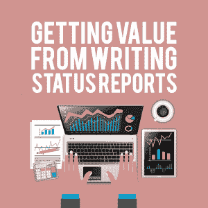

# 从撰写状态报告中获得价值

> 原文：<https://simpleprogrammer.com/value-status-reports/>

Let’s get this out of the way. Both you and I are not fans of the status report.

不幸的是，在缺乏任何合理的替代方法来使人们了解情况的时候，本组织就需要一份状况报告。

我希望有一种简单的方法可以一劳永逸地取消状态报告。我当然尽力了。甚至当你有了[一个工程 RFC 流程](https://www.leadsv.com/insight/improve-transparency-with-rfcs)或者正在实施 [Thoughtwork 的 ADRs](https://www.thoughtworks.com/radar/techniques/lightweight-architecture-decision-records) 时，你可能会发现自己需要写一份状态报告。

作为一名工程师，编写状态报告的枯燥意味着我们经常推迟到最后一刻才创建状态报告。

我们没抓住重点。如果我们要做状态报告，那么我们应该把它们变成有价值的练习，帮助我们分享我们工作的影响。然后，我们可以与我们的经理分享这种影响，[让他们更容易理解我们的工作](https://simpleprogrammer.com/dealing-with-your-boss/)并代表我们进行宣传。

状态报告是每个工程师都需要的重要沟通软技能。你不必发明一个状态报告；你可以只使用一个模板。(我们已经为您介绍了这方面的内容，请继续阅读。)你会发现，当我们改变对状态报告的想法时，它就变成了一个展示自己的机会，而不是一件苦差事。

## 状态报告的目的

任何关于状态报告的讨论都应该首先集中在为什么我们有它们。状态报告是一种信息工具。最简单的版本通常只是向你的经理重述一周的成就，他负责代表你在公司内分享相关信息。

通常，你的经理是你工作成果的传达者，无论是对他们的老板还是对整个公司。汇总团队工作的过程(通常是向上，然后向外)让你的经理和她的主管了解什么进展顺利，或者他们可以在哪些方面对你和你的团队有所帮助。

此外，由于您的工作流程通常是相互依赖的，因此您的经理会花费大量时间来解决您的团队与其他人之间的依赖关系。随着公司的发展，你的经理维护的关系数量呈指数增长:

*   三个团队，只有三种关系。
*   六个团队，有 15 种关系。
*   八个团队，有 28 种关系。

甚至楼梯井或其他建筑物等物理障碍也开始干扰信息在公司内的流动。

在某些时候，你或你的经理亲自通知每个人不再现实。有些东西必须取代面对面的会议。有时候是 Slack 之类的工具，但更多时候是电子邮件。

这种大规模交流的需要就是我们有状态报告的原因。但是如果我们的状态报告可以被任何人阅读，那么我们为谁写状态报告呢？

## 状态报告不只是给你的老板看的

我们的第一反应是专门为经理写状态报告。毕竟，经常是我们的经理要求这些更新。

Ideally, your boss is already aware of the work you are doing because your team has [one-on-ones](https://simpleprogrammer.com/engineering-management-mistakes/), [agile dailies](https://simpleprogrammer.com/dailies-spread-knowledge-work/), and other systems in place that acknowledge employee workflow. Even if these systems don’t exist, it’s rare to find a boss oblivious to their employees’ work.

相反，我们的状态报告最有可能被我们的经理拿走，并与他们的老板和你接触的团队分享。与你的老板不同，这些人不太关心工作的技术方面，他们更感兴趣的是你的报告主题将如何影响他们。

**向上管理**不总是你的老板，而是你老板的经理，他们的老板，以及尽可能向上的状态报告。通常(但不总是)，这仅限于学科。例如，你的工程或业务部门的总经理可能会阅读每个人状态的综合报告。为了满足管理链中的个人需求，我们的状态需要讨论为什么工作对业务目标很重要。

**同级团队**是我们上面讨论过的 28 个小组。他们想知道他们的工作是否会受到您团队的时间表的影响，或者他们是否会阻止您和您的团队交付价值。对于这些团队，我们的状态报告需要清楚地解释我们对他们工作的影响，以及我们的工作是否依赖于他们所负责的任务。

就像一张好的 bug 票一样，你的状态报告有很多观众。在这种情况下，是你的向上管理链和你的同级团队。

有可能写出这样的状态报告吗？能让你的老板支持你的工作，能清楚地解释商业价值，并能让同事团队了解技术含义的东西？

你打赌。不过，这看起来不像你传统的状态报告。

## 什么是状态？

考虑到我们的受众和我们写状态的原因，我们准备创建我们的第一个状态报告。您可以使用状态报告模板(我们在下面为您提供了该模板),或者打开您最喜欢的编辑器，给自己两个要点。

你要写下除了你的老板之外，你认为人们需要知道的两件最重要的事情。虽然你完全有可能想分享更多的东西，但这种人为的限制迫使我们集中注意力。

对状态报告的关注是有限的。如果我们谈论的项目越少，我们就有更多的话来关注我们选择的东西为什么重要。

我们有两个想要引起注意的项目，所以现在我们可以进入细节了。对于每一个要点，你都要加上五个句子。

首先，我们将把我们所做的写在一条 tweet 中——旧的 140 个字符的那种。这种简洁迫使我们变得具体和简洁。

然后，陈述为什么你的任务对公司很重要。也许这是一个重要项目的一部分。这可能是预防性维护。不管是什么原因，你都有意识地决定了优先次序，你的下一句话应该解释为什么这个任务对承担或完成很重要。

接下来，承认你的同事为了完成你的任务而要求你做的其他工作。在任何规模的公司中，我们的工作都不是孤立进行的。我们的状态报告让我们有机会[认可和认可我们的同事](https://simpleprogrammer.com/10-simple-social-skills/)对业务成果的支持。

如果你有需要从另一个团队继续进行的事情，清楚地陈述要求。然后，说明为了解决这种依赖，你将与谁交谈。

最后，说明个人有问题应该找谁。你可能会建议人们直接给你发邮件，但这也可能是一个松弛的渠道，或者是你的 bug/任务系统中最有效的一张票。

## 样本状态报告

To illustrate the power of reporting status in this form, I’m going to dredge up a status report I sent as an engineer during my time at LinkedIn while we were rolling out [reorderable profile sections](https://blog.linkedin.com/2010/02/02/linkedin-profile-reordering) (2010).

旧的无价值状态报告:

*   修正了拖拽错误–<jira ticket=""></jira>
*   新脚本初始化系统-<jira ticket=""></jira>
*   测试自动折叠部分–<jira ticket=""></jira>
*   带教育部分的固定布局问题-<jira ticket=""></jira>

新的价值导向状态报告:

*   通过改变我们的脚本初始化来加快个人资料页面的加载速度。这种对 JavaScript 加载方式的改变将会减少成员试图相互连接时的放弃。Scott(广告)和 Jeremy(主页)将会在他们的页面中采用这种技术。关于 JS 加载排序的问题可以发送到<my-email>。</my-email>
*   我们正在运行一个测试，测试在拖拽剖面的时候自动折叠剖面。我们认为，LinkedIn 个人资料较多的人不太可能重新排列页面，即使这有助于这些成员更好地展示自己。在我们向成员推出变更之前，我与 Sara(分析部门)合作，以确保行为得到正确处理，并且不会影响其他指标。有关此变更的问题可向我本人(<my-email>)或 Aaron ( <aaron-email>)提出。</aaron-email></my-email>

当采用新的状态报告格式时，我必须关注列表，以便我可以将更多的注意力放在对业务至关重要的事情上。Bug 修复很重要，但是除非某个特定的 bug 对业务产生了巨大的影响，否则它们必须被删除，以便为最重要的项目腾出空间。考虑到这一点，我立即放弃了 bug。

按照上面的格式，我们清楚地陈述了我们做了什么，为什么这么做很重要，谁帮助了我们，我们需要谁的帮助，以及后续问题应该去哪里。

当我改用这个系统来报告状态时，不仅我的工作得到了更多的关注，而且我也更容易与其他团队解决问题，并在遇到困难时寻求帮助。到了公司升职的时候，我已经有了自己工作的记录。更重要的是，我也记录了为什么这项工作很重要。这是我获得的最轻松的晋升。

## 将更好的状态报告付诸实践

留出时间来评估业务价值，识别同行，并清楚地定义是什么阻碍了你，这些都需要时间。如果你不留出时间做一份好的状态报告，你永远也不会。你需要做的第一件事就是在周五下午 2 点之前在你的日历上划出 30 分钟。

这似乎是武断的，但周五午餐后，工作场所的节奏慢了下来，周末计划形成了，越接近五点，越难留出 30 分钟进行高质量的工作。你越早封锁这段时间，你就越有创造力。

最后，到了写状态报告的时候，你就不用担心让它看起来很好了。我从这篇文章中提取了一些方法，将其放入 Google 文档中，添加了提示，并为您制作了这个[现成的状态报告模板](https://www.leadsv.com/splash/sp-status-reports?utm_source=blog&utm_medium=simpleprogrammer&utm_campaign=status-reports&utm_content=template)。

点击它。复制它。用今天文章中的细节来填写。如果每个人都开始抄袭你的好主意，不要惊讶。