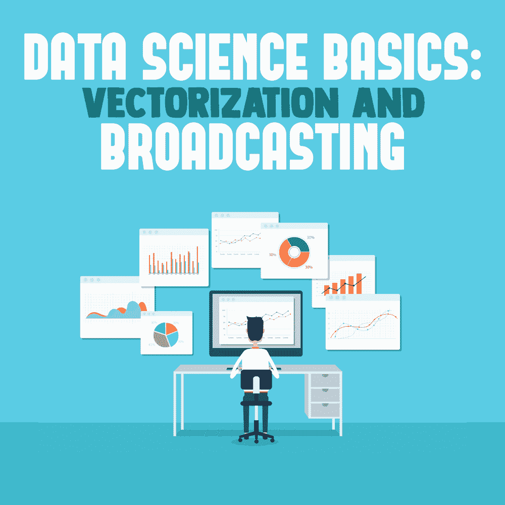

# 数据科学基础:矢量化和广播

> 原文：<https://simpleprogrammer.com/vectorization-and-broadcasting/>

<figure class="alignright is-resized">

</figure>

[数据科学](https://simpleprogrammer.com/data-science-viable-career-2018-beyond/)是一个*巨大的*领域。虽然有许多不同的重点和技能可供学习，但您不必了解所有这些才能认为自己是一名数据科学家。然而，有一样东西是你离不开的:数据— *和*将数据转换成有用格式的技术。

现在，我不是在说“清理”数据。这本身就是一个巨大的话题，我可以就此写一篇完全不同的文章。我说的是之后的*数据是干净的，把它变成一种你的分析可以理解的表示，甚至更强大，一种允许你利用强大的数字分析库的表示，这些库可用于快速、有效和干净的分析代码。* 

在处理数据时，您经常需要对数据的每个元素应用相同的计算，以便获得相同形状的新数据。假设你有一百万行数据。想象一下，编写一个 for 循环来遍历和访问每个元素。呃。现在想象在你的数据分析过程中的每一步都这样做。现在，你有了两个数据集，你想比较一个中的每个元素和另一个中的每个元素，你必须为每个计算写一个双重嵌套的 for 循环。你能感觉到你的代码膨胀吗？你能感觉到你的表现滞后吗？你能感觉到你的灵魂在一点点死去吗？

正是因为这些原因(可能不是最后一个原因)，才有了**向量化和广播**的概念。

我们将使用强大的、经过审查的库来利用快速的、编译的、低级语言来为我们完成繁重的工作。我们将编写我们想要编写的代码——我们每个人内心的数学家都希望我们 T2 能够编写的代码。我们将打破普通 for 循环的链条，发现*塑造*我们数据的力量。因为就像其他事情一样，一点点准备就能走很长的路。

> 曾经有人问一个樵夫:“如果你只有五分钟去砍倒一棵树，你会做什么？”他回答说，“我会花前两分钟磨我的斧子。”

*本文将会有一些使用 Python 和 [NumPy 包](https://docs.scipy.org/doc/numpy/reference/arrays.html)的例子(它为高效的矢量操作提供了基本的支持)。即使您不是一个熟练的 Python 用户，也应该足够清楚地理解本文中的思想。*

## **矢量化**

先说一下 **[矢量化](https://simpleprogrammer.com/vectorization)** 。为此，我们需要定义什么是**向量**。一个**向量**只不过是所有相同类型的项目的集合——通常只有一维。二维的集合通常称为矩阵。当谈论一个具有任意维数的泛型集合时，你可以使用数组这个词。

注意:不同语言的词汇会有所不同，但都意味着“一些值的集合”

在数据科学案例中，向量通常是数字，但其他数据类型也是可能的。矢量化背后的思想是，如果您足够小心，您可以直观地将矢量视为单个数字。

下面是矢量数学的工作原理:

用同样的方法将两个数字相加，你可以将两个矢量相加，运算将基于元素进行。

我们现在已经将加法运算“矢量化”，使其适用于向量。NumPy 库有一大堆矢量化函数，包括平方根、绝对值、三角函数、对数函数、指数函数等等。

当您基本上想对所有值做同样的事情时，这些矢量化运算有助于减轻处理大量值时的精神负担，就像处理一个数字一样处理逻辑。你不写任何自己的循环！

## **广播**

好了，到目前为止，我们已经弄明白了矢量化背后的想法是让两个大小和形状相同的集合之间的运算像两个单一数字之间的运算一样直观。

但是当这些系列是不同的形状时呢？

这就是我们应用一个叫做**广播**的概念的时候。**广播**是将一个数组扩展成某种形状的行为，这种形状将允许它成功地参与向量化计算。规则如下:

*   如果两个数组在一个维度上长度相同，那么这个维度将以元素方式进行操作。
*   如果一个数组在一个维度中有一些数字，而另一个数组在该维度中的大小仅为 1，则该值将被**广播**，并且它将与另一个数组中的每一项一起使用。
*   如果两个数组大小不同，并且大小都不是 1，则无法执行广播，并会引发错误。

这是一个很难理解的概念，所以我认为是时候举一些例子了。首先，假设我们有一个 4×5(4 行 5 列)的数组，另一个是一行 5 列的数组。

<figure class="aligncenter">

</figure>

我们有两个方面要考虑。在轴 0(行轴)中，一个是长度 4，另一个是长度 1。规则满足广播，所以我们广播！

<figure class="aligncenter">

</figure>

现在，0 轴匹配。检查轴 1(列轴)，两者都有五个元素。因为它们匹配，我们可以执行操作。

<figure class="aligncenter">

</figure>

让我们看另一个例子，它实际上更简单，但乍一看似乎很棘手:

<figure class="aligncenter">

</figure>

只是一个普通的号码？是啊！你可以把它想象成一个 1x1x1 的小数组。它将根据需要在多个轴上播放。在这种情况下，我们只需要一个。

<figure class="wp-block-image">

</figure>

好的。我们已经介绍了一些这些概念的含义，它们是如何工作的，以及它们意味着什么。但是现在是时候看看我们如何使用它们，为什么我们需要了解它们了。我们将通过一个例子来展示他们可以使我们的数据分析代码变得多么干净和快速。只需做一点点数据整形设置，我们就可以用一条简单、巧妙的逻辑将分析推出公园。

## **兰花数据集**

想象一下，我们有一个关于兰花的数据集。这个数据集将被分成两部分:一个训练集和一个测试集。利用“最近邻”算法，我们将对这些兰花进行分类。

这一切意味着什么？

训练集的每一行都有四列浮点值，描述特定植物的不同特征:长度、宽度等。每一行都有一个标签，上面写着兰花的种类。

测试集的每一行都有相同的东西，但我们将测试集中的每一行与训练集进行比较，以尝试预测它是哪种兰花。

“最近邻”算法听起来比实际上要花哨得多。我们将找出训练集中的哪一行“最接近”我们试图分类的测试集中的那一行。“最近”，我的意思是我们将使用距离计算。在 2D 坐标中，你可以这样计算两点之间的距离:

<figure class="aligncenter">

</figure>

对于 3D 空间变化不大:

<figure class="aligncenter">

</figure>

事实上，[模式适用于任意数量的维度。我们刚好有四个:](https://en.wikipedia.org/wiki/Euclidean_distance) 

<figure class="aligncenter">

</figure>

所以我们的目标是，对于测试集中的每一行来说:

1.  找出训练集中最相似的行。
2.  返回“最近邻”的标签，作为我们对测试集中该行标签的预测。(这是有道理的，因为同一物种的兰花应该大多具有非常相似的特征，与其他物种不同。)

但是这里是我们将如何伸展我们的数组肌肉:我们将不用写一个循环就能做到这一点！

在我们看到任何代码之前，我们想看看如何在一个更简单的例子中实现这一点，因为每个兰花都有四列相关的数据，这使得事情变得有点困难。

### **更简单的情况**

假设我们有一组*训练* *数字*和一组*测试* *数字*。

<figure class="aligncenter">

</figure>

我们如何使用广播来检查每个测试编号和所有训练编号？诀窍是*旋转*。

记住，只有当一个轴的长度为 1，而另一个数组的长度大于 1 时，广播才会发生。因此，我们首先将训练转换为 2D 数组，以便它知道第二维度，然后我们将*交换轴*,以便它不是单列，而是单行——有效地将其旋转到一个新的维度。

<figure class="aligncenter">

</figure>

现在，训练是 1×50，测试是 50×1，所以*两个*阵列将在相反的维度上广播！

<figure class="aligncenter">

</figure>

通过广播的惊人力量，我们已经将曾经的双重嵌套循环变成了一个命令，现在可以用来进行元素间的距离计算。

<figure class="aligncenter">

</figure>

### **回到兰花**

好了，现在我们已经在超能力列表中增加了新维度的旋转阵列能力，让我们回到我们的兰花，看看我们是否可以应用相同的技术。唯一的区别是我们的兰花有四列数据——一个额外的维度！那么我们能做什么呢？我们有一个 75 x 4 的测试集和一个 75 x 4 的训练集。我们不能交换 0 轴和 1 轴，因为对于 75 x 4 和 4 x 75，没有广播。还记得广播的规则吗？我们要么需要一个长度为 1 的轴，要么需要两个轴长度相同。你知道我们要做什么吗？

我们要进入…

<figure class="aligncenter">

</figure>

没错。我们可以把轴 1(四根柱子)看作是一个甚至不会打扰我们的东西，而是以垂直方向旋转！

<figure class="aligncenter">

</figure>

现在我们已经有了一个 1 x 4 x 75 和一个 75 x 4，所以我们就快到了，但是当我们试图对它们做任何矢量化的操作时:

值错误:操作数不能与 shapes (1，4，75) (75，4)
一起广播

测试数据集至少需要承认第三个轴的存在，即使它不做任何事情。

终于，我们到了。我们有一个 1 x 4 x 75 的阵列和一个 75 x 4 x 1 的阵列。相同数量的轴。每个轴要么匹配，要么其中一个是 1，所以我们可以广播。我们准备好了。当我们广播时，它会是这样的:

<figure class="aligncenter">

</figure>

既然距离变得如此复杂，我们该如何处理它呢？这就是矢量化计算的美妙之处。没什么不同。主要的区别在于，我们需要将每列的平方差相加。

<figure class="aligncenter">

</figure>

这可能是整个主题中最令人困惑的部分。花点时间坐下来，让它渗透一点。

首先我们做减法，元素方面:

<figure class="aligncenter">

</figure>

然后我们平方结果。

<figure class="aligncenter">

</figure>

我们使用一个**聚合**函数(sum)将每个列的计算结果添加到一个值中，最终*在一天结束时挤压*该轴。这就是为什么我们要告诉它要在哪个轴上求和。

<figure class="aligncenter">

</figure>

最后，求每个数字的平方根。

<figure class="aligncenter">

</figure>

最后，我们剩下的距离数组实际上是 75 x 1 x 75。对我们来说很方便的是，NumPy 意识到我们要的是什么，并交换最后两个轴，得到最终的 75 x 75 形状的数组。这些是每对兰花之间的总 4D 距离，测试在垂直轴上，训练在水平轴上。

<figure class="aligncenter">

</figure>

从现在开始都是下坡滑行。如果我们想找出哪个训练兰花与每个测试兰花最接近，我们需要计算出每行最小值的索引。

NumPy 为我们提供了另一个非常强大的聚合函数 argmin，它返回特定轴上最小值的索引。再次记住，每当我们使用聚合函数时，我们最终都会挤压那个轴。

<figure class="aligncenter">

</figure>

这些指数是在元素方面与每个测试值最相似的训练值的指数。让我们再看一个矢量化的魔术:索引。

<figure class="aligncenter">

</figure>

终于！我们有一个预测的兰花品种为每个测试兰花的基础上，最相似的训练兰花。

伟大的作品！

## **整理我们的数据**

矢量化和广播不是最容易理解的概念。这是一个相当厚的抽象层，隐藏了很多细节，但它将我们程序员从泥淖中提升出来，让我们成为科学家和数学家。如果你能掌握它们，你就能写出你*想要的*代码，你*意思是*的代码，*重要的*代码；并且您不必在实现细节中模糊它，例如带有中间帮助变量的深度嵌套循环、笨拙的过滤器和笨拙的映射逻辑。

许多库[在这些数组计算的基础上抽象](https://simpleprogrammer.com/machine-learning-without-mooc-book/)，所以在整个中间阶段，你通常不必担心你的数据是什么形状。然而，当事情出错时——它们确实会出错——理解多维数组确实会有所帮助。

现在，您已经掌握了分解分布在不同形状数组中的复合矢量化计算所需的技能。你知道如何计算每一小步；弄清楚数据在之前、期间和之后处于什么形状；并确定这如何影响下一步的计算。这将有助于您避免不知所措和困惑，并将您的数据科学技能提升到新的高度。能够“旋转”数据以避免嵌套循环，并使用聚合函数“挤压”数据将您的分析带到新的维度，然后将其带回更简单、更易于管理的数据形状。

您可能还没有掌握数据科学的整个领域，但现在您能够正确地准备和形成您的数据，这些基本技能为您奠定了坚实的基础，可以在此基础上构建您的技能。

<figure class="aligncenter">

</figure>