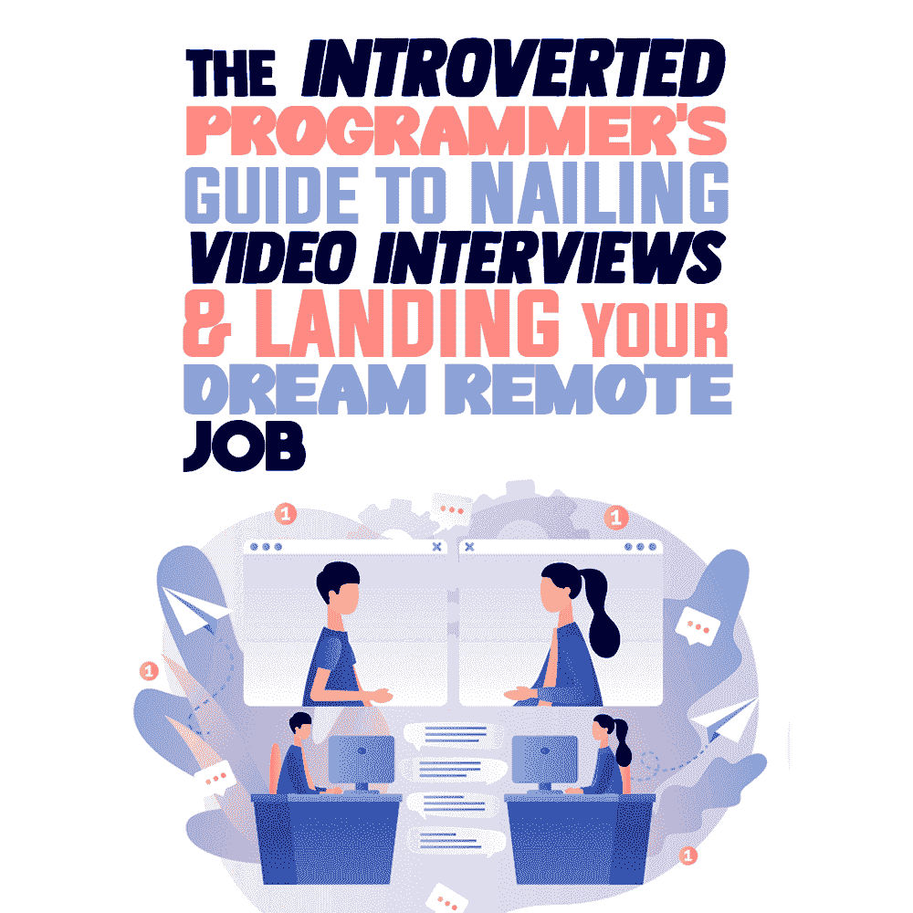

# 内向程序员的视频面试指南&获得你梦想中的远程工作

> 原文:[https://simple programmer . com/video-interests-dream-remote-job/](https://simpleprogrammer.com/video-interviews-dream-remote-job/)

Job interviews (even remote ones) can be a struggle, especially for introverted programmers. It can seem impossible if you’re not used to putting yourself out there by networking or marketing your skillset.

在你的工作中，别人如何看待你并不重要。你的工作是编写代码，调试它，并确保它的功能。为什么你需要看起来像样，并请面试官被录用？难道你丰富的简历和作品集还不足以证明你能做好这份工作吗？

我听到了；压力很大，感觉不公平。

然而，好消息是，通过准备和练习，你可以搞定任何工作面试。

更好的是，随着越来越多的公司开始提供远程职位，进入门槛正在降低，给你比以往更多的机会。因此，如果你有合适的资源可以支配，获得你梦想中的编程工作指日可待。在本帖中，我将与你分享你需要知道的关于视频面试和获得你梦想中的远程工作的一切。

## 准备和表现你所有的虚拟面试

即使你害怕面试，你仍然可以通过做调查来让自己成功。

从基础开始:除了你感兴趣的职位的工作描述，你还应该去公司的网站上看看他们的使命和价值观。了解一下工作文化，看看它是否适合你。

而且，你的研究应该超越公司网站。在 Glassdoor 等网站上查看员工评论，看看现任和前任员工有什么看法。你也可以搜索文章、博客文章或 YouTube 视频，让你了解这家公司的幕后。最后，你可以寻找面试官的信息，比如他们的 LinkedIn 个人资料。

不言而喻，如果你认识在这家公司工作的人，联系他们，看看他们是否愿意把你和招聘经理联系起来。这将会给你一个机会去更多地了解这家公司，并有可能让你进入这家公司的大门。

总体来说，准备是至关重要的。没有它，你可能会在工作面试中感到不知所措和不够资格——特别是如果你很内向的话。相反，如果你做好了调查，你会感到自信、有能力、有准备。

别忘了自己也准备几个问题。问问题会帮助你避免紧张，并显示你对这个机会真正感兴趣。

## 熟练回答常见问题

知道如何回答问题是准备面试最有效的方法之一。

最好的方法是头脑风暴，列出你认为面试官可能会问的问题，然后为每个问题想出答案。这将帮助你听起来自然，避免不舒服的面试停顿。

以下是一些常见问题的示例以及您可能的回答方式:

*   介绍一下你自己:这是一个简要介绍你的职业背景并突出你最相关的技能和经验的机会。保持简短和甜蜜——大约 2-3 分钟就可以了。
*   你的优势是什么？:在回答这个问题的时候，把重点放在让你非常适合这个角色的品质上。例如，如果你申请一份需要频繁协作的编程工作，你可以说你的优势是在团队中工作出色。
*   你的弱点是什么？:在这里要诚实，但是避免谈论那些让你不适合这份工作的品质。相反，把注意力放在你正在努力改进的地方。
*   你期望的薪水是多少？这是一个棘手的问题，所以你应该准备好答案。第一，研究同一地点类似职位的薪资。避免给出一个具体的数字，设定一个合理的薪资范围。稍后我会给你更多的建议。
*   你认为自己五年后会怎样？:这个问题旨在评估你的长期动机和职业抱负。回复时，关注你申请的职位如何符合你更大的职业目标。比如你可以说你希望和公司一起成长，最终承担更多的责任。

要获得更全面的列表，请查看编程面试问题列表以及如何回答这些问题。如果你想更深入地了解，这里有更多你可以研究的面试问题:

*   [一般面试问题&答案](https://novoresume.com/career-blog/interview-questions-and-best-answers-guide)
*   [编程工作面试问题(系列)](https://www.amazon.com/dp/B08BWWNHGK/makithecompsi-20)
*   [编码面试问题](https://www.amazon.com/dp/B08CMHNDTH/makithecompsi-20)
*   [Python 面试问题&答案](https://simpleprogrammer.com/top-python-interview-questions/)

一旦你很好地理解了他们可能会问你的问题，是时候练习你的回答了。最好的方法是和一个可以充当你面试官的朋友或家人进行角色扮演。这将帮助你习惯虚拟面试的形式和流程。

## 掌握视频采访的艺术

With the proliferation of remote work, video interviews have become increasingly popular. They can be done in real-time or asynchronously, which means you have more flexibility in scheduling. But whether it's a live or recorded video interview, there are a few things you should keep in mind to make sure you ace it.

### 找一个安静、整洁、舒适的空间

首先，在家里选择一个光线充足、背景噪音最小的地方。然后，你需要确保你的环境整洁和像样。

您还应该提前测试您的互联网连接，并熟悉正在使用的视频会议软件。

如果在你的面试中有潜在的干扰，确保找到一个你不会被打扰的安静的地方。如果你家里有孩子或宠物，在你面试的时候安排人照看他们。

### 打扮一下

说到穿什么，谨慎一点，穿得像你亲自面试时一样。所以，穿适合公司文化的职业装。

### 进行眼神交流和微笑

尽管你和面试官不在同一个房间，但是眼神交流仍然是必不可少的。即使感觉不自然，和面试官说话的时候也要看着镜头。否则，你可能会显得不感兴趣，甚至粗鲁。记得微笑！

如果你不习惯，所有这些可能会很困难或不舒服，但它有助于表现出自信和平易近人。当然，你也应该避免坐立不安或过多地注视附近的物体。

### 注意你的肢体语言

你的肢体语言是面试官如何看待你的重要因素。记得坐直，保持友好的肢体语言，少用手势。

不要交叉双臂，因为这会让你显得封闭。此外，偶尔点头表示你正在参与谈话。

记住，面试是你推销自己和技能的机会，所以突出你的成功，以及它们如何让你成为这份工作的理想候选人。为你的成就感到自豪，并用具体的例子来支持它们。

### 展示你的个性

你的面试官想要了解你，所以不要害怕展示你的个性。这将有助于他们了解你是否适合公司文化，以及你是否能与团队合作愉快。

一定要突出你的技能，并解释它们会给公司带来什么好处。这将表明你不仅能胜任这份工作，而且对它充满热情。

许多内向的人担心面试时说话太多，但过于安静也可能是一个错误。如果你不说话，面试官可能会认为你对这个角色不感兴趣，或者你没什么可说的。努力完整地回答问题，并问几个你自己的问题。

总的来说，要自信！自信在任何面试中都是至关重要的，尤其是对于内向的人，他们可能更倾向于怀疑自己。请记住，你和其他候选人一样可以提供很多，所以要相信自己。

### 突出您的远程体验

让你的面试官了解你过去的远程工作经验，以及它如何让你成为这份工作的绝佳候选人。这可以包括从自由职业到在家工作的任何事情。解释你如何在远程工作时保持动力和效率，因为这通常是雇主最关心的问题之一。

### 节约使用笔记

面试的时候可以参考自己的笔记，但是不要太依赖笔记。否则，你会显得毫无准备或不感兴趣。如果你使用它们，确保它们简明扼要。

### 发送后续消息

最后但同样重要的是，记得在视频面试后发一封跟进邮件或信息。感谢面试官的时间，重申你对这个职位的兴趣。跟进表明你对这个角色感兴趣，这有助于你保持头脑清醒。如果一两个星期后还没有回音，你也可以打电话或发电子邮件跟进。

遵循这些建议，你将会在下一次视频面试中取得成功。因此，本着乐观的精神，我也将和你分享一些关于如何协商你的薪水和福利的建议。

## 像专家一样协商你的薪水和福利

Negotiating your salary and benefits can be a daunting task, especially for introverts, but you can get everything you want with a bit of preparation. Here are a few tips.

### 了解你的价值

弄清楚你的职位和经验水平的平均工资是多少。这将有助于你知道要求多少，并给你一个谈判的起点。

你也可以看看其他公司类似职位的薪资范围，向你的潜在雇主表明你了解市场价值，并帮助他们理解你的期望。

### 准备还价

如果你的潜在雇主开出的薪水比你预期的要低，不要害怕反击。

一定要有一个你觉得合适的数字，并准备好解释为什么你值得拥有它。表明你对自己的技能和价值有信心。

### 考虑所有的好处

工资很重要，但不是唯一要考虑的。确保你也考虑到了诸如假期、健康保险和其他福利。

不要害怕要求你想要的。最好把所有的事情都写下来，这样以后就不会混淆了。

### 愿意妥协

到最后，你可能需要在一些事情上妥协，才能得到你想要的。准备好放弃一些东西来得到另一些东西。

例如，你可能愿意接受较低的工资，如果这意味着你有更多的假期。

### 有备用计划

永远要有一个后备计划，以防谈判失败。这可能是任何事情，从要求更多的时间来看看提供给你的工作，到找到另一份工作。

如果他们不想给你应得的薪水和福利，不要害怕离开谈判。与其接受一个不符合你最佳利益的提议，不如走开。

记住，在这种情况下你有力量，你不应该满足于低于你的价值。所以，满怀信心地走进去，准备好为你想要的而奋斗。

通过遵循这些建议，你应该能够得到你想要的报酬和福利。

## 准备会让你成功

对于内向的程序员来说，获得一份远程工作可能是一个挑战，但是你可以在面试中胜出，并通过适当的准备获得你梦想的职位。

记住要做好充分的准备，打扮好角色，要自信。相信自己，准备好熟练地谈判，获得你应得的梦想工作。