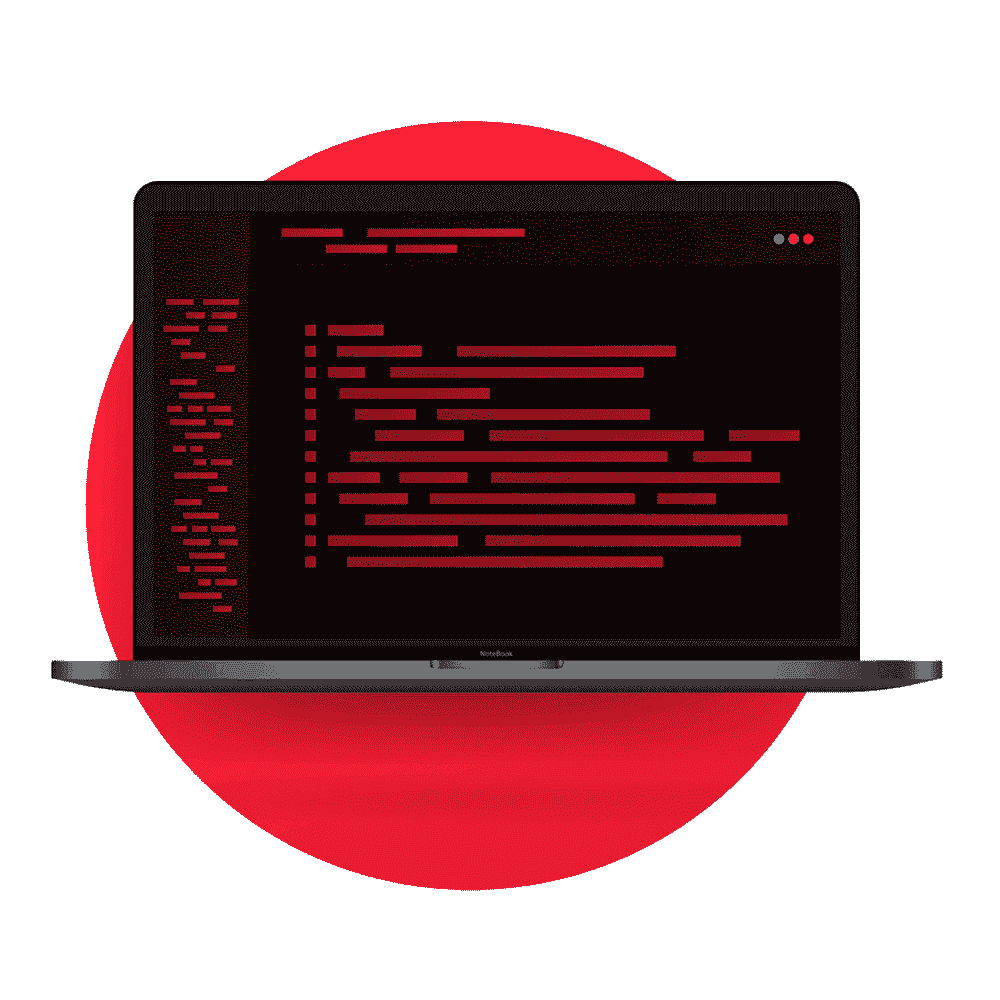

# 2020 年每个开发人员都应该拥有的 Visual Studio 代码扩展

> 原文：<https://simpleprogrammer.com/visual-studio-code-extensions/>

Remember those old TV commercials that sold amazing nonstick pans or the colorful knives that were as sharp as a Samurai sword? Although you might have already had pans and knives in your kitchen, it was common to suddenly feel the need to buy them because they seemed better. The same thing happens with Visual Studio (VS) Code extensions. Sometimes developers don’t realize how badly they need them until they see all their features.

如果你已经做了几年的开发人员，你可能已经使用过 [VS 代码，并且发现了很棒的扩展](https://www.amazon.com/dp/1484242238/makithecompsi-20)。然而，因为它们中的许多被标记为“最好的”或“最受欢迎的”，其他独特的 VS 代码扩展仍然相对不为人知。

在这篇文章中，我们将首先简要介绍 VS 代码的基础知识，然后我将向您推荐最有用的 VS 代码扩展，包括流行的和独特的、不太为人所知的扩展。这些扩展不仅会提高你的工作效率，而且——就像不粘锅或武士刀一样——你可能会想没有它们你是怎么应付的！

## 什么是 Visual Studio 代码？

对于那些进入这个奇妙的编程世界并寻求工具来使他们的编码更好更快的人来说，VS 代码是必备的。

在深入了解独特的 VS 代码扩展之前，让我们先了解一下 VS 代码是什么。

Visual Studio Code 是微软制作的[免费源代码编辑器，适用于 Windows、Linux、macOS 等不同操作系统。它内置了对 TypeScript、JavaScript 和 Node.js 的支持。根据 2019 年对](https://en.wikipedia.org/wiki/Visual_Studio_Code)[栈溢出](https://stackoverflow.com/)的开发者调查，它还包含许多有用的功能，这些功能使这款开发工具最受程序员欢迎。

例如，使用 VS 代码扩展，[开发人员可以更快地编程，](https://simpleprogrammer.com/learn-to-code-faster/)并且忘记机械任务，因为这些扩展中的一些会处理所有这些。例如，他们可以花更多的时间去思考新的方法来使软件更具创新性，而不是去调试。

[Visual Studio 代码](https://code.visualstudio.com/)包含了重要的特性，比如:

*   更快地编写代码
*   调试功能，确保您的代码是干净的，没有错误的。
*   支持重构操作。
*   允许您同时处理多个项目的拆分视图。
*   丰富的语义代码理解和导航

现在，有了基础知识，让我们直接进入重要的部分:VS 代码扩展。

## 流行与代码扩展

随着时间的推移，VS 代码越来越受欢迎，因为它是开源的，新的扩展不断出现在市场上，帮助开发人员解决各种困难。

我下面列出的五个 [VS 代码扩展](https://distantjob.com/blog/best-visual-studio-code-extensions/)在过去几年里越来越受欢迎，因为根据开发者社区的说法，它们帮助他们使编程过程更加高效。这些扩展中的大部分可以帮助他们自动完成那些繁琐耗时的手工任务。想想你在编码时每天都要面对的噩梦。这五个 VS 代码扩展可能会帮助你摆脱那些噩梦。

### [GitLens](https://marketplace.visualstudio.com/items?itemName=eamodio.gitlens)

这个 VS 代码扩展帮助开发人员更好地理解他们的代码。当一行/一个代码块中有变化时，他们可以搜索代码库的历史，了解代码是如何变化的，为什么变化，以及谁改变了它。

### [更漂亮](https://marketplace.visualstudio.com/items?itemName=esbenp.prettier-vscode)

大多数开发人员，尤其是初学者，努力维护一致的代码。通过从您的代码中创建一个抽象语法树，并使用它自己的规则重新打印它，漂亮地实施了一致的编码风格。

### [JavaScript (ES6)代码片段](https://marketplace.visualstudio.com/items?itemName=xabikos.JavaScriptSnippets)

编码往往是一项单调的任务，因为很多时候，开发人员需要一次又一次地编写相同的代码。有了代码片段，他们可以大大减少输入重复代码的需要，有更多的时间关注真正的代码。

### [ESLint](https://marketplace.visualstudio.com/items?itemName=dbaeumer.vscode-eslint)

它是一个林挺工具，允许开发者创建他们自己的林挺规则，这样他们可以在他们的代码中运行分析，以查看是否有些模式或代码没有遵守特定的规则指南。这个特性对于需要格式指南来保持代码一致性的开发团队特别有用。

### [括号对上色器](https://marketplace.visualstudio.com/items?itemName=CoenraadS.bracket-pair-colorizer-2)

括号是开发者的噩梦。但是，通过这个扩展，用户可以定义哪个令牌匹配什么颜色。这样，括号很容易用颜色识别，使开发人员有一个更可读和一致的代码。

## 唯一 VS 代码扩展

The year is ending, and the results are in. These eight VS Code extensions have made their way through this year by helping developers increase their speed and productivity while coding. Some of these extensions have even encouraged devs to take breaks or have fun while working!

### [孔雀](https://marketplace.visualstudio.com/itemdetails?itemName=johnpapa.vscode-peacock)

众所周知，孔雀是高贵的动物，呈现出美丽的蓝色和绿色。它们为 John Papa 提供了灵感，John Papa 是 Peacock VS Code extension 的创建者，该扩展允许开发人员更改他们的颜色设置。为什么更改颜色设置在编程中很重要？

当您处理多个 VS 代码实例时，有时很难识别它们中的每一个。但是当你用颜色区分它们的时候就变得容易了。因此，Peacock VS Code 扩展帮助开发人员识别他们的工作空间，并以更好的方式组织它，最大化他们的工作流程。

孔雀扩展亮点:

*   用不同的颜色定制您的工作空间。
*   与实时共享和 VS 代码远程集成。
*   命令(位于命令选项板中)。
*   用户自定义的颜色从喜爱的颜色。
*   调整受影响元素的颜色(使其变暗或变亮)。

### [WakaTime](https://marketplace.visualstudio.com/items?itemName=WakaTime.vscode-wakatime)

开发人员花大量时间编码。这不是新闻；这是他们工作的一部分。然而，花费数小时在编码上并不一定意味着他们是有生产力的，因为有时他们只是不知道他们在特定任务上花费的所有时间。

对于程序员来说，WakaTime 是一个完美的工具，可以跟踪他们在编程上花了多少时间，帮助他们衡量他们的性能，或者让他们意识到他们是否在不必要的任务上花了太多时间。有了这个扩展，他们可以通过查看 WakaTime 对他们表现的见解来提高他们的生产力。

WakaTime 扩展亮点:

*   带有指标的个人仪表板。
*   度量你的代码(每个项目、文件、分支等的实时度量。).
*   支持 600 多种编程语言。
*   设置提醒。
*   保持开发人员日常编码的一致性。

### [碳](https://marketplace.visualstudio.com/items?itemName=ericadamski.carbon-now-sh)

拥有代码的截图并不是最基本的，但是仍然很有帮助。无论是因为你是一个喜欢在博客文章中添加漂亮截图的技术作家，还是因为你是一个正在为你的团队创建演示文稿的远程程序员，使用截图将某些事情带到了另一个层次。Carbon 是它的完美的 VS 代码扩展。

虽然 Carbon 的主要功能是创建代码的截图，但它还有其他一些特性，使这个扩展成为一颗隐藏的宝石:

*   自定义您的颜色主题、背景色或窗口样式。
*   生成 SVG 或 PNG 图像。
*   分享你的代码截图。
*   自动检测编程语言并应用匹配的语法突出显示。
*   格式化生成的图像(使用字体大小和颜色主题)。

### [Base64](https://marketplace.visualstudio.com/items?itemName=adamhartford.vscode-base64)

Base 64 是一种编码算法，允许开发人员将任何字符转换成由拉丁字母、数字、加号和斜线组成的字母表。用户可以将汉字、图像和表情符号转换成可读的字符串。所以基本上，它是一个翻译器。

现在大多数程序员使用这种独特的 VS 代码扩展来编码二进制数据(如图像)以将其嵌入到 HTML 或 CSS 文件中。此外，Base64 用于编码在传输或存储过程中可能遭受损坏的数据。

Base64 亮点:

*   发送电子邮件时附加文件。
*   将图像嵌入 HTML 或 CSS 中。
*   输出二进制数据。
*   将二进制文件保存到数据库。

### [Vim](https://marketplace.visualstudio.com/items?itemName=vscodevim.vim)

Vim 不就是 Visual Studio 代码的竞争吗？幸运的是不再是了，因为现在这个 VS 代码扩展带来了两个世界的最好的东西。

Vim 是一个文本编辑器，允许开发人员高效地编写代码，这不仅是因为它的特性，还因为它的原理。Vim 反对使用鼠标，所以你只能在[运动和动作](https://medium.com/swlh/the-best-of-both-worlds-visual-studio-code-vim-f8e343eb070f#https://medium.com/swlh/the-best-of-both-worlds-visual-studio-code-vim-f8e343eb070f#:~:text=VSCode%20has%20a%20Vim%20extension,within%20the%20context%20of%20VSCode.:~:text=VSCode%20has%20a%20Vim%20extension,within%20the%20context%20of%20VSCode.)的想法下使用键盘。然而，尽管它是一个很棒的工具，大多数开发人员还是选择 Visual Studio 代码，因为它更加可定制，并且有更多的功能。

但是现在，由于 Vim 扩展，他们不必二选一了。开发人员现在能够使用这两种文本编辑器，利用它们各自的最佳特性。

Vim 扩展亮点:

*   多级撤消树。
*   广泛的插件系统。
*   支持数百种编程语言。
*   轻松定制。
*   它是高度可配置的。

### [Spotify](https://marketplace.visualstudio.com/items?itemName=shyykoserhiy.vscode-spotify)

是的，音乐也很重要！对于在工作时深深享受音乐的程序员来说，这是最适合你的 VS 代码扩展。

它是如何工作的？当你安装了 Spotify 扩展，你就可以听你最喜欢的歌曲，在你编码的时候控制哪些歌曲出现，暂停或者跳过它们。

Spotify 扩展亮点:

*   可以在任何平台上使用。
*   在 vscode 状态栏中显示当前播放的歌曲。
*   提供命令的热键。
*   歌词可用。

### [缩进彩虹](https://marketplace.visualstudio.com/items?itemName=oderwat.indent-rainbow)

Similar to Bracket Pair Colorizer, this unique VS Code extension has the objective of making coding more productive by distinguishing indents with different colors.

这个简单的扩展的主要目的是通过给每个缩进标签着色来增加缩进的可读性。默认情况下，它有所有的彩虹颜色，但如果它对你来说太丰富多彩了，你可以很容易地将它们定制为你最喜欢的颜色。

### [视觉蛇码](https://marketplace.visualstudio.com/items?itemName=ZhouSir.visual-snake-code)

我们都需要休息！有时我们害怕休息，因为我们觉得我们在浪费时间，但休息有助于我们补充能量，提高效率。大部分时间，程序员都在工作中消耗，编码几个小时甚至没有意识到。这意味着他们几乎从不休息！

但是，使用可视 Snake 代码扩展，中断是不可协商的。这个扩展可以让程序员在玩经典的贪吃蛇游戏时分心几分钟。他们可以放松一下，休息一下，玩一会儿，然后继续工作！

## 准备好优化您的工作流程了吗？

[Visual Studio 代码](https://www.amazon.com/dp/1119588189/makithecompsi-20)有成千上万的扩展供开发者使用和享受。虽然有一些流行的 VS 代码扩展非常有用，但是不要忽视那些不太为人所知的。这八个独特的 VS 代码扩展是[开发人员寻找策略来提高他们的生产力](https://simpleprogrammer.com/16-free-tools-for-developers/)和享受工作乐趣的完美工具。

编程不一定要在椅子上坐八个小时(如果不是更长的话)，打字直到眼睛累了。编程也是为了享受你的工作，有了这些扩展，你就可以一边听你最喜欢的 Spotify 播放列表，一边玩五分钟 Snake 来理清思绪。许多这些独特的扩展将允许您更快地编写更好的代码，优化您的工作流程，并从中获得乐趣。