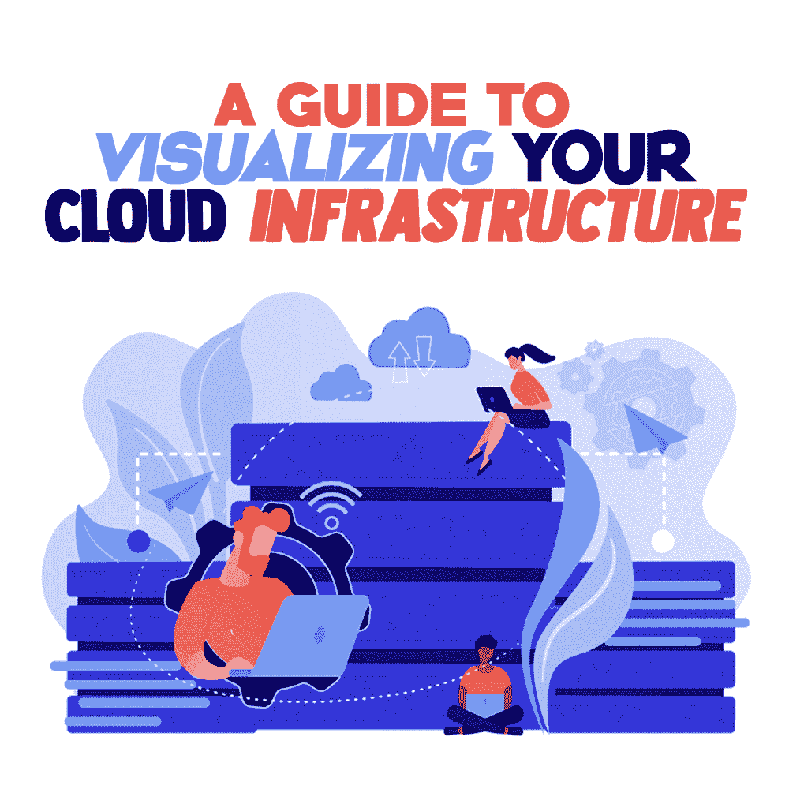

# 可视化云基础架构指南

> 原文：<https://simpleprogrammer.com/visualizing-cloud-infrastructure/>

Looking for a simple, efficient way to add value to your business and become competitive? All you need to do is to upgrade your old infrastructure to a cloud-based one.

云计算使您能够访问由云服务提供商管理的远程服务器，并且要使用这些按需远程数据中心，您只需要一个互联网连接。云计算增强了您的数据存储、网络功能和开发工具。根据您的使用情况，这些资源可以在订阅的基础上使用。

除了向您的公司介绍云解决方案，您还应该致力于集成不同的技术，如人工智能、大数据分析和机器学习。这些工具将改善和自动化您的业务，并加快您的业务活动和任务，因为它们有巨大的存储空间和计算能力。

让我们来看看云计算能为您做什么，以及如何可视化合适的云计算架构。

## 云计算涉及哪些内容？

云计算为您提供三种类型的服务:

*   **软件即服务(SaaS)**—您也可以将此服务称为云应用服务。你可以直接在你的网络浏览器上运行这个应用程序，这样可以节省你下载和安装软件的时间。

*   **平台即服务(PaaS)**–与 SaaS 类似，该服务也提供对应用程序的远程访问。主要区别在于它提供了一个软件创建平台和工具。

*   **基础设施即服务(IaaS)**–该服务管理应用数据、运行时环境和中间件。

让我们看看这些不同的云计算服务是如何在一个组织的云基础设施中实现的。

## 什么是云基础设施？

云计算基础设施允许您通过提供大量的软件和硬件来执行云计算。基础设施包括网络、计算能力和存储。此外，它还提供对用户界面的访问。

该界面为用户提供了一个平台，因此他们可以访问虚拟化资源。这些资源代表包含网络交换机、服务器、存储集群和内存等组件的物理基础架构。

物理基础架构和云基础架构提供相同的功能。但是，有了云，您将获得额外的好处，包括更大的灵活性、按成本拥有和可伸缩性。

## 可视化的好处

创建云基础架构的可视化表示是记录组织内复杂系统的一种很好的方式。这些都可以作为规划、组织和管理整个基础设施的很好的体系结构图。

### 安全可视化

当您拥有公共云时，管理流量就变得非常必要。创建一个安全的网络是一项复杂的任务，但是能够可视化和映射网络将会改变复杂的控制台参数。有了数以千计的设置选项，您可以通过 TCP、IP 地址和出口保护您的开放端口。此外，它将使您能够即时监控您的团队成员。

### 视觉通信

Visual aids can help you improve the internal and external communication of an organization, as visualization helps you to understand complex data with the use of org charts. You can use these charts to streamline organizational and supervisory communication.

这样做有助于员工认识到他们将向谁报告，以及信息将如何沿着组织结构流动。组织结构图定义了业务结构、职责、角色和层次结构。

### 解决纷争

在商业环境中解决问题时，您需要即时的解决方案。例如，如果您的团队添加了破坏网络的新基础设施代码，恢复它将使您免受损失。通过一系列有价值的资源拥有一个[基础架构图](https://creately.com/blog/tech/mapping-it-infrastructure/)将帮助你比较团队修改的代码。这样，您可以解决问题并快速恢复系统。

您还可以集成一个配置管理工具来确定变更，并突出显示做出这些变更的人的姓名。此时的可视化有助于您看到整个项目的全貌。

### 工作人员和承包商更快入职

新员工入职可能是一项艰巨的任务，因为你必须让他们理解业务目标，并让他们与其他表现出色的员工保持一致。在[入职](https://simpleprogrammer.com/team-onboarding-process/)期间，您为新员工提供培训资源和信息。你的新员工和承包商越了解他们在组织中的责任和角色，他们就能更有效地做出贡献。

传统的入职流程可能需要长达 12 个月的时间，这是一段很长的时间。然而，通过可视化，您可以提高入职流程和保留率。可视化表示将把知识和培训资源转化为全面的图表，使您能够以一种为新员工提供更大图景的方式吸引他们。

### 准确

没有准确性，文档是没有用的，无论是云图还是[传统流程图](https://creately.com/lp/flowchart-software/)。如果没有自动生成的基础设施，您可能会错过最近修改的资源。如果在云上有一个大规模的团队，这个过程会变得更加复杂，因为在为团队的每个成员提供适当的资源时，您可能会面临困难。

借助可视化，IT 团队可以生成云资源的可视化交互式概览。因此，不用分析所有的资源，您可以生成一个图表来为用户提供有价值的数据。此外，可视化还消除了许多手动错误。这意味着你在图上看到的一切都将运行。

### 突出异常

第一次可视化您的云系统会遇到意想不到的问题。在开发阶段之后，新的测试环境、开放的端口和重复的资源可能会导致许多问题。手动识别和解决这些问题要求很高。但是，您可以通过自动化图表可视化基础设施并识别这些问题。

### 报告和治理

可视化云系统使您能够记录平台的构造，并为存储和提取准确的文档提供许多好处。可视化图表的优势包括生成精确的治理报告。此外，通过可视化表示，您可以向风险承担者解释管理报告。

## 云计算架构图的类型

云计算架构图有助于您记录和可视化云计算架构。它使利益相关者之间能够更好地沟通。

该图由两部分组成；一个前端平台和一个后端平台。云基础设施是面向网络或互联网的前端。后端平台包括连接到云服务器的不同设备。这两个组件一起工作来描述和简化连接。以下是云架构的组件:

*   **内部资源**–它表示公司在现场管理和维护其 It 基础设施。

*   **云资源**–这种类型的架构为组织提供了一个私有网络来管理其基础设施。

*   **软件组件和服务**–这种类型的架构图表示企业中使用的各种软件系统如何相互作用。

*   **中间件**–中间件将应用程序与其他应用程序、数据库和软件连接起来。

考虑到这些，现在看一些可视化的例子是个好主意。

## 视觉化的例子

合适的可视化工具可以让您深入了解数据。当您更好地理解数据时，您可以使用不同类型的图表和图形来识别模式。例如，图表可以提供关于关系、KPI、分布、比较或构成的信息。下面，您将找到一些可视化数据的工具。

### 自动警报系统

使用 [AWS cloud](https://www.amazon.com/dp/1675528276/makithecompsi-20) ，您可以存储和访问您的数据，并在 web 应用程序上创建备份。Amazon Simple Storage Service 提供了一个接口，可以通过互联网随时随地存储和检索大量数据。

与传统的托管模式不同， [AWS](https://simpleprogrammer.com/cloud-computing-aws-developer-tools/) 通过扩展 web 应用程序来帮助您改变流量。使用此工具，您可以确保模型的安全性，并锁定主机。

### 蔚蓝建筑

微软 Azure 架构包含众多服务器和网络硬件。这便于您通过 Azure 服务器上的[虚拟化硬件托管复杂的应用程序并控制操作和配置。](https://creately.com/lp/azure-architecture-diagram-tool/)

### 谷歌云平台

The [Google Cloud’s Architecture](https://creately.com/lp/google-cloud-architecture-diagram-tool/) enables you to design a cloud development system according to your business needs. Google Cloud offers a platform for hosting, serving, and protecting customers. Their aim is to empower their users with complete data control and management. Furthermore, the tools also help you understand methods to efficiently use the platform.

### IBM 云

IBM Cloud 通过提供基础设施即服务重新定义了云这个术语，比以前更加丰富。 [IBM Cloud](https://www.amazon.com/dp/B07Y3YSGNB/makithecompsi-20) 不仅提供云服务和数据中心，它还提供了更多，即最先进的应用程序无法提供的复杂问题的解决方案。

## 学习和使用云计算来转变您的业务

云计算正在改变公司执行任务的方式。它为您提供了一个用于数据存储和简化业务任务的远程平台。

为了成功地将您的业务转变为云技术和增长，确定适合您业务的云计算类型至关重要。转向云服务最好的一点是，他们仍然可以提供很多新的机会。因此，保持技术更新将推动业务成果。