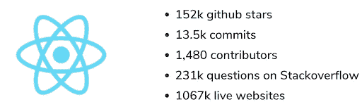
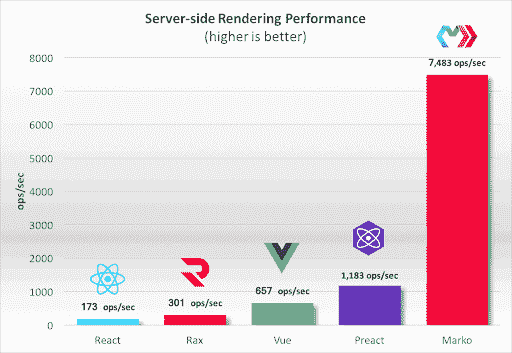
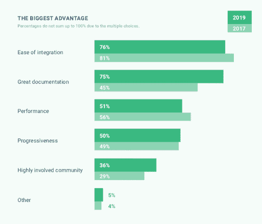
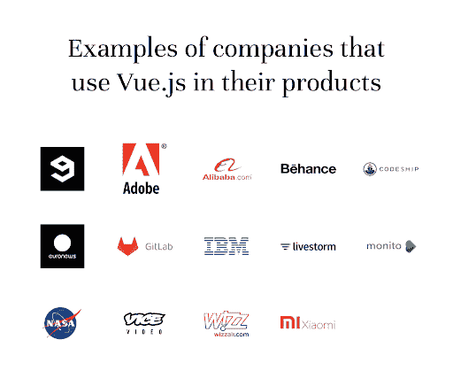
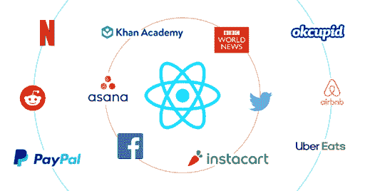

# vue vs . React:2021 年最好的 JavaScript 框架是哪个

> 原文：<https://simpleprogrammer.com/vue-vs-react/>

JavaScript 框架的世界在不断变化，几乎每年都有新的领先者。这就是为什么在你读到这句话的时候，关于哪个 JavaScript 框架最好的答案无疑会有所不同！

这份 Vue 与 React 对比指南将为您提供做出明智决策所需的信息，帮助您确定哪种框架最适合您的需求。但首先，让我们来看看统计数据。

根据最近 w3.techs 的一份报告，2.3%的网站使用了 T2 的 React，占 JavaScript 库市场份额的 2.8%。

此图描述了一段时间内使用所选技术的网站的百分比。

[来源](https://w3techs.com/technologies/comparison/js-react,js-vuejs)

虽然现在 web 应用程序开发需要 JavaScript 框架，但许多公司和个人都在争论他们的 web 开发项目是使用 Vue.js 还是 React。本文将从性能、安全性、受欢迎程度和其他因素方面对它们进行比较。

让我们开始吧！

## 类似

Vue 和 React 非常相似，拥有许多相同的属性和功能。虚拟 DOM 的使用是最显著的相似之处。

再者，React 和 Vue 都:

*   使用任何已经存在的 web 应用程序。
*   是具有生命周期方法的基于组件的架构。
*   为开发人员提供一个简单的技术来快速开始工作。
*   具有增加灵活性、速度和性能的优势。
*   提供一套多样化的库和工具。
*   拥有庞大而活跃的社区。

### 使用 Vue 的目的是什么？

Vue 是一个用于创建开源用户界面的渐进式 JavaScript 框架。它支持基于组件的 web 应用程序开发方法，该方法由独立且松散连接的单个文件组件组成，以提高代码重用和开发速度。

### 使用 React 的优势:

你可能知道 React 的一些功能，例如创建完全定制的用户界面的能力，但[的津贴清单](https://simpleprogrammer.com/why-react-js-web-apps-development/)要全面得多。以下是其中的几个例子:

*   成本效益
*   奇妙的用户体验
*   流行
*   性能和速度的增强
*   缩短上市时间(TTM)
*   搜索引擎优化友好

## Vue.js 与 React Native:详细比较

### Vue 与 React:受欢迎程度

检查一个框架在 GitHub 库中有多少颗星是确定其受欢迎程度的最常见方法之一。但这不是唯一的衡量标准——公司想要雇佣的开发人员的类型也是衡量受欢迎程度的标准。

[来源](https://www.mindk.com/blog/react-vs-vue/)

截止 2021 年， **Vue.js 拥有 181K GitHub stars** ，是最受欢迎的 JavaScript 框架。而 React 还在增长，165K 星排在第二位。

根据 Google Trends，在过去的 12 个月里，印度的公司渴望雇佣 React 开发者，其次是 Vue。

[来源](https://www.mindk.com/blog/react-vs-vue/)

另一个需要考虑的因素是使用每个框架的人数。宝马、TrustPilot、Vice、Adobe Portfolio 和许多其他公司都是 Vue 的用户。

BBC、脸书、Airbnb、PayPal、Instagram 和许多其他知名公司都使用 React。

**获胜者:Vue**

### Vue 与 React:性能

[来源](https://hackernoon.com/server-side-rendering-shootout-with-marko-preact-rax-react-and-vue-25e1ae17800f)

谈到性能，React 和 Vue 通常是相等的，因为它们共享相同的元素。为了提高性能和缩短加载时间，他们使用慢速加载和虚拟内存。

这两种框架都提供了出色的性能，并且各有各的优势。例如，Vue 在内存分配和设置时间方面有一定的优势，而 React 在运行时领先。

但是，有时两者之间的性能会有很大的差异。考虑下面的例子:

*   当 React 组件的状态被缓和时，它的子树中的所有元素都被重新呈现。
*   然而，在 Vue 中，这些依赖关系被记录下来，以防止浪费的重新渲染。

与每秒只能处理一帧的 React 相比，Vue 可以管理更高的帧速率。

赢家:平局

### Vue 与 React:可扩展性

当比较 Vue 和 React 的大型应用时， **React 因其卓越的可扩展性而优于 Vue**。因为 React 应用程序使用 JavaScript，所以您可以使用典型的代码组织方法来扩展它们。此外，组件重用提高了 React 的可伸缩性。

虽然 Vue 由于其大量的多功能工具而具有可扩展性，但它主要用于小型应用程序，尽管应用程序的大小取决于架构。

由于动态架构，您需要使用 Vue 的框架和元素来克服可伸缩性问题。当比较 Vue.js 与 React 原生企业应用时，React 可能是未来应用开发的更好选择。

**胜利者:做出反应**

### Vue 与 React:安全性

Vue.js 和 React 存在安全漏洞；然而，基于 Vue 的应用程序比基于 React 的应用程序更容易保护。尽管如此，授权自动防御 XSS 漏洞是不可能的。

为了防范安全危险和攻击， **[雇佣 Vue.js 开发者](https://www.pixelcrayons.com/hire-vuejs-developer?utm_source=sp&utm_medium=hire-vuejs-developer&utm_campaign=DC-Rukh)** 在实现前清理 HTML 代码或者使用外部库。

React 依靠安全最佳实践来防范 XSS 漏洞、SQL 注入、服务器端渲染攻击和其他安全威胁。

因为 React 使用起来非常简单，所以确保 React 应用程序的安全性需要大量的技术知识和经验。

**获胜者:Vue**

### Vue 与 React:文档

说到文档，Vue 显然是赢家。Vue 的网站以各种语言提供了**高质量和深入的描述，**及其文档和 API 参考通常被认为是业界最好的。

这些文件明确回答了各种关切和问题。但是，因为 Vue 社区比 React 的社区小，所以您可能更难找到文档中没有涉及的问题的正确答案。

因为 React 的文档远不如 Vue 的好，所以您将依赖社区来帮助您解决问题。另一方面，React 有一个庞大、活跃的社区和广泛的教学材料库。

**获胜者:Vue**

### Vue 与 React:社区支持

这是任何技术的关键组成部分，因为社区指导提供了重要的帮助、解决方案和工具。

脸书建立了 React，并在应用中加以利用。因此，它有一大批追随者和一个活跃的社区不断生产和维护新设备。

Vue 并没有像 React 那样迅速流行起来。Vue.js 刚发布的时候，很多人觉得很武断，犹豫要不要用。

然而，由于用户群体的持续支持，Vue **近年来取得了显著的增长，并越来越受欢迎。**

**获胜者:Vue**

### Vue 与 React:用例

视图

作为一个不断发展的框架，Vue 可以根据项目的需求分阶段集成到现有的项目中。例如，它可能被用作一个轻量级的库来为 web 应用程序添加交互。

据参与 2019 年版 State of [Vue.js research](https://www.monterail.com/state-of-vue-2021-report) 的 76%的开发者称，Vue 最重要的资产是**“易于集成”**

[来源](https://www.monterail.com/hubfs/state_of_vue_2021/State_of_vue.js_2021_report_by_Monterail.pdf)

Vue.js 还带有出色的自动完成和功能，以及用于调试 Vue 应用程序的官方 Vue 开发工具。

**反应**

因为 React Native**是为大型 web 开发项目设计的，**把它用于简单的 app 是有风险的。React Native 的设计从长远来看逐渐符合要求，尽管它只需要标准代码就可以启动并运行一个项目。

与 Vue 不同， **React 没有官方的路由或状态管理包。**实际上，对于任何事情，您都需要使用第三方解决方案来构建复杂的应用程序。因此，你可以雇佣一个 **[Vue.js 开发公司](https://www.pixelcrayons.com/javascript-development/vuejs-development-services?utm_source=sp&utm_medium=vuejs-development&utm_campaign=DC-Rukh)** 来按时完成你的项目。

很多知名公司都用 Vue 和 React 以下是其中的一些:

[来源](https://www.monterail.com/blog/why-we-use-vuejs)

[来源](https://www.simform.com/blog/websites-use-react/)

## 2021 年你该用什么:Vue 还是 React？

每个框架都有自己的优点和缺点。比如 Vue，由于它的模板和简化的语法，使用起来既快捷又简单。另一方面，React 在更大、更复杂的应用程序中允许更大的灵活性。

这场竞赛没有明显的赢家。最好的框架是适合你的用例的框架。将您的需求和要求与本指南中概述的特征对应起来，以做出适合您的决定。