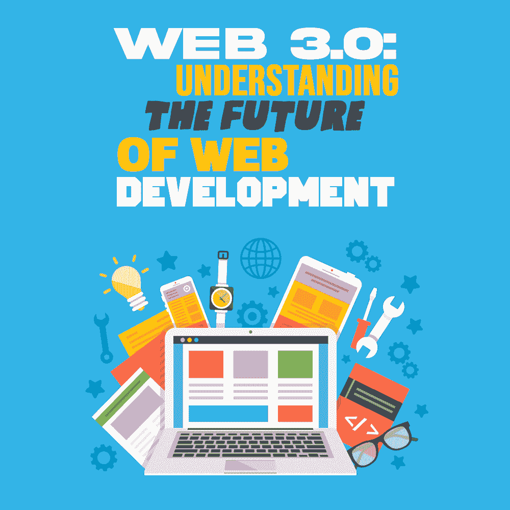

# Web 3.0:理解 Web 开发的未来

> 原文:[https://simple programmer . com/we b-3-future-of-web-development/](https://simpleprogrammer.com/web-3-future-of-web-development/)

The future seems unimaginable without the internet—especially after all the advancements in business technology, software, applications, and devices.

尽管如此，从技术爱好者的角度来看，互联网仍然处于童年早期，因为——尽管它在相对较短的时间内发展了起来——它仍然拥有显著增强的空间。

因此，我们可以说，目前我们只是触及了其潜力的表面。事实上，在不久的将来，任何商业转型都极有可能依赖于互联网的发展。

在这篇文章中，我将重点介绍革命性的、去中心化的、开放的 web 版本，即语义 Web 或 Web 3.0。同时，我将讨论 Web 3.0 的应用，强调 Web 2.0 和 Web 3.0 开发之间的区别，并强调为什么 Web 2.0 开发人员需要学习 Web 3.0 的开发。

## Web 3.0 和 Web 2.0 的特点和区别

有如此多的新特性帮助 Web 3.0 从我们经历的 Web 2.0 中脱颖而出。定义整个 Web 3.0 方法的最重要因素是去中心化。

换句话说，Web 3.0 通过致力于某些可能是数字革命本质的革命性进步，拥有了改善互联网所需的一切。其中包括:

*   **开放:**允许[开源](https://simpleprogrammer.com/pros-cons-open-source-software/)由可访问的开放开发者社区开发。换句话说，“开放”可以被定义为一种将可访问性、社区治理和公平性转化为 web 服务和协议的精神。
*   **无信任:**允许公共和私有网络交互，而没有任何信任问题或来自可信第三方来源的参与。简而言之，“无信任”指的是这样一种网络，其中用户可以依赖网络性能和输出，而没有任何限制来信任网络中涉及的任何其他人。
*   **免许可:**允许用户和供应商参与公共或私人项目，而不涉及任何管理机构。这样的网络环境将允许安全和灵活的信息传输。

在 Web 2.0 中开发的应用程序是在单个服务器上创建和部署的，数据通常存储在由云服务提供商公司托管的单个数据库中。

另一方面，Web 3.0 应用程序很可能建立在分散的网络上，通过大量对等服务器运行——我将在本文后面详细讨论。

从本质上讲，Web 3.0 要求开发人员在提供最高质量的服务和建立高度安全的分散网络方面展开竞争。这与区块链概念密切相关，在该概念中，Web 3.0 网络协议将建立在分散化之上。

换句话说，任何对项目的开发或治理做出贡献的人都可以获得财务激励或奖励，比如加密令牌。当我们说网络协议时，这些协议包括带宽、计算、托管、识别、存储和其他服务，这些服务以前由云服务提供商管理。

由于当前的 web 结构需要用户为使用协议付费，就像使用云提供商提供的服务一样，Web 3.0 将通过直接向开发者和网络参与者分配资金来工作。

因此，熟悉 Web 2.0 和 Web 3.0 的开发人员可以通过分享任何可以改进 Web 3.0 的技术或非技术技能来参与协议开发，以此谋生。

这种结构不仅有助于去中心化，还可能有助于减少中介，从而将所有利润直接转移给开发商。此外，为了确保网络参与者的贡献得到回报，许多 web 基础设施协议提供了实用令牌来规定协议功能。这种奖励的概念类似于以太坊和其他区块链本地技术使用的概念。

## 为什么 Web 2.0 开发者需要学习 Web 3.0？

The web has extensively changed over the past few years. The same could be clearly witnessed from the fact that decentralization, crypto, and AI have already disrupted the way business formation and transactions work.

由于作为一项进步的技术，web 的潜力还没有被认识到，向一个去中心化的世界发展使得开发人员适应 Web 3.0 变得至关重要。从赚取机会到获得为 web 开发的东西的所有权，Web 3.0 是需要成长的开发人员的首选技术。

在我们更详细地讨论 Web 3.0 之前，让我们快速跳到开发人员需要学习 Web 3.0 的两个最重要和潜在的原因。

### 权力下放浪潮

[去中心化](https://simpleprogrammer.com/defi-developer-jobs/)是 web 3.0 的精髓，当涉及到 Web 以及 Web 以外的领域时，它有着广泛的潜力。因此，拥有理解创新并有能力去中心化的开发人员是创建高质量生态系统的关键。

这可以让开发者利用 Web 3.0 充分利用他们的职业生涯。他们可以直接拥有已开发的项目，从而在没有第三方参与的情况下获得更好的盈利机会。

### 所有权、代币等等

Web 3.0 拥有报酬和数据所有权，这是开发人员在使用它时可以获得的一些最重要的好处。最重要的是，去中心化和区块链技术可能会变得更加可扩展。

如果你是一个顺应潮流并开始走向去中心化未来的开发人员，学习 Web 3.0 是必要的。简而言之，在 Web 3.0 上工作可以推动财务产出，也给了开发者一个贡献和拥有对 Web 3.0 时代所做贡献的机会。

## 升级的身份特征

当我们在 Web 3.0 中说 [IDs](https://permission.io/blog/digital-identity/) 或 identity 时，我们指的是与以前版本相比完全不同的功能。Web 3.0 中的 id 是钱包地址簿，包含与应用程序交互的用户的详细信息。

这样做是为了克服 Web 2.0 的挑战，在 Web 2.0 中，用户使用电子邮件和密码来定义他们的身份，这样很容易丢失信息或需要频繁更新以确保安全。

在 Web 3.0 中，用户的 id 或钱包地址是完全匿名的，除非用户选择公开分享他们的身份。此外，Web 3.0 将允许用户顺利地将他们的 ID 从同一个钱包转移到不同的分散应用程序。

Web 3.0 这样的模型要求开发人员使用陶瓷或 IDX 等身份协议来绕过身份层和传统的身份验证，同时允许自我主权身份验证。此外，这一过程需要有效地检查解决传统身份识别所涉及的隐私问题的方法，从而为 Web 3.0 带来更多机会。

为了提高安全性，以太坊基金会(Ethereum Foundation)之类的组织正在研究 RFP(提案请求),它可以帮助简化文档，使 Web 3.0 更进一步。有了这样的便利，Web 3.0 允许用户体验开放、无信任和无权限的应用程序。

## Web 3.0 及其应用

毫无疑问，Web 2.0 是巨大的，它让世界更接近互联网的下一个维度。之前的十年也发生了一场范式变革，呼吁 Web 3.0 的发展。

这里有几个要点可以帮助你更好地理解整个 Web 3.0 的概念。leader-2-multi-119{border:无！重要；显示:屏蔽！重要；浮动:无！重要；行高:0；边距-底部:15px！重要；左边距:0！重要；右边距:0！重要；margin-top:15px！重要；最大宽度:100%！重要；最小高度:250px 最小宽度:250 像素；填充:0；文本对齐:居中！重要}

*   Web 3.0 或语义网为革命性的应用开辟了道路。 [Web 3.0](https://www.amazon.com/dp/B07X1V8D58/makithecompsi-20) 是一种连接人类和人工智能等技术的媒介，旨在创建一个更加合理和个性化的网络。换句话说，Web 3.0 将利用人工智能和人工智能的潜力来处理信息，就像人类使用自然语言处理和语义网的其他概念一样。

*   由于 Web 3.0 关注的是源自过去互联网的挑战，它补充了协调的需要，从而激励了内容提供商、数据、服务和工作。Web 3.0 可能面临的最大挑战是开放、无信任和无权限的概念，这就是不稳定性。

*   Web 2.0 和 Web 3.0 都有独特的组织结构。Web 2.0 让我们更接近云网络，同时让世界变得更加移动，并引入了社交媒体的力量。另一方面，Web 3.0 更多的是关于 AI 和去中心化。因此，一个使用 Web 3.0 的世界是无法由一个监控全球网络的公司来处理的。

*   Web 2.0 为数据中心组织、存储和使用大量用户生成的数据开辟了道路。Web 3.0 有可能用分散的互联网取代数据中心，允许电器、汽车、笔记本电脑、移动设备和传感器保存数据。到 2025 年，这种变化将允许扩展带宽，以容纳全球数据领域可用的 175 zettabytes 数据。

*   Web 3.0 上的分散式网络将允许人们拥有自己的数据。从健康报告到健康数据，网络上任何可用的东西都将处于用户的完全控制之下，使他们有权消除第三方组织，并有权分享所有权和隐私。

*   由于人工智能和人工智能技术已经达到了可以帮助拯救生命的预测的智能水平，因此将该技术集成到分散的环境中可以帮助引入更多数据，从而通过精确的预测建模实现巨大进步。

总而言之，Web 3.0 呼吁未来允许人和机器在没有任何第三方参与的情况下就数据或传递价值进行交互。它甚至可以帮助创建一个以人为中心的未来网络，并通过对等网络模型保护用户的隐私。

记住所有这些，让我们快速看一下可以为下一次网络革命让路的 Web 3.0 最有效的应用程序。

### 内置无缝支付

Over the years, the entire idea of payments and transactions has changed. Especially, the use of tokens has made payments a completely borderless process, with brands like PayPal and Stripe delivering the much-needed seamlessness between payer and payee.

不利的一面是，这些方法很复杂，可能效率低下，而且有风险，因为它们需要使用个人数据，而个人数据很容易被泄露。

然而，基于 Web 3.0 的支付应用基于加密概念，这使得[无国界交易](https://www.binance.com/en/blog/all/why-you-should-make-borderless-payments-using-crypto-421499824684901810)极其简单和安全，而不会泄露敏感数据或个人详细信息。一个常见的例子是 Solana，这是一个网络，它允许以非常低的成本在几毫秒内进行交易，而不会让用户共享他们的个人信息。

这种交易过程甚至不涉及在当前交易模式中作为联网一部分的任何形式或程序。基于 Web 3.0 的加密钱包只需要用户安装一个应用程序，简单地发送/接收资金，绕过任何收集用户信息的看门人或第三方网络服务。

### 重新定义的商业形态

由于加密和令牌是定义协议和 Web 3.0 开发的重要部分，令牌化也有助于创造令牌经济。使用 Web 3.0 进行商业组建的一个简单例子是基于令牌的投资。

换句话说，使用令牌化有助于防止业务损失，尤其是当如今大多数企业通过雇佣风险资本家以交换业务股权的形式获得流动资金时。

当投资者想要退出或进入时，这种业务结构通常会引发法律问题。例如，当人们开始经历优先事项的变化时，以金钱形式换取股份的企业发现很难稀释。

但是，基于 Web 3.0 概念形成的企业可以从像代币这样的数字货币中创造价值，代币在所有权上更容易分割。与流动性投资不同，在流动性投资中，利益相关者投入时间、金钱和劳动力，但没有确定的回报，通过令牌化，投资者可以立即获得回报，回报以价值增长的令牌的形式反映出来。

尽管这可能看起来像是一种更具未来性的商业形成方式，但这将允许网络上的任何人投资于商业创意或构建它。它甚至可以促进组织的发展，因为任何需要离开组织的人都可以获得一定数量的令牌，从而不会稀释业务。

此外，利益相关者可以对他们的令牌进行投票，以促进未来项目的变化，或者人们可以持有他们的令牌份额，开始一些新的计划。

### Web 3.0 已经到来！

像 Web 3.0 这样推动去中心化的方法甚至有助于提高透明度，让利益相关者了解在 Web 3.0 空间中商业股票的每一笔买卖。令人惊讶的是，同样的事情已经在 Web 3.0 时代发生了。

Radicle 是一个基于去中心化概念的 GitHub 替代方案，它是一个这样的应用程序，允许利益相关者在业务的治理模型上工作。

此外，Gitcoin 是另一个允许开发者因参与开源项目而获得报酬的举措。像 Audius、The Graph、SuperRare 和 Uniswap 这样的品牌已经开始发行代币来换取所有权、参与权和治理权。

除此之外，还有一些分散的自治组织，它们为那些想到公司并需要从风险资本家或开发商那里获得投资的人提供了一种独特的基于 Web 3.0 的投资方法。

组织工作在令牌化模型上，在该模型中，整个组织结构是在真实和公平的所有权基础上创建和运行的。此外，利益相关者之间分配的所有权被用来以更有趣的方式分配激励。

尽管去中心化自治组织(Dao)的概念非常广泛，但未来的商业或事物建设在 Web 3.0 中得到了非凡的展望。因此，Web 2.0 开发者应该充分利用去中心化的概念，让互联网成为用户更加个性化的空间，这一点至关重要。

## Web 3.0:高度公平的互联网

Web 3.0 可以创造一个高度公平的互联网，从用户到开发者，每个人都将体验到主权。无论是对信息、时间、资源还是利润的控制，Web 3.0 都可以帮助培养一个安全的网络生态系统。

此外，为 Web 3.0 中的区块链协议做贡献可以帮助开发者和用户从他们在 Web 上的所有投资中获得补偿，从他们的开发到定义协议。

简而言之，web 3.0 是击败剥削性 Web 的门槛，剥削性 Web 涉及非法行为，这些行为不仅会在集中式存储库中捕获用户数据，还会限制所有人的利润和增长。