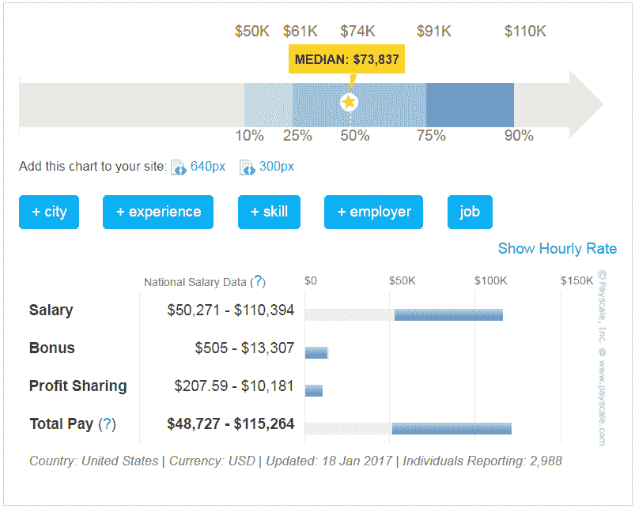

# 网站开发人员可以掌握的 7 个技巧来赚更多的钱

> 原文：<https://simpleprogrammer.com/web-developers-more-money/>

随着技术领域的不断变化和发展，全球 web 开发人员面临的挑战也在不断增加。浏览器的突然、持续的变化，开发者自己设定的低性能标准，以及一批渴望建立自己的投资组合并接受报酬过低的项目的新开发者，都是 web 开发者在市场上赚取一些现金的痛苦来源。

在这篇文章中，我们将谈论一些你可以学习的技能，来提高你的专业水平，这样你就可以要求最高的薪水。

在此之前，让我们先来看看目前的情况。

## 2019 年网络开发者的收入

据[Glassdoor.com](https://www.glassdoor.com/Salaries/web-developer-salary-SRCH_KO0,13.htm)报道，2017 年，网页开发者平均年收入为 75487 美元。Payscale.com 引用了类似的数字 73，837 美元。2019 年，这个数字不会增加太多。

来源:Payscale.com(2019 年)

通常，拥有各种技能的 web 开发人员和那些提供全面的 web 开发包的人赚得最多。例如，如果你是一名只具备前端开发技能的 web 开发人员，你会比那些拥有后端编程技能和丰富知识和经验的人挣得少。

根据[Glassdoor.com](https://www.glassdoor.com/Salaries/ui-ux-designer-salary-SRCH_KO0,14.htm)的数据，全栈开发者在 2017 年的平均收入为 90697 美元。这个工资接近一个后端程序员的平均收入:117284 美元/年。

然而，真正的区别在于就业人数。公司更愿意雇佣对 UI 和 UX 都有丰富知识和经验的开发人员。这是因为公司倾向于更精简的雇佣结构，拥有不同专业知识的小团队更受青睐。

你设计网站的哪一部分并不是工资的唯一考虑因素。同样相关的还有:

*   经验水平
*   位置
*   工业
*   教育水平
*   项目类型

作为一名网络开发人员，要想赚更多的钱，你还需要考虑一些不那么传统的职业道路，比如自由职业。

### 做自由职业者能赚多少钱？

这不是一个简单答案的问题。理论上，自由职业者可能看起来更有利可图，因为越来越多的网络开发人员转向互联网寻找一些额外的工作和额外的现金。但是这也需要更多的工作；每次投标新项目时，你都必须推销自己。这也将花费你相当多的时间来达到你可以要求更高报酬的水平。

但是，最终，你会到达那里。

老实说，自由职业的网络开发人员收入颇丰。根据 Payoneer 的一项调查，IT 和升级程序的平均时薪是 49 美元，相比之下，工薪员工的时薪是 26.30 美元。

这是一个巨大的差异。

然而，在你递交辞职信并开始建立你的自由职业者档案之前，听听这个:在美国，个体经营者的税率最高。他们还必须自掏腰包支付自己的退休储蓄和医疗保险，显然没有雇主的帮助。

所以，明智的做法是开始学习新的技能，比如标志设计、社交媒体、搜索优化、用户界面/UX 原则等。另一方面，加入自由职业项目——只有当你挣到高薪的时候才辞掉你的日常工作。这就引出了我们的主要问题:

## 作为一名网站开发人员，你可以学习哪些额外的技能来帮助你赚更多的钱？

在这里，我们将讨论一些[最受欢迎的技能](https://learntocodewith.me/posts/tech-skills-in-demand/),无论是作为自由职业者还是内部开发人员，这些技能都将让你马上赚到大钱。

虽然无论你是自由职业者还是内部开发人员，SEO、人工智能或数据可视化等大多数技能都将派上用场，但社交媒体营销、[徽标设计](https://www.designmantic.com/how-to/how-to-learn-logo-design-without-going-college)和技术写作技能等一些技能在你是自由职业者时会更有用，因为这些项目通常需要你同时兼任多个职位。

为了给你真实的收入数据，我们将依靠两个主要来源:Payscale.com 的内部专家数据和 Upwork.com 的自由职业者平均每小时工资。

### 1.搜索引擎优化

搜索引擎优化是一个高度市场化的技能。每个通过网站开展业务的人都旨在将进来的流量转化为真正的客户。要实现这种转化，SEO 是关键。

SEO 通过设计有机的营销策略将随机流量转化为真实的客户群，以确保他们的网站总是在搜索结果中排名靠前。SEO 包括持续的测试、调整和测量 KPI，以找出哪些有效，哪些无效，并做出相应的改变。

SEO 专业化的额外技能将使你对潜在客户非常有吸引力，因为你不仅能创建一个令人惊叹的功能性网站，还知道如何将网站变成一个真正的赚钱实体。

**需要学习的主要技术技能:**

*   关键词分析
*   超文本标记语言
*   街头流氓
*   内部链接
*   网站地图
*   航行

内部专家的平均工资:65200 美元

自由职业者的平均时薪为 68 美元

### 2.数据可视化

数据可视化是指将原始数据转换成易于理解和理解的形式。它本质上包括将电子表格转换成图表和图形。随着科技行业寻找越来越多的以数据为中心的角色，这一特定领域预计将呈指数级增长。

数据可视化专家擅长预测趋势、识别模式、定位重要变量和指导业务策略。

需要学习的主要技术技能:

*   r 或 Python
*   电子表格
*   演示技巧
*   统计程序设计

内部专家的平均工资:77000 美元

自由职业者的平均时薪为 20-200 美元

### 3.云计算

As more companies switch from traditional server setups to more flexible and dynamic cloud-based solutions, the demand for cloud computing specialists is on the rise. A lot of this demand is being driven by companies that require IT professionals who specialize in Amazon Web Services (AWS).

AWS 是目前最大的云计算解决方案网络。它的客户包括网飞、联合利华、麦当劳和通用电气石油天然气公司，它拥有最大的市场份额——注册活跃用户超过 100 万。在 AWS 的认证会让你获得 123，000 美元的平均年收入[。](https://www.payscale.com/research/US/Skill=Cloud_Computing/Salary)

要学习的主要技术技能:

*   数据库技能
*   编程技能
*   Linux 操作系统
*   DevOps
*   信息安全

内部专家的平均工资:12.3 万美元

自由职业者的平均时薪为 104 美元

### 4.用户界面/UX 设计

在一个满是既能设计一个漂亮的网站，又能做很棒的后端编程的人的房间里，你看起来有多有吸引力，能提供丰富的专业知识和全面的 web 开发知识？

对于那些作为 UX 开发者已经赚了很多钱的人来说，学习如何做 UI 将会增加你的就业潜力。我们 UI 的同志们，现在就开始[学习 UX](http://www.amazon.com/exec/obidos/ASIN/1788837363/makithecompsi-20) 。诚然，学起来并不容易，但简单永远不会带来丰厚的回报。

**需要学习的主要技术技能:**

对于 UX:

*   超文本标记语言
*   爪哇
*   半铸钢ˌ钢性铸铁(Cast Semi-Steel)
*   数据库
*   算法
*   统计数字

对于用户界面:

*   产品设计
*   接口设计
*   用计算机修改（图片或照片）
*   动画
*   样机研究

内部专家的平均工资:75057 美元

自由职业者的平均时薪为 30-150 美元

### 5.人工智能

如果你愿意投入时间和工作，建立一套以人工智能为中心的技能是最令人兴奋的事情。越来越多的公司正在寻求在数据分析和用户体验中实施人工智能解决方案。

据福布斯报道，自 2000 年以来，活跃的人工智能初创公司数量增加了 14 倍，风险资本家对人工智能的投资增加了 6 倍，人工智能程序员的就业市场自 2013 年以来增长了 4.5 倍。

**需要学习的主要技术技能:**

*   机器学习
*   计算机编程语言
*   爪哇
*   数据科学
*   r 编程语言

内部专家的平均工资:12.1 万美元

自由职业者的平均时薪为 61-80 美元

### 6.基本社交媒体

光有网站是不够的。你需要一个强大的、吸引人的、活跃的社交媒体来和你的观众保持联系。无论你的网站多么互动或吸引人，都比不上社交媒体提供的真实的人际关系。顾客对看起来像活生生的实体的企业反应良好。

学习基本的社交媒体相当容易，而且收获颇丰。作为一名网络开发人员，如果你精通社交媒体战略，并能为你的公司或客户建立数字营销指南，这是一个即时的优势。

**需要学习的主要技术技能:**

*   战略规划
*   了解内容在社交媒体上的工作方式
*   出色的写作技巧
*   了解最新的数字营销趋势
*   灵活性
*   用户界面/UX 设计

内部专家的平均工资:50040 美元

自由职业者的平均时薪:50-100 美元

### 7.技术写作

整个互联网正以惊人的速度发展，这一事实让大多数人担心他们会被新发展的浪潮抛在后面。这是一个合理的担忧。技术写作是让这种担忧远离的原因。你不仅可以直接了解这些发展，因为持续的研究是技术写作的一部分，而且你还可以将技术写作的额外技能添加到你的文件夹中。

技术写作是关于新想法、产品、技术和行业正在寻找的其他技术世界新闻的文章写作和博客。技术写作的目的主要是向寻找它的人传递信息和指导。除了技术行业，医学、法律、工程和其他科学领域[也使用技术写作](https://simpleprogrammer.com/need-start-writing/)来分享信息。

你大概也知道，不是每个人都能写好，也不是每个写得好的人都能做技术写作。如果你有一点写作天赋，写技术文档会给你的银行账户增加一大笔钱。因为不是每个优秀的作家都能写技术文章，那些能写的人已经很抢手了，所以确保你能进入这个波动的市场，并从中获得公平的份额。

**需要学习的主要技术技能:**

In addition to good writing skills, you also need:

*   设计技巧和格式
*   分析技能
*   数据显示
*   简洁清晰的写作能力
*   研究
*   与主题专家(SME)的互动

内部员工的平均工资:59217 美元

自由职业者的平均时薪:30-60 美元

## 了解更多，赚取更多…

现在，坐在所有这些信息旁边，为你蓬勃发展的 web 开发事业的下一阶段想出一个策略。我们希望这些令人兴奋的技能中的一个或一些已经足够吸引你开始认真思考它们。

请告诉我们哪一个最吸引你，然后让我们开始工作。为更多的钱干杯，宝贝！