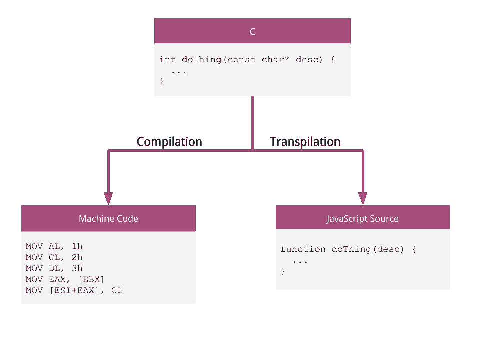
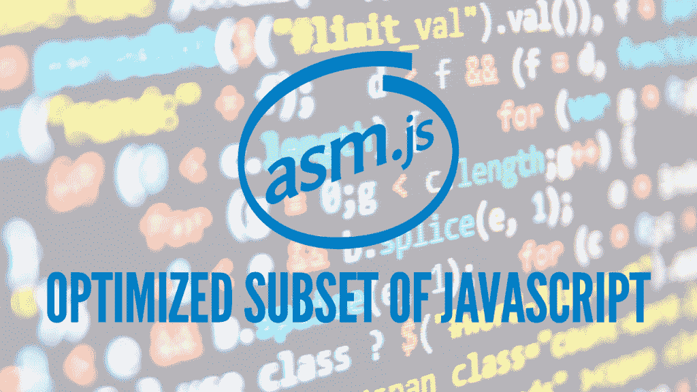
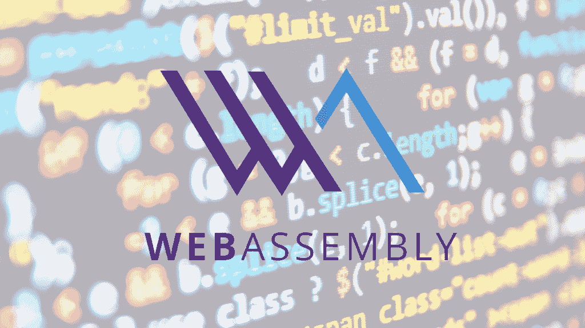

# WebAssembly:终于从 JavaScript 中解脱了？

> 原文:[https://simple programmer . com/web assembly-finally-freed-JavaScript/](https://simpleprogrammer.com/webassembly-finally-freed-javascript/)

我们大多数人都讨厌 JavaScript，这是由[布伦丹·艾希](https://en.wikipedia.org/wiki/Brendan_Eich)在 10 天内开发的著名软件[。](https://www.w3.org/community/webed/wiki/A_Short_History_of_JavaScript)

如果有人对这种语言只有赞美之词，他们可能还没有充分使用这种语言。我的意思是，肯定有[好的部分](http://www.amazon.com/exec/obidos/ASIN/0596517742/makithecompsi-20)，但是如果你的语言需要那样的书，那就意味着有很多不好的部分。

如今，网络是一个不可否认的有用且无处不在的平台，JavaScript 是我们唯一可以使用的真正的标准化编程语言。这种语言每年都在变得越来越好，性能也越来越高，但是和任何编程语言一样，它并不总是适合这项工作的工具。

不幸的是，它往往是 ***的唯一*** 的工作工具。

那么，如果我们想使用不同的编程语言，我们该怎么办呢？

在你开始学习任何新技能或概念之前，我建议你看一下我的课程[“快速学习任何东西的 10 个步骤”。](https://simpleprogrammer.com/store/products/learn-anything-quickly/)T3】

## 编译与编译

编程语言实际上只是一种对人类友好的语法。我们已经有程序可以将这种语法翻译或编译成计算机可以运行的东西。我们可以将程序编译成另一种编程语言，而不是机器代码。

这个过程被称为[转换](https://en.wikipedia.org/wiki/Source-to-source_compiler)，因为它是**将一种编程语言转换成另一种**。它让程序员用他们最喜欢的语言编写代码，然后依靠 transpiler 将代码转换成浏览器可以在网页上执行的 JavaScript。

这不是一个特别新的想法，有几种编程语言可以转换成 JavaScript 两个值得注意的是[ClojureScript](http://clojure.org/about/clojurescript)([Clojure](https://clojure.org/)转 JavaScript)和 [Google Web Toolkit](http://www.gwtproject.org/overview.html) (Java 转 JavaScript)。

编译与翻译

问题是, [JavaScript 根本不是为](https://simpleprogrammer.com/2013/12/09/wrong-javascript-responsive-design/)设计的。

它是一种垃圾收集语言，具有非常松散的语义，虽然对于初学者来说学习起来更友好，但作为一个移植目标来说确实很糟糕。

## JavaScript 太动态了

当用 JavaScript 创建一个类时，可以像其他面向对象编程语言一样给它字段和方法。通常，解释器可以读取一个类定义，并根据它们的类型为字段分配一些存储空间，从而预测需要多少空间。

通过预测需要多少空间并有效地在内存中布局对象，解释器或编译器可以优化代码执行。这在像 C 或 Java 这样的编程语言中工作得很好，因为在定义一个类之后，你不能改变它有什么字段，或者它们的类型。

JavaScript 就不是这样了！

因为 [JavaScript 是一种非常动态的语言](http://www.amazon.com/exec/obidos/ASIN/0596517742/makithecompsi-20)，你可以在运行时添加/删除和修改变量，甚至中途将一个字段从`Number`改为`String`。

例如，在下面的代码中，您可以看到我们可以修改类实例上的字段，甚至可以在对象创建后完全改变方法！

如今，大多数浏览器都试图通过假设类不会改变来优化 JavaScript 代码，但是如果这个假设不成立，它们就不得不退回到更慢但更通用的算法来执行代码。他们永远不能排除用户在任何时候调用晦涩复杂的语言特性的可能性，这会导致额外的解释器复杂性和速度减慢。

如果 JavaScript 不那么动态，那么将其他编程语言移植到它上面会更容易优化，也不那么复杂。

事实上，正因为如此，有人试图定义 JavaScript 语言的子集，这样浏览器就可以假装支持某些不变量(比如不动态地改变类，不使变量改变类型)。

这种语言被称为 [asm.js](http://asmjs.org/) 。

## js 是 JavaScript 的一个更加优化的子集

js 是 JavaScript 编程语言的一个限制性子集。

它没有 JavaScript 的任何虚饰，但是因为它是该语言的子集，所以它仍然可以在普通的 JavaScript 浏览器上运行。它支持的功能更像 C 代码，你可以用特定的方式指定参数的类型。

例如，在 JavaScript 中，一个数字总是一个[双精度浮点值](https://en.wikipedia.org/wiki/Double-precision_floating-point_format)，如果你想要整数，这是非常低效的。在 asm.js 中，你可以通过写`x = x|0;`来通知解释器你想要一个整数。这仍然是有效的 JavaScript 代码(对任何带零的数字进行[位或](https://en.wikipedia.org/wiki/Bitwise_operation)运算只会返回相同的数字)，但是它让 asm 知道它可以使用快速整数数学。

这里有一个 asm.js 代码的例子，如果它是手工编写的，看起来会更疯狂。

因为它仍然是有效的 JavaScript，所以普通浏览器可以以与编译版本相同的行为运行它。支持 asm.js 的浏览器可以进行额外的优化，运行速度也快得多(比如 Firefox)。

缺点是它实际上是一个基于 JavaScript 的黑客。这是一种基于文本的格式，所以需要很长时间来解析，并且有许多必要的语法扭曲来使它与 JavaScript 兼容——所以很难达到本机(即类似 C)的速度。

**进入 WebAssembly。**

## WebAssembly 是 Web 的一个*编译*目标

WebAssembly 是一种低级语言格式，被明确设计为由其他编程语言编译。我们一直在谈论 ***transpilation*** ，但是由于 WebAssembly 与 JavaScript 相比是足够低级的，我们可以真正地称它为 ***编译*** 。

最棒的是——它不是在 10 天内设计出来的！

它基于 asm.js，但该规范是从头开始构建的，是一个高效的通用编译目标。它不是 JavaScript 的子集，所以它不需要扭曲来支持由旧引擎运行。

这里有一个文本格式的 WebAssembly 代码的例子。主要格式是二进制，但可以自由转换为更适合人类阅读的文本格式。这只是一种潜在的文本语法，因为官方格式尚未确定。

### 它很快

WebAssembly 是二进制格式。这意味着它比 JavaScript 或 asm.js 更紧凑，下载速度更快。它的解析速度也非常快(事实上，在一些早期的基准测试中，它比普通的 JavaScript 快 20 倍！).这对于电池和 CPU 受限的移动设备来说尤其令人惊叹。

因为它不一定是 JavaScript 的子集，所以它没有垃圾收集。这意味着用 C 和 C++编写的手动管理内存的代码可以直接以本机速度运行，而没有任何内置的 GC 试图妨碍，并且其他编程语言可以自由实现自己的自定义垃圾收集器。(注意，还计划在某个时候使用可选的内置垃圾收集器。)

它还将支持现代处理器的硬件加速功能，如[单指令、多数据(SIMD)](https://en.wikipedia.org/wiki/SIMD) 。这将让您编写代码，有可能同时对多个变量进行计算，从而真正加速某些应用程序，如实时视频处理或游戏。

最后，但同样重要的是，它最终将支持多线程，这在 JavaScript 中是不可能的。

### 很安全

因为它是为 web 而构建的，所以从第一天开始在浏览器中运行是安全的。“在浏览器中运行安全”是什么意思？

首先，它是内存安全的，这意味着你不能仅仅通过访问一些有分配错误的网站就让你的电脑崩溃。

其次，代码将不得不遵守现有的基于浏览器的安全限制，如[同源策略](https://en.wikipedia.org/wiki/Same-origin_policy)，以防止恶意网站在未经用户允许的情况下窃取用户数据。

### 它是便携式的

最后，WebAssembly 将是可移植的，所以这种格式没有平台特定的方面。这意味着它可以在许多不同的设备上运行，包括普通的网络浏览器、手机，甚至是物联网设备。从技术上讲，它甚至不需要在网页环境中运行！

正因为 WebAssembly 没有特定于平台的方面，一个给定的主机可能会决定在正常可用的基础上提供额外的 API。例如，如果 Android 有一个 WebAssembly 的原生主机，它可以提供一个 API 来访问网站通常不可用的原生 Android 功能。

## 这对其他编程语言来说非常好

这一切对你来说意味着什么？

这意味着我们将拥有一个优化底层代码的坚实平台，以及一个实现跨平台运行的编程语言的伟大载体。除此之外，**它让其他编程语言成为网络的一等公民。**

因为没有内置的 GC，而且开销很小，所以任何语言都可以被编译。我们可以把网络想象成一个新的操作系统，能够在任何可以想象的设备上运行——现在我们不用担心 JavaScript 的限制了！

已经有围绕 ClojureScript 这样的语言形成的社区，但我可以看到更高性能的语言真正开始成为主流。

## 我们会杀死 JavaScript 吗？

T2】

所以最大的问题是，既然 JavaScript 在 10 天内就诞生了，而且有很多讨厌它的人，这是否意味着一旦其他语言出现，每个人都会跳槽呢？

JavaScript 背后有很大的动力，所以它不会有任何进展。在未来的许多年里，它可能会继续成为网络上的主导语言。

尽管很多人喜欢抨击它(包括我自己)，但由于 EcmaScript 6 ，在过去的几年里已经有了很多改进。当你需要高灵活性和快速原型，或者前端工作的大多数选择时，它将永远是一个伟大的语言。

然而，如果你想建立一个视频编码器，安全加密软件之类的东西，或者需要仔细管理内存，现在你可以使用一种适合这项任务的低级语言。

或者，如果你真的关心在编译时捕捉 bug，你可以使用静态类型的东西，比如 [Haskell](https://www.haskell.org/) 。理论上，你甚至可以将它们混合在一个应用程序中。

## 现在还为时尚早

那么 WebAssembly 现在在哪里？

它于 2015 年 6 月首次公布，截至撰写本文时(2016 年 5 月)，它仍在设计中。然而，他们一直在努力工作，已经有了一个规范和参考解释器，一个二进制格式的草案，甚至还有一个由 Unity 开发的名为“愤怒的机器人”的 3D 游戏。一切都是开源的，所以你可以在 github [repos](https://github.com/webassembly) 查看他们的实现和设计。

我们都应该为生活在这样一个具有创新和潜力的时代而感到兴奋。web 已经被证明是有史以来最有用和最容易访问的平台，WebAssembly 将把一切带到下一个层次。

我对未来充满期待。网络万岁！